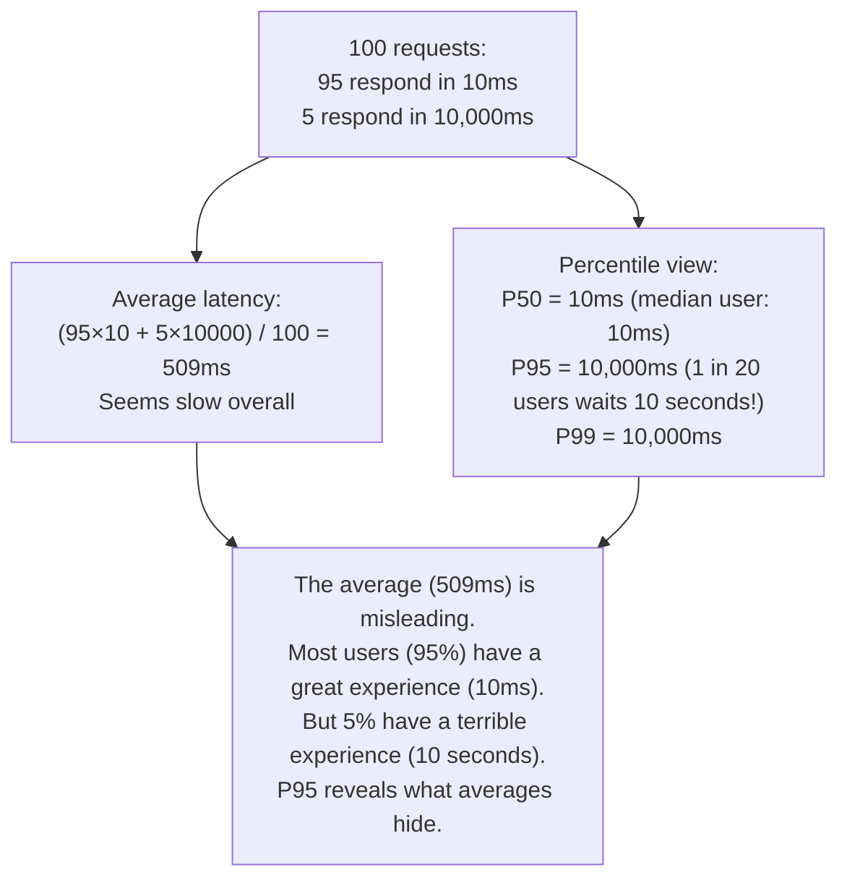
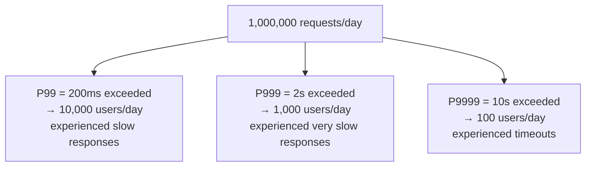
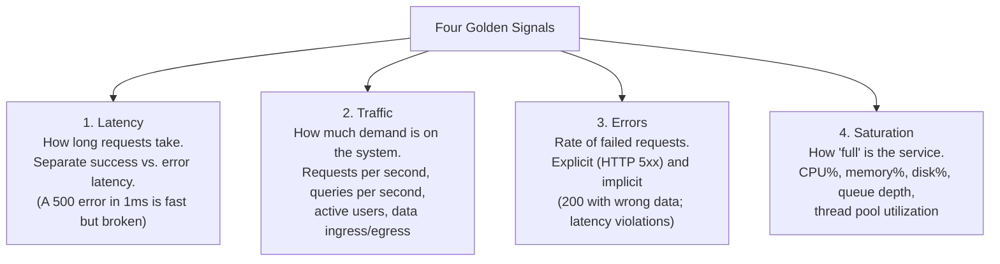
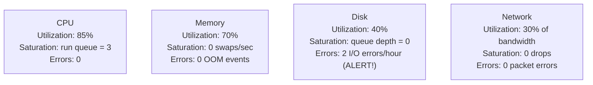
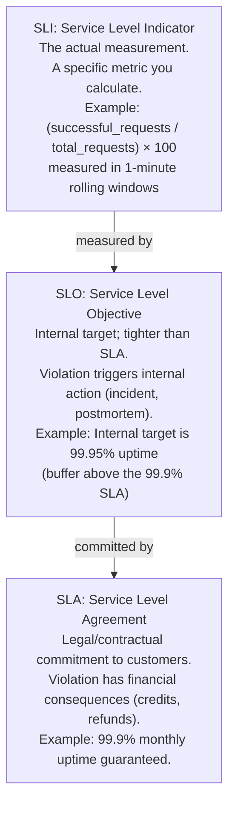
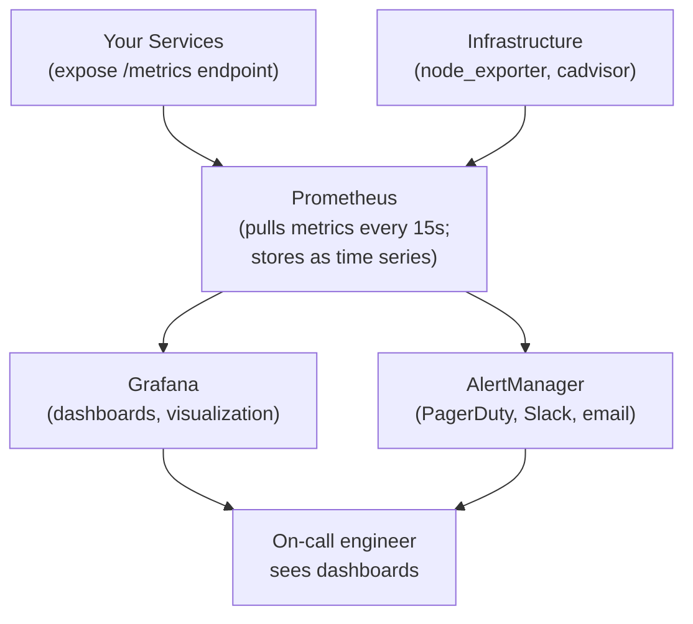

# Performance Metrics

Performance metrics are the quantitative language of system reliability. Without them, "fast" and "slow" are opinions; with them, they're measurements you can alert on, trend over time, and make architectural decisions from. The metrics you track define what you optimize — choosing the right ones is itself a design decision.

> **Why this matters in interviews:** Interviewers at senior levels often ask "how would you know if this system is healthy?" or "what metrics would you monitor?" The answer requires knowing which metrics actually matter (latency percentiles, not averages), what SLIs/SLOs/SLAs mean, and how Google's four golden signals framework provides a complete view of any service's health.

---

## The Problem with Averages

Average latency is the most commonly used metric and the most misleading one.



**Why percentiles tell the truth:** The P50 is the median (half of requests are faster, half are slower). The P95 means 95% of requests complete faster than this value. The P99 means 99% of requests complete faster. The P999 (99.9th percentile) means 1 in 1,000 requests is slower — this is your "worst-case user experience" signal.

---

## Latency Percentiles in Practice

| Percentile       | Meaning                       | Typical Use Case                       |
| ---------------- | ----------------------------- | -------------------------------------- |
| **P50 (Median)** | 50% of requests are faster    | Baseline "normal" experience           |
| **P75**          | 75% of requests are faster    | Slightly worse than typical            |
| **P95**          | 95% of requests are faster    | Alert threshold for most APIs          |
| **P99**          | 99% of requests are faster    | SLO target for critical paths          |
| **P999**         | 99.9% of requests are faster  | Tail latency; affects 1 in 1000 users  |
| **P9999**        | 99.99% of requests are faster | Used by financial systems; 1 in 10,000 |

**Setting SLOs (Service Level Objectives):**

- "99% of API requests will complete in under 200ms" = P99 ≤ 200ms
- "99.9% of checkout requests will complete in under 500ms" = P99.9 ≤ 500ms

**The tail latency problem:** At scale, extreme percentiles matter more than you'd think. With 1 million requests/day:

- P99 violation = 10,000 users/day with bad experience
- P999 violation = 1,000 users/day with terrible experience
- P9999 violation = 100 users/day with broken experience



---

## Google's Four Golden Signals

Google's SRE book defines four metrics that, together, give a complete picture of any service's health:



**Why these four?** They're sufficient to detect every class of system problem:

- High latency → system is slow (congestion, lock contention, slow dependencies)
- High error rate → system is broken (bugs, bad deploys, downstream failures)
- Traffic spike + OK latency → healthy scaling under load
- High saturation → system is approaching limits (pre-failure warning signal)

---

## The RED Method (for Microservices)

An alternative framework specifically for request-driven microservices:

| Signal       | Metric                             | What it Tells You                         |
| ------------ | ---------------------------------- | ----------------------------------------- |
| **R**ate     | Requests per second                | How much demand is the service handling?  |
| **E**rrors   | Error rate (%)                     | Is the service returning correct results? |
| **D**uration | Latency distribution (percentiles) | How fast is the service responding?       |

**RED is a subset of the four golden signals** — it omits saturation, which is more infrastructure-level. Use RED for service-level dashboards, four golden signals when you also manage infrastructure.

---

## The USE Method (for Infrastructure)

For infrastructure components (CPU, memory, disk, network), Brendan Gregg's USE method applies:

| Signal          | Metric                               | Example                    |
| --------------- | ------------------------------------ | -------------------------- |
| **U**tilization | % time resource is busy              | CPU: 85%, Disk: 60%        |
| **S**aturation  | Work queued beyond resource capacity | CPU run queue length > 1   |
| **E**rrors      | Error events                         | Disk I/O errors, NIC drops |



---

## SLI, SLO, and SLA

These three terms form a hierarchy defining reliability commitments:



**Error Budget:** The difference between SLO and 100%. If SLO is 99.9% uptime, you have a 0.1% error budget = 43.8 minutes of downtime per month. Error budgets enable data-driven release decisions: if you've used 80% of your error budget, you slow down deployments.

**Common SLO examples:**

| Service          | SLI                                            | SLO Target |
| ---------------- | ---------------------------------------------- | ---------- |
| API availability | successful_requests / total_requests           | 99.95%     |
| API latency      | P99 response time                              | ≤ 200ms    |
| Search relevance | fraction of searches returning quality results | ≥ 97%      |
| Data freshness   | fraction of data updated within 1 hour         | ≥ 99%      |

---

## Key Infrastructure Metrics

### Throughput

- **RPS (Requests Per Second):** Rate of incoming requests. Fundamental capacity metric.
- **TPS (Transactions Per Second):** Rate of completed transactions (often DB-specific).
- **QPS (Queries Per Second):** Database-specific; affects connection pool sizing.

### Error Rate

```
Error Rate = error_count / total_requests × 100%
```

Track separately:

- **HTTP 5xx rate:** Server-side errors (bugs, crashes, dependencies)
- **HTTP 4xx rate:** Client errors (bad requests, auth failures) — high 4xx often indicates upstream bugs
- **Implicit errors:** Successful HTTP 200 responses that contain incorrect data (requires business logic monitoring)

### Time to First Byte (TTFB)

The time from when the client sends a request to when it receives the first byte of the response. Critical for perceived performance:

- **TTFB < 200ms:** Good (Google's recommended threshold for web pages)
- **TTFB 200ms-500ms:** Needs improvement
- **TTFB > 500ms:** Poor; affects SEO rankings and bounce rates

### Apdex Score

A standardized metric for user satisfaction with latency, ranging from 0 to 1:

```
Apdex = (Satisfied + Tolerating/2) / Total

Where:
- Satisfied:   response time ≤ T (target, e.g., 200ms)
- Tolerating:  T < response time ≤ 4T (e.g., 200ms–800ms)
- Frustrated:  response time > 4T (e.g., > 800ms)
```

| Apdex Score | Quality      |
| ----------- | ------------ |
| 1.0         | Perfect      |
| 0.85–0.94   | Good         |
| 0.70–0.84   | Fair         |
| < 0.70      | Unacceptable |

**Apdex is useful for a single number that captures user experience** without needing to look at percentile distributions.

---

## Prometheus + Grafana: The Standard Stack

The industry standard for collecting and visualizing metrics in production:



**Key Prometheus metric types:**

| Type          | Description                       | Example                                 |
| ------------- | --------------------------------- | --------------------------------------- |
| **Counter**   | Monotonically increasing          | `http_requests_total{status="200"}`     |
| **Gauge**     | Current value (up or down)        | `memory_usage_bytes`                    |
| **Histogram** | Samples observations into buckets | `http_request_duration_seconds`         |
| **Summary**   | Pre-computed percentiles          | `rpc_duration_seconds{quantile="0.99"}` |

**Histogram vs. Summary:** Use Histogram when you want to compute percentiles across aggregated data (multiple instances). Use Summary when you need pre-computed percentiles on a single instance. Histograms are generally preferred because they support cross-instance aggregation.

**Useful PromQL queries:**

```promql
# P99 latency over last 5 minutes
histogram_quantile(0.99, rate(http_request_duration_seconds_bucket[5m]))

# Error rate (%)
rate(http_requests_total{status=~"5.."}[5m]) /
rate(http_requests_total[5m]) * 100

# Requests per second
rate(http_requests_total[1m])

# CPU utilization per instance
1 - avg(rate(node_cpu_seconds_total{mode="idle"}[5m])) by (instance)
```

---

## Dashboard Design Principles

A good monitoring dashboard shows:

1. **Overview row:** Service health in one glance — current RPS, error rate, P99 latency, saturation
2. **Golden signals row:** Traffic, latency (P50/P95/P99), errors, saturation — all on one screen
3. **Dependency row:** Latency to downstream services (DB, cache, external APIs)
4. **Infrastructure row:** CPU, memory, disk, network per host

**Alert philosophy:** Alert on symptoms (user-visible impact), not causes (CPU spike). Alert when:

- Error rate > 1% (5xx) for 5 minutes → page on-call
- P99 latency > SLO threshold for 10 minutes → page on-call
- Disk space < 20% → alert (lower priority)
- CPU > 90% sustained for 15 minutes → alert (investigate)

---

## Interview Talking Points

**1. Why should you use percentiles instead of average latency?**

> "Averages mask distribution. If 95% of requests take 10ms and 5% take 10 seconds, the average is 509ms — which doesn't accurately describe either group's experience. Percentiles reveal the truth: P50=10ms tells you the typical user has a great experience; P95=10,000ms tells you 1 in 20 users waits 10 seconds, which is a critical problem to fix. At scale with 1 million daily requests, a P99 latency violation affects 10,000 users per day — that's operationally significant even if it looks small as a percentage. Always track at least P50, P95, and P99 and set SLOs on P99."

**2. What are the four golden signals and why are they sufficient?**

> "Google's four golden signals are latency, traffic, errors, and saturation. Together, they can detect every class of system problem. High latency with normal traffic suggests a slow dependency or lock contention. High error rate signals a bug or broken deployment. Traffic spike with stable latency and error rate means your scaling is working correctly. High saturation (CPU, memory, queue depth) warns of an approaching failure before it happens — it's the early warning signal. Any system health issue will manifest in at least one of these four signals, which is why they're sufficient as a complete monitoring baseline."

**3. What's the difference between SLI, SLO, and SLA?**

> "An SLI is the actual measurement — a specific metric like 'fraction of requests returning HTTP 200 within 200ms.' An SLO is the internal target for that SLI — 'we target 99.9% of requests meeting that criterion.' An SLA is the external contract — 'we guarantee 99.5% to customers.' You set your SLO tighter than your SLA to give yourself a buffer. The error budget concept ties these together: if your SLO is 99.9% uptime, you have a 0.1% error budget (43.8 minutes/month). Error budgets enable data-driven release decisions — if you've used 80% of your budget, slow down deployments to protect the SLA."

**4. What metrics would you add to a dashboard for a new API service?**

> "I'd build four rows. The first is a health summary: current RPS, error rate (5xx%), and P99 latency — three numbers that tell you instantly if the service is healthy. The second row covers the four golden signals in detail: traffic (RPS trend), latency (P50/P95/P99 on the same graph), error rate (4xx and 5xx separately), and saturation (CPU%, memory%, connection pool utilization). The third row shows dependency health: latency to the database, cache hit rate, and any external APIs the service calls. The fourth row covers infrastructure: host CPU, memory, disk I/O, and network. I'd set alerts on P99 latency exceeding the SLO and error rate exceeding 1% for 5 minutes."

---

## Key Takeaways

- **Average latency lies** — use percentiles (P50, P95, P99, P999) to understand the distribution of user experience
- **P99** is the standard alert threshold; at 1M requests/day, P99 violations still affect 10,000 users
- **Four golden signals** (latency, traffic, errors, saturation) give a complete picture of any service's health
- **SLI** = the measurement; **SLO** = internal target (tighter); **SLA** = external contract (looser) — error budgets bridge them
- **RED method** (Rate, Errors, Duration) is a clean framework for microservice dashboards
- **USE method** (Utilization, Saturation, Errors) applies to infrastructure components
- **Histogram metrics** (not summaries) are preferred in Prometheus — they support cross-instance aggregation for percentile computation
- Alert on **symptoms** (high error rate, high latency) not causes (CPU spike) — symptoms are what users experience
