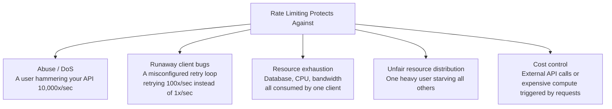
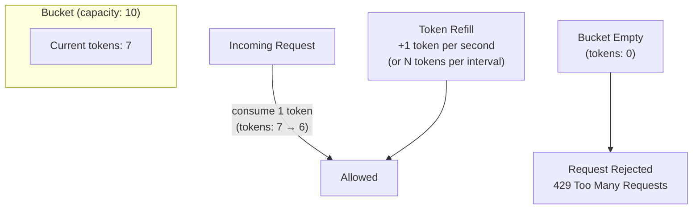
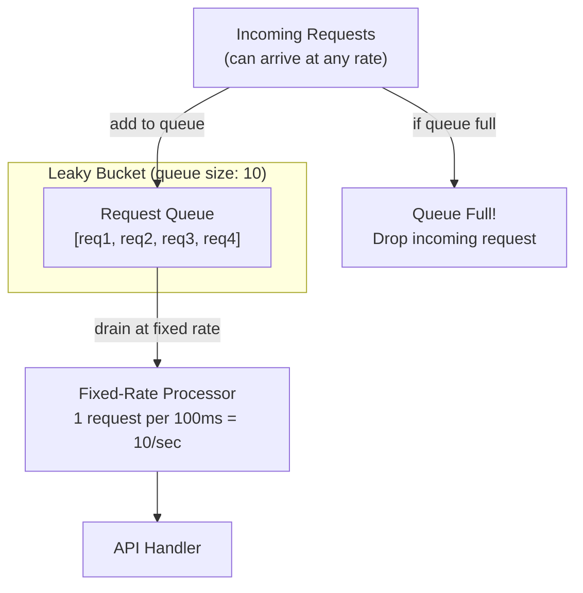
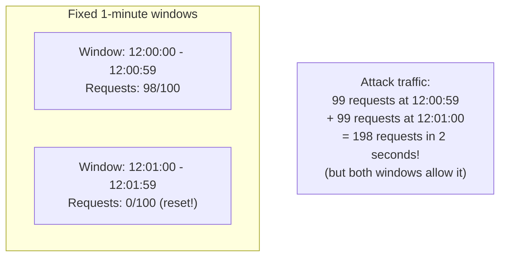
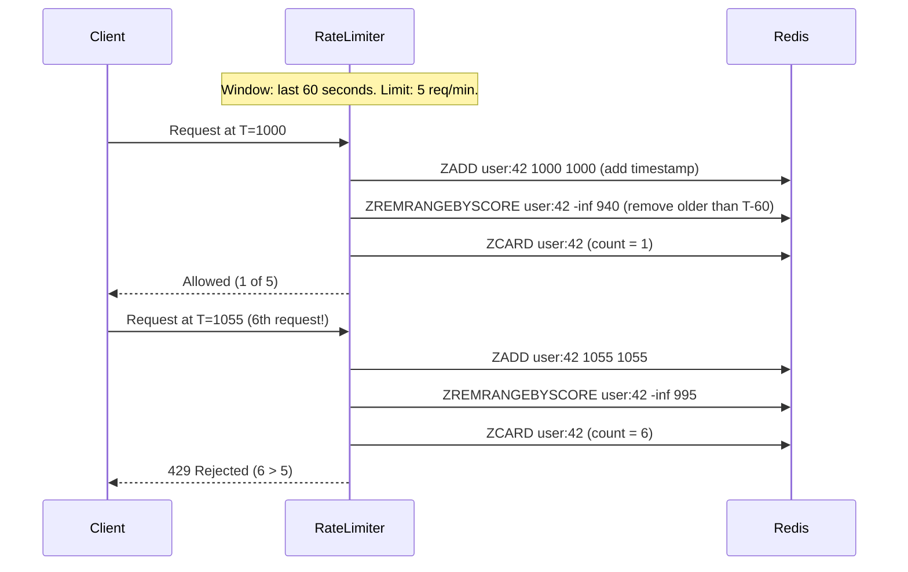
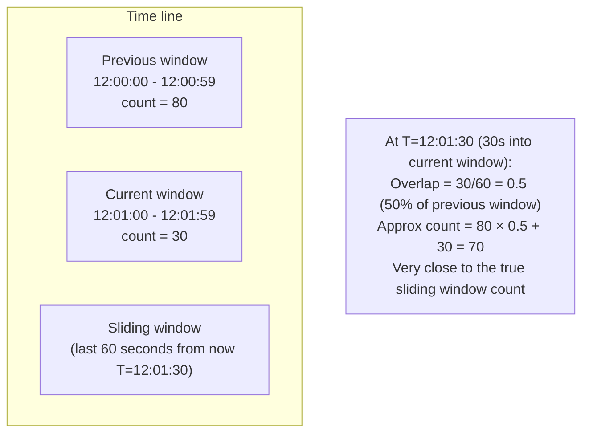
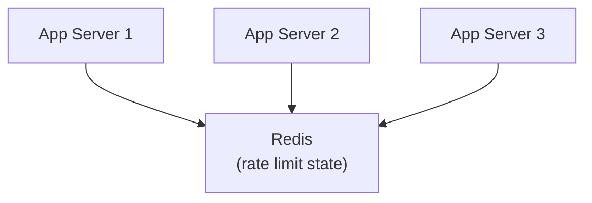

# Rate Limiting

Rate limiting controls how many requests a client can make to a system within a time window. Without it, a single misbehaving client — whether a bug in their code, a denial-of-service attempt, or unexpected viral usage — can consume all available resources and degrade service for everyone else. Rate limiting is the basic contract of fairness in shared infrastructure.

> **Why this matters in interviews:** Rate limiting is asked about in two ways: (1) as a component of a system design (every public API needs it), and (2) as a standalone design question ("Design a rate limiter"). Both require understanding the algorithms, their tradeoffs, and how to implement them at scale with Redis. The algorithms — Token Bucket, Leaky Bucket, Fixed Window, Sliding Window — are tested directly.

---

## What Rate Limiting Protects Against



**Common rate limits in production:**

| System      | Limit                                            |
| ----------- | ------------------------------------------------ |
| GitHub API  | 5,000 requests/hour per authenticated user       |
| Twitter API | 300 requests/15 minutes per user                 |
| Stripe API  | 100 requests/second per account                  |
| Twilio      | Configurable per account tier                    |
| OpenAI API  | Requests per minute per API key (varies by tier) |

---

## Algorithm 1: Token Bucket

**The most widely used rate limiting algorithm.** A bucket holds tokens. A token is added at a fixed rate. Each request consumes one token. If the bucket is empty, the request is rejected.



**Key properties:**

- **Burst handling:** The bucket can accumulate tokens (up to capacity). A client that was idle can burst up to `capacity` requests instantly.
- **Sustained rate:** On average, only `refill_rate` requests per second are allowed.
- **Smooth enough:** Bursts are bounded by the bucket size.

**Redis implementation:**

```python
import time
import redis

r = redis.Redis()

def token_bucket_allow(user_id: str, capacity: int, refill_rate: float) -> bool:
    """Returns True if request is allowed, False if rate limited."""
    key = f"rate:tb:{user_id}"
    now = time.time()

    pipe = r.pipeline()
    pipe.hgetall(key)
    result = pipe.execute()
    data = result[0]

    if data:
        tokens = float(data[b'tokens'])
        last_refill = float(data[b'last_refill'])
        # Add tokens based on elapsed time
        elapsed = now - last_refill
        tokens = min(capacity, tokens + elapsed * refill_rate)
    else:
        tokens = capacity  # New user: start with full bucket
        last_refill = now

    if tokens >= 1:
        # Allow request: consume 1 token
        r.hset(key, mapping={'tokens': tokens - 1, 'last_refill': now})
        r.expire(key, 3600)
        return True
    else:
        # Reject: bucket empty
        r.hset(key, mapping={'tokens': tokens, 'last_refill': now})
        return False
```

**Best for:** APIs that want to allow short bursts (a client sending 10 requests quickly is fine) while limiting sustained throughput. Used by: AWS API Gateway, Stripe, Nginx.

---

## Algorithm 2: Leaky Bucket

Requests flow into a queue (the bucket). They're processed at a fixed rate regardless of how fast they arrive. If the queue overflows, new requests are dropped.



**Key difference from Token Bucket:**

- Token Bucket: Requests proceed immediately if tokens are available (bursts processed instantly)
- Leaky Bucket: Requests always exit at a fixed rate (smooth output, burst absorbed into queue)

**Best for:** Network traffic shaping where you need smooth output rates (e.g., sending emails at exactly 100/second to avoid spam filters). Less useful for APIs where you want to allow legitimate short bursts.

---

## Algorithm 3: Fixed Window Counter

Divide time into fixed windows (e.g., 1 minute). Count requests in the current window. Reject if count exceeds the limit.



**The boundary problem:** A client can exploit the window boundary — 99 requests just before the window resets and 99 requests just after — effectively doubling the allowed rate for a brief period.

**Redis implementation:**

```python
def fixed_window_allow(user_id: str, limit: int, window_seconds: int) -> bool:
    now = int(time.time())
    window_key = now // window_seconds  # Which window are we in?
    key = f"rate:fw:{user_id}:{window_key}"

    count = r.incr(key)
    if count == 1:
        r.expire(key, window_seconds * 2)  # Auto-expire after window

    return count <= limit
```

**Best for:** Simple use cases where boundary attacks are acceptable (internal services, coarse-grained limits). Simple to implement and very memory-efficient (one counter per client per window).

---

## Algorithm 4: Sliding Window Log

Store a timestamp for every request. Count requests in the past [window_duration]. Reject if count exceeds the limit.



**Properties:**

- **Perfect accuracy:** No boundary attack — the window slides continuously with each request
- **Memory expensive:** Stores every request timestamp for every client (10 req/sec × 1,000 users × 60 sec = 600,000 entries)
- **Not suitable for high-throughput scenarios** where millions of requests per second per client are possible

**Best for:** Low-volume APIs where precision is critical and memory is acceptable (per-user tweet posting rate, per-user API key rate).

---

## Algorithm 5: Sliding Window Counter

A compromise between Fixed Window (fast, memory-efficient, imprecise) and Sliding Window Log (slow, memory-intensive, precise). Approximates the sliding window using two fixed window counters:

```
count ≈ (previous_window_count × overlap_ratio) + current_window_count

Where overlap_ratio = fraction of the previous window that falls within the rolling window
```



**Memory:** Just two counters per client (previous window + current window). O(1) memory vs. O(requests) for sliding window log.

**Precision:** Within ~2% error rate in practice — accurate enough for rate limiting purposes.

**Best for:** High-throughput APIs at scale. The algorithm used by **Cloudflare** and **Redis-cell** (the Redis rate limiting module).

---

## Algorithm Comparison

| Algorithm                  | Accuracy        | Memory      | Burst Handling      | Complexity | Best For                   |
| -------------------------- | --------------- | ----------- | ------------------- | ---------- | -------------------------- |
| **Token Bucket**           | Good            | O(1)        | ✅ Allows bursts    | Low        | APIs allowing bursts       |
| **Leaky Bucket**           | Good            | O(queue)    | ❌ Queues bursts    | Low        | Smooth output rate         |
| **Fixed Window**           | Poor (boundary) | O(1)        | ❌ Boundary exploit | Very Low   | Simple, coarse limits      |
| **Sliding Window Log**     | Perfect         | O(requests) | Precise             | Medium     | Low-volume, high precision |
| **Sliding Window Counter** | Near-perfect    | O(1)        | Good                | Medium     | High-scale APIs            |

---

## Distributed Rate Limiting

A single Redis server can become a bottleneck. At scale (billions of requests/day), rate limiting must itself be distributed:

### Centralized Redis (Standard)



Works for most production systems. Redis can handle ~1M operations/second. For most companies, this is sufficient.

### Local + Sync (Hybrid)

Each server maintains a local counter. Periodically syncs to Redis. Trades some accuracy for lower Redis load:

```
Local counter handles 90% of rate limit checks.
Redis sync every 100ms keeps global state accurate.
Accept that ~10% of limit violations may slip through between syncs.
```

Used by: Stripe, Cloudflare at extreme scale.

### Sliding Window with Redis Sorted Sets

```python
import time
import redis

def sliding_window_allow(user_id: str, limit: int, window_sec: int) -> bool:
    now_ms = int(time.time() * 1000)
    window_ms = window_sec * 1000
    key = f"rate:sw:{user_id}"

    pipe = r.pipeline()
    pipe.zremrangebyscore(key, 0, now_ms - window_ms)  # Remove old entries
    pipe.zadd(key, {str(now_ms): now_ms})              # Add current request
    pipe.zcard(key)                                     # Count in window
    pipe.expire(key, window_sec + 1)                   # Auto-cleanup
    results = pipe.execute()

    count = results[2]
    return count <= limit
```

---

## Rate Limit Response Headers

Well-designed APIs return headers that help clients back off gracefully:

```
HTTP/1.1 429 Too Many Requests
X-RateLimit-Limit: 100          # Max requests per window
X-RateLimit-Remaining: 0        # Requests remaining in current window
X-RateLimit-Reset: 1705312800   # Unix timestamp when window resets
Retry-After: 30                 # Seconds to wait before retrying
```

GitHub, Stripe, and Twitter all return these headers. Well-behaved clients use `Retry-After` for backoff instead of retrying immediately (which would make the rate limiting problem worse).

---

## Interview Talking Points

**1. What are the tradeoffs between Fixed Window and Sliding Window rate limiting?**

> "Fixed Window divides time into discrete windows (e.g., 1-minute buckets) and counts requests per window. It's simple (one counter per client per window), uses O(1) memory, and is fast. The weakness is the boundary attack: a client can send max_requests just before a window resets and max_requests just after, effectively getting 2x the limit in a 2-second period. Sliding Window Log fixes this by storing timestamps of all requests and computing the exact count in the past [window] seconds — accurate but memory-intensive (one entry per request). Sliding Window Counter is the best compromise: two counters per client, O(1) memory, and a weighted interpolation that approximates the true sliding window within ~2% error."

**2. Explain the Token Bucket algorithm and when to use it.**

> "Token Bucket maintains a bucket that fills with tokens at a constant rate (e.g., 10 tokens/second). Each request consumes one token. If the bucket has tokens, the request is allowed; if empty, it's rejected. The bucket has a maximum capacity (e.g., 50 tokens). This capacity is the burst allowance — a client that was idle can accumulate tokens up to capacity and then use them in a burst. Use Token Bucket when you want to allow short legitimate bursts (a user rapidly reloading a page) while still limiting sustained throughput. It's the most widely used algorithm — Nginx, AWS API Gateway, and Stripe all use Token Bucket variants."

**3. How would you implement a distributed rate limiter?**

> "The standard approach uses Redis as a central rate limit counter. For a sliding window counter: use two Redis keys per client (current and previous window), store counts with TTLs, and compute the weighted approximation on each request. Use a Lua script to make the check-and-increment atomic, preventing race conditions. For Token Bucket: store {tokens, last_refill} in a Redis hash per client, and refill tokens based on elapsed time on each request. At extreme scale (millions of clients × billions of requests), use a hybrid: each app server maintains a local counter bucket that's synced to Redis every 100ms, accepting minor accuracy loss in exchange for dramatically reduced Redis operations."

**4. What should you return to clients when rate limiting them?**

> "Return HTTP 429 (Too Many Requests) with a Retry-After header indicating how many seconds to wait before retrying. Include X-RateLimit-Limit (the max), X-RateLimit-Remaining (how many requests remain in the window), and X-RateLimit-Reset (Unix timestamp when the limit resets). This allows well-behaved clients to adapt — implement exponential backoff starting from the Retry-After value, rather than hammering the rate limiter with immediate retries (which would amplify the problem). Also consider returning 429 before the hard limit is reached using soft limits — warn clients they're approaching the limit with a Retry-After header even while still serving requests."

---

## Key Takeaways

- Rate limiting protects against **abuse, runaway bugs, resource exhaustion, and unfair resource distribution**
- **Token Bucket**: refill at fixed rate, burst up to capacity — the most widely used algorithm; allows short bursts
- **Leaky Bucket**: fixed output rate regardless of input rate — best for smooth traffic shaping
- **Fixed Window Counter**: simple O(1) memory, but has a boundary exploit — useful for coarse limits
- **Sliding Window Log**: perfect accuracy, O(N) memory per client — only for low-volume precise limits
- **Sliding Window Counter**: near-perfect accuracy with O(1) memory via weighted interpolation — the production-scale choice
- Implement with **Redis Lua scripts** for atomic check-and-increment — prevents race conditions
- Return `429 Too Many Requests` with **`Retry-After`**, `X-RateLimit-Limit`, `X-RateLimit-Remaining`, and `X-RateLimit-Reset` headers
