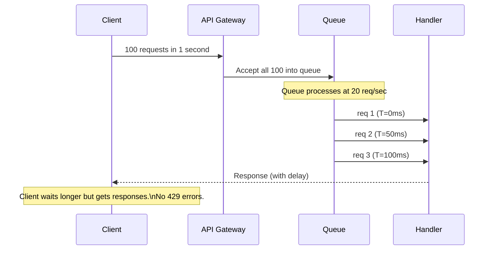
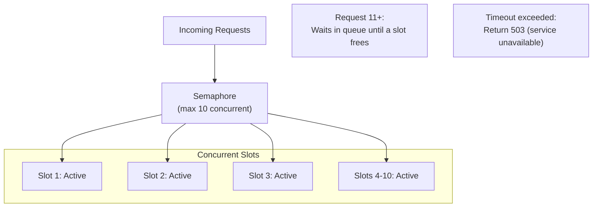
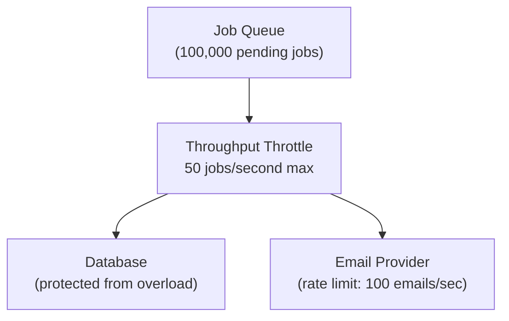
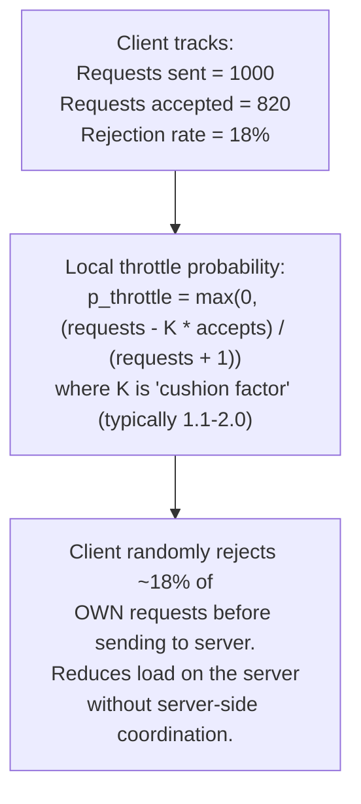
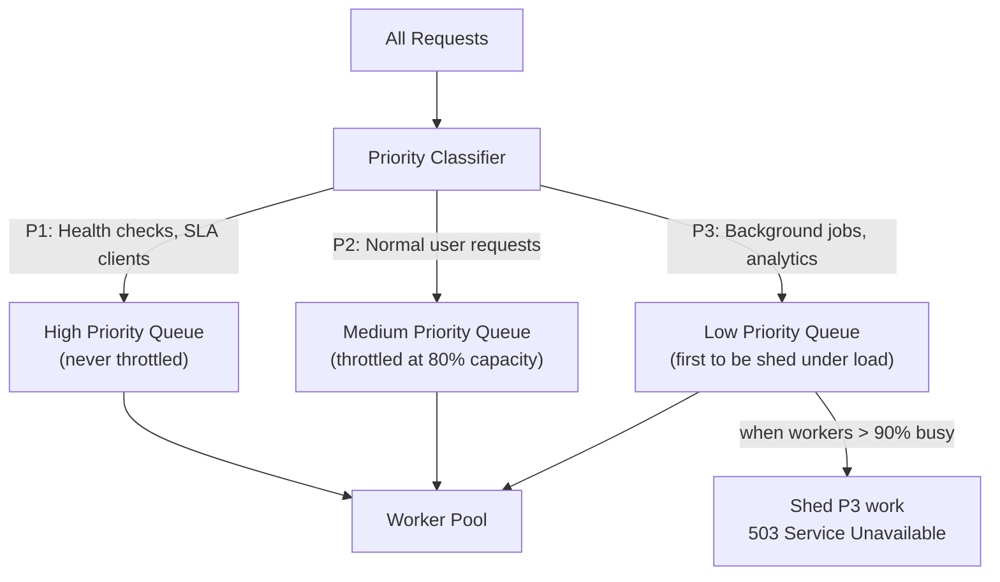
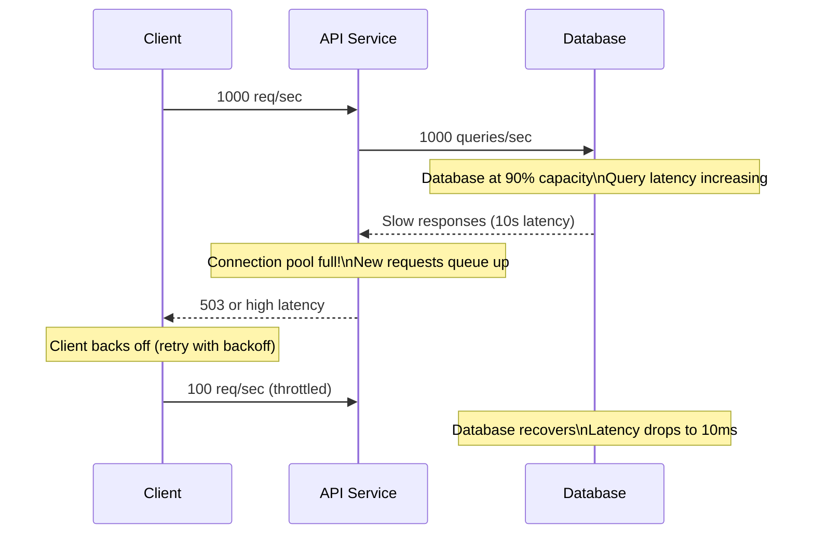
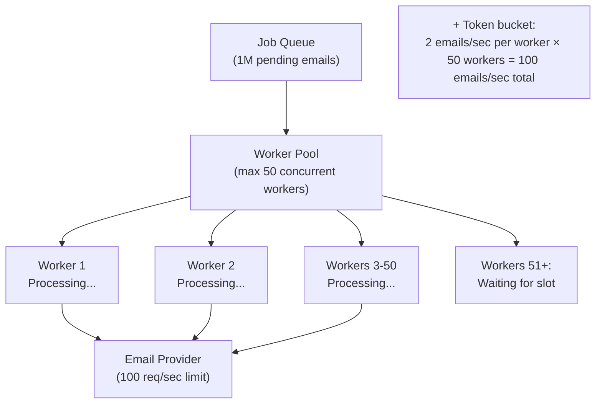
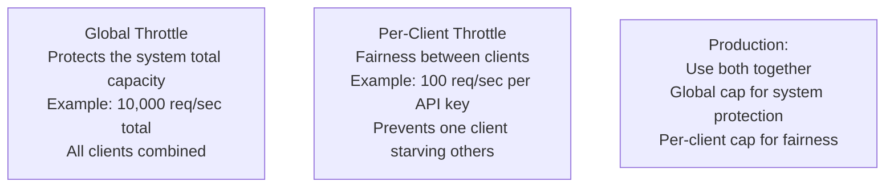

# Throttling

Throttling is the practice of **controlling the rate at which a system processes requests** — slowing down or queuing excess requests rather than just rejecting them. Where rate limiting is binary (allow or reject), throttling is a spectrum: you can delay requests, queue them for later processing, degrade the response quality, or shed lower-priority work. Throttling is how systems maintain stability under load without complete failure.

> **Why this matters in interviews:** Throttling questions appear when designing high-traffic APIs, background job systems, and anything that calls external services with rate limits (payment gateways, email providers, AI APIs). The key distinction from rate limiting — and the reason throttling often appears in "reliability" discussions alongside circuit breakers — is that throttling is about graceful degradation, not just access control.

---

## Throttling vs. Rate Limiting

These terms are often used interchangeably but have important distinctions:

| Dimension             | Rate Limiting                             | Throttling                                     |
| --------------------- | ----------------------------------------- | ---------------------------------------------- |
| **Action on excess**  | Reject with 429                           | Delay, queue, or degrade                       |
| **Goal**              | Access control / fairness                 | System stability under load                    |
| **Client experience** | Hard failure (must handle 429)            | Slower responses (transparent)                 |
| **Typical location**  | API gateway, external-facing              | Internal services, job processors              |
| **Analogy**           | Bouncer at a door ("no, you can't enter") | Highway speed limit ("you can go, but slower") |

In practice, most systems use both: rate limiting at the edge (reject abusers), throttling internally (slow down or queue excess load to protect databases and downstream services).

---

## Types of Throttling

### 1. Request Throttling (Delay-Based)

Slow down requests instead of rejecting them. Excess requests wait in a queue and are processed at a controlled rate.



**Benefit:** Clients see higher latency but no hard failures. Useful when clients can tolerate slow responses better than errors.

**Risk:** If the queue grows faster than it drains, memory fills and the queue itself becomes a failure point. Always have a maximum queue depth with overflow rejection.

### 2. Concurrency Throttling (Semaphore-Based)

Limit the number of **simultaneous in-flight requests** to a downstream service. New requests wait for a slot to become available.



**Why it matters:** Network-based rate limits often care about **concurrent connections**, not just request rate. A database can handle 100 concurrent queries; exceeding this causes connection exhaustion and crashes.

**Implementation:**

```python
import asyncio

# Semaphore: allow max 10 concurrent DB operations
db_semaphore = asyncio.Semaphore(10)

async def get_user(user_id: str) -> dict:
    async with db_semaphore:  # Acquires slot; releases automatically
        return await db.query("SELECT * FROM users WHERE id = %s", [user_id])
```

### 3. Throughput Throttling (Rate-Based)

Enforce a specific throughput rate at the system level (not per client). Protects downstream dependencies.



**Example:** A batch email job processor. The email provider allows 100 emails/second. The job queue may have 1 million pending emails. The throughput throttle ensures you never send more than 100/second, regardless of how many workers are running.

### 4. Adaptive Throttling (Google's Approach)

Instead of fixed limits, **clients measure their own success rate and self-throttle based on observed rejection rate**. Used by Google's internal RPC framework (Stubby):



**Why this is elegant:** Throttling happens at the client, not the server. Servers don't need to implement throttling — clients self-regulate based on observed rejections. Scales to thousands of clients without central coordination.

---

## Server-Side Throttling Patterns

### Priority Queuing with Shed

When under load, not all requests are equal. Route by priority:



**Load shedding:** Under extreme load, drop the lowest-priority requests rather than degrading all requests. Better to have some requests succeed than all requests degrade.

### Backpressure Propagation

Throttling should propagate upstream — when a service is throttled, it signals its callers to slow down:



Without backpressure propagation, clients keep hammering an overloaded system. With it, the overload signal propagates through the stack and callers naturally reduce their rate.

---

## Client-Side Throttling

Throttling doesn't only happen at servers — well-designed clients throttle themselves:

### Exponential Backoff with Jitter

```python
import random, time

def call_with_retry(fn, max_retries: int = 5):
    for attempt in range(max_retries):
        try:
            return fn()
        except RateLimitError as e:
            if attempt == max_retries - 1:
                raise
            # Exponential backoff with jitter
            base_delay = 2 ** attempt          # 1s, 2s, 4s, 8s, 16s
            jitter = random.uniform(0, base_delay * 0.1)
            wait = base_delay + jitter
            time.sleep(wait)

# Without jitter: all retrying clients retry simultaneously
# With jitter: retries spread out, preventing retry storm
```

**Without jitter:** 100 clients all get rate-limited at the same time. They all wait 2 seconds. They all retry at the same time. They all get rate-limited again. They all wait 4 seconds... This is a **retry storm**.

**With jitter:** Retries are spread across a window. Server sees a smooth stream of retries rather than a coordinated wave.

### Token Bucket on the Client Side

Clients implementing outbound rate limiting avoid ever getting 429s in the first place:

```python
# Client-side token bucket for calling an external API
from time import sleep, time

class ClientRateLimiter:
    def __init__(self, rate_per_second: float, burst: int):
        self.rate = rate_per_second
        self.burst = burst
        self.tokens = burst
        self.last_refill = time()

    def acquire(self):
        now = time()
        elapsed = now - self.last_refill
        self.tokens = min(self.burst, self.tokens + elapsed * self.rate)
        self.last_refill = now

        if self.tokens >= 1:
            self.tokens -= 1
            return  # Proceed immediately

        # Wait until we have a token
        wait_time = (1 - self.tokens) / self.rate
        sleep(wait_time)
        self.tokens = 0

# Usage:
limiter = ClientRateLimiter(rate_per_second=10, burst=20)
for item in large_batch:
    limiter.acquire()
    send_to_external_api(item)
```

---

## Throttling in Distributed Systems

### Worker Pool Throttling

Control how many concurrent background jobs run:



### Global vs. Per-Client Throttling



---

## Throttling Response Codes and Headers

| Scenario                      | HTTP Status               | When to Use                                              |
| ----------------------------- | ------------------------- | -------------------------------------------------------- |
| Hard rate limit exceeded      | `429 Too Many Requests`   | Client sent too many requests; reject with Retry-After   |
| System temporarily overloaded | `503 Service Unavailable` | Server-side throttle (load shedding); Retry-After header |
| Request queued, long timeout  | `202 Accepted`            | Accepted for processing; response will come later        |
| Degraded mode response        | `200 OK (partial)`        | Return cached/degraded data instead of full response     |

---

## Real-World Throttling Examples

**AWS SDK:** Built-in retry logic with exponential backoff and jitter for all AWS API calls. When DynamoDB returns `ProvisionedThroughputExceededException`, the SDK automatically retries with backoff — the client is throttled transparently.

**Kafka consumer:** `max.poll.records` and `max.poll.interval.ms` control consumer throughput — a form of consumer-side throttling to prevent a slow consumer from being kicked out of the consumer group.

**Google Ads API:** Returns `ResourceExhausted` (gRPC equivalent of 429). The client library implements adaptive throttling — tracking reject rates and self-throttling before requests even leave the client.

**Netflix Hystrix:** Implements semaphore-based concurrency throttling (max N concurrent calls to a dependency) as part of its circuit breaker pattern, preventing one slow dependency from consuming all threads.

---

## Interview Talking Points

**1. What is the difference between throttling and rate limiting?**

> "Rate limiting is access control — binary allow/reject based on a client's request rate. It's typically implemented at the API gateway edge to prevent abuse. Throttling is about system stability — controlling throughput to prevent overload, often by queuing or delaying excess requests rather than rejecting them. Rate limiting protects fairness between clients; throttling protects the system's downstream dependencies (databases, external APIs). In practice, systems use both: rate limiting at the edge to reject abusers, and internal throttling (concurrency limits, job rate limits) to protect internal resources."

**2. What is adaptive throttling and why is it powerful?**

> "Adaptive throttling lets clients throttle themselves based on observed server rejection rates, rather than relying on the server to enforce limits. Google's Stubby RPC framework uses this: clients track their accept rate (successes / total requests) and randomly drop a fraction of their own outgoing requests proportional to the rejection rate they're experiencing. The result is that throttling distributes automatically across all clients without any central coordination — each client self-regulates. It also handles varying server capacity: if the server's capacity increases, rejection rates drop, clients reduce self-throttling, and throughput increases automatically."

**3. How do you handle a downstream service that has a rate limit (e.g., an email provider limited to 100/second)?**

> "Three layers: First, implement a client-side token bucket that limits outbound calls to the provider's rate — 100 tokens/second, so you never exceed their limit. Second, implement a job queue with controlled throughput — workers consume from the queue at 100/second (using a centralized token bucket in Redis if multiple workers are involved). Third, implement exponential backoff with jitter for retries when the provider does reject requests — ensure retry storms don't compound the problem. Monitor the provider's rate limit response headers and log when you approach limits. Consider batching API calls where the provider supports it (e.g., send 1 batch of 100 instead of 100 individual calls)."

**4. What is load shedding and when should you use it?**

> "Load shedding is intentionally dropping lower-priority requests when the system is under extreme load, rather than degrading all requests. Under normal load, everything is processed. When CPU or queue depth exceeds a threshold, you start shedding the lowest-priority work: batch jobs, background analytics, non-critical reads. At higher load, you shed non-SLA traffic. At critical load, only health checks and the most critical user-facing operations are served. The design principle: it's better for 80% of users to get a fast, correct response and 20% to get a 503, than for 100% of users to get an 8-second response. Load shedding requires priority classification of requests and a mechanism to measure current load."

---

## Key Takeaways

- Throttling **controls the rate of processing** — delaying, queuing, or degrading excess requests vs. rate limiting's binary reject
- **Request throttling** queues excess requests (delay not rejection) — protects downstream without hard client failures
- **Concurrency throttling** (semaphore) limits simultaneous in-flight operations — critical for DB connection pool protection
- **Adaptive throttling** (Google pattern) lets clients self-throttle based on observed rejections — scales without central coordination
- **Exponential backoff with jitter** prevents retry storms — random jitter spreads retry load across time
- **Load shedding** drops low-priority work under extreme load — better partial success than universal degradation
- Client-side token buckets prevent ever exceeding external API rate limits in the first place
- Throttling should propagate **backpressure** upstream — overloaded downstream signals callers to slow down
