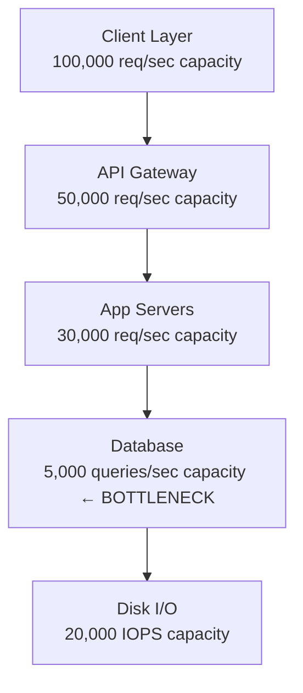
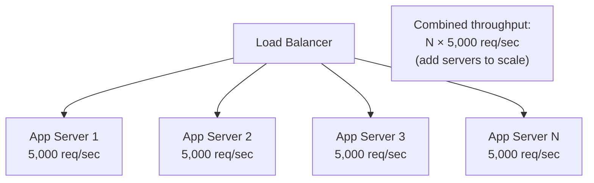
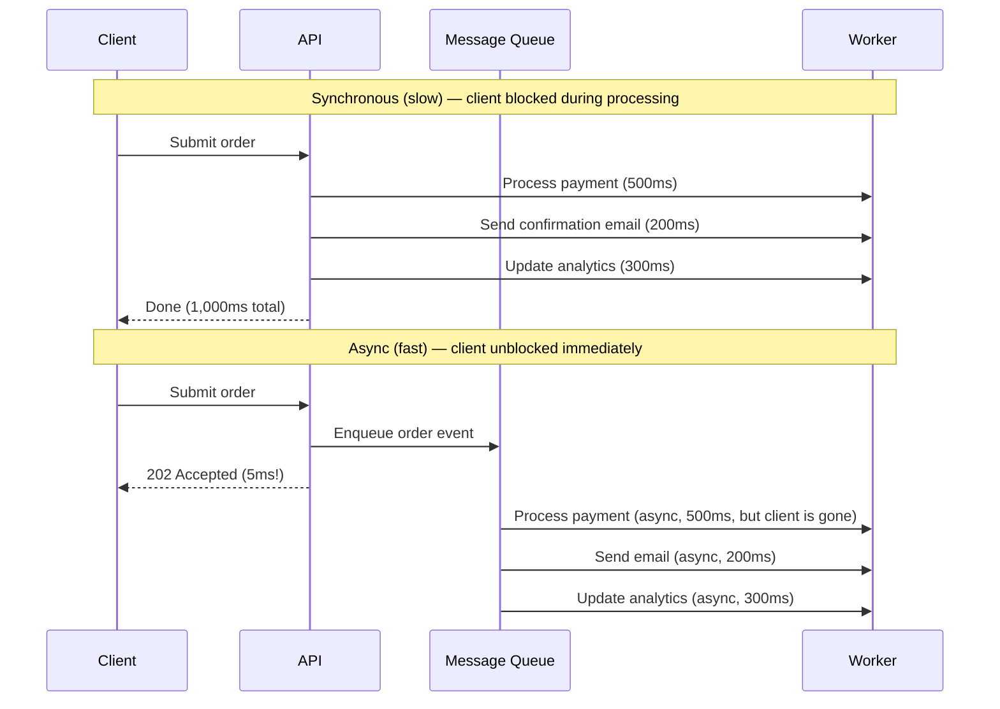
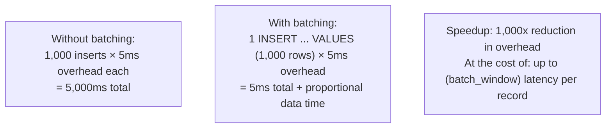
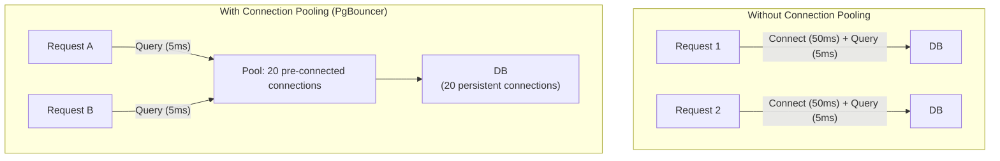
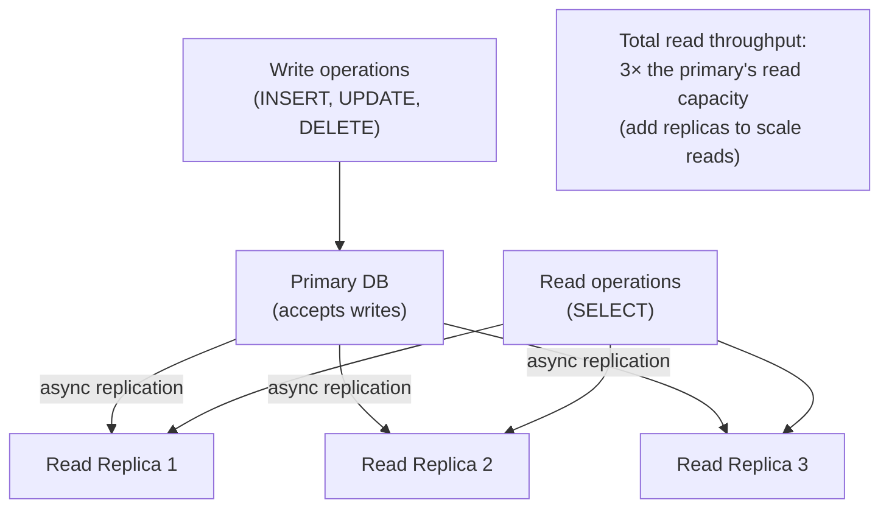
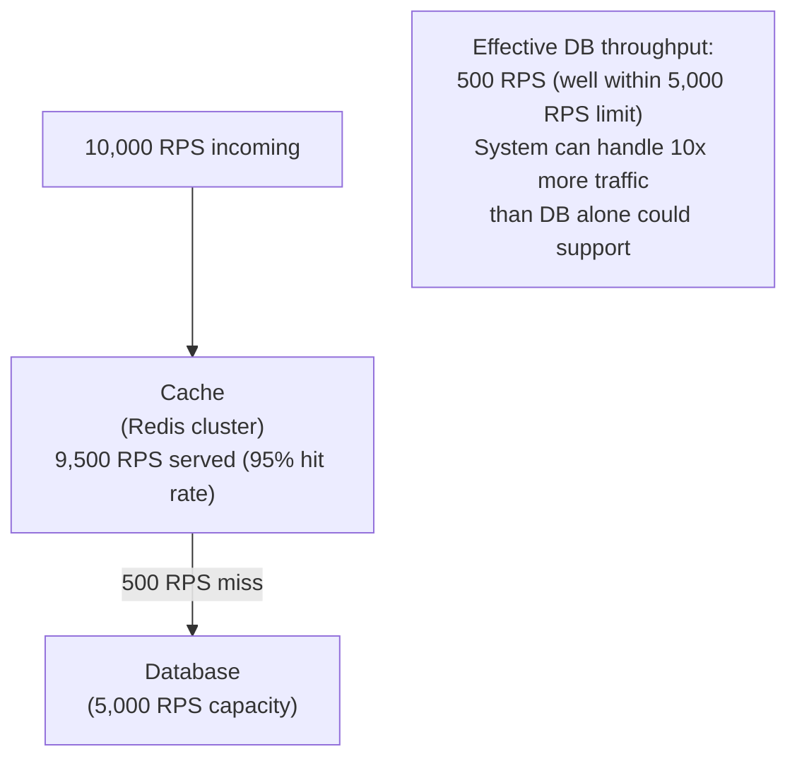
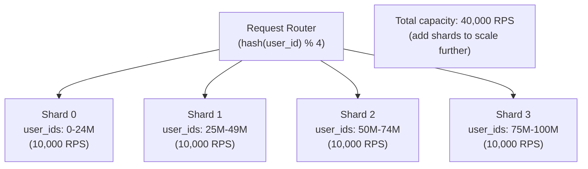
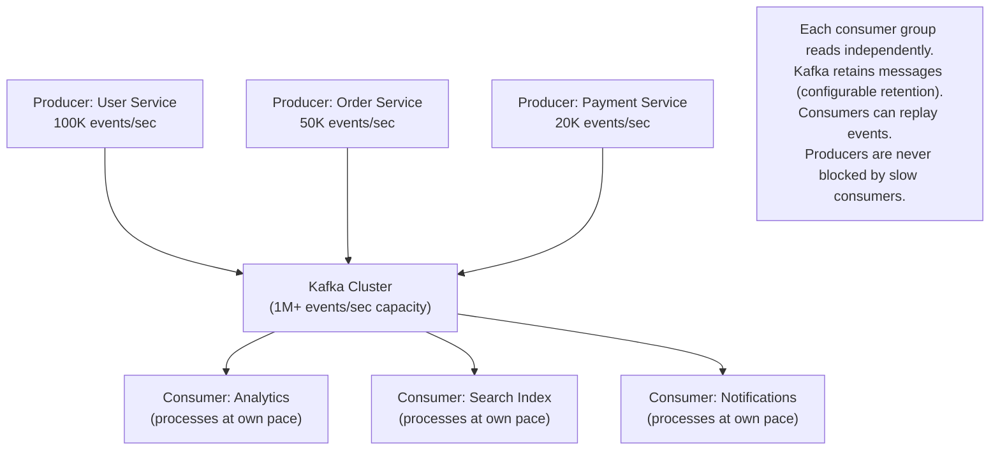

# Throughput Optimization

Throughput is the rate at which a system successfully processes work — requests per second (RPS), transactions per second (TPS), messages per second, or bytes per second. Unlike latency (which describes a single request's journey), throughput is a system-level property: it measures how much work the system completes in aggregate over time. A system with low latency but poor throughput serves each user fast but can't serve many users at once; a system with high throughput can handle enormous load even if individual requests take longer.

> **Why this matters in interviews:** Throughput questions arise whenever you're designing systems that need to handle millions of events: payment processing, feed generation, search indexing, log ingestion, notification delivery. The answer always follows the same pattern: find the bottleneck (the slowest component in the chain), then apply the appropriate technique — horizontal scaling, async processing, batching, or connection pooling.

---

## What Limits Throughput?

Every system has a bottleneck — the component with the lowest throughput capacity. The system's overall throughput equals the throughput of its bottleneck (Amdahl's Law applied to distributed systems).



**Common bottlenecks:**

| Bottleneck                    | Symptoms                         | Solutions                             |
| ----------------------------- | -------------------------------- | ------------------------------------- |
| **Single-threaded CPU**       | One core at 100%, others idle    | Concurrency, async processing         |
| **Database connection limit** | "Too many connections" errors    | Connection pooling, read replicas     |
| **I/O bound**                 | CPU idle, disk/network saturated | Async I/O, caching, batching          |
| **Network bandwidth**         | Bandwidth saturation             | Compression, CDN, reduce payload size |
| **Lock contention**           | High wait time in DB profiler    | Optimistic locking, CQRS, sharding    |
| **Single process**            | Only one instance running        | Horizontal scaling                    |

---

## Strategy 1: Horizontal Scaling

The most direct throughput improvement: add more instances of the bottleneck component.



**When horizontal scaling works well:** Stateless application servers, cache clusters (Redis cluster, Memcached cluster), read replicas for databases, worker processes for background jobs.

**When it doesn't work:** When the bottleneck is a single stateful component that can't be easily partitioned (a single-writer database, a single Kafka partition, a global lock). In these cases, you need to shard or partition the state before horizontal scaling is possible.

---

## Strategy 2: Async Processing (Decouple Producers from Consumers)

**The core throughput insight:** If a client synchronously waits for every step of a request to complete, throughput is limited by the slowest step. Async processing decouples fast producers from slow consumers via a queue.



**The throughput math:** With synchronous processing at 1,000ms/request, a single worker handles 1 request/second = 1 RPS. With async processing, API response time is 5ms, so the same single API server can handle 200 RPS. The actual work still takes 1 second, but client throughput is 200x higher because clients don't wait for it.

**Systems that make this pattern possible:**

- **Kafka:** High-throughput durable log; producers write at millions of events/second; consumers process at their own pace
- **RabbitMQ / SQS:** Task queues for background job processing
- **Redis Streams:** Lightweight event streaming with consumer groups
- **Celery (Python):** Distributed task queue backed by Redis or RabbitMQ

---

## Strategy 3: Batching

Batching reduces per-request overhead by amortizing it across many operations:



**Where batching dramatically improves throughput:**

**Database writes:**

```sql
-- Instead of 1,000 individual inserts (1,000 × round-trip overhead):
INSERT INTO events (user_id, action) VALUES (1, 'click');
INSERT INTO events (user_id, action) VALUES (2, 'view');
-- ... × 1,000

-- One batch insert (1 round-trip):
INSERT INTO events (user_id, action) VALUES
  (1, 'click'),
  (2, 'view'),
  -- ... × 1,000
;
```

**Kafka producer batching:**

```python
from confluent_kafka import Producer

# Kafka producer batches records automatically
producer = Producer({
    'bootstrap.servers': 'localhost:9092',
    'batch.size': 65536,          # 64KB batch before sending
    'linger.ms': 10,              # Wait up to 10ms to fill a batch
    'compression.type': 'snappy', # Compress batches for more throughput
})

# Records are buffered and sent in batches automatically
for event in events:
    producer.produce('events', value=event.to_bytes())

producer.flush()  # Ensure all buffered records are sent
```

**API call batching:** Instead of calling an external API once per record, collect N records and call once with a batch. Many services support this:

- Stripe: `charges.list`, batch refunds
- SendGrid: Up to 1,000 email recipients per API call
- Elasticsearch: `_bulk` API for indexing thousands of documents per request

**Tradeoff:** Batching introduces latency (you wait to accumulate a batch). This is acceptable for throughput-oriented systems (analytics, log ingestion) but not for latency-sensitive paths (user-facing API responses).

---

## Strategy 4: Connection Pooling

Every new database or network connection requires a TCP handshake and authentication — typically 20–50ms of overhead. Connection pooling maintains a pool of pre-established connections, eliminating this overhead.



**Tools:**

- **PgBouncer** (PostgreSQL): Pool in transaction mode; enables thousands of application connections to share 20 DB connections
- **ProxySQL** (MySQL/MariaDB): Connection pooling + query routing + read/write split
- **HikariCP** (Java): Fast in-process JDBC connection pool
- **asyncpg** / **aiomysql** (Python async): Async-native connection pools

**Sizing the pool:** Too few connections = requests wait for a connection (queuing latency); Too many connections = DB server overwhelmed. Use Little's Law:

$$\text{Pool size} = \text{Max concurrent queries} = \lambda \times W$$

If your app handles 1,000 RPS and average query time is 5ms:
Pool size = 1,000 × 0.005 = **5 connections** (plus headroom: 10–20 connections)

---

## Strategy 5: Read/Write Separation

Databases are often throughput-limited because reads and writes compete for the same resources. Separating them multiplies read capacity:



**Consistency tradeoff:** Async replication means replicas may be slightly stale (replication lag). Reads may return data that's a few milliseconds old. This is acceptable for most reads (product listings, user profiles) but not for reads that must reflect the immediately preceding write (e.g., reading a balance after a deposit).

**Pattern for consistency-sensitive reads:** After a write, read from the primary for a brief window, then switch to replicas.

---

## Strategy 6: Caching at Scale

Caching is a throughput multiplier — it converts expensive operations into cheap ones, multiplying effective system throughput:



**Cache throughput itself:** Redis (single-threaded for commands, multi-threaded for I/O) handles ~100,000–1,000,000 GET operations/second per instance. Redis Cluster shards across multiple nodes, scaling linearly.

---

## Strategy 7: Sharding

When a single database or service cannot handle the required throughput, partition data across multiple independent shards:



**Sharding strategies:**

- **Hash sharding:** `shard_id = hash(partition_key) % num_shards` — even distribution but makes range queries hard
- **Range sharding:** `shard_id` based on value ranges — enables range scans but can create hot spots
- **Directory sharding:** Lookup service maps keys to shards — flexible but lookup service becomes a bottleneck

**Hotspot problem:** If one shard receives disproportionate traffic (e.g., a viral user), it becomes a bottleneck. Solutions: virtual nodes (consistent hashing), sub-sharding, or request hedging to multiple shards for hot keys.

---

## Strategy 8: Compression

Reducing payload size increases effective throughput on bandwidth-constrained links:

| Technique     | Compression Ratio | CPU Cost   | Best For                           |
| ------------- | ----------------- | ---------- | ---------------------------------- |
| **Gzip**      | 60–80%            | Low-medium | HTTP responses (JSON/HTML)         |
| **Brotli**    | 65–85%            | Medium     | Static assets (better than gzip)   |
| **Snappy**    | 20–50%            | Very low   | Kafka messages, internal RPCs      |
| **LZ4**       | 30–60%            | Very low   | Real-time data where speed matters |
| **Zstandard** | 60–75%            | Low        | Balances ratio and speed well      |

**Kafka compression:** Using Snappy or LZ4 compression on Kafka producers can double or triple effective throughput on bandwidth-limited clusters while reducing storage costs.

---

## Event-Driven Architecture for Throughput

Event-driven systems (Kafka, Kinesis, Pulsar) achieve very high throughput by design:



**Why this achieves high throughput:**

- **Producers and consumers are fully decoupled** — a slow consumer never blocks a producer
- **Sequential disk writes** — Kafka writes to disk sequentially (very fast, ~500MB/s) rather than random access
- **Zero-copy** — Kafka uses `sendfile()` to transfer data from disk to network without copying to userspace
- **Consumer parallelism** — multiple partitions allow multiple consumer instances in the same consumer group to process in parallel

---

## Throughput vs. Latency Tradeoffs

Optimizing for throughput and latency often involves tradeoffs:

| Technique              | Throughput Effect                 | Latency Effect                             |
| ---------------------- | --------------------------------- | ------------------------------------------ |
| **Batching**           | ↑ (fewer round-trips)             | ↑ (wait to fill batch)                     |
| **Async processing**   | ↑ (decouple producer/consumer)    | ↑ (client doesn't wait for completion)     |
| **Compression**        | ↑ (less bandwidth)                | ↑ slightly (CPU overhead)                  |
| **Connection pooling** | ↑ (eliminate connection overhead) | ↓ (less per-request latency)               |
| **Caching**            | ↑ (fewer expensive operations)    | ↓ (faster responses)                       |
| **Horizontal scaling** | ↑ (more parallel capacity)        | Neutral (parallel, not faster per-request) |
| **Read replicas**      | ↑ (more read capacity)            | ↓ (potentially, if primary less loaded)    |

**Key insight:** Batching and async processing trade latency for throughput. Caching and connection pooling improve both. When designing for high throughput at the cost of latency, this tradeoff must be explicit and acceptable for the use case.

---

## Interview Talking Points

**1. How would you increase the throughput of a system that's bottlenecked on the database?**

> "I'd work through a hierarchy of solutions. First, identify whether it's a read or write bottleneck. For read throughput: add read replicas and route read queries to them; add a caching layer (Redis) in front of the database so that only cache misses hit the DB (at 95% hit rate, the DB sees 20x less traffic). For write throughput: use connection pooling (PgBouncer) to eliminate connection overhead; batch writes using bulk INSERT instead of individual statements; consider async writes via a queue if the use case allows eventual consistency. For both: if a single database can't scale enough, shard the data — partition by a natural key like user_id so writes and reads distribute across shards."

**2. How does async processing improve throughput?**

> "Async processing decouples the rate at which clients submit work from the rate at which the system processes it. In synchronous mode, if processing takes 500ms, a single worker handles 2 requests/second. In async mode, the API acknowledges the request in 5ms (writes to a queue) and returns 202 Accepted. The client is free to submit the next request immediately. The same worker processes jobs at 2/second in the background, but the API can now accept 200 requests/second. The queue acts as a buffer. Throughput increases by the ratio of processing time to acknowledgment time — in this case 100x. The tradeoff is that the client doesn't get an immediate result and must poll or receive a callback when processing completes."

**3. How does Kafka achieve such high throughput?**

> "Kafka's throughput comes from several design decisions. First, sequential disk I/O: Kafka appends messages to the end of a partition log sequentially — sequential disk writes are 10–100x faster than random writes. Second, zero-copy: Kafka uses the OS sendfile() syscall to transfer data directly from the page cache to the network socket without copying to userspace, eliminating a memory copy and a context switch. Third, batching: Kafka producers batch records together before sending, reducing the number of network round-trips. Fourth, parallelism: multiple partitions allow multiple consumers to read in parallel — throughput scales linearly with the number of partitions. Fifth, consumer decoupling: producers never block on consumers; the log retains messages for configurable retention periods."

**4. Explain the throughput tradeoff with batching.**

> "Batching improves throughput by amortizing per-operation overhead — a TCP connection setup, an HTTP round trip, a DB query planner invocation — across many operations at once. Instead of 1,000 individual inserts (1,000 × 5ms overhead = 5,000ms), a batch insert pays the overhead once (5ms + data serialization time). The tradeoff is latency: to fill a batch, you wait. If your batch window is 10ms, records that arrive early in the window wait up to 10ms before being processed. For throughput-oriented systems (analytics ingestion, log processing, bulk email), this latency is acceptable. For user-facing synchronous APIs, it's not. The design decision is: can the use case tolerate up to [batch_window] additional latency in exchange for dramatically higher throughput and lower downstream pressure?"

---

## Key Takeaways

- **System throughput equals its bottleneck's throughput** — find the bottleneck before applying solutions
- **Horizontal scaling** directly multiplies capacity for stateless components; requires sharding for stateful components
- **Async processing via queues** decouples producer throughput from consumer throughput — clients don't wait for slow processing
- **Batching** amortizes per-operation overhead across many operations — 1,000× improvement possible, at the cost of latency
- **Connection pooling** eliminates 20–50ms connection overhead per query — often the fastest DB throughput win
- **Read replicas** multiply read capacity without changing the write path; accept slight replication lag
- **Caching** is a throughput multiplier: at 95% hit rate, a 5,000 RPS database can serve 100,000 RPS
- **Kafka achieves extreme throughput** via sequential I/O, zero-copy, batching, and partition parallelism
- **Batching trades latency for throughput** — an explicit and acceptable tradeoff for many backend systems
