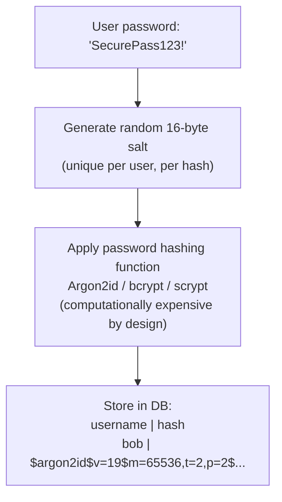
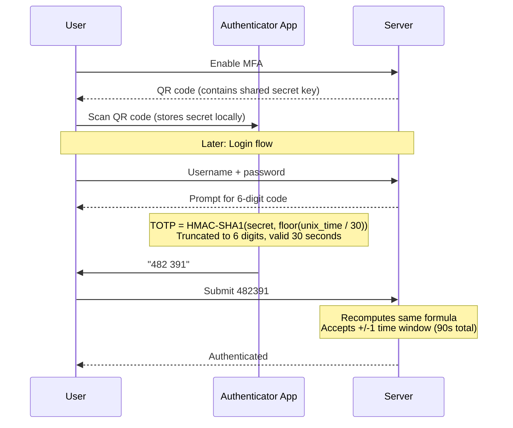
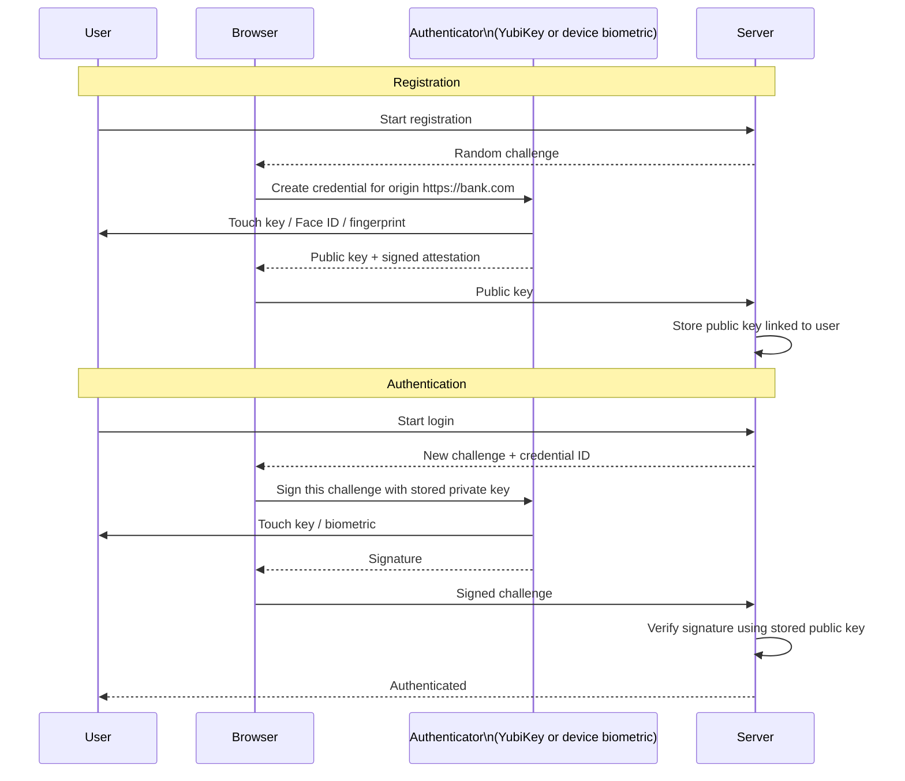
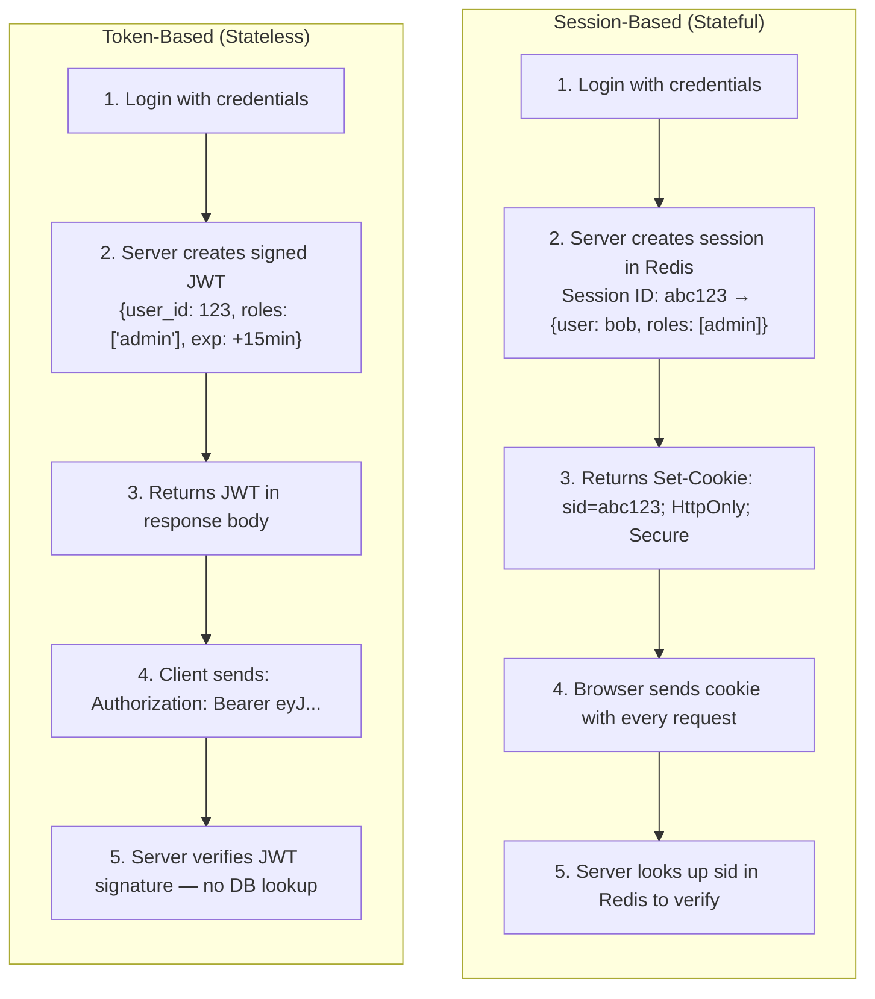

# Authentication

Authentication (AuthN) is the process of verifying that a user, service, or system is who it claims to be — answering the question "Who are you?" before the system decides what you can do. It is the front door of every system: if it is weak, no other security control behind it matters. Modern authentication has evolved from simple username/password pairs to phishing-resistant cryptographic hardware keys.

> **Why this matters in interviews:** Nearly every system design involves authentication. Whether you are designing a social network, payment API, or healthcare platform, interviewers will ask how users log in, how sessions are managed, how you protect against credential attacks, and when to use MFA. Senior engineers are expected to understand password hashing algorithms, the session-vs-token tradeoff, and how WebAuthn eliminates phishing.

---

## Authentication vs Authorization

These terms are frequently confused — they are distinct concerns handled by separate systems:

| Concept | Question | Example |
|---|---|---|
| **Authentication (AuthN)** | Who are you? | User proves identity with password + TOTP code |
| **Authorization (AuthZ)** | What can you do? | User has `read:orders` but not `delete:orders` permission |

Always authenticate first, then authorize. A common architecture mistake is mixing these layers.

---

## Password-Based Authentication

### Password Hashing — The Correct Way

**Never store passwords in plaintext or with reversible encryption.** Use a dedicated password hashing algorithm designed to be slow and memory-intensive:



| Algorithm | Recommended | Key Properties |
|---|---|---|
| **Argon2id** | Best choice | Memory-hard, winner of Password Hashing Competition 2015 |
| **bcrypt** | Good | Widely supported, 72-byte password limit, configurable cost |
| **scrypt** | Good | Memory-hard; harder to configure correctly |
| **PBKDF2** | Acceptable | FIPS-compliant; CPU-hard only (weaker vs GPUs) |
| **SHA-256 (raw)** | Never | Too fast — billions of guesses/second with a GPU |
| **MD5 / SHA-1** | Never | Cryptographically broken; crackable in seconds |

**Why slow hashing matters:** bcrypt at cost=12 takes ~250ms per hash. An attacker with a GPU can compute 10 billion SHA-256 hashes per second, but only ~4 bcrypt hashes per second — a 2.5-billion-× slowdown.

```python
from argon2 import PasswordHasher

ph = PasswordHasher(
    time_cost=2,        # iterations
    memory_cost=65536,  # 64 MB — makes GPU/ASIC attacks expensive
    parallelism=2       # threads
)

# Registration
hashed = ph.hash("user_password")  # salt embedded in output

# Login
try:
    ph.verify(hashed, "user_password")  # raises if wrong
    if ph.check_needs_rehash(hashed):   # upgrade if parameters changed
        hashed = ph.hash("user_password")
        # save updated hash to DB
except Exception:
    raise ValueError("Invalid credentials")
```

---

## Multi-Factor Authentication (MFA)

MFA requires proof of identity from at least two different factor categories:

| Factor | Type | Examples |
|---|---|---|
| **Something you know** | Knowledge | Password, PIN |
| **Something you have** | Possession | Authenticator app (TOTP), hardware key, SMS OTP |
| **Something you are** | Inherence | Fingerprint, Face ID |

Two passwords is **not** MFA — they are the same factor type.

### TOTP — Authenticator Apps

TOTP (RFC 6238) is the algorithm behind Google Authenticator, Authy, and 1Password:



**TOTP security properties:** Codes expire every 30 seconds. Without the shared secret, an attacker cannot predict codes. Even if they capture a valid code, it is useless in 31 seconds.

### WebAuthn / FIDO2 — Passkeys (Most Secure)

WebAuthn uses public-key cryptography. The private key **never leaves the device**, making it phishing-resistant:



**Why WebAuthn eliminates phishing:** The credential is cryptographically bound to the exact origin (`https://bank.com`). A phishing site at `https://b4nk.com` simply cannot use the credential — the browser enforces origin binding. This is categorically more secure than any password + OTP combination.

### SMS OTP — The Weakest MFA

SMS is better than no MFA, but has real weaknesses:
- **SIM swapping:** Attacker convinces carrier to transfer victim's phone number to attacker's SIM
- **SS7 protocol attacks:** Sophisticated actors can intercept SMS at the telecom layer
- **Social engineering:** Phishing sites can relay codes in real time

**Recommendation:** Use TOTP apps as the default; hardware keys for high-value accounts; SMS only as a last-resort fallback.

---

## Session-Based vs Token-Based Authentication



| Dimension | Session-Based | Token-Based (JWT) |
|---|---|---|
| **Server state** | Stateful (session store required) | Stateless (any server can verify) |
| **Revocation** | Instant — delete the session record | Hard — JWT valid until expiry |
| **Scalability** | Requires sticky sessions or shared Redis | Any server validates independently |
| **Token size** | Tiny (~32-byte session ID in cookie) | Larger (~500+ bytes JWT in header) |
| **Best for** | Traditional web apps, admin panels | APIs, microservices, mobile clients |

---

## Common Attacks and Defenses

| Attack | Description | Defenses |
|---|---|---|
| **Brute force** | Try millions of passwords against one account | Rate limit logins, account lockout, CAPTCHA |
| **Credential stuffing** | Use leaked credentials from other site breaches | MFA, breach password checking (HaveIBeenPwned API), anomaly detection |
| **Phishing** | Fake login page captures credentials | WebAuthn/passkeys (domain-bound), security awareness training |
| **Session hijacking** | Steal a session cookie | HttpOnly + Secure + SameSite cookie flags, session rotation on login |
| **Man-in-the-Middle** | Intercept credentials in transit | Enforce HTTPS/TLS everywhere, HSTS |

### Secure Cookie Flags (Baseline)

```http
Set-Cookie: sid=abc123; HttpOnly; Secure; SameSite=Strict; Path=/; Max-Age=3600
```

- **HttpOnly:** JavaScript cannot read the cookie (`document.cookie` blocked) — prevents XSS-based cookie theft
- **Secure:** Only sent over HTTPS — never over HTTP
- **SameSite=Strict:** Not sent on cross-site requests — prevents CSRF

---

## Passwordless Authentication

### Magic Links

User enters email → server generates a signed, one-time, time-limited link → clicking authenticates them:

```
https://app.com/auth/magic?token=<HMAC-signed-token>&expires=1716999999
```

The token is used once and expires in 15 minutes. It depends on email security — if the email account is compromised, so is the login.

### Passkeys

Passkeys are WebAuthn credentials synced via iCloud Keychain or Google Password Manager. Users authenticate with Face ID or fingerprint — no password needed. Apple, Google, and Microsoft now support passkeys natively. This is the future of consumer authentication.

---

## Interview Talking Points

**1. How do you store passwords securely in a production system?**
> "I use Argon2id — winner of the Password Hashing Competition and the modern best practice. The critical properties: it is memory-hard (64MB+ memory cost makes GPU/ASIC attacks prohibitively expensive), it has a unique random salt per password embedded in the output (defeats rainbow tables and precomputation), and cost parameters are tunable as hardware gets faster. I configure it so hashing takes 100-300ms on the server — slow enough to defeat brute force but fast enough that users don't notice. On login, I call verify() which handles salt extraction automatically. I also implement check_needs_rehash() — if I increase cost parameters, the hash is transparently upgraded the next time the user logs in with their plaintext password in memory."

**2. What is the tradeoff between session-based and token-based (JWT) authentication?**
> "Session-based auth stores a session record server-side, keyed by a random session ID in the user's cookie. The advantage is instant revocation — delete the record and the session dies immediately. The disadvantage is that every request hits the session store, which becomes a bottleneck. Token-based auth with JWTs is stateless — the server validates a cryptographic signature with no DB lookup, which scales beautifully for microservices where any instance can verify any token. The tradeoff is revocation: a JWT is valid until its expiry timestamp. If I need immediate revocation (account compromise, user logout from all devices), I need either very short expiry (5-15 minutes) with refresh tokens, or a token denylist — which reintroduces server state. For traditional web apps I prefer sessions; for APIs and microservices I use short-lived JWTs with refresh token rotation."

**3. Why is WebAuthn/passkeys considered the gold standard for authentication?**
> "WebAuthn uses asymmetric cryptography — the device generates a public/private key pair during registration, stores the private key in a secure enclave (TPM, Secure Enclave on iPhone), and sends only the public key to the server. During login, the server sends a random challenge and the device signs it with the private key. Two properties make this uniquely secure: the private key never leaves the device — it cannot be phished, leaked in a breach, or transmitted over a network; and the credential is cryptographically bound to the origin URL. A phishing site at b4nk.com simply cannot trigger the bank.com credential — the browser enforces this at the WebAuthn API level. No password or OTP can match this guarantee because they are knowledge factors that can be captured and replayed."

**4. How would you defend against a large-scale credential stuffing attack?**
> "Credential stuffing uses valid credentials leaked from other site breaches — attackers are not guessing, they are testing 500 million known username/password pairs. My defense layers: First, rate limiting per IP and per account with exponential backoff — 5 failures, 30-second lockout, then 1-minute, 5-minute, escalating. Second, integrate HaveIBeenPwned's Pwned Passwords API during registration and password change to reject passwords that have appeared in known breaches. Third, device fingerprinting and behavioral analytics — flag logins from new devices, unusual geolocations, or impossible travel patterns and require MFA step-up. Fourth, CAPTCHA challenges for suspicious traffic patterns. And fundamentally: make MFA the default or mandatory. Even with a valid credential, MFA stops the attacker cold. The goal is to make credential stuffing economically unviable — too many checks for too little success rate."

---

## Key Takeaways

- **Authentication is identity verification** — always separate from authorization (what you can do)
- **Never store plaintext passwords** — use Argon2id (best), bcrypt (good), or scrypt (good); never MD5/SHA-1/raw SHA-256
- **MFA factors must be different types** — two passwords is not MFA; use something-you-know + something-you-have
- **WebAuthn/passkeys** are phishing-resistant because private keys never leave the device and credentials are domain-bound
- **Session-based auth** is stateful with instant revocation; **JWT-based auth** is stateless but hard to revoke immediately
- **Cookie security baseline:** always set `HttpOnly`, `Secure`, and `SameSite` flags
- **Passwordless** (magic links, passkeys) eliminates the entire class of password-based attack vectors
