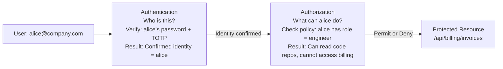
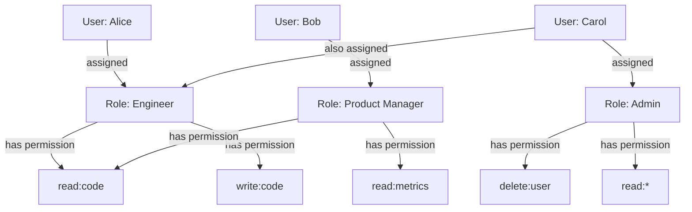
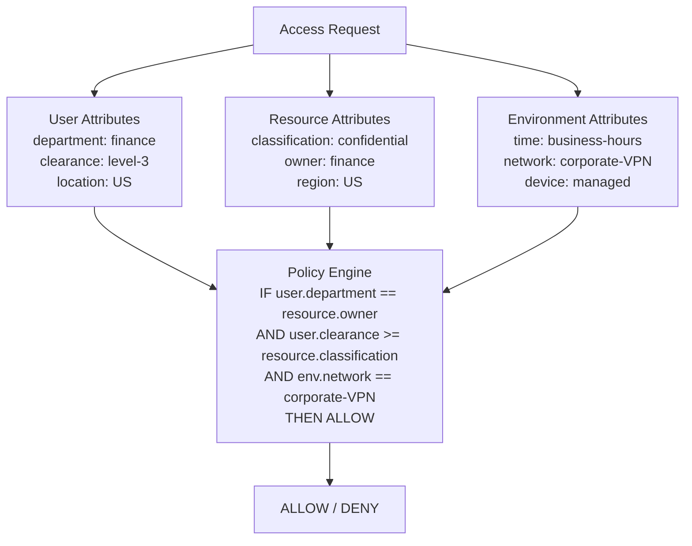
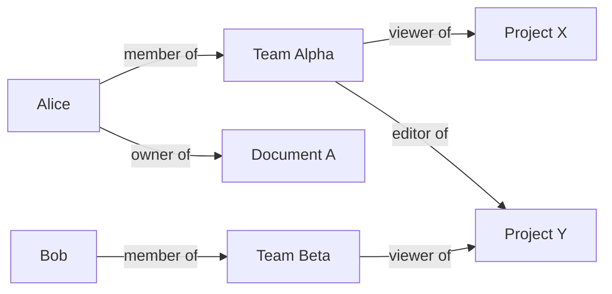
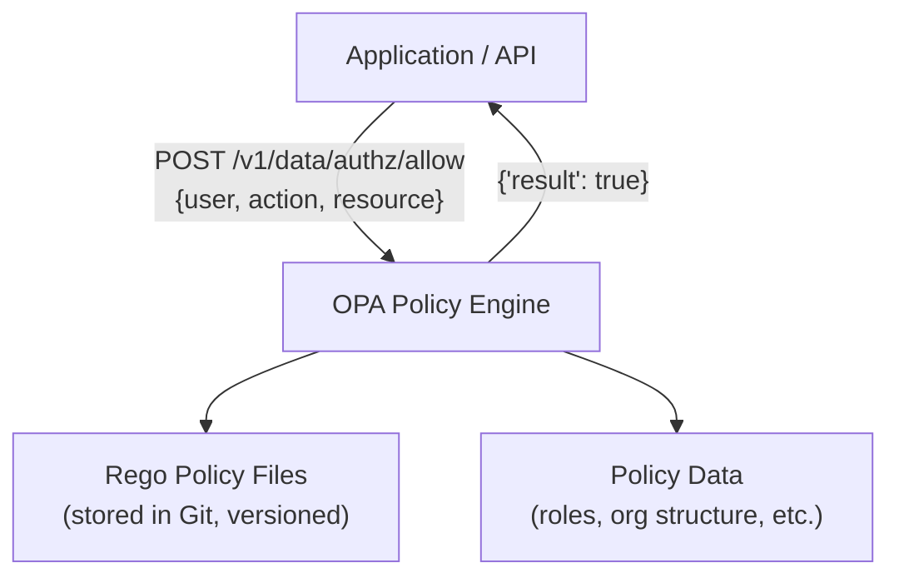

# Authorization

Authorization (AuthZ) is the process of determining what an authenticated identity is allowed to do — answering the question "What can you access?" after authentication has already confirmed who you are. It is the enforcement layer that separates what different users can see, create, modify, or delete within a system. Poor authorization design is consistently in the OWASP Top 10 most critical web application security risks, causing data breaches where users can access other users' data.

> **Why this matters in interviews:** Authorization is a first-class design concern for any multi-user system. Interviewers ask "how would you ensure a user can only access their own data?" or "how would you implement admin vs regular user permissions?" Experienced engineers are expected to know RBAC vs ABAC, understand the principle of least privilege, and have a view on policy-as-code systems like Open Policy Agent.

---

## Authentication vs Authorization — One More Time



Authentication establishes **identity**. Authorization enforces **policy** on that identity.

---

## Access Control Models

### 1. ACL — Access Control Lists

The simplest model: each resource has a list of who can access it and how.

```
File: /data/report.csv
  - alice: read, write
  - bob: read
  - carol: (no access)
```

**Good for:** File systems (Unix permissions, S3 bucket policies), small-scale systems.  
**Problems at scale:** As users and resources grow, ACLs become unmanageable — imagine maintaining per-file ACLs for 10,000 users.

---

### 2. RBAC — Role-Based Access Control

Users are assigned **roles**. Roles have **permissions**. Users inherit permissions through roles:



**RBAC implementation in a database:**

```sql
-- Tables
users (id, email, ...)
roles (id, name)  -- e.g., 'engineer', 'admin', 'viewer'
permissions (id, resource, action)  -- e.g., ('code', 'read'), ('billing', 'write')
role_permissions (role_id, permission_id)
user_roles (user_id, role_id)

-- Check: can alice write to billing?
SELECT COUNT(*)
FROM user_roles ur
JOIN role_permissions rp ON ur.role_id = rp.role_id
JOIN permissions p ON rp.permission_id = p.id
WHERE ur.user_id = 'alice'
  AND p.resource = 'billing'
  AND p.action = 'write';
```

**RBAC pros:** Simple to understand, easy to audit ("who has admin role?"), good for enterprise software.  
**RBAC cons:** Role explosion — companies often end up with hundreds of roles that are hard to manage; poor fit for fine-grained contextual policies.

---

### 3. ABAC — Attribute-Based Access Control

Access decisions are based on **attributes** of the user, the resource, and the environment — evaluated against a policy:



**Example ABAC policy (plain English):**
> "Allow access to financial reports only if: the user is in the Finance department AND they are on the corporate VPN AND it is during business hours AND the report belongs to their regional business unit."

This policy is impossible to express cleanly in RBAC without creating dozens of roles.

**ABAC pros:** Extremely fine-grained; handles complex contextual policies; scales to millions of users without role explosion.  
**ABAC cons:** Harder to understand and audit; policy complexity can become its own risk.

---

### 4. ReBAC — Relationship-Based Access Control

Access is determined by the **relationship** between a user and a resource in a graph:



**The question "can Alice edit Project Y?" is answered by traversing the graph:**  
`Alice` → `member of Team Alpha` → `editor of Project Y` → **Yes**

Google's authorization system **Zanzibar** (described in a 2019 paper) underpins Google Docs, Drive, YouTube, and Maps. It evaluates tuple-based relationship graphs: `(user: alice, relation: editor, object: doc:123)`.

**Open-source implementations:** OpenFGA (by Auth0), SpiceDB (by AuthZed).

---

### Model Comparison

| Model | Best For | Scales To | Complexity |
|---|---|---|---|
| **ACL** | File systems, simple resources | Thousands of resources | Low |
| **RBAC** | Enterprise SaaS, internal tools | Millions of users | Medium |
| **ABAC** | Regulatory compliance, fine-grained policies | Unlimited | High |
| **ReBAC** | Collaborative platforms (Google Docs, GitHub) | Billions of relationships | Medium-High |

---

## Policy-as-Code with Open Policy Agent (OPA)

OPA is a general-purpose policy engine that decouples authorization policy from application code. Policies are written in **Rego** (a declarative query language):



**Example Rego policy:**

```rego
package authz

# Default deny
default allow = false

# Allow if user has the required permission for this action
allow {
    user_role := data.user_roles[input.user]
    required_permission := data.role_permissions[user_role][_]
    required_permission.resource == input.resource
    required_permission.action == input.action
}

# Admins can do anything
allow {
    data.user_roles[input.user] == "admin"
}
```

**Why OPA/policy-as-code matters:**
- Policies are version-controlled in Git alongside code
- Policy changes go through code review and CI/CD
- Policies can be unit-tested independently of the application
- One policy engine can authorize across microservices, Kubernetes, Terraform, and APIs

---

## Principle of Least Privilege

**Every identity should have the minimum permissions required to perform its function — nothing more.**

In practice:
- An API server that reads orders does not need `DELETE` permission on the orders table
- A background job that sends emails does not need database access to user financials
- An engineer in dev environment does not need access to production databases
- A service account for a reporting tool should be read-only

**Implementation patterns:**
- Short-lived tokens with narrow scopes (OAuth 2.0 scopes)
- Per-microservice database users with limited permissions
- Just-in-time (JIT) access: engineers request temporary elevated access, which is auto-revoked after a time window
- Regular access reviews and automated de-provisioning when employees leave

---

## Authorization Anti-Patterns

### IDOR — Insecure Direct Object References

The most common authorization bug — the #1 OWASP API security risk:

```python
# VULNERABLE: no ownership check
@app.get("/api/orders/{order_id}")
def get_order(order_id: int):
    return db.query("SELECT * FROM orders WHERE id = ?", order_id)
    # Any authenticated user can read any order by guessing order IDs
```

```python
# CORRECT: enforce ownership
@app.get("/api/orders/{order_id}")
def get_order(order_id: int, current_user: User = Depends(get_current_user)):
    order = db.query(
        "SELECT * FROM orders WHERE id = ? AND user_id = ?",
        order_id, current_user.id  # Always scope to the authenticated user
    )
    if not order:
        raise HTTPException(status_code=404)  # 404, not 403 — don't confirm existence
    return order
```

### Privilege Escalation via Mass Assignment

```python
# VULNERABLE: binding all request fields to the model
@app.put("/api/users/{user_id}")
def update_user(user_id: int, data: dict):
    db.update("users", data, where={"id": user_id})
    # Attacker sends {"email": "new@email.com", "role": "admin"}
```

```python
# CORRECT: allowlist only the fields the user can update
class UserUpdateRequest(BaseModel):
    email: str | None = None
    display_name: str | None = None
    # role is NOT here — users cannot change their own role
```

---

## Interview Talking Points

**1. What is the difference between RBAC and ABAC, and when do you choose each?**
> "RBAC assigns users to roles and roles to permissions. It is simple, auditable, and works well for enterprise SaaS where you have a manageable number of user types — viewer, editor, admin, billing-admin. The failure mode is role explosion: when you need to express 'finance team in Europe can access Q3 reports during business hours,' you end up creating a dozen specific roles that are hard to manage. ABAC evaluates policies against attributes of the user, resource, and environment. It handles that European finance scenario naturally — the policy engine checks user.department, resource.region, and env.time. I choose RBAC when roles map cleanly to job functions and there are fewer than ~50 roles. I reach for ABAC or OPA-based policy-as-code when I need contextual, fine-grained access control or have regulatory requirements like HIPAA or SOC 2 that require attribute-based controls."

**2. What is an IDOR vulnerability and how do you prevent it?**
> "IDOR — Insecure Direct Object Reference — is when an API allows a user to access another user's resource by simply changing an ID parameter. For example: `GET /api/orders/12345` returns my order fine, but `GET /api/orders/12346` returns my neighbor's order because the server never checks ownership. It is the number one API security flaw (OWASP API1). The fix is always to scope database queries to the authenticated user's identity: `WHERE order_id = ? AND user_id = current_user.id`. Never trust the client to provide a user ID in the request — derive it from the authenticated session or JWT. Additionally, consider using UUIDs instead of sequential integers for IDs — it does not prevent IDOR but eliminates the trivial enumeration attack of trying IDs 1, 2, 3, 4."

**3. What is the principle of least privilege and why is it hard in practice?**
> "Least privilege means every identity — user, service account, API token, database user — should have the minimum permissions needed to do its job. A read-only reporting service should have only SELECT permissions. An API server should not have TRUNCATE or DROP TABLE access even if it owns the table. In practice, least privilege is hard for two reasons: convenience and urgency. Developers grant broad permissions because it is faster and they do not want to deal with permission denied errors during a deadline. Operations teams grant production access to entire engineering teams 'just in case' rather than on-demand. I address this with JIT access — engineers request elevated permissions for a specific reason and duration, an automated system grants it, and it auto-revokes after the window closes. For services, I use separate per-service database accounts with minimal permissions enforced at the database level."

**4. What is Open Policy Agent and why would you use it over embedding authorization logic in your code?**
> "OPA is a general-purpose policy engine that takes a JSON input describing a request — who, what action, on what resource — and evaluates it against Rego policy rules to return allow or deny. The key benefit over embedded authorization logic is separation of concerns: policy lives in version-controlled Rego files, not scattered across application code. When a business rule changes — say, 'contractors can no longer access salary data' — you change one policy file, review it like code, test it, and deploy it; you do not hunt through 20 microservices to find every authorization check. OPA integrates at the API gateway, service mesh (Envoy/Istio), Kubernetes admission controller, and Terraform plan level — one policy engine governing your entire stack. The tradeoff is operational overhead: you are running another service, adding network latency to authorization checks, and learning Rego. For simple RBAC in a small app, it is overkill. For a platform team managing authorization across 50 microservices, it pays for itself quickly."

---

## Key Takeaways

- **Authorization (authZ)** answers "what can you do?" — always comes after authentication (authN)
- **RBAC** is simple and auditable — use for enterprise apps with well-defined job roles
- **ABAC** handles complex contextual policies — use when role explosion becomes a problem
- **ReBAC** (Zanzibar/OpenFGA) is ideal for collaborative platforms with complex resource sharing graphs
- **IDOR is the #1 API security flaw** — always scope queries to the authenticated user's identity
- **Principle of least privilege:** every identity should have minimum required permissions; use JIT access for elevated privileges
- **Policy-as-code (OPA/Rego)** decouples authorization from application code — enables version control, review, and testing of policies
- **Mass assignment vulnerabilities** are prevented by explicit allowlisting of updateable fields, never binding all request fields to models
