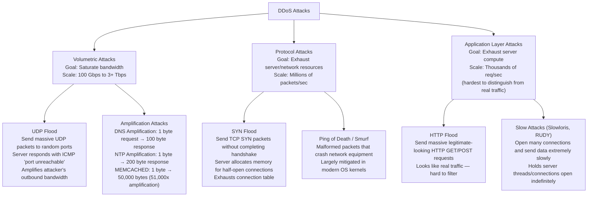
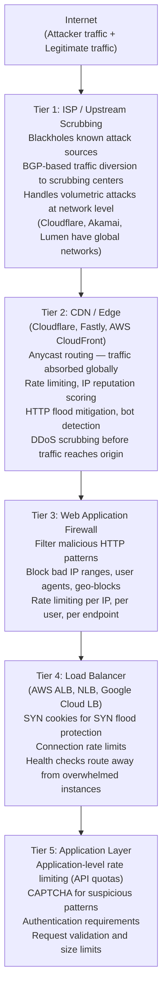
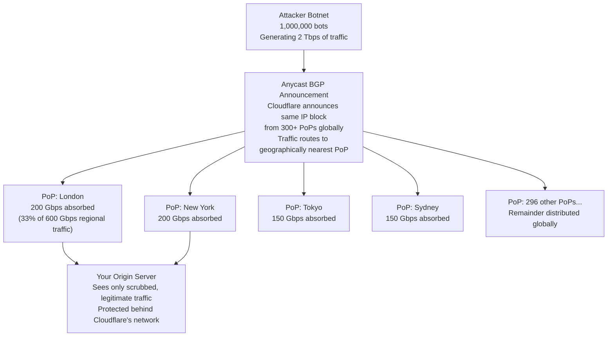
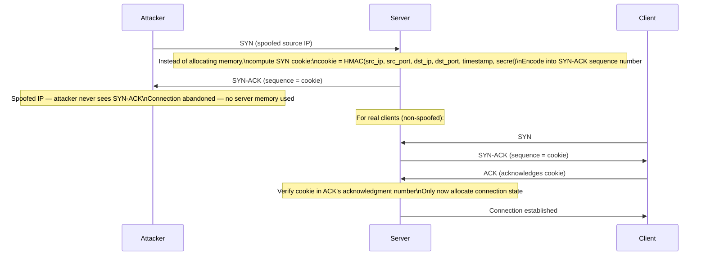
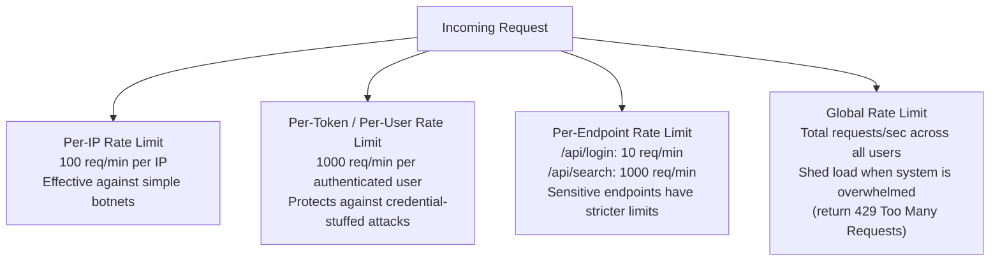

# DDoS Protection

A Distributed Denial of Service (DDoS) attack attempts to make a system or service unavailable to legitimate users by overwhelming it with traffic from many sources simultaneously — often thousands to millions of compromised machines (a botnet). Unlike a simple DoS attack from one source (easily blocked by IP), DDoS traffic comes from a massive, distributed source, making it extremely difficult to filter without specialized infrastructure. DDoS attacks are one of the few threats that can make a properly coded system completely unavailable regardless of code quality.

> **Why this matters in interviews:** DDoS protection comes up when designing any public-facing system — especially high-traffic consumer apps, financial services, gaming platforms, or APIs. Interviewers expect you to know the attack taxonomy, the defense layers (CDN/edge, network, application), and architectural choices like anycast routing. Knowing specific mitigation techniques (SYN cookies, rate limiting, anycast BGP) signals deep infrastructure knowledge.

---

## DDoS Attack Taxonomy



---

## Defense Architecture: Defense-in-Depth

No single layer stops all DDoS attacks. Effective protection uses multiple layers:



---

## Volumetric Attack Mitigation: Anycast Routing

**Anycast** is the most powerful architectural weapon against volumetric DDoS:



**Why anycast works:** A 2 Tbps attack sounds massive, but Cloudflare's global network has ~300 Tbps of total capacity. 2 Tbps distributed across 300 PoPs is ~6.7 Gbps per PoP — easily absorbed. The attacker cannot concentrate their traffic because BGP routing always takes them to the nearest PoP.

Cloudflare mitigated the largest recorded DDoS in 2023 at **201 million requests per second** (and 3.8 Tbps in 2024) using this anycast architecture.

---

## Protocol Attack Mitigation: SYN Cookies

SYN floods exploit TCP's three-way handshake. The server normally allocates memory for each SYN it receives (half-open connection). Under a SYN flood, this connection table fills up and the server cannot accept legitimate connections.

**SYN Cookies** solve this by making the server stateless during the handshake:



**Result:** The server holds zero state for unacknowledged SYNs. The connection table can never be exhausted by a SYN flood. Real clients complete the handshake and their connection is established. SYN cookies are implemented in the Linux kernel (enabled by default) and in hardware load balancers.

---

## Application Layer Attack Mitigation

HTTP floods and slow attacks look like legitimate traffic — you cannot filter them purely by volume or protocol.

### Rate Limiting

Block or throttle clients sending too many requests:



### Bot Detection and CAPTCHA

**Behavioral signals that indicate bot traffic:**
- No or minimal JavaScript execution (headless browser indicators)
- Request rate faster than any human can produce (100 req/sec from one IP)
- Missing or fake browser fingerprint (User-Agent doesn't match TLS fingerprint)
- High request volume with no session cookies or cookie rotation
- Requests targeting only specific high-value endpoints (credential stuffing pattern)

**Cloudflare Bot Score** assigns each request a 0-100 bot probability score. Scores above 80: return CAPTCHA or block. CAPTCHAs have evolved from text puzzles to invisible behavioral analysis (mouse movement patterns, typing rhythm, browser characteristics).

### Slowloris and Slow POST Attack Mitigation

Slowloris sends HTTP headers very slowly — one byte every ~15 seconds — keeping connections open indefinitely and exhausting the thread pool:

```nginx
# Nginx configuration to mitigate slow attacks
http {
    client_body_timeout 10s;     # Kill connections not sending body within 10s
    client_header_timeout 10s;   # Kill connections not sending headers within 10s
    keepalive_timeout 65s;       # Close idle keep-alive connections
    send_timeout 10s;            # Kill if client stops receiving for 10s
    
    # Limit connection count per IP
    limit_conn_zone $binary_remote_addr zone=conn_limit_per_ip:10m;
    limit_conn conn_limit_per_ip 20;
    
    # Limit request rate per IP
    limit_req_zone $binary_remote_addr zone=req_limit_per_ip:10m rate=100r/m;
    limit_req zone=req_limit_per_ip burst=20 nodelay;
}
```

Nginx and modern web servers handle Slowloris well because they are event-driven (not thread-per-connection). Apache in prefork mode (thread-per-connection) is vulnerable and requires explicit mitigation like the `mod_reqtimeout` module.

---

## DNS Amplification and Reflection Attacks

Attacker sends DNS queries with spoofed source IP (victim's IP). DNS servers send large responses to the victim:

```
Attacker → DNS Servers: "Query for ANY records at example.com" (source: victim IP)
DNS Servers → Victim: Large response (up to 4KB per query)

Amplification: 1 byte request → 100 byte response = 100x amplification
At 1 million queries/sec: 1 Gbps of attack generates 100 Gbps of traffic to victim
```

**Mitigations:**
- **BCP38 / IP Spoofing Prevention:** ISPs filter packets with spoofed source IPs at their network edge (required by RFC 2827/BCP38). Widely deployed but not universal.
- **DNS Response Rate Limiting (DNS RRL):** DNS servers limit response rate per source IP
- **Cloudflare / Akamai scrubbing:** Absorbs the flood before it reaches your infrastructure
- **Anycast for DNS:** Distribute DNS servers globally so flood traffic is distributed

---

## AWS Shield — DDoS Protection as a Service

AWS Shield is a managed DDoS protection service:

| Tier | Coverage | Cost | Features |
|---|---|---|---|
| **Shield Standard** | All AWS customers | Free | Layer 3/4 protection, SYN flood, UDP flood |
| **Shield Advanced** | Opt-in | ~$3,000/month | Layer 7 protection, WAF integration, DDoS cost protection, 24/7 DRT team |

**Shield Advanced + WAF + CloudFront** is a common production pattern:
1. CloudFront at the CDN edge handles volumetric attacks and caches content
2. WAF rules block HTTP floods, malicious IPs, geo-blocking
3. Shield Advanced protects ALB/EC2 with automatic threat intelligence and the DDoS Response Team (DRT)
4. Shield Advanced provides "DDoS cost protection" — if an attack causes AWS bill spikes, AWS credits the excess charges

---

## Interview Talking Points

**1. How would you design DDoS protection for a high-traffic public API?**
> "I use defense-in-depth with multiple independent layers. The first layer is a CDN like Cloudflare or AWS CloudFront — their anycast network distributes traffic globally so volumetric attacks are absorbed across hundreds of PoPs rather than concentrated on my origin. Cloudflare specifically has 300+ Tbps of network capacity, so even a 1 Tbps attack is absorbed at the edge. The second layer is WAF — AWS WAF or Cloudflare WAF — with rules for rate limiting, IP reputation, geo-blocking, and bad bot user agents. The third layer is application-level rate limiting — per-IP and per-API-key limits implemented in the API gateway or application, with 429 responses that tell legitimate clients to back off. The fourth layer is infrastructure sizing: auto-scaling so that traffic spikes that are not attacks can be absorbed by adding capacity. The goal is that any DDoS attack either gets absorbed at the CDN/WAF layer before reaching my origin, or if it is sophisticated enough to reach the origin, auto-scaling and rate limiting prevent a complete outage."

**2. What is a SYN flood attack and how does SYN cookie mitigate it?**
> "TCP connections start with a three-way handshake: SYN → SYN-ACK → ACK. Normally, when a server receives a SYN, it allocates memory for a 'half-open connection' and waits for the final ACK. A SYN flood sends millions of SYN packets with spoofed source IPs — the SYN-ACK response goes to a random IP that never replies, so the server's half-open connection table fills up. Legitimate connections fail because the table is full. SYN cookies eliminate the memory allocation problem. Instead of storing state for each SYN, the server encodes all necessary information into the sequence number of the SYN-ACK: it is a cryptographic hash of the source and destination addresses and a timestamp. When the legitimate ACK arrives, the server verifies the cookie in the acknowledgment number and only then allocates the connection state. Spoofed SYNs never complete to the ACK step (the response goes to the spoofed IP), so they consume zero server memory. SYN cookies are implemented in the Linux kernel and are enabled by default under high load."

**3. What is anycast routing and why is it effective against volumetric DDoS?**
> "Anycast is a network addressing scheme where the same IP address is announced from multiple geographic locations via BGP. When a packet is sent to that IP, the internet's routing protocols deliver it to the topologically nearest announcement point. CDNs like Cloudflare and Akamai use anycast to announce their IP ranges from hundreds of Points of Presence globally. The effect on DDoS is geographic distribution of the attack traffic. If an attacker generates 1 Tbps of attack traffic from botnets distributed globally, that traffic routes to the nearest PoP — some goes to London, some to New York, some to Tokyo. Each PoP might receive 3-5 Gbps, well within its capacity to absorb and scrub. Compare this to the alternative: all 1 Tbps converges on a single data center, which is overwhelmed. The attacker would need to exceed the total capacity of the entire global network — Cloudflare's is ~300 Tbps — to disrupt service. That is practically impossible."

**4. How would you distinguish a DDoS attack from a legitimate traffic spike?**
> "Legitimate traffic spikes and DDoS attacks can look similar at the volume level, but they have very different signatures. Legitimate spikes typically show geographic distribution matching your normal user base — if you are a US e-commerce site, a spike should come from US IPs. DDoS traffic often shows anomalous geographic patterns: all traffic from unusual regions, or all traffic from known datacenter/VPN IP ranges (botnets use compromised cloud instances). Second, legitimate users browse — they hit multiple different endpoints, have normal HTTP headers, execute JavaScript, and have browser fingerprints that match their declared User-Agent. Bot traffic often only hits one endpoint repeatedly, has minimal or fake browser characteristics, and mismatches TLS fingerprints with User-Agents. Third, response codes: legitimate traffic generates varied response codes; DDoS often floods a specific endpoint generating mostly 200s or 404s. I combine these signals: CDN analytics, WAF logs, application metrics by endpoint and response code, and geographic distribution — anomalous patterns in two or more dimensions usually confirm a DDoS."

---

## Key Takeaways

- **DDoS attack types:** volumetric (bandwidth exhaustion), protocol (resource exhaustion like SYN floods), application-layer (HTTP floods, Slowloris)
- **Defense-in-depth:** ISP/upstream scrubbing → CDN/edge → WAF → load balancer → application layer
- **Anycast routing** is the most powerful volumetric defense — distributes attack traffic globally across hundreds of PoPs
- **SYN cookies** make servers stateless during TCP handshake — SYN flood cannot exhaust connection tables
- **Rate limiting** per IP, per user, and per endpoint stops HTTP floods without blocking legitimate traffic
- **Cloudflare / AWS Shield Advanced** provide managed DDoS protection — always sit behind a CDN for any public-facing system
- **DNS amplification** exploits large responses to spoofed queries — mitigated by IP anti-spoofing (BCP38) and scrubbing centers
- **Bot detection** combines IP reputation, browser fingerprinting, behavioral analysis, and CAPTCHA challenges
- **Application-layer attacks** are hardest to filter — they look like real traffic; behavioral analysis + rate limiting are the main tools
