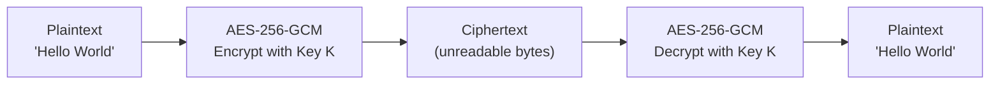
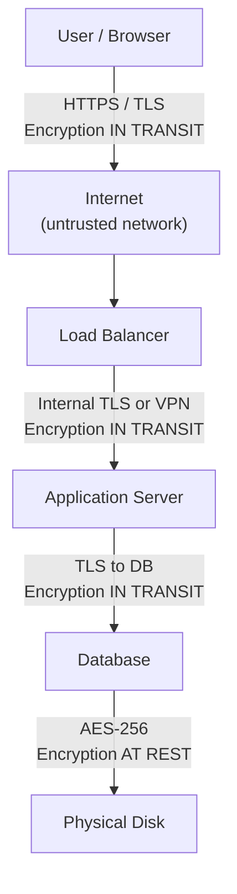
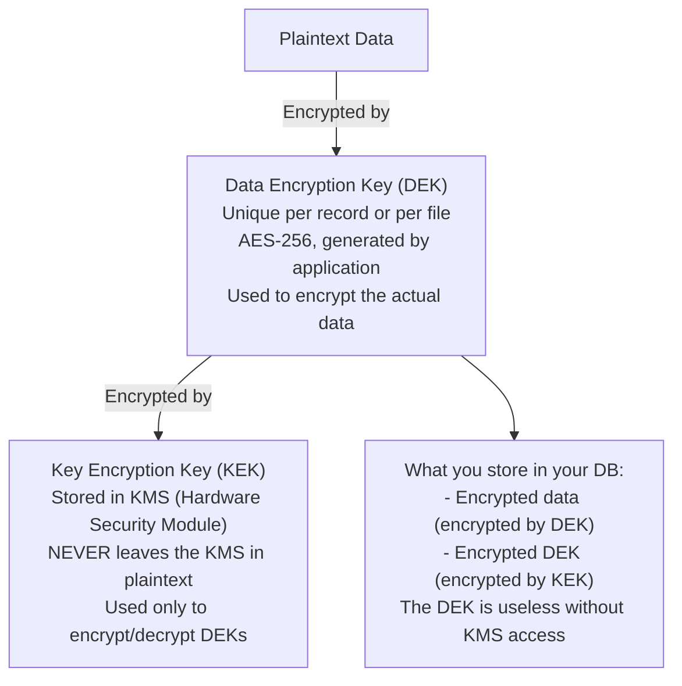
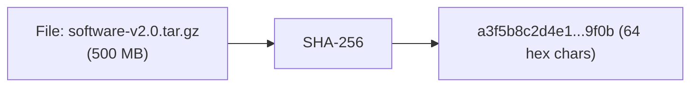

# Encryption

Encryption is the process of transforming readable data (plaintext) into an unreadable form (ciphertext) using a cryptographic algorithm and a key, such that only parties with the correct key can recover the original data. It is the foundational technology for protecting data confidentiality — in transit over networks, at rest in databases and disks, and in backups. A modern production system encrypts data at every layer: TLS in transit, AES-256 at rest, asymmetric keys for key exchange.

> **Why this matters in interviews:** Encryption is a universal requirement across all regulated industries (HIPAA, PCI-DSS, GDPR) and any serious system design. Interviewers will ask about symmetric vs asymmetric encryption, how TLS works at a high level, how you encrypt data at rest, and how you manage keys. Understanding the difference between encryption, hashing, and encoding (and when to use each) is baseline knowledge for senior engineers.

---

## Encryption vs Hashing vs Encoding

These are frequently confused — they serve fundamentally different purposes:

| Technique | Reversible? | Key Required? | Use For |
|---|---|---|---|
| **Encoding** (Base64, URL) | Yes | No | Data representation format — not security |
| **Hashing** (SHA-256, bcrypt) | No | No | Integrity verification, password storage |
| **Symmetric Encryption** (AES) | Yes | Same key for both | High-throughput data encryption |
| **Asymmetric Encryption** (RSA, ECC) | Yes | Public encrypts, private decrypts | Key exchange, digital signatures |

**Encoding is not security.** Base64 is often mistaken for encryption — it is just a format.  
**Hashing is one-way** — you cannot decrypt a hash. It proves "this data matches what was hashed" without storing the original.  
**Encryption is two-way** — requires a key to decrypt. Used when you need the original data back.

---

## Symmetric Encryption — AES

**Symmetric encryption** uses the same key for both encryption and decryption. AES (Advanced Encryption Standard) is the industry standard:



### AES Modes of Operation

| Mode | Authenticated? | Parallelizable? | Use For |
|---|---|---|---|
| **AES-GCM** | Yes (AEAD) | Yes (decryption) | **Recommended** — TLS 1.3, disk encryption, API data |
| **AES-CBC** | No | No (encrypt) | Legacy; requires separate MAC for authentication |
| **AES-CTR** | No | Yes | Stream data; requires separate MAC |
| **AES-ECB** | No | Yes | Never use — identical plaintext blocks produce identical ciphertext, leaking patterns |

**AES-GCM (Galois/Counter Mode)** is the modern default. It provides **AEAD** — Authenticated Encryption with Associated Data — meaning it encrypts AND produces a MAC (authentication tag) that detects any tampering. Use AES-256-GCM for all new systems.

```python
from cryptography.hazmat.primitives.ciphers.aead import AESGCM
import os

def encrypt(plaintext: bytes, key: bytes) -> tuple[bytes, bytes]:
    """Returns (nonce, ciphertext+tag)"""
    aesgcm = AESGCM(key)
    nonce = os.urandom(12)  # 96-bit nonce — must be unique per encryption
    ciphertext = aesgcm.encrypt(nonce, plaintext, associated_data=None)
    return nonce, ciphertext

def decrypt(nonce: bytes, ciphertext: bytes, key: bytes) -> bytes:
    aesgcm = AESGCM(key)
    # Raises InvalidTag if ciphertext was tampered with
    return aesgcm.decrypt(nonce, ciphertext, associated_data=None)

# Usage
key = os.urandom(32)  # 256-bit key
nonce, ct = encrypt(b"sensitive data", key)
original = decrypt(nonce, ct, key)
```

**AES key sizes:** 128-bit (secure), 192-bit, 256-bit (strongest). AES-256 is recommended when you need the highest security margin.

**Nonce reuse is catastrophic with AES-GCM:** Reusing a nonce with the same key completely breaks GCM's security and allows an attacker to recover the plaintext. Always use a random 96-bit (12-byte) nonce per encryption operation.

---

## Asymmetric Encryption — RSA and ECC

**Asymmetric encryption** uses a mathematically linked key pair: a **public key** (can be shared freely) and a **private key** (must be kept secret):

```mermaid
graph TD
    subgraph "Encryption (Confidentiality)"
        direction LR
        Sender["Alice\n(has Bob's public key)"]
        Enc2["Encrypt with\nBob's public key"]
        Cipher2["Ciphertext"]
        Dec2["Decrypt with\nBob's private key"]
        Recv["Bob\n(only he has private key)"]
        Sender --> Enc2 --> Cipher2 --> Dec2 --> Recv
    end

    subgraph "Digital Signature (Authentication + Integrity)"
        direction LR
        Sign["Alice\nSign with Alice's private key"]
        Sig["Signature + Message"]
        Verify["Verify with\nAlice's public key"]
        Anyone["Anyone\n(with Alice's public key)"]
        Sign --> Sig --> Verify --> Anyone
    end
```



### RSA vs Elliptic Curve Cryptography (ECC)

| Dimension | RSA | ECC (ECDSA/ECDH) |
|---|---|---|
| **Key size for 128-bit security** | 3072-bit key | 256-bit key |
| **Performance** | Slower (large key operations) | Faster (smaller keys) |
| **Adoption** | Decades of trust, widely supported | Modern, increasingly dominant |
| **Use in TLS** | RSA-2048/4096 for certificates | ECDSA P-256 preferred in TLS 1.3 |
| **Algorithms** | RSA-OAEP (encrypt), RSA-PSS (sign) | ECDH (key exchange), ECDSA (sign) |

**For new systems:** ECC (specifically the P-256 / NIST curve or Curve25519) is preferred for performance and smaller key sizes. RSA remains valid for compatibility.

---

## Encryption at Rest vs Encryption in Transit



### Encryption in Transit

- Uses TLS (Transport Layer Security) to protect data as it moves over networks
- Protects against network eavesdropping and man-in-the-middle attacks
- Covers: browser ↔ server, server ↔ server (mTLS in microservices), server ↔ database, server ↔ cache

### Encryption at Rest

- Uses symmetric encryption (typically AES-256) to protect data stored on disk, in databases, in backups, and in object storage
- Protects against: physical disk theft, cloud storage breach, insider access to raw storage

**Layers of encryption at rest:**

| Layer | Mechanism | Who Controls Key |
|---|---|---|
| **Application-level** | App encrypts before writing to DB | Application team |
| **Database-level** | DB engine encrypts on write (TDE) | Database admin / cloud KMS |
| **Volume/disk-level** | OS or hypervisor encrypts the block device | Cloud provider (EBS, persistent disk) |
| **Backup encryption** | Backup tool encrypts before offsite storage | Operations team |

Defense-in-depth: multiple layers. Even if a cloud provider employee accesses raw disk, they see encrypted bytes. Even if a database dump is leaked, columns with application-level encryption are doubly protected.

---

## Key Management — The Hard Part

Encryption is only as strong as key management. A perfectly encrypted database is worthless if the encryption key is stored in the same file next to the data.

### Envelope Encryption

The industry standard pattern for managing encryption keys at scale:



**Key rotation** becomes manageable: to rotate the master KEK, you just re-encrypt all the DEKs (small, fast). You do not need to re-encrypt all data.

**AWS KMS / Google Cloud KMS / Azure Key Vault** implement this pattern. Your application calls the KMS API to decrypt DEKs at runtime — the KEK never leaves the HSM.

### Key Management Principles

- **Never hardcode keys** in source code, config files, or environment variables checked into version control
- Use a **secret management system** (HashiCorp Vault, AWS Secrets Manager) to inject keys at runtime
- **Rotate keys regularly** — annually for KEKs, per-record for DEKs via envelope encryption
- **Audit key access** — every KMS call should be logged
- **Least privilege on keys** — the reporting service should not have access to the payment encryption key

---

## Hashing for Integrity

Cryptographic hash functions (SHA-256, SHA-3) map arbitrary data to a fixed-size digest. They are one-way and deterministic:



**Uses:**
- **File integrity:** Download a file, hash it, compare against the published hash — any modification changes the hash
- **Digital signatures:** Sign the hash of a document (not the document itself) — RSA/ECDSA over SHA-256
- **HMAC (Hash-based Message Authentication Code):** Keyed hash for message authentication — `HMAC-SHA256(key, message)` — used in JWT HS256, API request signing

**For passwords:** Never use SHA-256 directly — use bcrypt/Argon2id (slow, memory-hard). SHA-256 is too fast for passwords (billions of guesses/second on a GPU).

---

## Interview Talking Points

**1. What is the difference between symmetric and asymmetric encryption, and when do you use each?**
> "Symmetric encryption uses the same key for both encrypting and decrypting. AES-256 is the standard — it is extremely fast and suitable for encrypting large volumes of data: database records, disk volumes, files in object storage, backup archives. The problem with symmetric encryption is key distribution: both parties need the same key, and you need a secure channel to share it. Asymmetric encryption (RSA, ECC) uses a key pair — a public key for encryption and a private key for decryption. The public key can be shared freely; only the private key can decrypt. In practice, these two approaches are almost always combined: asymmetric encryption is used for key exchange (securely establishing a shared symmetric key between two parties), then the much faster symmetric AES is used for the actual data encryption. TLS does exactly this — ECDH key agreement to establish a session key, then AES-GCM for the data."

**2. What is envelope encryption and why is it used for data at rest?**
> "Envelope encryption is the standard pattern for key management at scale. You generate a unique Data Encryption Key (DEK) for each record or file, encrypt the data with the DEK using AES-256-GCM, then encrypt the DEK itself using a Key Encryption Key (KEK) stored in a Hardware Security Module (HSM) like AWS KMS. What you store is the encrypted data and the encrypted DEK — neither is usable without KMS access. The KEK never leaves the HSM in plaintext. This solves several problems: first, key rotation is manageable — to rotate the master KEK, you just re-encrypt all the DEKs without touching the actual data. Second, access control to the master key is centralized and audited through the KMS. Third, if a single DEK is compromised, only the records encrypted by that DEK are exposed, not everything."

**3. What is the difference between encryption at rest and encryption in transit, and do you need both?**
> "Encryption in transit uses TLS to protect data as it moves across a network — between browser and server, server to server, server to database. It protects against network eavesdropping and man-in-the-middle attacks. Encryption at rest uses symmetric encryption (typically AES-256) to protect data on disk, in databases, in object storage, and in backups — protecting against physical disk theft, storage layer breaches, or insider access to raw files. You need both because they protect against different threat models. An attacker who gains physical access to a disk bypasses all in-transit protections. An attacker who intercepts network traffic bypasses all at-rest protections. For regulated industries (HIPAA, PCI-DSS, SOC 2), both are required. In practice, I implement TLS for all network communication, database-level encryption (Transparent Data Encryption) for all databases, and application-level encryption for particularly sensitive fields like Social Security Numbers or payment card data."

**4. How would you handle encryption key management in a production system?**
> "Key management is honestly harder than the encryption itself. My principles: First, keys must never be hardcoded in source code or config files — use a secret management system like HashiCorp Vault or AWS Secrets Manager that injects secrets at runtime and audits every access. Second, use envelope encryption with a KMS-managed master key — the KEK lives in an HSM and never leaves it in plaintext. Third, separate keys by purpose — the key for payment card data is not the same key used for user profile data. Compromise of one key does not expose everything. Fourth, automate key rotation — annual rotation of KEKs, with per-record DEKs enabling rotation without re-encrypting all data. Fifth, audit everything — every KMS decrypt call should produce a log entry so you can detect anomalous access patterns. The AWS KMS + envelope encryption pattern, combined with Secrets Manager for other credentials, covers 95% of production needs."

---

## Key Takeaways

- **Encoding** (Base64) is not encryption — it provides no security, only format transformation
- **Hashing** is one-way (SHA-256, bcrypt) — for integrity and password storage; not reversible
- **Symmetric encryption** (AES-256-GCM) is fast and ideal for large data — same key encrypts and decrypts
- **Asymmetric encryption** (RSA, ECC) solves key distribution — public key encrypts, private key decrypts
- **Use AES-GCM** (AEAD mode) — it provides both confidentiality and authentication in one operation
- **Never reuse nonces** with AES-GCM — nonce reuse completely breaks the security guarantee
- **Envelope encryption** (DEK + KEK via KMS) is the standard for managing keys at scale
- **Encrypt in transit** (TLS) AND **at rest** (AES-256) — they protect against different threat models
- **Keys must never be hardcoded** — use a secrets manager (Vault, AWS Secrets Manager, GCP Secret Manager)
