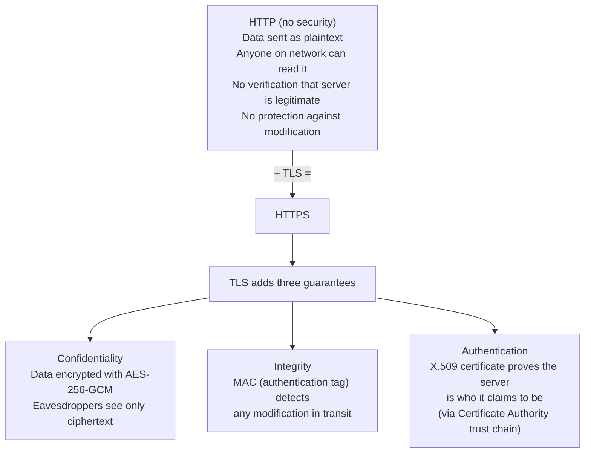
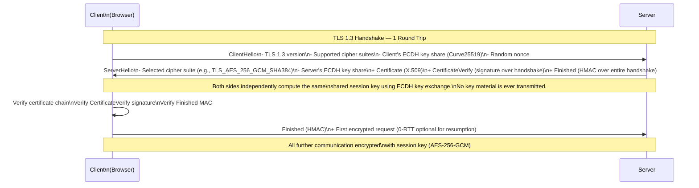
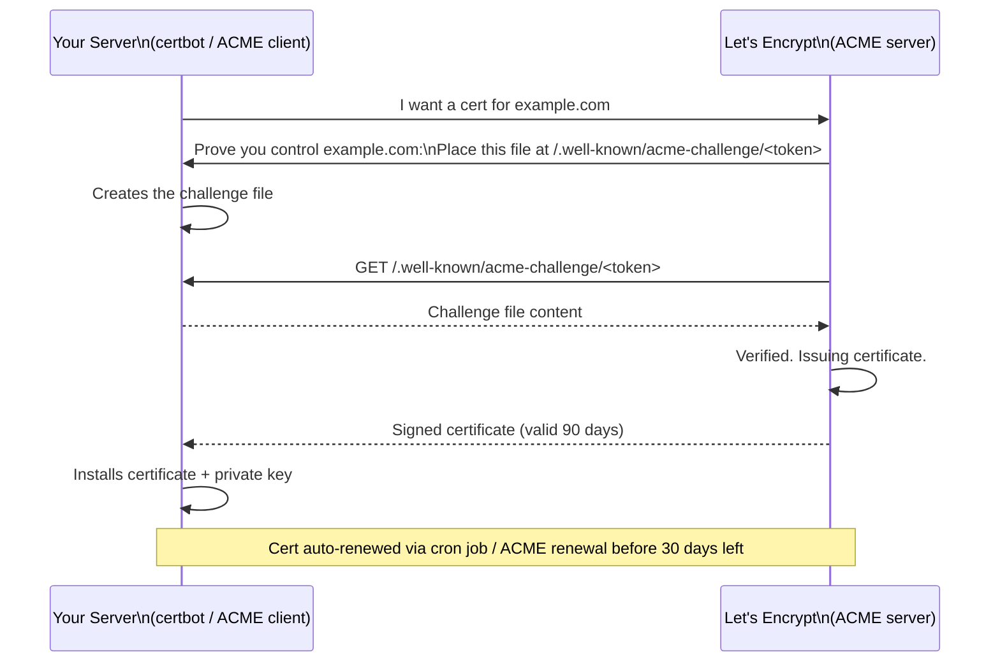
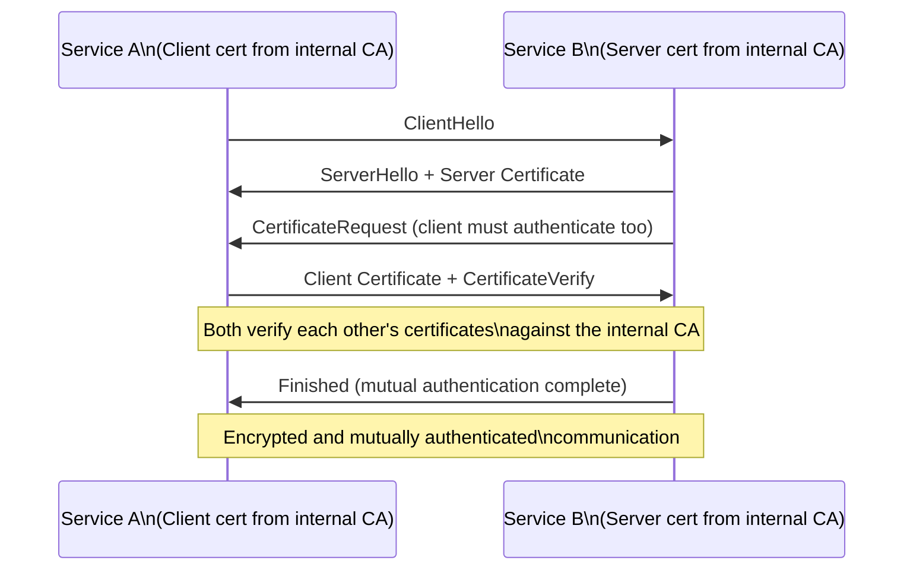
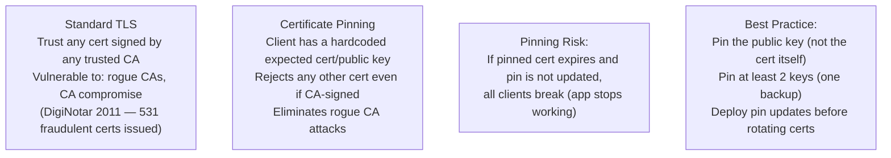

# HTTPS and TLS

HTTPS is HTTP running over TLS (Transport Layer Security) — a cryptographic protocol that provides confidentiality, integrity, and authentication for data in transit. TLS encrypts the connection between client and server so that eavesdroppers cannot read the data, ensures that data is not modified in transit, and uses digital certificates to verify that you are actually talking to the real server and not an impersonator. It is the foundational security mechanism for the entire web.

> **Why this matters in interviews:** TLS comes up in almost every security or networking conversation. Interviewers ask how the TLS handshake works, what certificates are, how HSTS protects against downgrade attacks, and what mTLS is used for. A system designer who cannot explain TLS at a conceptual level raises red flags. Understanding TLS also underpins understanding of service mesh security (mTLS between microservices), API gateway security, and CDN configurations.

---

## What HTTPS Provides



---

## TLS Handshake — How a Secure Connection is Established

### TLS 1.3 Handshake (Modern Standard)

TLS 1.3 (2018) reduced the handshake to **1 round-trip** (from 2 in TLS 1.2), significantly reducing connection latency:



**Key insight:** The private keys never traverse the network. The client and server each generate an ephemeral ECDH key pair, exchange public keys, and independently compute the same shared secret using the Diffie-Hellman math. This property is called **Perfect Forward Secrecy (PFS)** — even if the server's long-term private key is later compromised, past sessions cannot be decrypted because the session key was ephemeral and never stored.

### TLS 1.2 vs TLS 1.3

| Feature | TLS 1.2 | TLS 1.3 |
|---|---|---|
| **Handshake RTTs** | 2 round trips | 1 round trip |
| **0-RTT resumption** | No | Yes (with security tradeoff) |
| **Perfect Forward Secrecy** | Optional (depends on cipher) | Mandatory |
| **Weak cipher suites** | RSA key exchange (no PFS), RC4, 3DES | All removed — only AEAD ciphers |
| **Recommended** | Acceptable for legacy | Yes — use TLS 1.3 |

**Deprecate TLS 1.0 and 1.1 immediately** — they have known vulnerabilities (POODLE, BEAST, CRIME). Most compliance frameworks (PCI-DSS) require TLS 1.2 minimum; TLS 1.3 is the target.

---

## X.509 Certificates and the CA Trust Chain

A TLS certificate is a digital document that:
1. Contains the server's **public key**
2. States the **domain name(s)** it is valid for (Subject Alternative Names)
3. Has a **validity period** (not before / not after)
4. Is **digitally signed** by a Certificate Authority (CA) that the client trusts

```mermaid
graph TD
    RootCA["Root CA\n(Mozilla/Browser trust store)\nSelf-signed, pre-installed in browsers/OS\nExample: DST Root CA X3, ISRG Root X1"]
    
    IntCA["Intermediate CA\n(Signed by Root CA)\nExample: Let's Encrypt R3\nUsed for operational signing"]
    
    Leaf["Leaf Certificate\n(Signed by Intermediate CA)\nfor: *.example.com\nPublic key for example.com's server"]
    
    RootCA -->|"Signs"| IntCA
    IntCA -->|"Signs"| Leaf
    
    Client["Browser / Client\nVerifies chain upward to Root CA\nRoot CA public key is pre-trusted"]
    Client -->|"Trusts"| RootCA
    Client -->|"Verifies"| Leaf
```



**Certificate chain verification:** When you connect to `https://example.com`, your browser verifies the leaf certificate is signed by the intermediate CA, which is signed by a root CA in its trust store. Any break in the chain → connection rejected with a certificate error.

**Certificate types:**

| Type | Validation Level | Use Case |
|---|---|---|
| **DV (Domain Validated)** | Proves domain control | Most websites, Let's Encrypt |
| **OV (Organization Validated)** | Verifies the legal org | Business websites |
| **EV (Extended Validation)** | Strict org verification + legal checks | Banks, financial institutions |
| **Wildcard** | `*.example.com` — all subdomains | SaaS platforms with many subdomains |
| **SAN (Multi-domain)** | Multiple domains in one cert | `example.com` + `api.example.com` + `app.example.com` |

---

## Let's Encrypt — Free Automated Certificates

Let's Encrypt is a free, automated, open CA backed by the Internet Security Research Group (ISRG). It changed certificate management from "manual, expensive, annual" to "free, automated, 90-day rotation":



**90-day certificates:** Shorter validity forces automation and limits damage from compromised certificates. Certificates with 1-year validity from a compromised server sit valid for months — 90-day certs cap the window.

---

## HSTS — HTTP Strict Transport Security

HSTS is an HTTP response header that tells browsers: "This site only works over HTTPS. For the next N seconds, never attempt HTTP — always use HTTPS directly":

```http
Strict-Transport-Security: max-age=31536000; includeSubDomains; preload
```

**Without HSTS:** A user types `example.com` → browser first tries `http://example.com` → server redirects to `https://example.com`. That initial HTTP request is vulnerable to SSL stripping attacks (attacker intercepts the HTTP request and serves a fake HTTP version, bypassing TLS entirely).

**With HSTS:** Browser knows to go directly to `https://example.com` from the first keystroke (after the first HTTPS visit sets the HSTS header). No unencrypted HTTP request is ever sent.

**HSTS Preload List:** Chrome, Firefox, Safari, and Edge maintain a hardcoded list of domains that must use HTTPS. Even brand-new users who have never visited your site get HSTS protection. Submit to `hstspreload.org`. Requirement: `max-age` ≥ 1 year, `includeSubDomains`, `preload` flag.

---

## mTLS — Mutual TLS

Standard TLS only authenticates the **server** to the client. **Mutual TLS (mTLS)** also authenticates the **client** to the server — both parties present certificates:



**Use cases for mTLS:**
- **Zero-trust microservices:** Service mesh (Istio, Linkerd) enforces mTLS for all pod-to-pod communication — even internal traffic is authenticated
- **API clients:** Clients presenting client certificates for machine-to-machine APIs (banking, B2B)
- **Kubernetes:** Control plane to node communication uses mTLS

mTLS eliminates the "anyone inside the network is trusted" assumption — each service must cryptographically prove its identity to every other service on every connection.

---

## Common TLS Configuration Issues

| Issue | Impact | Fix |
|---|---|---|
| **Expired certificate** | Connection refused — all users get cert error | Automate renewal (Let's Encrypt + certbot, AWS Certificate Manager) |
| **Self-signed certificate** | Browser warning; users click through, defeating security | Use a CA-signed certificate; internal CA for internal services |
| **Weak ciphers (RC4, 3DES)** | Vulnerable to known attacks | Disable — allow only TLS 1.2+ with AEAD ciphers (AES-GCM, ChaCha20) |
| **TLS 1.0/1.1 enabled** | POODLE, BEAST vulnerabilities | Disable; minimum TLS 1.2 (preferably 1.3) |
| **Missing HSTS** | SSL stripping attacks possible | Add HSTS header with long max-age |
| **HTTP allowed** | Plaintext access possible | Redirect all HTTP to HTTPS + HSTS |
| **Private key not rotated** | Old private key stays valid if not rotated | Regular key rotation with certificate renewal |
| **Certificate pinning misconfiguration** | App crashes when cert rotated | Use public key pinning with backup pins, or rely on CA pinning |

---

## Certificate Pinning

Certificate pinning makes a client explicitly trust only a specific certificate or public key — rejecting all others, even if they are signed by a trusted CA:



**Certificate pinning is primarily a mobile app security control.** Modern browsers use CT (Certificate Transparency) logs instead of pinning — all publicly trusted CAs are required to log every certificate, and browsers verify certificates appear in the CT log, detecting rogue certs without the brittleness of pinning.

---

## Interview Talking Points

**1. Explain how TLS establishes a secure connection.**
> "TLS 1.3 establishes a secure connection in one round trip. The client sends a ClientHello with its TLS version, supported cipher suites, and an ephemeral ECDH public key. The server responds with its certificate, its ECDH public key, and a MAC over the entire handshake using the session key. Both sides independently compute the same shared session key using the Diffie-Hellman math — the actual key material never crosses the network. The client verifies the server's certificate chain up to a trusted root CA, then verifies the server's handshake MAC proves the server holds the private key corresponding to the public key in the certificate. After this, all communication is encrypted with AES-256-GCM. The elegant property is Perfect Forward Secrecy: those ephemeral ECDH keys are thrown away after the session — even if the server's long-term private key is compromised later, past sessions cannot be decrypted."

**2. What is HSTS and why is it important?**
> "HSTS is the HTTP Strict Transport Security header — the server tells the browser 'for the next year, never send any request to this domain over HTTP, always use HTTPS directly.' Without HSTS, when a user types 'bank.com' without specifying the protocol, the browser tries HTTP first. That plain HTTP request is vulnerable to SSL stripping — an attacker intercepts the HTTP request and serves a fake HTTP-only version of the site, completely bypassing TLS. With HSTS, once the browser has seen the header, it never sends that initial HTTP request again. The HSTS Preload List goes further: major browsers hardcode a list of domains that must use HTTPS, so even first-time visitors are protected before they've ever seen the HSTS header. For any production site, I add HSTS with max-age of one year and includeSubDomains, and submit to the preload list."

**3. What is mTLS and when would you use it?**
> "Standard TLS authenticates the server to the client — the server proves its identity with a certificate. Mutual TLS (mTLS) also authenticates the client to the server — both parties present certificates and verify each other. This is valuable in two scenarios: microservice-to-microservice communication in a zero-trust network, and machine-to-machine API authentication. In a microservices architecture, mTLS ensures that even internal service calls are cryptographically authenticated — a compromised service cannot impersonate another service. Service meshes like Istio and Linkerd implement mTLS automatically for all pod-to-pod communication using short-lived certificates from an internal CA. For external machine clients (a business partner's backend calling your API), client certificates offer stronger authentication than API keys — the private key never leaves the client, so it cannot be phished."

**4. How do you manage TLS certificates at scale in production?**
> "At scale, manual certificate management is a disaster — certificates expire, engineers forget to renew them, and the result is outages. I automate everything. For public-facing services, I use AWS Certificate Manager (ACM) or Let's Encrypt with certbot. ACM integrates directly with ALB and CloudFront — certificates auto-renew, zero operational overhead. For internal services and microservices, I use an internal Certificate Authority — either AWS Private CA or Vault PKI Secrets Engine — which issues short-lived certificates (24-72 hours) to services automatically via the ACME protocol or Vault agent. Short-lived internal certs mean there is no revocation problem: if a cert is compromised, it expires in hours, not months. For Kubernetes, cert-manager is the standard tool — it handles ACME challenges, certificate issuance, and renewal automatically as Kubernetes resources. The key metric I monitor is certificate expiry days remaining — alert at 30 days, page at 7 days."

---

## Key Takeaways

- **HTTPS = HTTP + TLS** — TLS provides confidentiality (encryption), integrity (tamper detection), and authentication (certificate verification)
- **TLS 1.3** is the modern standard — 1 RTT handshake, Perfect Forward Secrecy mandatory, all weak ciphers removed
- **Perfect Forward Secrecy** — ephemeral session keys mean past sessions cannot be decrypted even if the long-term private key is later compromised
- **Certificates** are signed by a CA trust chain — browsers verify the chain up to a pre-trusted root CA
- **Let's Encrypt** provides free, automated 90-day certificates — automate renewal with certbot or ACME clients
- **HSTS** prevents SSL stripping attacks — browser never sends HTTP requests once HSTS is set
- **mTLS** authenticates both parties — essential for zero-trust microservice communication (Istio, Linkerd)
- **Automate certificate management** — manual renewal causes outages; use ACM, Let's Encrypt, or cert-manager
- **Disable TLS 1.0/1.1 and weak ciphers** — allow only TLS 1.2+ with AEAD cipher suites
