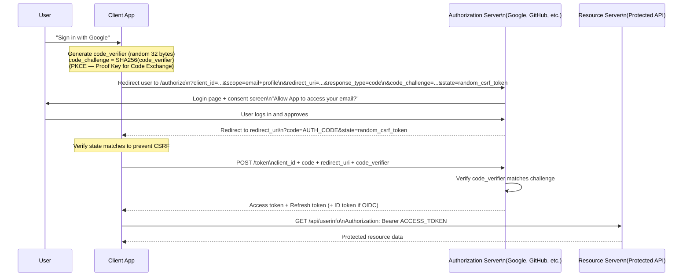
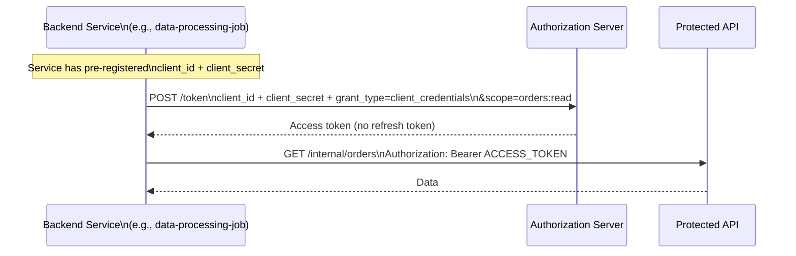
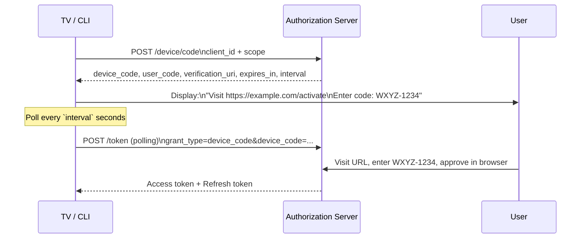
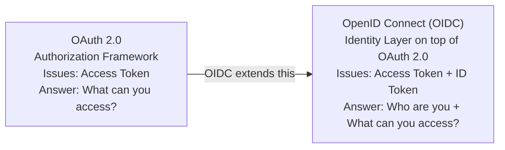
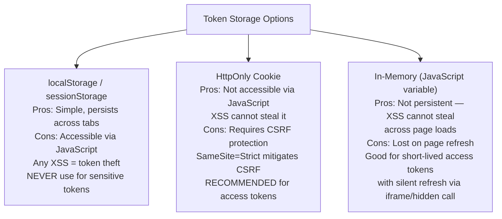
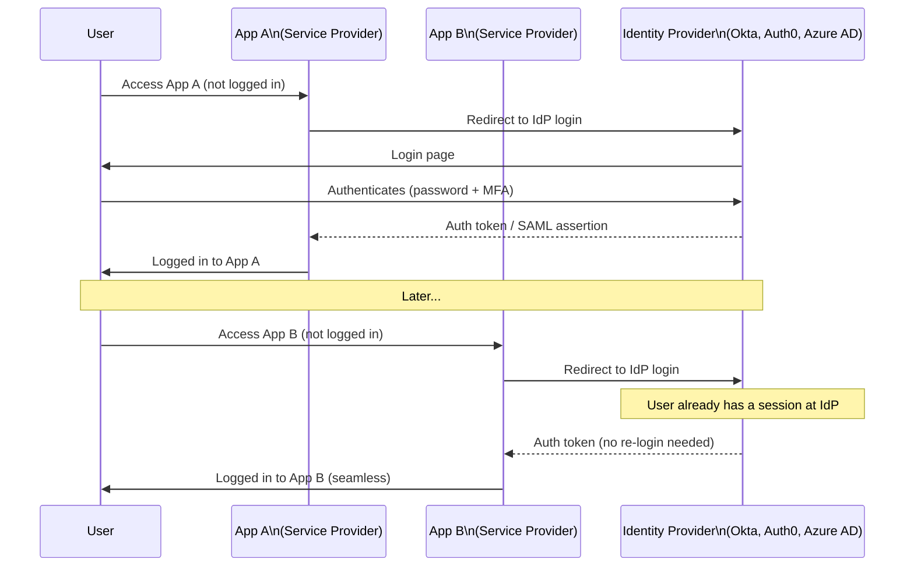

# OAuth and SSO

OAuth 2.0 is an authorization framework that allows a user to grant a third-party application limited access to their account without sharing their password. OpenID Connect (OIDC) extends OAuth 2.0 to add authentication — telling the application who the user is. Single Sign-On (SSO) lets users authenticate once and access multiple applications. Together, these form the backbone of modern identity on the web.

> **Why this matters in interviews:** OAuth 2.0 and SSO come up when designing any platform that integrates with third parties, supports "Login with Google/GitHub," or serves an enterprise customer base. Interviewers expect you to know which OAuth flow to use for which client type, what the difference is between an access token and an ID token, and how SSO architectures work at scale. Security mistakes in OAuth implementations are common and severe.

---

## OAuth 2.0 Core Concepts

OAuth 2.0 solves a specific problem: **delegated authorization** without sharing credentials.

**Classic problem:** You want an app (say, a calendar scheduling tool) to read your Google Calendar. Before OAuth, you'd have to give the app your Google password. With OAuth, you authorize the app with a limited-scope token while your password stays private.

**Four roles in OAuth 2.0:**

| Role | Description | Example |
|---|---|---|
| **Resource Owner** | The user who owns the data | You (the Google account holder) |
| **Client** | The app requesting access | Calendar scheduling tool |
| **Authorization Server** | Issues tokens after verifying consent | Google's OAuth server |
| **Resource Server** | Hosts the protected API | Google Calendar API |

---

## OAuth 2.0 Grant Types (Flows)

### Authorization Code + PKCE — The Standard Flow for User-Facing Apps

Use this for: web apps, mobile apps, single-page apps. This is the most secure flow.



**Why PKCE?** Without PKCE, a malicious app on the same device could intercept the `code` parameter in the redirect URI and exchange it for tokens. PKCE binds the authorization code to the client that generated it — the `code_verifier` can only be known by the original requesting party.

**The `state` parameter** is a random nonce that must be validated when the redirect comes back — it prevents CSRF attacks on the OAuth flow.

---

### Client Credentials — For Machine-to-Machine (M2M)

Use this for: server-to-server API access, microservices, background jobs. No user is involved.



There is no user login, no redirect, no consent screen — just a service authenticating itself with its credentials to get a token.

---

### Device Code — For Input-Constrained Devices

Use this for: smart TVs, CLI tools, IoT devices with no browser.



---

## OpenID Connect (OIDC) — OAuth 2.0 for Authentication

OAuth 2.0 is an **authorization** framework — it grants access to resources. It does not, by itself, tell you who the user is. OpenID Connect adds an **identity layer** on top of OAuth 2.0.



**The ID Token** is a JWT containing claims about the authenticated user:

```json
{
  "iss": "https://accounts.google.com",
  "sub": "1234567890",
  "email": "alice@example.com",
  "name": "Alice Smith",
  "picture": "https://lh3.googleusercontent.com/...",
  "aud": "your-client-id",
  "exp": 1716999999,
  "iat": 1716996399,
  "nonce": "random-nonce-to-prevent-replay"
}
```

**Access Token vs ID Token:**

| Token | Who Reads It | Purpose |
|---|---|---|
| **Access Token** | Resource Server (API) | Authorizes API calls — "this token has `calendar:read` scope" |
| **ID Token** | Client Application | Authentication — "this user is alice@example.com" |
| **Refresh Token** | Client (talks to Auth Server) | Gets new access tokens when current one expires |

**Critical mistake:** Sending the ID token to your API as an authorization token. The ID token is for the client to consume — it identifies the user. The access token is for the API. Validate the right token at the right layer.

---

## Token Storage Security

Where you store OAuth tokens in a browser matters enormously:



**Recommendation:** Store access tokens in `HttpOnly; Secure; SameSite=Strict` cookies (set by your own backend, not by client-side JavaScript). Store refresh tokens server-side or in HttpOnly cookies with strict rotation.

---

## Single Sign-On (SSO) Architectures

SSO lets users authenticate once with an **Identity Provider (IdP)** and access multiple **Service Providers (SPs)** without re-authenticating:



### SSO Protocol Comparison

| Protocol | Age | Format | Common Use Case |
|---|---|---|---|
| **SAML 2.0** | 2005 | XML assertions | Enterprise, legacy B2B, Salesforce, Workday |
| **OIDC** | 2014 | JWT (JSON) | Modern web/mobile apps, consumer apps |
| **CAS** | 1990s | XML/JSON tickets | University systems, legacy enterprise |

**SAML** is XML-heavy and complex but ubiquitous in enterprise. When a corporate customer asks for SSO, they almost always mean SAML with their Okta/Azure AD/Google Workspace as the IdP.

**OIDC** is simpler, JSON-based, and the modern choice for new systems. "Sign in with Google/Apple/GitHub" is all OIDC.

---

## OAuth Security Pitfalls

### 1. Missing State Parameter (CSRF on OAuth)

Without validating the `state` parameter, an attacker can trick a victim into linking their account to the attacker's OAuth identity:

```
Attack:
1. Attacker initiates OAuth flow, gets authorization URL with code
2. Before completing, attacker sends that URL to victim
3. Victim clicks, completes OAuth — now attacker's account is linked to victim's
```

**Fix:** Generate a cryptographically random `state` value before redirecting; validate it on return.

### 2. Open Redirect in redirect_uri

If the authorization server does not validate `redirect_uri` exactly, an attacker can steal the authorization code:

```
https://accounts.google.com/oauth/authorize
  ?client_id=app
  &redirect_uri=https://attacker.com/callback  ← steal the code here
  &response_type=code
```

**Fix:** Authorization servers must validate `redirect_uri` against an exact pre-registered whitelist.

### 3. Access Token in URL (Authorization Code misuse)

Using `response_type=token` (Implicit Flow) puts the access token directly in the URL fragment, where it appears in browser history, server logs, and Referer headers.

**Fix:** Always use Authorization Code + PKCE. The Implicit Flow is deprecated in OAuth 2.1.

---

## Interview Talking Points

**1. Explain the OAuth 2.0 Authorization Code flow with PKCE. Why is PKCE necessary?**
> "The Authorization Code flow is a redirect-based OAuth flow designed for user-facing applications. The client redirects the user to the authorization server's login page with a client_id and requested scopes. After the user authenticates and consents, the authorization server redirects back to the client with a short-lived authorization code. The client then exchanges this code — in a back-channel server-to-server request — for access and refresh tokens. PKCE (Proof Key for Code Exchange) is necessary for public clients like SPAs and mobile apps that cannot securely store a client secret. Before PKCE, an attacker could intercept the authorization code from the redirect URI (e.g., via a malicious app on the same mobile device with the same URI scheme registered). PKCE mitigates this by having the client generate a random `code_verifier` before the flow starts, hash it as `code_challenge`, and include the hash in the authorization request. When exchanging the code for tokens, the client provides the original `code_verifier` — the authorization server verifies the hash matches, proving the same party that initiated the flow is completing it."

**2. What is the difference between OAuth 2.0 and OpenID Connect?**
> "OAuth 2.0 is an authorization framework — it lets a user grant an application limited access to their resources without sharing credentials. The output is an access token that the client presents to an API. It does not inherently tell the application who the user is. OpenID Connect is an identity layer built on top of OAuth 2.0. It adds one thing: the ID token, which is a JWT that the authorization server signs and that contains claims about the authenticated user — their subject ID, email, name, and so on. The application uses the ID token to establish the user's identity. A common confusion: the access token should be sent to your API (resource server) to authorize calls; the ID token should be consumed by the client to know who the user is. Sending the ID token to your API as an authorization mechanism is a mistake — APIs should validate access tokens with the appropriate scopes."

**3. How does SSO work, and what protocols support it?**
> "SSO relies on a central Identity Provider that maintains a session after the user's first login. When the user tries to access another application (Service Provider), the SP redirects them to the IdP. The IdP checks if a session already exists — if yes, it immediately issues a token or assertion to the SP without asking the user to log in again. The two main protocols are SAML 2.0 and OpenID Connect. SAML uses XML-based assertions and is dominant in enterprise B2B contexts — if a corporate customer needs SSO with their Okta or Azure Active Directory, they almost certainly mean SAML. OIDC is simpler, JSON-based, and the modern choice for consumer apps and new enterprise integrations. In practice, I would use an identity platform like Auth0, Okta, or AWS Cognito to handle SSO implementation rather than building it from scratch — these are security-critical systems where implementation bugs are severe."

**4. Where should you store OAuth access tokens in a browser-based application?**
> "The right answer depends on threat model. HttpOnly cookies set by your own backend server are the most secure choice — JavaScript cannot read them, so XSS attacks cannot steal the token. The cookie is automatically sent with requests to your domain. The tradeoff is you need CSRF protection (SameSite=Strict cookie attribute handles this in most cases). Storing tokens in localStorage is convenient but dangerous — any JavaScript on your page, including third-party scripts, can read localStorage. XSS vulnerabilities are common and would immediately expose all stored tokens. In-memory storage (a JavaScript variable or React state) is a middle ground — not accessible across tabs or after refresh, but also lost when the page is refreshed, requiring a silent token refresh mechanism. My recommendation: use HttpOnly cookies, enforce SameSite=Strict, ensure your backend handles CORS strictly, and keep access token lifetimes short (5-15 minutes)."

---

## Key Takeaways

- **OAuth 2.0** is an authorization delegation framework — not an authentication protocol by itself
- **OpenID Connect** adds identity (ID token as JWT) on top of OAuth 2.0 — use OIDC for "who is this user?"
- **Authorization Code + PKCE** is the correct flow for all user-facing clients (web, mobile, SPA)
- **Client Credentials** is for machine-to-machine (no user) — service-to-service API calls
- **The `state` parameter** prevents CSRF attacks on OAuth flows — always validate it on return
- **ID token ≠ access token** — ID token is for the client to know the user; access token is for the API
- **HttpOnly cookies** are safer than localStorage for browser token storage — XSS cannot steal HttpOnly cookies
- **SSO** = one login at an Identity Provider, seamless access to all connected Service Providers
- **SAML** for enterprise/legacy, **OIDC** for modern apps — use an IdP platform (Okta, Auth0) rather than building from scratch
