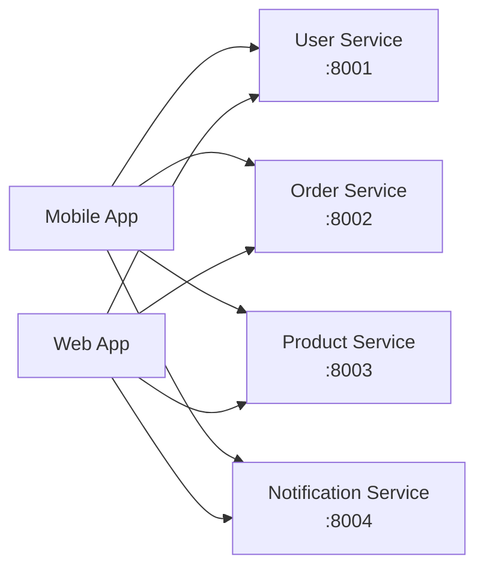
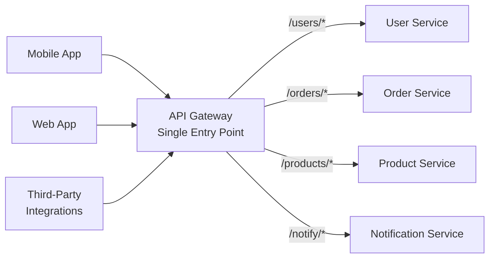
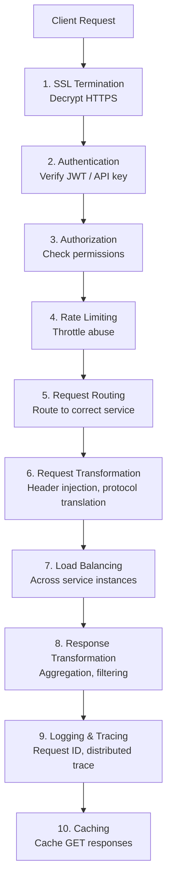
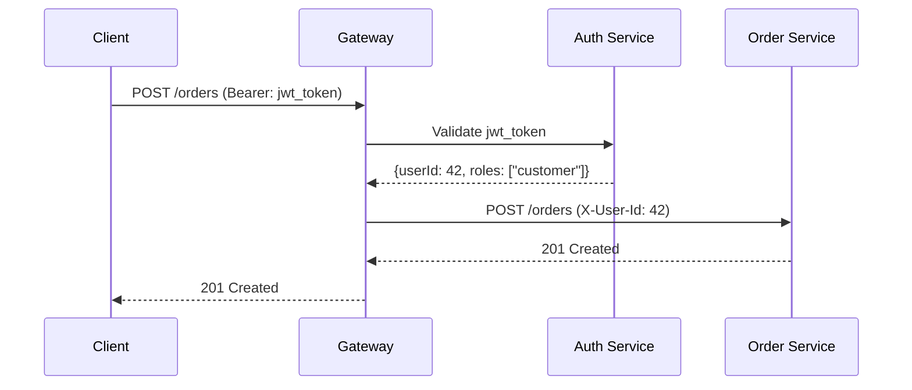
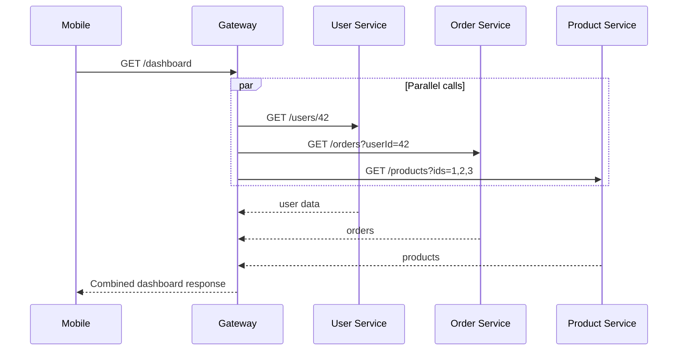
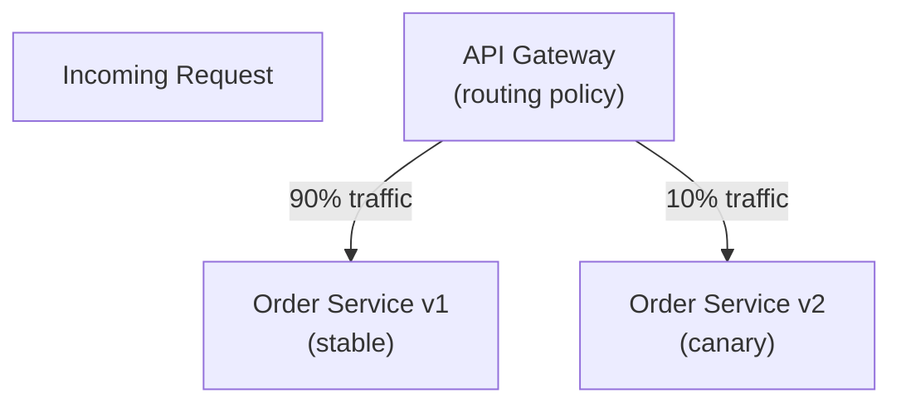
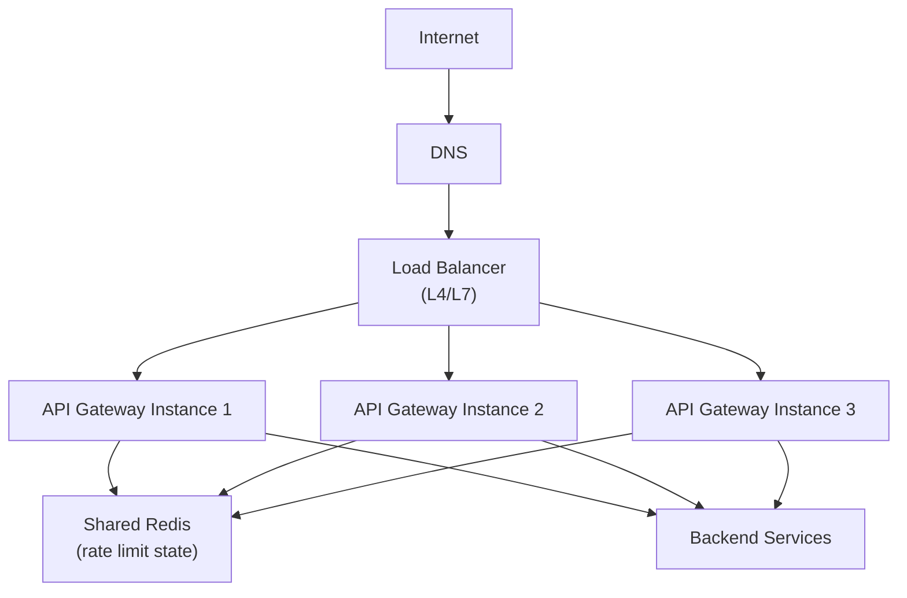

# API Gateway

An API Gateway is the single entry point for all client-to-backend communication in a microservices architecture. It sits in front of your services and handles cross-cutting concerns — authentication, rate limiting, routing, transformation — so individual services don't have to.

> **The mental model:** An API Gateway is to microservices what a receptionist is to a large office. All visitors go through one desk; the receptionist verifies identity, routes them to the right room, and enforces building rules — so individual teams don't need to manage visitors themselves.

---

## The Problem Without an API Gateway

In a microservices system, clients would need to know about every service:



**Problems:**

- Clients must know the internal address of every service
- Each service must implement auth, rate limiting, CORS, logging independently
- Changing a service's URL requires updating all clients
- Mobile apps can't be forced to update — API contracts break

---

## The API Gateway Solution



Now clients interact with one stable endpoint. Internal services can change independently.

---

## Core Responsibilities

An API Gateway is not just a router. It handles a full stack of cross-cutting concerns:



### 1. Authentication & Authorization

The gateway verifies every request's identity before it reaches a service:



Services receive the user identity in trusted headers — they never parse JWTs themselves. This centralizes auth logic and prevents services from needing auth library dependencies.

### 2. Rate Limiting

Prevent abuse and ensure fair use:

```
Per-user:    100 requests/minute
Per-API-key: 1000 requests/minute
Per-IP:      500 requests/minute
Global:      50,000 requests/second
```

When exceeded, the gateway returns `429 Too Many Requests` with a `Retry-After` header — services never see the excess traffic.

### 3. Request Routing

Route based on URL path, HTTP method, headers, or query parameters:

```yaml
# Example routing config (Kong/Traefik style)
routes:
  - path: /api/v1/users
    service: user-service
    methods: [GET, POST]
  - path: /api/v1/orders
    service: order-service
    methods: [GET, POST, PUT]
  - path: /internal/admin
    service: admin-service
    auth_required: true
    allowed_roles: [admin]
```

### 4. API Aggregation (Backend for Frontend)

A gateway can aggregate multiple service calls into a single response, reducing client round-trips:



Without aggregation, the mobile app would make 3 separate requests. With aggregation, one request does all three — critical for mobile networks where connection overhead matters.

### 5. Protocol Translation

Clients speak HTTP/REST; internal services may speak gRPC, GraphQL, WebSockets, or even legacy SOAP. The gateway handles translation:

```
Client HTTP/REST → Gateway → gRPC (internal service)
Client REST      → Gateway → AMQP (async queue)
Client WebSocket → Gateway → HTTP streaming (service)
```

---

## API Gateway vs. Load Balancer vs. Reverse Proxy

This is a common interview question. The three are related but serve different purposes:

| Concern                | Load Balancer                       | Reverse Proxy                  | API Gateway                         |
| ---------------------- | ----------------------------------- | ------------------------------ | ----------------------------------- |
| **Primary job**        | Distribute traffic across instances | Forward requests, hide backend | Manage API policies across services |
| **Protocol awareness** | L4 (TCP) or L7 (HTTP)               | L7 (HTTP)                      | L7 (HTTP/gRPC/WebSocket)            |
| **Authentication**     | ❌                                  | Sometimes                      | ✅ Core feature                     |
| **Rate limiting**      | ❌                                  | Sometimes                      | ✅ Core feature                     |
| **Routing**            | Instance selection                  | Path-based                     | Service + path + header + auth      |
| **Aggregation**        | ❌                                  | ❌                             | ✅                                  |
| **Target**             | Server instances                    | Any backend                    | Microservices                       |

> In practice, these overlap. NGINX can act as all three. AWS ALB + API Gateway is a common combination where ALB handles L7 load balancing and API Gateway handles auth/rate limiting.

---

## Request/Response Transformation

The gateway can rewrite requests and responses without touching services:

```
# Add internal headers
X-Request-ID: uuid-generated-by-gateway
X-User-Id: 42
X-Correlation-Id: trace-span-id

# Rewrite URLs
/api/v2/users → /users (service internal path)

# Strip sensitive headers from responses
Remove: X-Internal-Service-Token
Remove: X-Debug-Info
```

This enables **API versioning** — the gateway translates v1 to v2 format, so the service only handles one version.

---

## Canary Deployments and A/B Testing

The gateway is the perfect place to implement gradual rollouts:



Route based on user ID hash, cookie, header, or random percentage. Gradually increase the canary percentage while monitoring error rates.

---

## Real-World API Gateways

| Gateway                  | Type                     | Key Feature                                    |
| ------------------------ | ------------------------ | ---------------------------------------------- |
| **AWS API Gateway**      | Managed cloud            | Serverless-native, deep Lambda integration     |
| **Kong**                 | Open source / Enterprise | Plugin ecosystem, highly extensible            |
| **NGINX**                | Self-managed             | High performance, proxy + gateway hybrid       |
| **Traefik**              | Open source              | Native Kubernetes, automatic service discovery |
| **Envoy**                | Open source              | xDS config, service mesh foundation (Istio)    |
| **Apigee** (Google)      | Enterprise managed       | Analytics, monetization, full lifecycle        |
| **Azure API Management** | Managed cloud            | Azure integration, developer portal            |

---

## Design Considerations and Tradeoffs

### The Bottleneck Risk

Every request passes through the gateway. It must be:

- **Horizontally scalable** (multiple gateway instances behind a load balancer)
- **Stateless** (state in Redis, not in process memory)
- **Fast** (adds <5ms overhead per request ideally)



### Avoid Putting Business Logic in the Gateway

The gateway should handle **cross-cutting infrastructure concerns** only:

- ✅ Auth, rate limiting, routing, logging, tracing
- ❌ Business validation ("Is this order amount valid?")
- ❌ Data transformation beyond format conversion
- ❌ Orchestration logic (use orchestration services instead)

Business logic in the gateway is hard to test, deploy independently, or reuse.

---

## Interview Talking Points

### What the interviewer wants to hear

**1. Position in the architecture**

> "The API Gateway sits between clients and services, handling auth, rate limiting, and routing centrally so individual services stay lean."

**2. How it handles auth**

> "The gateway validates JWTs against our auth service on every request. Valid tokens get the user ID injected as a trusted header so services can trust it without re-validating."

**3. Scaling the gateway itself**

> "The gateway is stateless — all rate limit state lives in Redis. We run multiple instances behind an NLB, so it's not a single point of failure."

**4. The BFF pattern (Backend for Frontend)**

> "For mobile vs. web, we'd use separate gateway configurations — the mobile gateway aggregates calls and returns compact responses, while the web gateway can tolerate more round-trips."

---

## Key Takeaways

- The API Gateway is the **single entry point** for all external traffic into a microservices system
- It centralizes **auth, rate limiting, routing, and observability** — so services don't have to implement them
- **Not a replacement for load balancers** — they work together (LB distributes to gateway instances, gateway routes to services)
- The gateway must be **scalable and highly available** — it's in the critical path of every request
- **Avoid business logic** in the gateway — keep it to infrastructure concerns
- The **Backend for Frontend (BFF) pattern** uses specialized gateway configurations per client type
