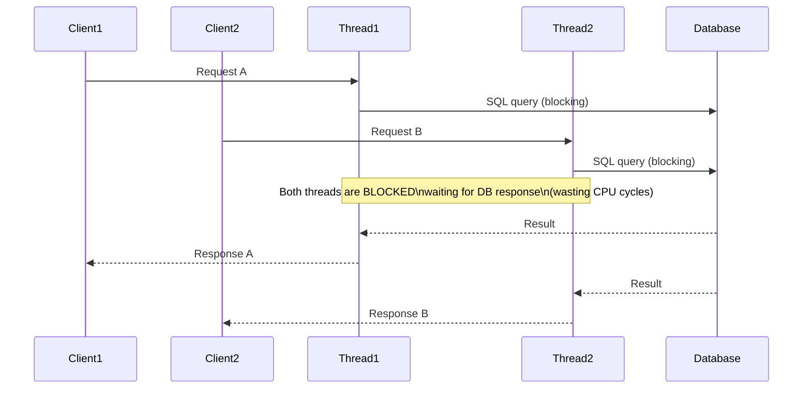
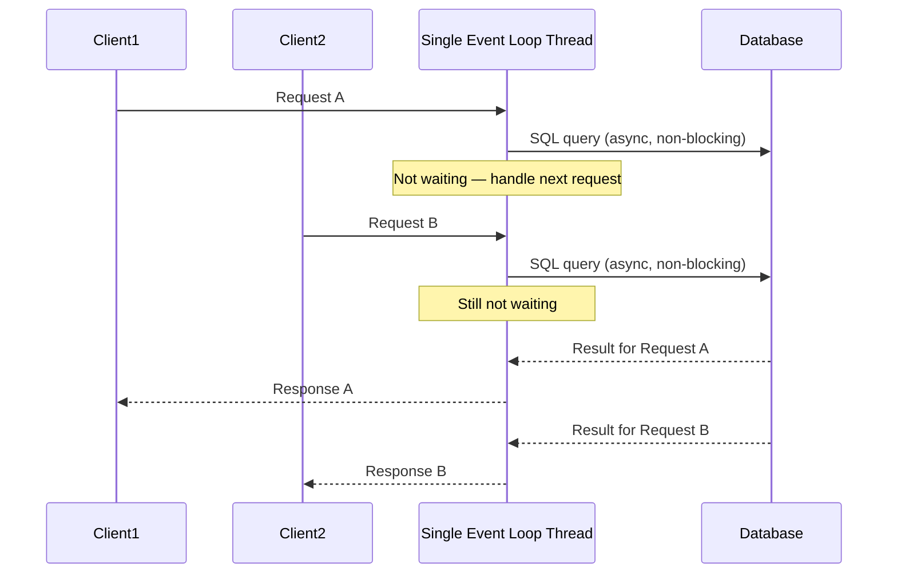
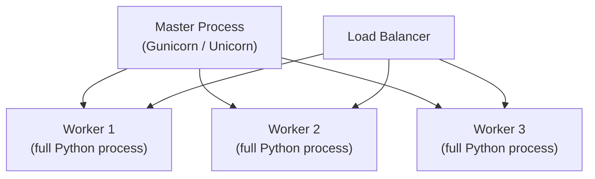
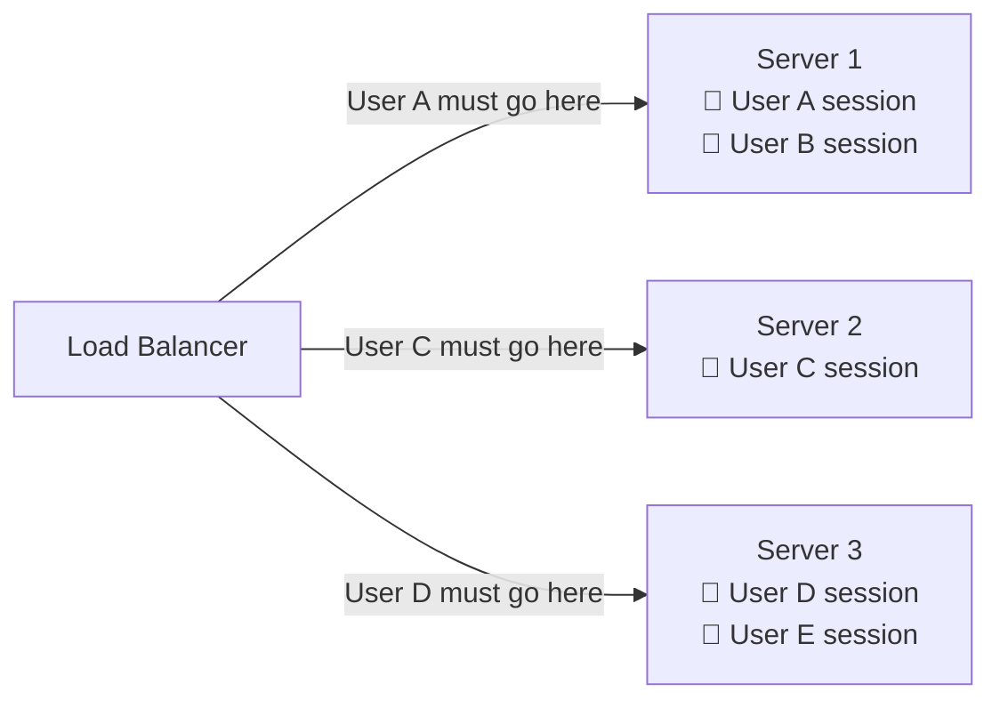
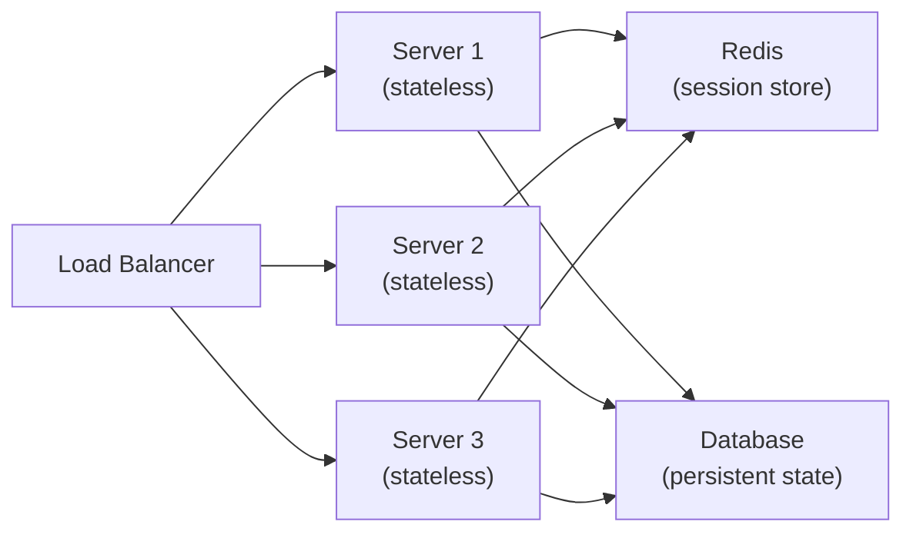
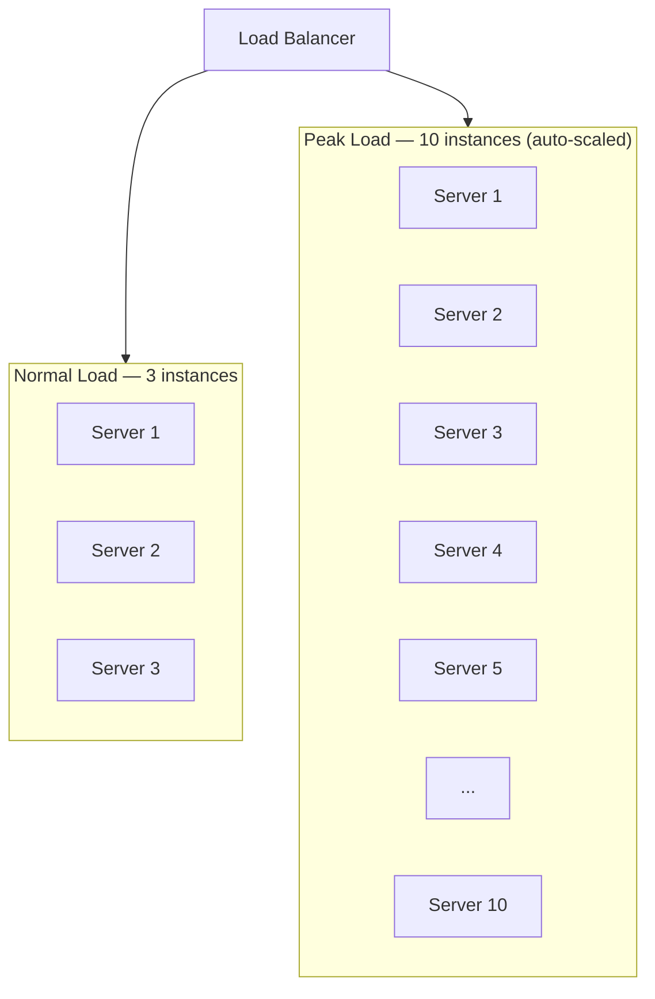
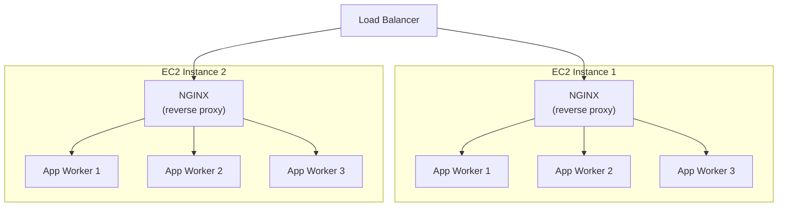
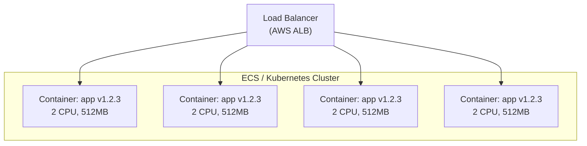

# Application Servers

An application server is the compute layer that executes your business logic — processing requests, running rules, calling databases, and returning responses. Everything else in your infrastructure exists to support, scale, and protect this layer.

> **The application server is where code runs.** Everything else — load balancers, CDNs, caches, queues — exists to either get requests to the app server efficiently, or shield it from being overwhelmed.

---

## What an Application Server Does

At its core, an application server performs a request-response cycle:


This seems simple — but at scale, every microsecond here counts and the execution model matters enormously.

---

## Concurrency Models — The Foundation

How an application server handles multiple simultaneous requests is its most critical design decision. Different models have radically different performance characteristics.

### Thread-Per-Request (Traditional)

One OS thread handles one request from start to finish:



**How it works:**

- Thread pool of N threads (e.g., 200)
- Each incoming request gets a thread
- Thread blocks while waiting for I/O (database, network calls)
- Max concurrent requests = thread pool size

**The problem:** Threads are expensive:

- 1–8MB of stack memory per thread
- Context switching overhead
- 200 threads × 8MB = 1.6GB just for thread stacks

**Examples:** Classic Java Servlet containers (Tomcat BIO), Python Gunicorn (sync workers), Ruby Puma

### Event Loop (Non-Blocking I/O)

A single thread handles thousands of concurrent requests using an event loop:



**How it works:**

- One (or a few) threads manage all connections
- When I/O is started, the thread registers a callback and moves on
- When I/O completes, the event loop calls the callback
- No thread is ever blocked

**The win:** 10,000+ concurrent connections with a single thread and minimal memory.

**The constraint:** Long-running CPU-bound work (heavy computation) blocks the event loop and degrades all connections. Must offload to worker threads.

**Examples:** Node.js (libuv), NGINX, Go (goroutines), Python asyncio, Vert.x

### Worker Process Model (Python/Ruby)

Fork multiple independent processes, each handling requests sequentially:



Workers don't share memory. Crash isolation is excellent — one worker dying doesn't affect others. Memory cost is high (one full interpreter per worker).

**Rule of thumb:** `workers = 2 × CPU_cores + 1`

### Goroutines (Go)

Go's goroutines are the modern synthesis — lightweight green threads that are multiplexed onto OS threads by the Go runtime:

```
- OS Thread:   1MB+ stack, kernel-managed
- Goroutine:   2KB stack (grows dynamically), Go-runtime-managed
```

You can run **1 million goroutines** on a laptop. Go's scheduler parks blocked goroutines, runs ready ones — combining the simplicity of thread-per-request with the efficiency of event loops.

**Example:** A Go HTTP server handling 100K concurrent requests uses the same amount of memory a Node.js server uses at 10K.

### Comparison

| Model              | Language                              | Concurrency       | Memory per Request | Best For                              |
| ------------------ | ------------------------------------- | ----------------- | ------------------ | ------------------------------------- |
| Thread-per-request | Java (Tomcat), Python (Gunicorn sync) | ~200–500          | ~1–8MB             | CPU-bound work, blocking I/O          |
| Event loop         | Node.js, Python asyncio               | 10,000–100,000    | ~KB                | I/O-bound, many connections           |
| Worker processes   | Python (Gunicorn), Ruby (Puma)        | 8–32 workers      | High (per process) | GIL-constrained languages             |
| Goroutines         | Go                                    | 100,000–1,000,000 | ~KB                | High concurrency, any workload        |
| Virtual threads    | Java 21+ (Loom)                       | ~1,000,000        | ~KB                | Modern Java, thread-per-request style |

---

## Stateful vs. Stateless Servers

This is one of the most important architectural decisions for application servers:

### Stateful Servers

Store session data in process memory:



**Problems:**

- Requires sticky sessions — routing is constrained
- If Server 1 crashes, User A and B lose their sessions
- Can't horizontally scale freely (imbalanced session distribution)
- Blue/green deployments are difficult (sessions on old servers)

### Stateless Servers

No session state in process memory — state lives in an external store:



Any server can handle any request. Horizontal scaling is trivial. No sticky sessions needed.

**The rule:** Application servers should be **stateless by design**. Externalise everything — sessions to Redis, files to S3, state to a database.

---

## Horizontal Scaling

Stateless servers scale by adding instances:



**Auto-scaling triggers:**

- CPU utilization > 70% for 3 minutes → add instances
- Request queue depth > 1000 → add instances
- p95 latency > 500ms → add instances

**Tools:** AWS EC2 Auto Scaling Groups, Kubernetes HPA (Horizontal Pod Autoscaler), GCP Managed Instance Groups

---

## Application Server Process Architecture

### Typical Production Setup



- **NGINX** handles SSL termination, static files, and connections
- **NGINX** passes dynamic requests to app workers via Unix socket (faster than TCP localhost)
- **App workers** process business logic, call external services

### Container-Based (Modern)



Containers are ephemeral — they start in seconds, can be killed and replaced anytime. Each container runs one app process (12-factor app principle). Orchestrators (Kubernetes, ECS) handle scheduling, health checking, and rolling updates.

---

## Performance Tuning Knobs

The key levers for application server performance:

### Worker / Thread Tuning

```bash
# Gunicorn (Python) — CPU-bound: match CPU cores
gunicorn app:app --workers 4 --worker-class sync

# Gunicorn (Python) — I/O-bound: async workers, more concurrent
gunicorn app:app --workers 4 --worker-class gevent --worker-connections 1000

# Node.js — cluster mode: one process per CPU core
node --cluster master app.js

# JVM — thread pool for Tomcat
server.tomcat.threads.max=200
server.tomcat.threads.min-spare=10
```

### Connection Pooling

Opening a new database connection is expensive (~20–50ms). Connection pools reuse connections:

```
App Server has 4 workers
Each worker has 5 connections in pool
Total DB connections: 20

vs.

4 workers × 200 thread each × 1 connection each = 800 connections (unacceptable)
```

**Rule of thumb:** Database connection pool size ≈ `(CPU_cores × 2) + effective_spindle_count` per server (pgBouncer, HikariCP, SQLAlchemy pool)

### JVM Tuning (Java Servers)

```bash
-Xms2g -Xmx4g          # Heap min/max
-XX:+UseG1GC            # G1 garbage collector (low latency)
-XX:MaxGCPauseMillis=100 # Target GC pause < 100ms
-XX:+HeapDumpOnOutOfMemoryError  # Debug OOM crashes
```

---

## Real-World Application Servers

| Server               | Language   | Model                      | Common With              |
| -------------------- | ---------- | -------------------------- | ------------------------ |
| **Gunicorn**         | Python     | Worker processes (prefork) | Django, Flask            |
| **uWSGI**            | Python     | Workers, async             | Django at scale          |
| **Uvicorn**          | Python     | Async (ASGI)               | FastAPI, async Django    |
| **Node.js**          | JavaScript | Event loop                 | Express, NestJS, Fastify |
| **Tomcat**           | Java       | Thread pool                | Spring MVC               |
| **Jetty / Undertow** | Java       | NIO (non-blocking)         | Modern Spring            |
| **Go net/http**      | Go         | Goroutines                 | Native Go web apps       |
| **Puma**             | Ruby       | Clustered threads          | Rails                    |
| **Unicorn**          | Ruby       | Prefork workers            | Rails (legacy)           |

---

## Interview Talking Points

### What the interviewer wants to hear

**1. Stateless design**

> "My application servers are completely stateless — session data lives in Redis, files in S3. Any instance can handle any request, so the load balancer uses simple round-robin and we can add or remove instances freely."

**2. Choosing a concurrency model**

> "This is a heavily I/O-bound service — most time is spent waiting on database calls. I'd use Node.js or Go for high concurrency per instance. CPU-bound workloads would push me toward Java or Go with goroutines."

**3. Horizontal scaling**

> "We configure auto-scaling based on CPU utilization. At 70% CPU for 3 consecutive minutes, we add instances. Scale-in happens at 30%, with a 10-minute cooldown to prevent flapping."

**4. Connection pool sizing**

> "We run 4 app instances, each with a pool of 10 database connections — 40 connections total. This is well within PostgreSQL's limit and prevents connection exhaustion under load."

---

## Key Takeaways

- **The concurrency model** (threads vs. event loop vs. goroutines) is the most impactful performance decision for an app server
- **Stateless is mandatory** at scale — externalise all state (Redis, S3, DB)
- **Horizontal scaling** of stateless servers is the primary scaling mechanism in modern architectures
- **Connection pooling** is not optional — every app server should use it
- **Container-based deployment** (Docker + Kubernetes/ECS) is the modern standard — ephemeral, independently scalable, fast to deploy
- Event-loop models (Node.js, Go) excel at **I/O-bound workloads**; thread pools excel at **CPU-bound work**
