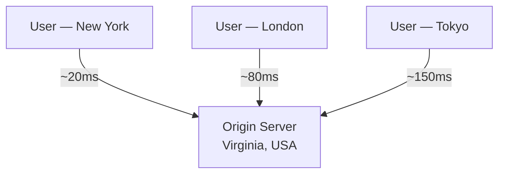
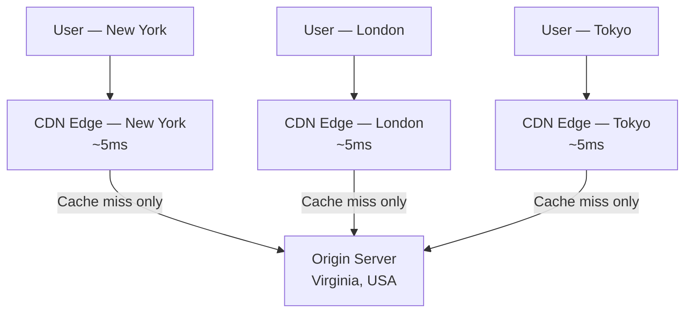
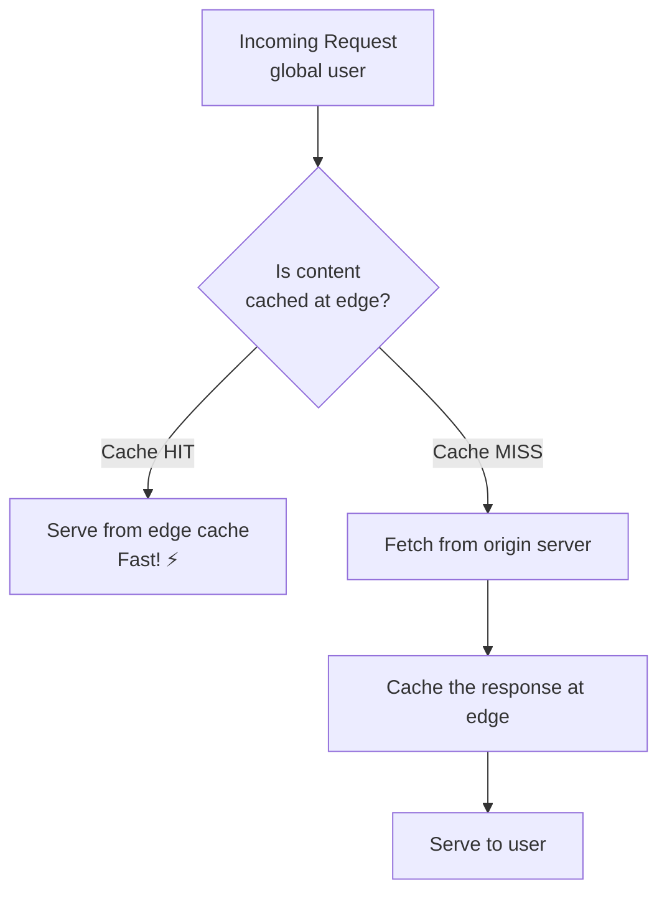
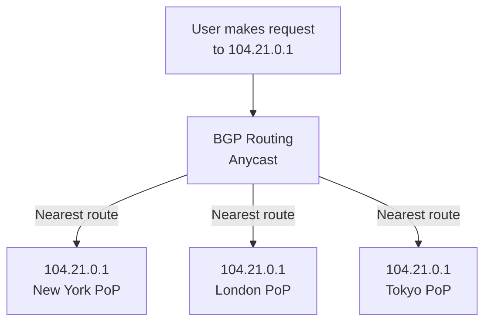

# CDN — Content Delivery Network

A CDN is a globally distributed network of servers — called **Points of Presence (PoPs)** or **edge servers** — that cache and serve content from locations physically close to end users. Instead of every request traveling across the globe to your origin server, the CDN intercepts it at the nearest edge node.

> **The core insight:** Latency is fundamentally limited by the speed of light. A request from Tokyo to a server in Virginia takes ~150ms minimum, just from physics. A CDN eliminates that by serving from Tokyo instead.

---

## The Problem CDNs Solve

Without a CDN, every user hits your single origin:



With a CDN, users hit their nearest edge node:



The result: global users experience sub-10ms latency for cached content, and your origin handles a fraction of the requests.

---

## How CDN Caching Works

Every edge node maintains a local cache. When a request arrives:



**Cache hit ratio** is the key CDN metric. A 95%+ hit ratio means 95% of requests never reach your origin — massive savings in bandwidth, server load, and latency.

### What CDNs Cache

| Content Type                    | Cacheable?   | Notes                                |
| ------------------------------- | ------------ | ------------------------------------ |
| Static assets (JS, CSS, images) | ✅ Excellent | Long TTL, high hit ratio             |
| Video / Audio                   | ✅ Excellent | Huge bandwidth savings               |
| HTML pages                      | ⚠️ Sometimes | Only if content is not user-specific |
| API responses                   | ⚠️ Sometimes | Only GET requests, with care         |
| Authenticated responses         | ❌ No        | Must not be cached (security risk)   |
| POST / mutation responses       | ❌ No        | Side-effecting requests              |

---

## Push CDN vs. Pull CDN

There are two fundamental models for how content gets to the edge:

### Pull CDN (Most Common)

The CDN fetches content from your origin **on demand** when the first user requests it.

```
1. User requests /logo.png
2. Edge cache MISS → edge fetches from origin
3. Edge caches /logo.png with TTL
4. All subsequent users get it from edge
```

**Pros:** Zero setup — just point your domain at the CDN. Content is automatically cached on first access.  
**Cons:** First user to request uncached content experiences origin latency (cold start).

**Best for:** Websites, APIs, content that's accessed by many users after initial publication.

### Push CDN

You explicitly upload content to the CDN before users request it.

```
1. You publish /video.mp4
2. Your system pushes it to all CDN edge nodes worldwide
3. All users get it instantly from their nearest edge
```

**Pros:** Zero cold start. Guaranteed availability even during origin outages.  
**Cons:** Storage costs grow linearly. You manage distribution complexity. Stale content stays cached until explicitly removed.

**Best for:** Large files, videos, software downloads, content with known access patterns.

|                | Pull CDN                    | Push CDN                        |
| -------------- | --------------------------- | ------------------------------- |
| **Setup**      | Easy (DNS change)           | Requires integration            |
| **Cold start** | Yes (first request)         | No                              |
| **Storage**    | Cache only what's requested | Store everything                |
| **Control**    | TTL-based                   | Explicit management             |
| **Use case**   | Web assets, APIs            | Video, downloads, known content |

---

## Cache Invalidation — The Hard Problem

> "There are only two hard things in computer science: cache invalidation and naming things." — Phil Karlton

When you update content on your origin, edge caches may still serve the old version until the TTL expires. This is cache staleness.

### Strategies

**1. TTL-based expiry (simplest)**
Set `Cache-Control: max-age=86400`. Content expires after 24 hours.

```
Cache-Control: public, max-age=3600
Cache-Control: public, max-age=86400, stale-while-revalidate=3600
```

**2. Cache Busting (most reliable)**  
Embed a hash or version in the filename. When content changes, the filename changes — old cache is never invalidated, it just becomes unreachable:

```
/assets/app.a3f9b12.js      ← v1
/assets/app.c7d8e45.js      ← v2 (new hash, new cache entry)
```

Webpack, Vite, and most modern bundlers do this automatically.

**3. Explicit Purge / Invalidation API**  
Most CDN providers offer APIs to purge specific files or paths:

```bash
# Cloudflare cache purge example
curl -X POST "https://api.cloudflare.com/client/v4/zones/{zone_id}/purge_cache" \
  -H "Authorization: Bearer $TOKEN" \
  -d '{"files": ["https://example.com/logo.png"]}'
```

**Gotcha:** Mass purges can flood your origin with requests if many users try to re-fetch at the same time (thundering herd).

**4. Surrogate Keys / Cache Tags**  
Tag cached responses with logical keys. Invalidate by tag, not URL. Used by Cloudflare Enterprise, Fastly, and Varnish:

```
Surrogate-Key: product-123 category-shoes homepage
```

Purge all responses tagged `product-123` when product 123 is updated.

---

## CDN for Dynamic Content

Modern CDNs aren't just for static files. They can accelerate dynamic content too:

### Edge-Side Logic

**Cloudflare Workers / Lambda@Edge / Fastly Compute:**
Run code at the edge — authentication, A/B testing, personalization — without a round-trip to origin:

```javascript
// Cloudflare Worker: A/B test at the edge
export default {
  async fetch(request) {
    const variant = Math.random() < 0.5 ? "a" : "b";
    const url = new URL(request.url);
    url.pathname = `/${variant}${url.pathname}`;
    return fetch(url.toString());
  },
};
```

### Dynamic API Caching

Short-TTL caching of API responses reduces origin load significantly:

```
Cache-Control: public, max-age=5, stale-while-revalidate=60
```

A 5-second cache on a popular API endpoint can reduce origin load by 90%+ at high traffic volumes.

---

## CDN Architecture Internals

### Anycast Routing

CDNs use **BGP Anycast** — the same IP is advertised from multiple locations. The internet's routing protocol automatically directs each user to their topologically nearest PoP:



### Multi-Tier Caching

Large CDNs (Cloudflare, Akamai) use tiered architecture to increase hit ratios:

```
User → Edge Node (L1 cache)
         ↓ miss
    Regional Shield (L2 cache)
         ↓ miss
       Origin Server
```

The regional shield (or "shield PoP") collapses many edge cache misses into a single origin request, protecting the origin from thundering herds.

---

## Real-World CDN Providers

| CDN                  | Key Strength                                        | Used By                            |
| -------------------- | --------------------------------------------------- | ---------------------------------- |
| **Cloudflare**       | DDoS protection, edge compute, 300+ PoPs, free tier | Discord, Canva, Shopify            |
| **AWS CloudFront**   | Deep AWS integration, Lambda@Edge, Shield           | Netflix (for some content), Twitch |
| **Akamai**           | Largest network, enterprise-grade, streaming        | Apple, government, media           |
| **Fastly**           | Programmable CDN, Compute@Edge, fast purge          | GitHub, Stripe, Reddit             |
| **Google Cloud CDN** | GCP integration, HTTP/3 support                     | GCP workloads                      |

---

## CDN Tradeoffs and When NOT to Use One

**CDNs help when:**

- Content is cacheable and accessed by many users
- You have global users and need low latency
- You want to reduce origin bandwidth costs
- You need DDoS mitigation at the edge

**CDNs hurt when:**

- All content is user-specific / personalized (low hit ratio = paying for nothing)
- Freshness is critical and your TTL is effectively 0
- You're adding latency for intra-datacenter requests (CDN overhead isn't worth it)
- Data sovereignty requirements conflict with CDN PoP locations

---

## Interview Talking Points

### The Canonical CDN Interview Question

> "How would you design a system to serve images to 100 million users globally?"

**The answer always involves CDN:**

1. Upload images to object storage (S3/GCS)
2. Put CloudFront / Cloudflare in front
3. Cache-bust on upload (use content hash in URL)
4. Set long TTLs (`max-age=31536000, immutable`)
5. Use CDN purge API for emergency invalidation

### Tradeoff Discussion Points

| Tradeoff                         | Explanation                                                             |
| -------------------------------- | ----------------------------------------------------------------------- |
| **Freshness vs. Cache Hit Rate** | Longer TTL = better performance but potentially stale content           |
| **Pull vs. Push**                | Pull is simpler; push guarantees availability but has storage costs     |
| **Single CDN vs. Multi-CDN**     | Multi-CDN improves resilience but adds complexity (DNS/anycast routing) |
| **Edge compute vs. Origin**      | Edge is faster but has runtime limitations and harder debugging         |

---

## Key Takeaways

- CDNs **reduce latency** by serving content from the nearest edge node, and **reduce origin load** by caching
- **Pull CDN** is the standard for web apps; **Push CDN** is better for known large files
- **Cache busting via content hashing** is the most reliable way to handle stale content
- **Short TTL + stale-while-revalidate** is the modern pattern for semi-dynamic content
- **Edge compute** (Cloudflare Workers, Lambda@Edge) moves logic closer to users — a major architectural shift
- **Cache hit ratio** is the north star metric — below 80% means you're not getting full CDN value
