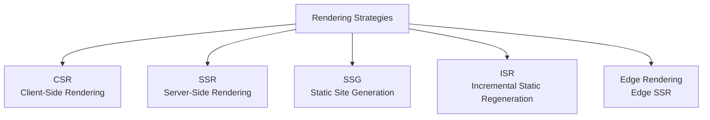
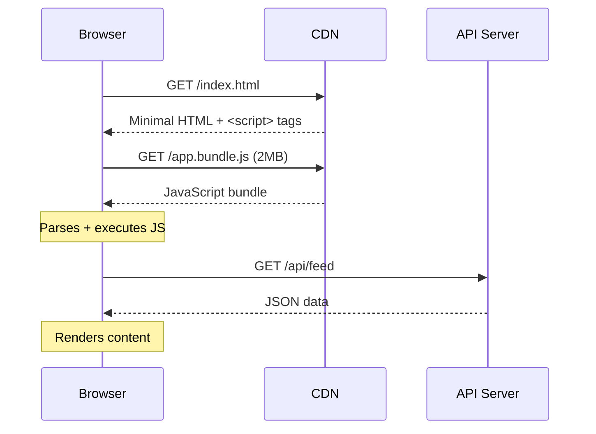
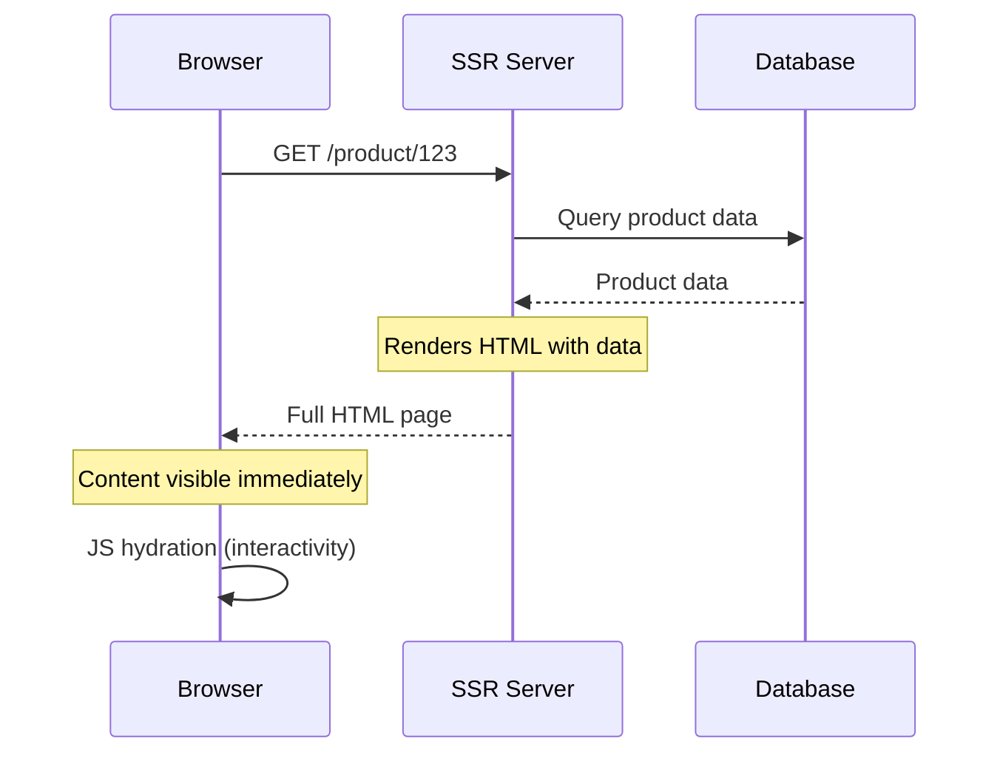
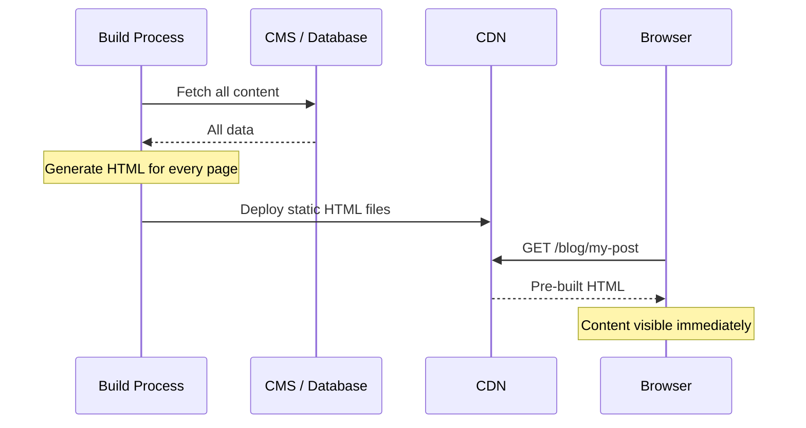
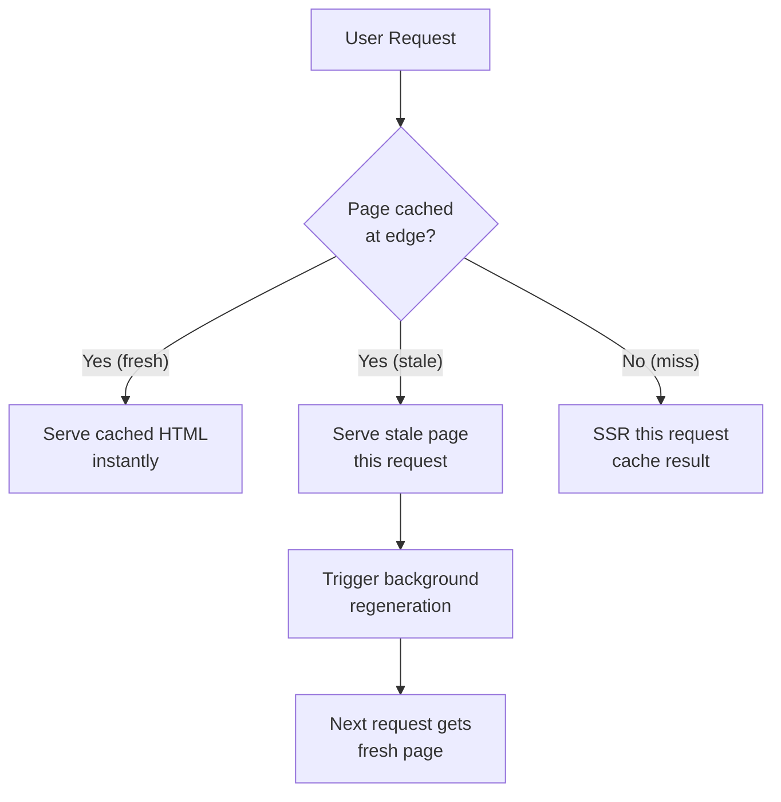
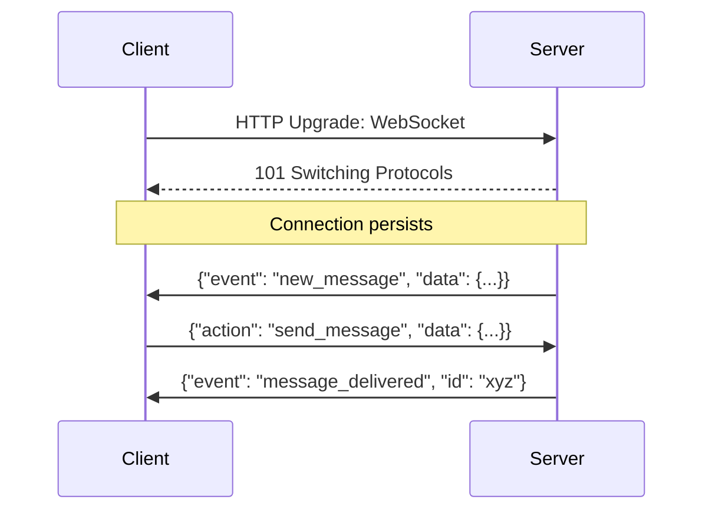
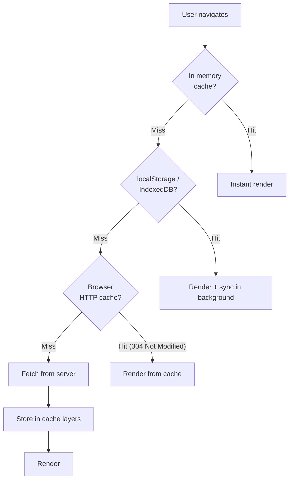
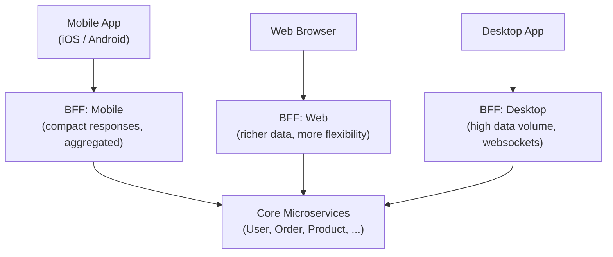

# Client Layer

The client layer is where users interact with your system. It's often underestimated in system design discussions — but decisions made here drive architecture choices all the way down to the database. A mobile client on a 3G network has fundamentally different requirements than a desktop browser on fiber. Understanding this shapes everything.

> **The client layer is not just "the frontend."** It defines latency budgets, API contracts, caching strategies, data transfer volumes, and offline requirements that ripple through the entire system design.

---

## Types of Clients

### Web Browsers

The most universal client. Runs JavaScript, HTML, CSS. Accesses your system via HTTP/HTTPS.

**Characteristics:**

- No installation required — universal reach
- Sandboxed — limited access to OS resources (no raw TCP, no file system)
- Session state in cookies, localStorage, or sessionStorage
- Limited persistent storage (~5–10MB in localStorage, GBs in IndexedDB)
- Constrained by the browser's memory and CPU (shared with other tabs)

### Mobile Apps (iOS / Android)

Native applications with OS-level access.

**Characteristics:**

- Higher performance — native GPU, background processes, push notifications
- Local persistent storage (SQLite, files, encrypted keychain)
- Intermittent connectivity — must handle offline gracefully
- Expensive update cycle — users don't always update (version fragmentation)
- Battery constraints — background processing is limited by the OS

### Desktop Applications

Native or Electron-based applications.

**Characteristics:**

- Rich OS integration (file system, hardware, system tray)
- Higher resource availability (CPU, memory)
- More predictable network conditions than mobile
- Update mechanism is more controlled than web but slower than server changes

### IoT / Embedded Clients

Sensors, smart devices, embedded systems.

**Characteristics:**

- Extremely constrained resources (KB of memory, MHz of CPU)
- May use lightweight protocols (MQTT, CoAP) instead of HTTP
- Must operate for days/months without manual intervention
- Data transmission is batched to conserve power

---

## Rendering Strategies

For web clients, _where_ HTML is generated determines performance, SEO, and architecture complexity. This is one of the most consequential decisions in web system design.



### Client-Side Rendering (CSR)

The server sends a minimal HTML shell + JavaScript bundle. The browser downloads, parses, and runs JS to render content.



**Timeline:** User sees content after: HTML download + JS download + JS parse + API call + render = 2–5 seconds on slow connections

**Pros:**

- Rich, app-like interactions
- After initial load, navigation is instant (SPA)
- Cheap to host (just static files on CDN)

**Cons:**

- Slow Time to First Contentful Paint (TTFCP) — bad for conversion
- Poor SEO by default (search crawlers may not execute JS)
- Large JavaScript bundles increase load time on mobile

**Best for:** Admin dashboards, authenticated apps, internal tools — where SEO and initial load aren't critical.

**Real-world examples:** Gmail, Figma, Notion (post-login views)

### Server-Side Rendering (SSR)

The server renders full HTML for each request and sends it to the browser.



**Timeline:** User sees content after: SSR response time (server side) + HTML parse = 200–800ms

**Pros:**

- Fast Time to First Contentful Paint
- Excellent SEO (full HTML in response)
- Works without JavaScript enabled

**Cons:**

- Server cost — every request needs compute
- Requires server infrastructure (not just static hosting)
- Scaling requires more effort than static hosting

**Best for:** E-commerce, news sites, marketing pages, anywhere SEO and perceived performance matter.

**Real-world examples:** Amazon product pages, news sites, early Twitter

### Static Site Generation (SSG)

HTML is pre-rendered at build time and deployed to a CDN. No server computation at request time.



**Pros:**

- Fastest possible delivery (pre-built, served from CDN edge)
- Zero server compute at request time
- Trivially scalable — CDN handles all load
- Cheapest to operate

**Cons:**

- Build time grows with content volume (1M pages = long builds)
- Content updates require a rebuild and redeploy
- Not suitable for personalized or real-time content

**Best for:** Documentation sites, blogs, marketing landing pages, any site where content changes infrequently.

**Real-world examples:** Docs sites (Stripe, Cloudflare), GitHub Pages, many marketing sites

### Incremental Static Regeneration (ISR)

The Next.js-pioneered middle ground between SSG and SSR:



Pages are pre-generated but can be revalidated on a schedule (every 60 seconds, for example). Users never wait for server rendering — they get either cached or stale content, while the background process updates the cache.

**Best for:** Product pages, news articles, any content that changes but doesn't need real-time freshness.

### Rendering Strategy Comparison

| Strategy     | TTFCP   | SEO  | Dynamic Content | Infrastructure Cost | Real-time |
| ------------ | ------- | ---- | --------------- | ------------------- | --------- |
| **CSR**      | Slowest | Poor | ✅              | Lowest              | ✅        |
| **SSR**      | Fast    | ✅   | ✅              | Medium-High         | ✅        |
| **SSG**      | Fastest | ✅   | ❌              | Lowest              | ❌        |
| **ISR**      | Fastest | ✅   | Near-real-time  | Low                 | ❌        |
| **Edge SSR** | Fastest | ✅   | ✅              | Low-Medium          | Partial   |

---

## Client-API Communication Patterns

How the client communicates with your backend is an architectural decision with significant consequences.

### REST (Request-Response)

Standard HTTP verbs over predictable URLs. The workhorse of web APIs.

```
GET    /users/42           → Get user
POST   /orders             → Create order
PUT    /orders/99          → Replace order
PATCH  /orders/99          → Partial update
DELETE /orders/99          → Delete order
```

**Pros:** Universal, cacheable (GET), human-readable, tooling everywhere  
**Cons:** Over-fetching (get more data than needed), under-fetching (multiple round-trips for related data), versioning is painful

### GraphQL

Client specifies exactly what data it needs. Server returns exactly that.

```graphql
query {
  user(id: 42) {
    name
    email
    orders(last: 5) {
      id
      total
      items {
        product {
          name
        }
        quantity
      }
    }
  }
}
```

One request. Exactly the data needed. No over-fetching.

**Pros:** Perfect for mobile (smaller payloads), eliminates API versioning, aggregates multiple resources in one call  
**Cons:** Harder to cache (POST with dynamic body), complex query optimization, N+1 problem (requires DataLoader pattern), overkill for simple CRUD APIs

**Best for:** Mobile-heavy apps with diverse data needs, rapid-changing frontends, BFF (Backend for Frontend) patterns

### WebSocket

Full-duplex, persistent connection for real-time bidirectional communication:



**Best for:** Chat applications, live collaboration (Figma, Google Docs), live trading/gaming, real-time notifications

**Connection overhead:** Each WebSocket is a persistent TCP connection. At 1M concurrent users, you need to handle 1M open connections — this requires specific server architecture (Node.js, Go, or dedicated WebSocket servers).

### Server-Sent Events (SSE)

One-way server-to-client streaming over HTTP. Simpler than WebSocket for unidirectional data.

```javascript
// Client
const es = new EventSource("/api/live-feed");
es.onmessage = (event) => updateUI(JSON.parse(event.data));

// Server
res.setHeader("Content-Type", "text/event-stream");
setInterval(() => {
  res.write(`data: ${JSON.stringify(latestData)}\n\n`);
}, 1000);
```

**Best for:** Live scores, stock tickers, log tailing, notification feeds — where you push data but don't need client-to-server streaming

**Advantages over WebSocket:** Automatic reconnection built into browser, works over standard HTTP/2, easier to proxy and cache

---

## Client-Side Caching

The client layer is itself a powerful cache — reducing server load and improving perceived performance.



### HTTP Cache Headers

```
Cache-Control: public, max-age=86400       # Cache for 24 hours
Cache-Control: private, max-age=300        # User-specific, 5 minutes
Cache-Control: no-store                    # Never cache (sensitive data)
ETag: "abc123"                             # Fingerprint for conditional requests
Last-Modified: Thu, 01 Jun 2025 00:00:00  # For conditional requests
```

**Conditional requests:** If the browser has a cached version, it sends `If-None-Match: "abc123"`. Server responds with `304 Not Modified` (no body) if unchanged — saving bandwidth.

### Service Workers and Offline-First

Service workers intercept all network requests from a web page, enabling offline-first architectures:

```javascript
// Service Worker intercepts requests
self.addEventListener("fetch", (event) => {
  event.respondWith(
    caches.match(event.request).then((cached) => {
      // Serve from cache, fetch fresh in background
      const fetchPromise = fetch(event.request).then((fresh) => {
        caches
          .open("v1")
          .then((cache) => cache.put(event.request, fresh.clone()));
        return fresh;
      });
      return cached || fetchPromise;
    }),
  );
});
```

**Strategies:**

- **Cache First:** Serve cached, update in background (best for assets)
- **Network First:** Try network, fall back to cache (best for APIs)
- **Stale While Revalidate:** Serve cache immediately, fetch fresh asynchronously

**Real-world examples:** Twitter Lite, Uber, Pinterest — all use service workers for offline support and ~30–50% load time improvements.

---

## Client Architecture Patterns

### BFF — Backend for Frontend

Different clients have different data needs. A single API serving both mobile and web leads to over-fetching on mobile and under-serving on web. BFF solves this by providing a dedicated API gateway layer per client type:



**Benefits:**

- Mobile gets compact payloads optimized for bandwidth
- Web gets rich data for complex UIs
- Each team can evolve their BFF independently
- Core services aren't polluted with client-specific logic

### Progressive Web Apps (PWA)

Web apps that behave like native apps:

- **Installable** — added to home screen, no app store
- **Offline capable** — service worker caches critical resources
- **Push notifications** — using Web Push API
- **Background sync** — queue operations made while offline, replay when connected

**Performance benchmark:** Twitter Lite (PWA) saw a 65% increase in pages per session and a 20% decrease in bounce rate vs. native mobile site.

---

## Client Constraints by Network Type

Network type dramatically affects what's feasible. Design for the worst case:

| Network         | Bandwidth    | Latency   | Strategy                                   |
| --------------- | ------------ | --------- | ------------------------------------------ |
| WiFi / Ethernet | 10–1000 Mbps | <5ms      | No special handling needed                 |
| 4G LTE          | 10–50 Mbps   | 50–100ms  | Bundle splitting, lazy loading             |
| 3G              | 1–5 Mbps     | 100–500ms | Aggressive compression, skeleton screens   |
| 2G / Edge       | <1 Mbps      | 300ms–1s  | Text-first, defer all non-critical assets  |
| Offline         | 0            | N/A       | Service worker, optimistic UI, queued sync |

**The Network Information API** lets JavaScript detect connection quality:

```javascript
const connection = navigator.connection;
if (connection.effectiveType === "2g") {
  // Serve lower-quality images, skip video autoplay
}
```

---

## Interview Talking Points

### What the interviewer wants to hear

**1. Rendering strategy selection**

> "For a public e-commerce product page, I'd use SSR or ISR — SEO is critical, and users should see content immediately. The product dashboard (authenticated, complex) uses CSR since SEO doesn't matter there."

**2. Mobile considerations for API design**

> "Mobile clients on 3G have to pay for every byte. I'd use GraphQL or a BFF to return only the fields they need, compress responses with gzip/Brotli, and keep the payload under 100KB."

**3. Real-time communication choice**

> "For a chat application, WebSocket is the right choice — bidirectional, low latency, persistent connection. For a stock price ticker, SSE is sufficient and simpler — server pushes, client never sends."

**4. Handling offline / unreliable connectivity**

> "Mobile users lose connectivity frequently. I'd use optimistic UI — apply the user's action immediately in the UI, queue the API call, and reconcile when connectivity returns. The service worker handles retrying failed requests."

---

## Key Takeaways

- **Client type drives architecture**: mobile offline requirements, web SEO needs, and IoT bandwidth constraints all cascade into backend decisions
- **Rendering strategy** (CSR / SSR / SSG / ISR) is a first-class architectural decision — not just a frontend implementation detail
- **REST** is the safe default; **GraphQL** shines for mobile and diverse data requirements; **WebSocket** is for real-time bidirectional; **SSE** for server-push only
- **Client-side caching** via HTTP headers and service workers is one of the highest-leverage performance optimizations available
- **BFF pattern** decouples client-specific data needs from core services — essential at scale with diverse client types
- **Design for the worst network** — a 3G mobile user in a rural area is a real user, not an edge case
