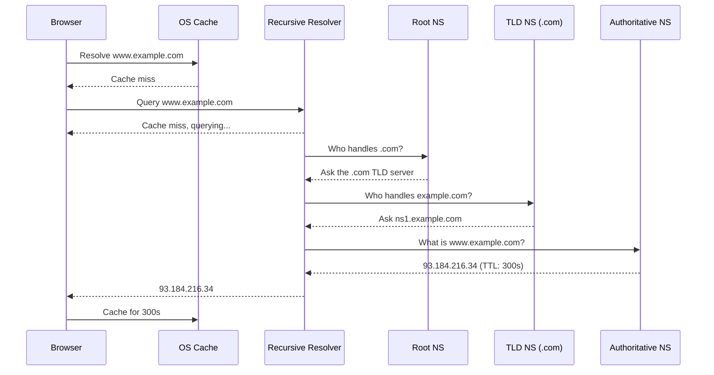
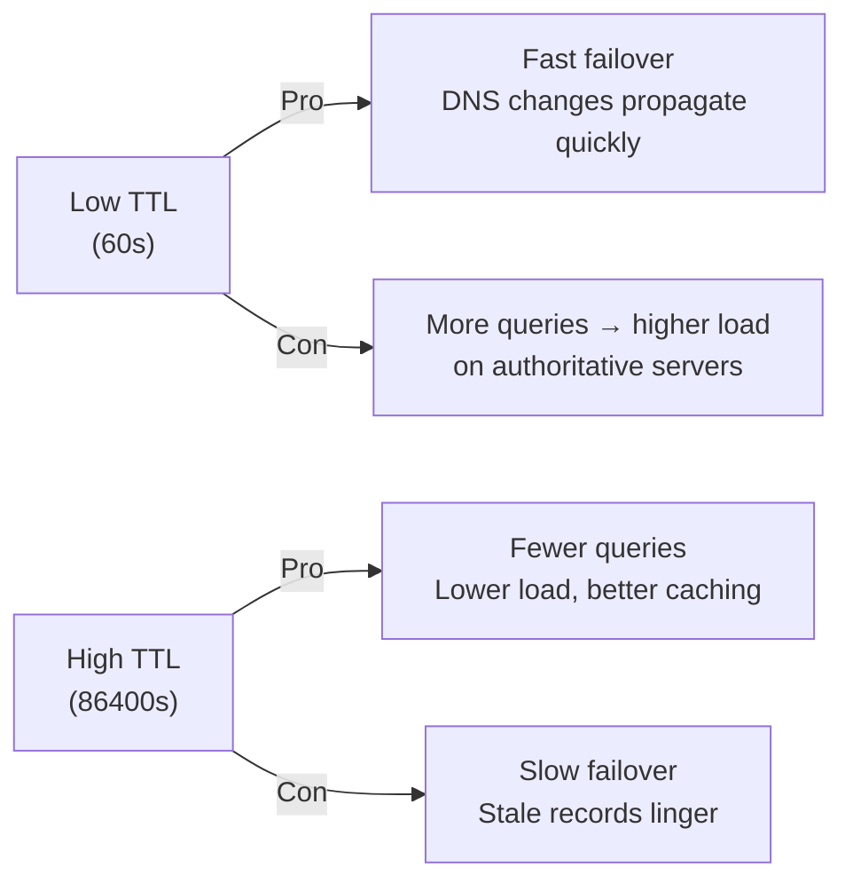
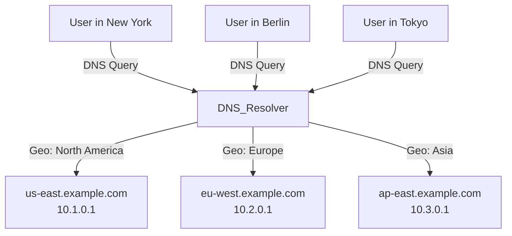
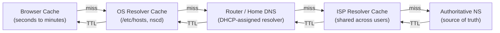

# DNS — Domain Name System

DNS is the phonebook of the internet. Every time you type `google.com` into a browser, DNS silently translates that human-readable name into an IP address your computer can actually route to. Behind that single lookup is a globally distributed, highly available, hierarchical system handling **trillions of queries per day**.

> **In interviews:** DNS comes up in almost every system design. Understanding TTL, caching, failover, and GeoDNS is what separates junior answers from senior ones.

---

## How DNS Resolution Works

When you type `www.example.com`, the following chain of events happens — all in under 50ms on a warm cache:



### The Four Players

| Role                          | Who                                  | What it does                      |
| ----------------------------- | ------------------------------------ | --------------------------------- |
| **DNS Resolver**              | Your ISP or `8.8.8.8`                | Asks questions on your behalf     |
| **Root Name Server**          | 13 clusters (a–m.root-servers.net)   | Knows where TLD servers are       |
| **TLD Name Server**           | Verisign (.com), IANA (.org)         | Knows authoritative NS per domain |
| **Authoritative Name Server** | Route53, Cloudflare, your own server | Has the actual DNS records        |

---

## DNS Record Types

Every DNS response is a **record**. Knowing these is essential for both engineering and interviews:

| Record    | Purpose                                  | Example                                    |
| --------- | ---------------------------------------- | ------------------------------------------ |
| **A**     | Maps domain → IPv4                       | `example.com → 93.184.216.34`              |
| **AAAA**  | Maps domain → IPv6                       | `example.com → 2606:2800:220:1::93`        |
| **CNAME** | Alias one domain to another              | `www.example.com → example.com`            |
| **MX**    | Mail server for a domain                 | `example.com → mail.example.com`           |
| **NS**    | Authoritative name server                | `example.com → ns1.example.com`            |
| **TXT**   | Arbitrary text (SPF, DKIM, verification) | `"v=spf1 include:..."`                     |
| **SOA**   | Start of Authority — zone metadata       | Serial, refresh, retry intervals           |
| **PTR**   | Reverse DNS (IP → domain)                | `34.216.184.93.in-addr.arpa → example.com` |
| **SRV**   | Service location (port + protocol)       | Used by Kubernetes, SIP, XMPP              |

> **CNAME gotcha:** You cannot CNAME the root (`@`) of a domain. `example.com` can't be a CNAME. Use an `A` record or ALIAS/ANAME (provider-specific) instead. This trips up many engineers.

---

## TTL — The Hidden Performance Knob

**Time to Live (TTL)** controls how long resolvers cache a DNS record before re-querying. It's measured in seconds.

```
TTL = 60   → Cache for 1 minute   (very fresh, high query volume)
TTL = 300  → Cache for 5 minutes  (typical web application)
TTL = 3600 → Cache for 1 hour     (stable infrastructure)
TTL = 86400 → Cache for 1 day     (static content, rarely changes)
```

### The TTL Tradeoff



**Engineering pattern:** Before a planned migration or failover, lower TTL to 60s **24–48 hours in advance**. After the switch, raise it back. This gives you fast propagation without permanent high query volume.

---

## DNS and Load Balancing

DNS can be your first layer of load distribution — before traffic even hits a load balancer:

### Round-Robin DNS

Return multiple A records for the same domain. Resolvers rotate through them:

```
example.com   A   10.0.0.1
example.com   A   10.0.0.2
example.com   A   10.0.0.3
```

**Problem:** DNS doesn't know if a server is down. If `10.0.0.1` dies, clients that cached it will experience failures until the TTL expires.

### GeoDNS (Geographic DNS)

Return different IPs based on where the query comes from. This is how CDNs and global services route users to their nearest datacenter:



**Real-world use:** Netflix, Spotify, and CloudFront use GeoDNS to route users to the nearest edge location, reducing latency by 100–200ms for global users.

### Weighted DNS

Route a percentage of traffic to each record. Used for canary deployments or gradual traffic shifting:

```
example.com  A  10.0.0.1  weight=90   (stable version)
example.com  A  10.0.0.2  weight=10   (canary version)
```

AWS Route53, Cloudflare, and Google Cloud DNS all support weighted records natively.

---

## DNS Caching Layers

A DNS query passes through multiple caches before hitting an authoritative server:



**Practical implication:** After changing a DNS record, even with a 60s TTL, some users may see the old record for hours due to:

- Misbehaving resolvers that ignore TTL
- ISP resolvers with their own minimum cache time
- Browser tab caching

---

## DNS Failures and Resilience

DNS is critical infrastructure. It's also a single point of failure if designed poorly.

### Common DNS Failure Patterns

| Failure                 | Cause                                           | Mitigation                           |
| ----------------------- | ----------------------------------------------- | ------------------------------------ |
| NXDOMAIN floods         | Misconfigured apps querying nonexistent domains | Rate limiting at resolver            |
| DNS amplification DDoS  | Open resolvers used as reflectors               | Block open recursion, use BCP38      |
| Cache poisoning         | Injecting fake records into resolver cache      | DNSSEC, randomized ports             |
| Authoritative NS outage | All NS servers go down                          | Multiple NS records across providers |

### DNSSEC — Signing Your Records

DNSSEC adds cryptographic signatures to DNS responses, preventing cache poisoning and man-in-the-middle attacks on DNS:

```
Without DNSSEC:  Resolver trusts any response
With DNSSEC:     Resolver verifies signature chain from root → TLD → domain
```

**Reality check:** DNSSEC is complex and has poor adoption. Many major sites don't use it. For most applications, using reputable DNS providers (Cloudflare, Route53) provides sufficient security at the resolver level.

---

## Real-World DNS Providers

| Provider             | Strengths                                               | Best for                   |
| -------------------- | ------------------------------------------------------- | -------------------------- |
| **AWS Route53**      | Native AWS integration, health checks, failover, GeoDNS | AWS-hosted workloads       |
| **Cloudflare DNS**   | Fastest resolver globally (1.1.1.1), DDoS protection    | Performance-critical sites |
| **Google Cloud DNS** | Low latency, 100% SLA, Anycast                          | GCP workloads              |
| **Azure DNS**        | Azure integration, private DNS zones                    | Azure workloads            |
| **NS1**              | Advanced traffic management, data-driven DNS            | Complex routing needs      |

---

## DNS in System Design Interviews

When DNS comes up in an interview, examiners want to see:

### 1. You understand the resolution chain

> "When a user hits `api.myapp.com`, the browser checks its cache → OS → resolver → authoritative. With GeoDNS, Route53 returns the IP of the nearest region."

### 2. You can use DNS as a first routing layer

> "Before traffic reaches our load balancer, GeoDNS routes US users to `us-east-1` and EU users to `eu-west-1`. This cuts cross-region latency significantly."

### 3. You know TTL implications

> "We'll lower TTL to 60 seconds 24 hours before the migration so we can failover quickly. Post-migration, we'll raise it to 3600 to reduce resolver load."

### 4. You account for DNS failure

> "We use multiple authoritative name servers with different providers (Route53 + Cloudflare) so a single provider outage doesn't make our domain unresolvable."

---

## Key Takeaways

- DNS is **hierarchical and globally distributed** — no single server handles all queries
- **TTL is your propagation speed knob** — lower it before changes, raise it after
- **GeoDNS** is the easiest way to reduce global latency before code changes
- DNS is **not real-time failover** — health-check-based failover at the load balancer layer is faster and more reliable
- **DNSSEC** prevents poisoning but adds complexity — use trusted providers as a pragmatic alternative
- DNS failures are **rare but catastrophic** — use multiple NS providers for critical domains
