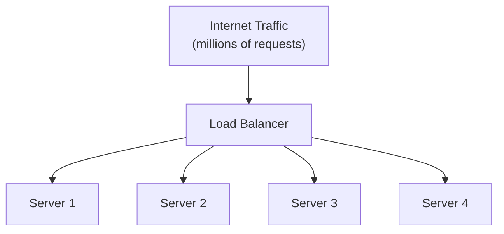
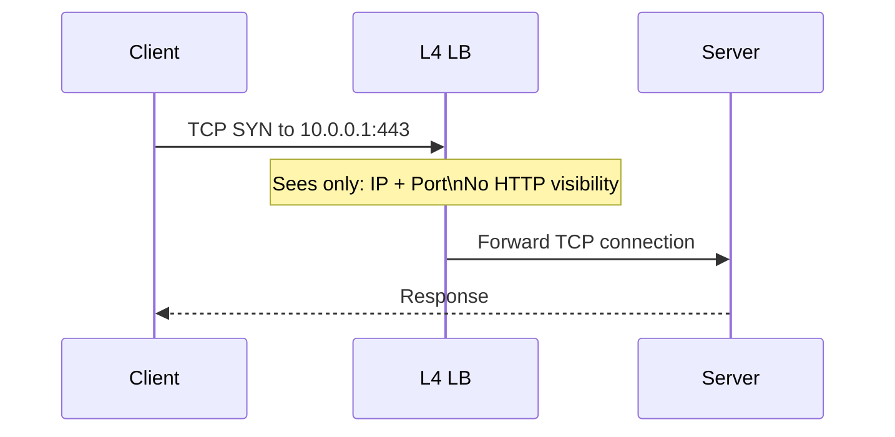
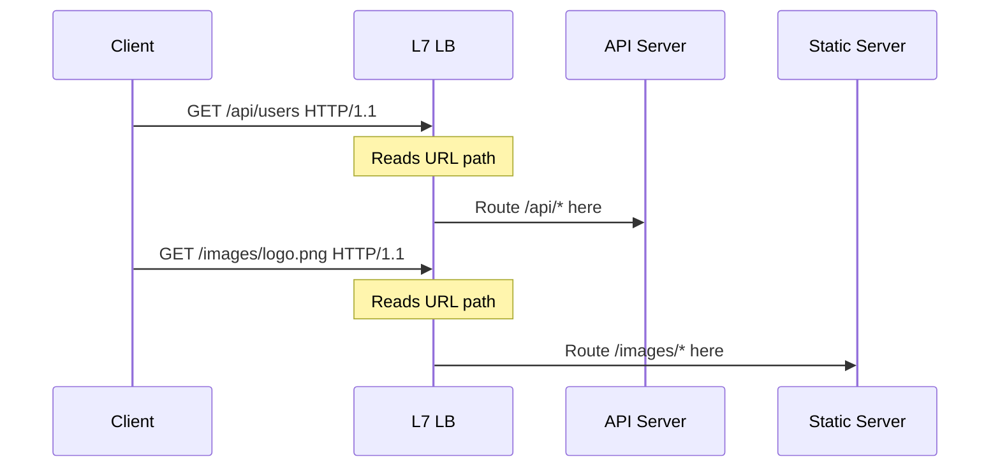
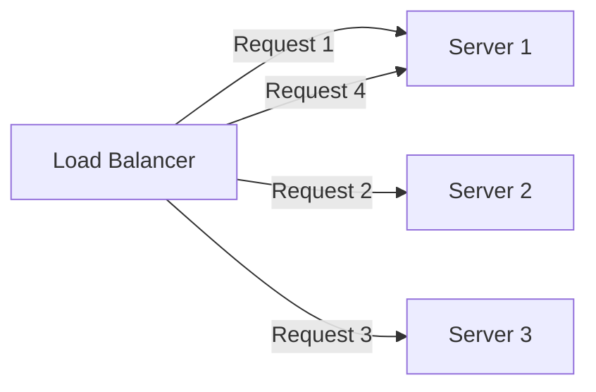
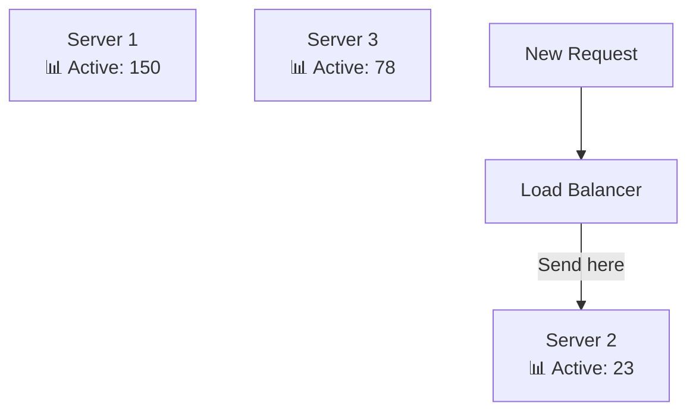
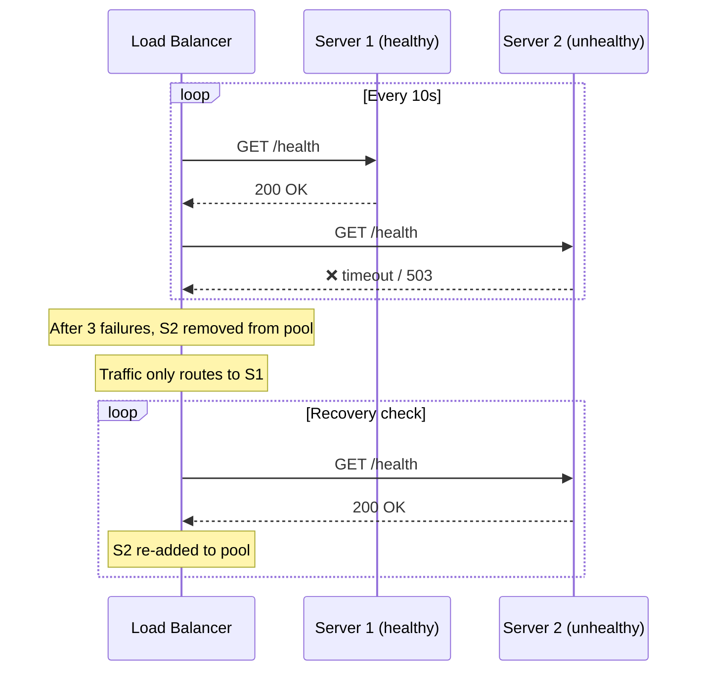
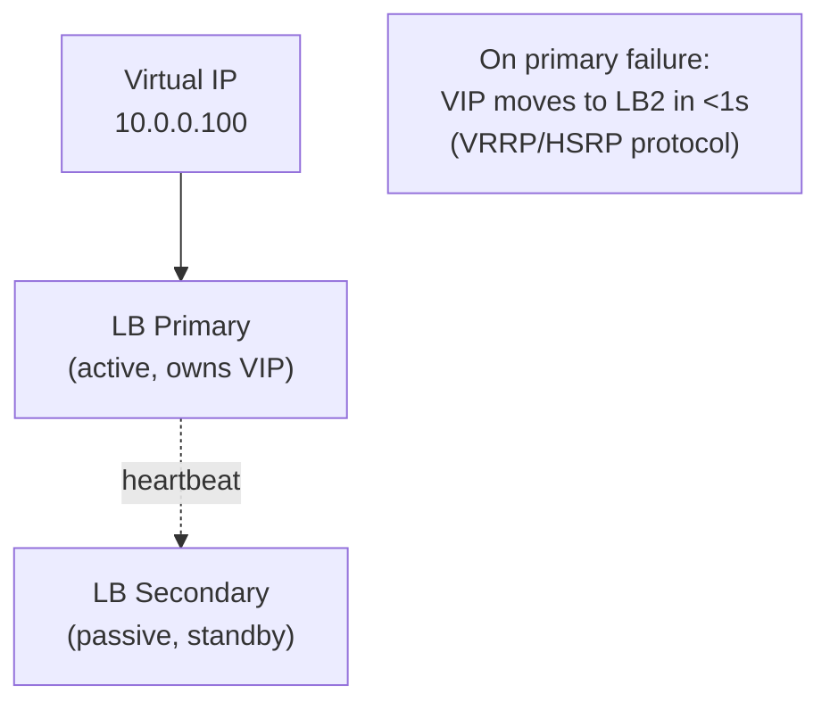
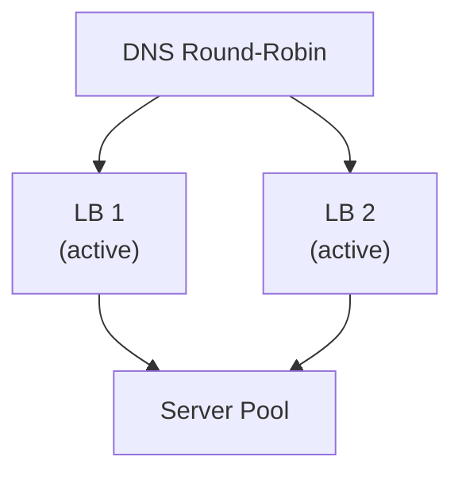

# Load Balancer

A load balancer sits in front of a pool of servers and distributes incoming traffic across them according to a defined algorithm. It is the cornerstone of horizontal scalability — the mechanism that lets you go from one server to thousands without changing client code.

> **The fundamental rule:** No single server should receive all the traffic. A load balancer enforces this.

---

## Why Load Balancers Exist

A single application server has hard limits:

- CPU saturation at ~10K–50K RPS (depending on workload)
- Memory exhaustion
- A single point of failure — one crash = full outage

Load balancers solve all three:



---

## L4 vs. L7 Load Balancers

Load balancers operate at different layers of the OSI model. This is one of the most important distinctions in system design interviews.

### L4 — Transport Layer (TCP/UDP)

Operates on IP addresses and TCP/UDP ports. It **does not** read HTTP headers, URLs, or cookies — it just routes packets based on connection-level information.



**Characteristics:**

- Extremely fast — minimal processing per packet
- Protocol-agnostic (HTTP, HTTPS, MySQL, Redis, gRPC all work the same)
- Cannot route based on URL path, headers, or cookies
- SSL termination at the server (LB just forwards encrypted bytes)

**Examples:** AWS NLB, HAProxy (TCP mode), hardware load balancers (F5)

### L7 — Application Layer (HTTP/HTTPS)

Reads the full HTTP request — headers, URL, body — before routing. This enables content-based routing.



**Characteristics:**

- Can route based on URL, headers, cookies, query params
- Can terminate SSL (decrypt once at LB, forward HTTP internally)
- Can inject headers, compress responses, handle WebSockets
- Slightly higher latency than L4 due to request parsing
- Can do sticky sessions (route same user to same server based on cookie)

**Examples:** AWS ALB, NGINX, Traefik, Envoy, HAProxy (HTTP mode)

### Side-by-Side Comparison

| Feature             | L4 LB                         | L7 LB                       |
| ------------------- | ----------------------------- | --------------------------- |
| **Routing basis**   | IP + Port                     | URL, headers, cookies       |
| **Protocol aware**  | No                            | Yes (HTTP, gRPC, WebSocket) |
| **SSL termination** | No (passthrough)              | Yes                         |
| **Performance**     | Higher                        | Slightly lower              |
| **Content routing** | ❌                            | ✅                          |
| **Sticky sessions** | Limited (IP hash)             | ✅ (cookie-based)           |
| **Use case**        | High-throughput, any protocol | Web apps, microservices     |

---

## Load Balancing Algorithms

How does the LB decide which server to pick? Several algorithms exist, each with distinct tradeoffs:

### Round Robin

Requests are distributed sequentially: S1, S2, S3, S1, S2, S3, ...



- **Pro:** Simple, equal distribution
- **Con:** Ignores server load or request cost. A 10ms request and a 10s request count equally.
- **Best for:** Homogeneous servers, similar request types

### Weighted Round Robin

Assign weights based on server capacity. More powerful servers get more requests.

```
Server 1 (8 cores):  weight=4  → gets 4 of every 7 requests
Server 2 (4 cores):  weight=2  → gets 2 of every 7 requests
Server 3 (2 cores):  weight=1  → gets 1 of every 7 requests
```

- **Best for:** Heterogeneous server pools (different hardware generations)

### Least Connections

Route each new request to the server with the fewest active connections.



- **Pro:** Adapts to actual load. Long-running requests don't over-burden a server.
- **Con:** Requires the LB to track active connections — more state.
- **Best for:** Variable request durations (e.g., API calls mixed with file uploads)

### Least Response Time

Route to the server with the lowest combination of active connections and response time. The most intelligent basic algorithm.

- **Best for:** Latency-sensitive applications

### IP Hash (Sticky by Client IP)

Hash the client's IP to consistently route them to the same server:

```
hash(client_ip) % num_servers → server index
```

- **Pro:** Simple session affinity without cookies
- **Con:** Breaks if servers are added/removed (hash changes). Imbalanced if some IPs generate far more traffic.
- **Better alternative:** Cookie-based sticky sessions at L7

### Random

Pick a server at random. Surprisingly effective for large, homogeneous pools:

- **Pro:** No state needed, trivially simple
- **Con:** No guarantees of evenness for small pools
- **Variant:** **Power of Two Choices** — pick 2 servers randomly, send to the least loaded. Near-optimal performance with minimal state.

---

## Health Checks

A load balancer that routes to dead servers is worse than no load balancer. Health checks are the mechanism for detecting and removing unhealthy servers from the pool.



### Active vs. Passive Health Checks

| Type        | Mechanism                          | Notes                                     |
| ----------- | ---------------------------------- | ----------------------------------------- |
| **Active**  | LB probes servers on a schedule    | Detects failures before user hits them    |
| **Passive** | LB monitors real traffic responses | No probe overhead, but users see failures |

**Best practice:** Use both. Active checks catch dead servers proactively; passive checks catch degraded servers (returning 500s but technically responding).

### Health Check Best Practices

```
# Shallow health check (just confirms process is alive)
GET /ping → 200 OK

# Deep health check (confirms dependencies work)
GET /health → {"status": "ok", "db": "ok", "redis": "ok"}
```

**Warning:** Don't make health checks too deep. If a server's DB is temporarily slow, you don't want to remove it from the pool immediately — that concentrates load and causes a cascade.

---

## Session Persistence (Sticky Sessions)

Some applications store user session state in memory (not ideal, but common in legacy systems). These require that a user's requests always go to the same server.

### Cookie-Based Affinity (L7 only)

The LB inserts a cookie that identifies which server the user was routed to:

```
Set-Cookie: SERVERID=server2; Path=/
```

On subsequent requests, the LB reads this cookie and routes to `server2`.

**The fundamental problem with sticky sessions:**

- If `server2` goes down, all its users lose their sessions
- Traffic distribution becomes uneven as users accumulate on specific servers
- Prevents true stateless scaling

**The correct fix:** Store session state externally (Redis, Memcached, a database) so any server can serve any user. Then sticky sessions become unnecessary.

---

## High Availability for Load Balancers

Load balancers are themselves a potential single point of failure. Production systems address this with:

### Active-Passive (Failover)



### Active-Active

Both LBs handle traffic simultaneously. DNS round-robins between them. If one fails, the other handles all load:



Cloud load balancers (AWS ALB/NLB, GCP Load Balancing) handle HA internally — you don't manage it yourself.

---

## Real-World Load Balancers

| Tool                   | Type                | Strengths                                                    |
| ---------------------- | ------------------- | ------------------------------------------------------------ |
| **AWS ALB**            | L7, managed         | Deep AWS integration, WAF, target groups                     |
| **AWS NLB**            | L4, managed         | Ultra-low latency, static IPs, TLS passthrough               |
| **NGINX**              | L4/L7, self-managed | Extremely configurable, widely understood                    |
| **HAProxy**            | L4/L7, self-managed | Battle-tested, excellent performance, detailed metrics       |
| **Traefik**            | L7, self-managed    | Native Docker/Kubernetes integration, auto service discovery |
| **Envoy**              | L7, self-managed    | Service mesh foundation (Istio), rich observability          |
| **GCP Load Balancing** | L4/L7, managed      | Global anycast, single IP for global deployments             |

---

## Load Balancer in System Design Interviews

### What the interviewer wants to hear

**1. You know when to use L4 vs L7**

> "At the edge, I'd use an L7 load balancer (AWS ALB) for URL-based routing between services. For the database tier, an L4 NLB — it's faster and protocol-agnostic."

**2. You address single points of failure**

> "The load balancer itself must be HA. In AWS, ALB handles this automatically. Self-managed, I'd use VRRP with two NGINX instances in active-passive."

**3. You design stateless servers**

> "I'll store sessions in Redis so any server can handle any request — no sticky sessions needed, and we can scale horizontally without constraints."

**4. You know about health checks**

> "Each server exposes a `/health` endpoint. The LB removes it after 3 consecutive failures (threshold) and re-adds after 2 consecutive successes."

---

## Key Takeaways

- **L4 LBs** route by IP/port — fast, protocol-agnostic. **L7 LBs** route by HTTP content — flexible, feature-rich
- **Least Connections** beats Round Robin for variable workloads
- **Health checks** are non-negotiable — without them, dead servers stay in rotation
- **Sticky sessions are a design smell** — fix them by externalizing state (Redis)
- **Load balancers must themselves be HA** — cloud-managed LBs handle this for you
- At high scale, load balancers become **layers**: DNS → Global LB → Regional LB → Service LB
