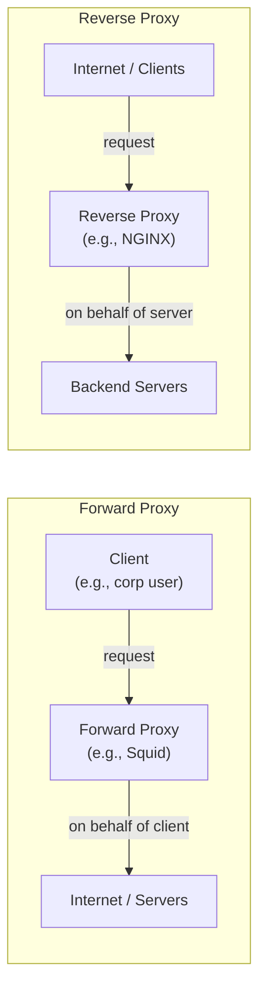
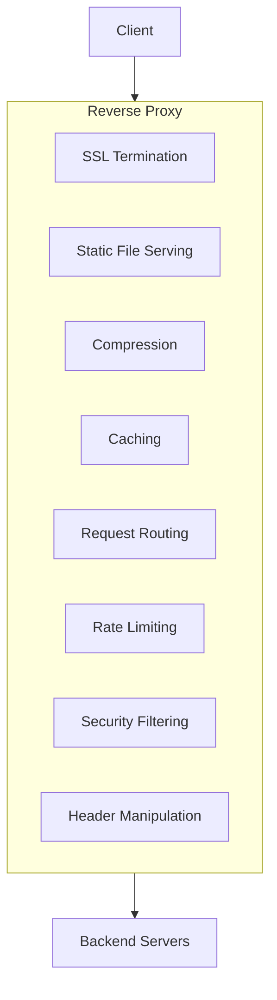
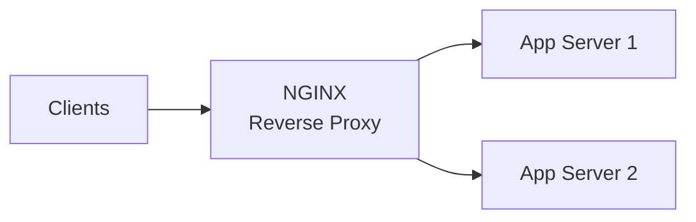
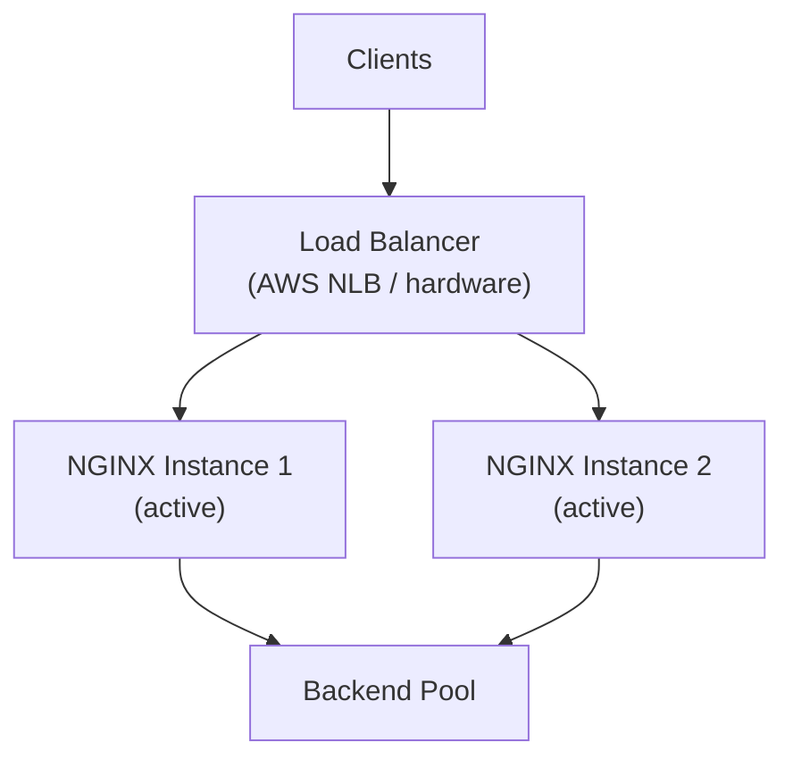
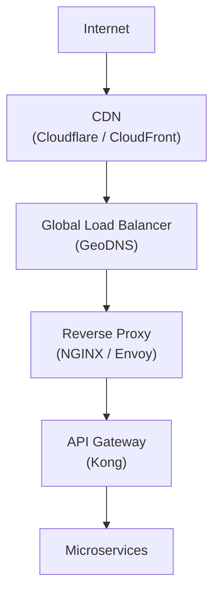

# Reverse Proxy

A reverse proxy is a server that sits **in front of backend servers** and intercepts requests on their behalf. From the client's perspective, they're talking to the proxy — the backend servers are completely hidden.

> **The name "reverse" is intentional:** A _forward_ proxy hides the client from servers (e.g., corporate proxies, VPNs). A _reverse_ proxy hides the servers from the client.

---

## Forward Proxy vs. Reverse Proxy

This distinction is fundamental and commonly tested in interviews:



|                   | Forward Proxy                              | Reverse Proxy                            |
| ----------------- | ------------------------------------------ | ---------------------------------------- |
| **Hides**         | The client                                 | The servers                              |
| **Configured by** | Client (browser/OS proxy settings)         | Server administrator                     |
| **Use cases**     | Corporate filtering, anonymity, geo-bypass | Load balancing, SSL termination, caching |
| **Examples**      | Squid, corporate proxies, VPN              | NGINX, HAProxy, Cloudflare               |

---

## What a Reverse Proxy Does

A reverse proxy can do one or many of these:



### 1. SSL/TLS Termination

The proxy decrypts HTTPS at the edge. Backend servers receive plain HTTP:

```
Client ──HTTPS──▶ Reverse Proxy ──HTTP──▶ Backend Server
```

**Benefits:**

- Offloads expensive TLS handshake and crypto from application servers
- Centralized certificate management (renew in one place)
- Backend servers can use faster HTTP/1.1 or HTTP/2 internally
- Private network between proxy and backends is often trusted (no need for inner TLS)

**Security note:** If inner HTTP traffic traverses untrusted networks (multi-cloud, co-located DCs), encrypt the internal leg too.

### 2. Static File Serving

Serve static files directly without hitting the application server:

```nginx
# NGINX config example
server {
    location /static/ {
        root /var/www/;
        expires 30d;        # Cache-Control: max-age=2592000
        gzip_static on;     # Serve pre-compressed .gz files
    }

    location /api/ {
        proxy_pass http://backend_pool;
    }
}
```

NGINX serves static files at ~50,000 req/s from disk. An application server processing the same request adds Python/Node overhead unnecessarily.

### 3. Compression

Compress responses before sending to clients, reducing bandwidth by 60–80%:

```
Backend → Reverse Proxy: raw 100KB JSON
Reverse Proxy → Client: gzip-compressed 15KB JSON
```

The backend doesn't need to implement compression — the proxy handles it transparently based on the `Accept-Encoding` request header.

### 4. Response Caching

Cache backend responses to serve repeated requests without hitting the application:

```nginx
# NGINX proxy cache example
proxy_cache_path /tmp/nginx_cache levels=1:2 keys_zone=api_cache:10m max_size=1g;

location /api/products {
    proxy_cache api_cache;
    proxy_cache_valid 200 60s;     # Cache 200 responses for 60 seconds
    proxy_cache_use_stale error timeout updating; # Serve stale on error
    proxy_pass http://backend_pool;
}
```

A 60-second cache on a popular product listing endpoint can cut backend load by 90%+ at peak traffic.

### 5. Security Shield

The reverse proxy is the first line of defense:

- **IP filtering:** Block known bad IPs, allowlist trusted ranges
- **Request size limits:** Reject abnormally large request bodies
- **Rate limiting:** Throttle connections per IP
- **DDoS mitigation:** Absorb and filter flood attacks
- **WAF integration:** Inspect HTTP payloads for injection attacks

```nginx
# Block requests exceeding 10MB body
client_max_body_size 10m;

# Rate limit: 10 req/s per IP, burst of 20
limit_req_zone $binary_remote_addr zone=api:10m rate=10r/s;
limit_req zone=api burst=20 nodelay;
```

---

## NGINX as a Reverse Proxy — The Industry Standard

NGINX is the most widely deployed reverse proxy, powering ~30% of the world's web servers.

### Basic Proxy Configuration

```nginx
upstream backend_pool {
    server backend1.internal:8080 weight=3;
    server backend2.internal:8080 weight=2;
    server backend3.internal:8080 weight=1;

    keepalive 32;    # Persistent connections to backends
}

server {
    listen 443 ssl;
    server_name api.example.com;

    ssl_certificate     /etc/ssl/api.crt;
    ssl_certificate_key /etc/ssl/api.key;
    ssl_protocols       TLSv1.2 TLSv1.3;

    location / {
        proxy_pass http://backend_pool;

        # Forward real client info
        proxy_set_header Host              $host;
        proxy_set_header X-Real-IP         $remote_addr;
        proxy_set_header X-Forwarded-For   $proxy_add_x_forwarded_for;
        proxy_set_header X-Forwarded-Proto $scheme;

        # Timeouts
        proxy_connect_timeout  5s;
        proxy_read_timeout     60s;
    }
}
```

**Key headers to always forward:**

- `X-Real-IP` / `X-Forwarded-For` — so backend sees client's real IP, not the proxy's
- `X-Forwarded-Proto` — so backend knows if the original request was HTTPS
- `Host` — so virtual hosting on the backend works correctly

---

## Reverse Proxy Architecture Patterns

### Single Reverse Proxy (Simple)



**Limitation:** The NGINX server is now a single point of failure.

### High-Availability Reverse Proxy



Both NGINX instances share the same configuration (synced via config management tools like Ansible, Puppet). The load balancer distributes to healthy NGINX instances.

### Layered Architecture

Modern production systems often have multiple layers:



Each layer has a specific responsibility. This looks complex but every component is independently scalable and replaceable.

---

## Reverse Proxy vs. API Gateway

A frequent interview confusion:

| Feature                 | Reverse Proxy                          | API Gateway                            |
| ----------------------- | -------------------------------------- | -------------------------------------- |
| **Core job**            | Forward requests, terminate SSL, cache | Manage API policies (auth, rate limit) |
| **Authentication**      | Passthrough or basic                   | Deep JWT / API key validation          |
| **Request aggregation** | ❌                                     | ✅                                     |
| **Developer portal**    | ❌                                     | ✅ (Apigee, APIM)                      |
| **Granularity**         | Per-server                             | Per-route, per-consumer                |
| **Complexity**          | Lower                                  | Higher                                 |
| **Examples**            | NGINX, HAProxy, Traefik                | Kong, AWS API Gateway, Apigee          |

> **In practice:** NGINX is often configured to do many things an API Gateway does. The distinction is organizational as much as technical. For microservices at scale, a dedicated API Gateway (Kong, etc.) provides better tooling.

---

## Real-World Reverse Proxies

| Tool           | Strengths                                        | Common Use                         |
| -------------- | ------------------------------------------------ | ---------------------------------- |
| **NGINX**      | Performance, flexibility, ubiquity               | Most common web server/proxy combo |
| **HAProxy**    | Best-in-class TCP/HTTP load balancing, stats     | High-performance backend routing   |
| **Traefik**    | Auto-discover services via Docker/K8s labels     | Cloud-native, microservices        |
| **Caddy**      | Automatic HTTPS via Let's Encrypt, simple config | Developer-friendly deployments     |
| **Envoy**      | Observability, xDS dynamic config, service mesh  | Kubernetes / Istio-based systems   |
| **Cloudflare** | Global CDN + reverse proxy + DDoS                | Public-facing, managed             |

---

## Interview Talking Points

### What the interviewer wants to hear

**1. What it is and why it's there**

> "A reverse proxy sits in front of our backend servers. Clients never know the real server IPs. It handles SSL termination, compression, and is our first security layer."

**2. Concrete benefits**

> "SSL termination at the proxy offloads TLS crypto from app servers. We've seen 15–20% CPU headroom freed on application servers by moving this."

**3. The header forwarding gotcha**

> "Without `X-Forwarded-For`, all backend traffic appears to come from the proxy's IP. We always forward real client IP so rate limiting and analytics work correctly."

**4. HA setup**

> "We run two NGINX instances with shared config. Our NLB health-checks them every 5 seconds. If one fails, all traffic routes to the healthy instance in under 10 seconds."

---

## Key Takeaways

- A reverse proxy **hides servers from clients** (opposite of forward proxy)
- Core capabilities: **SSL termination, static serving, compression, caching, security, routing**
- Always forward **`X-Real-IP` and `X-Forwarded-For`** — otherwise backends lose client identity
- **NGINX** is the industry default; **Envoy** is the modern service-mesh standard; **Traefik** excels in container environments
- Reverse proxies need **their own HA setup** — they're a single point of failure if not clustered
- In large systems, a reverse proxy is **one layer** in a deeper stack (CDN → LB → Proxy → Gateway → Services)
