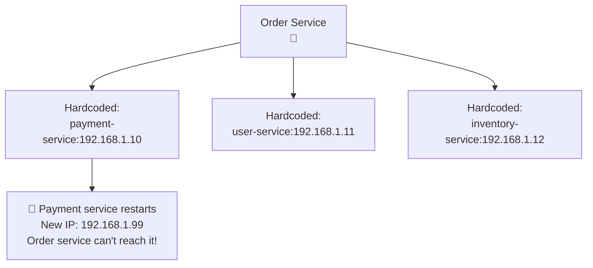
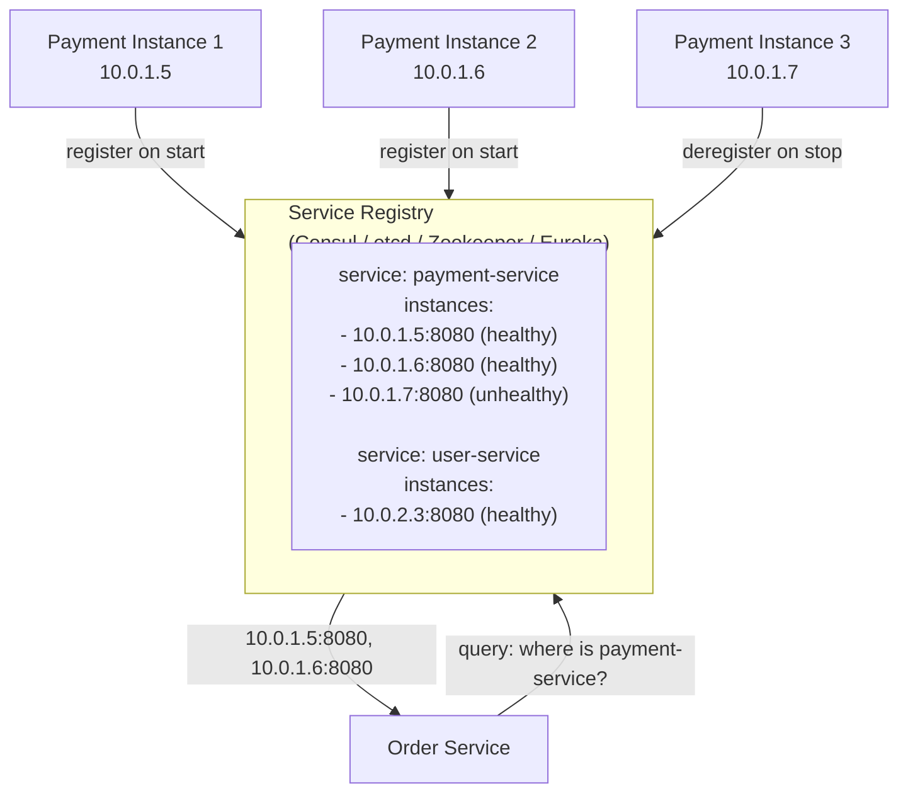
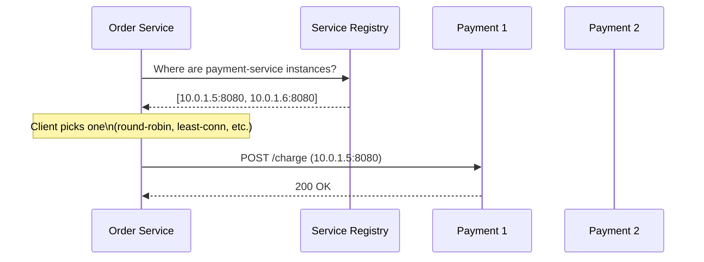
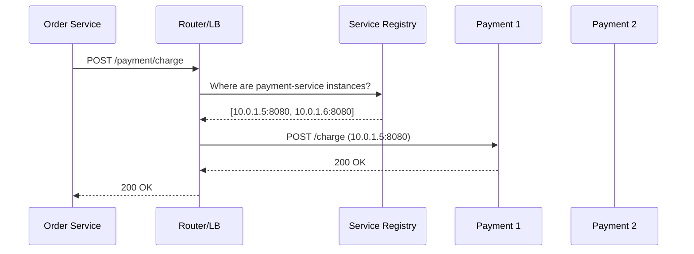
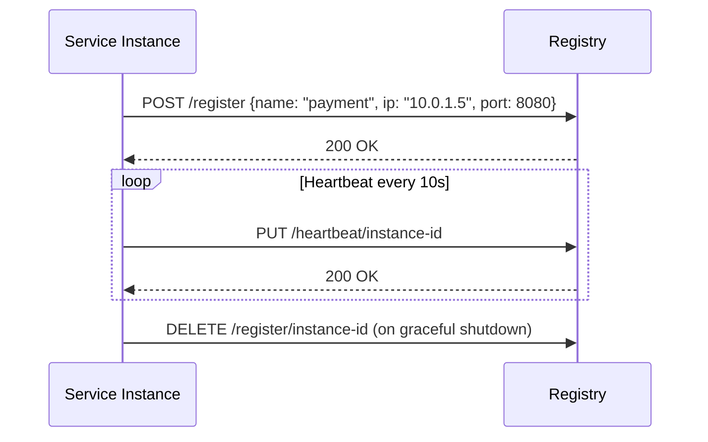
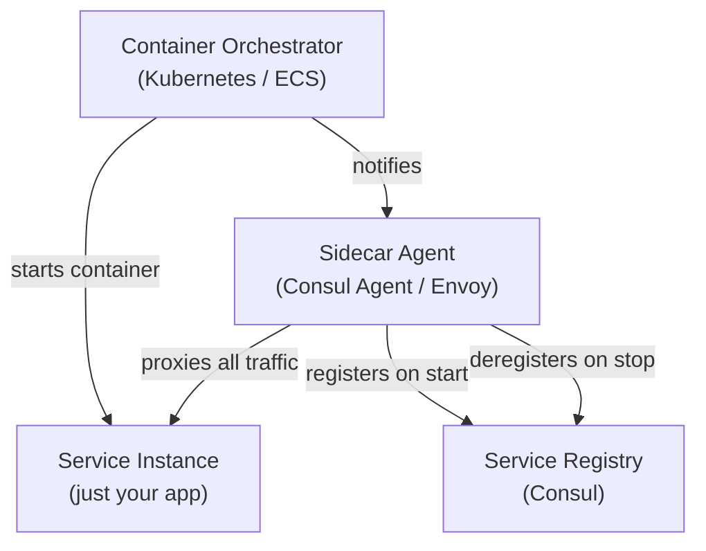
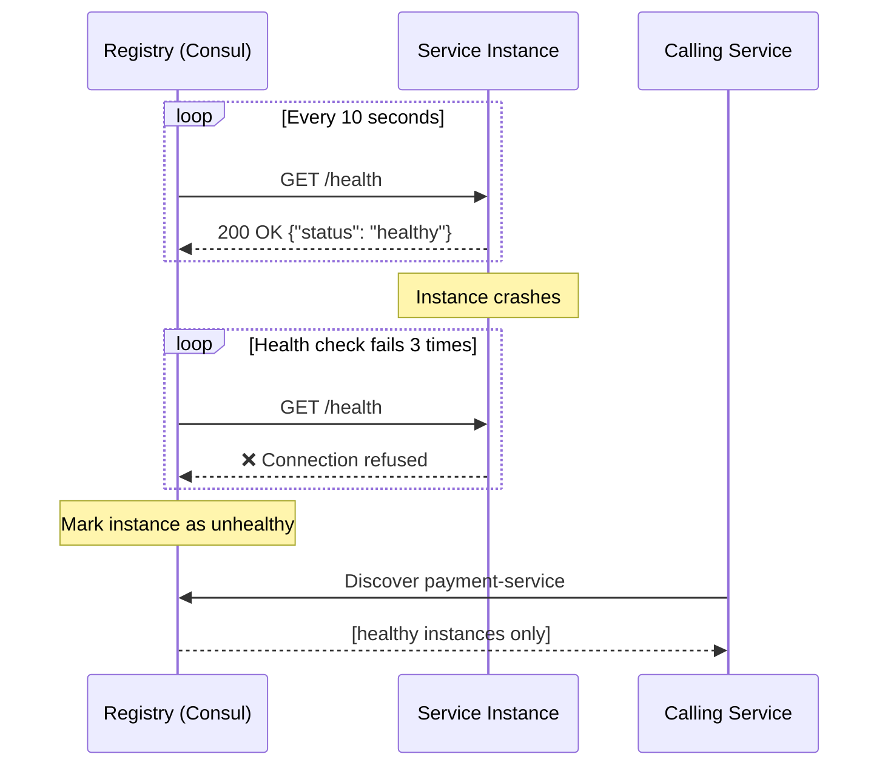
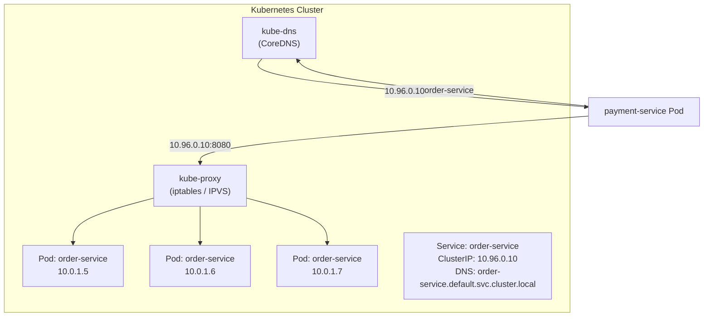
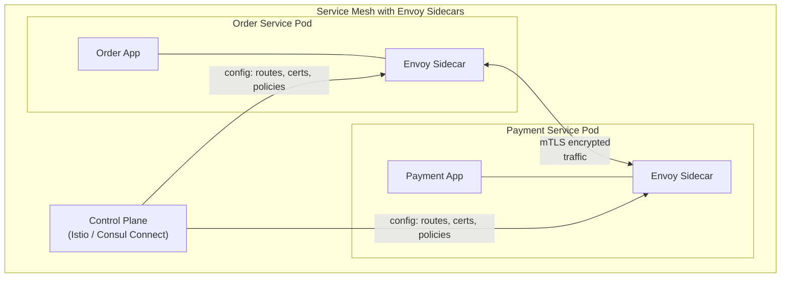

# Service Discovery

In a microservices system, services need to find each other to communicate. Service discovery is the mechanism that answers the question: **"Where is the Order Service running right now?"**

In static infrastructure, you hardcode IPs. In dynamic cloud environments, container orchestrators (Kubernetes, ECS) start, stop, and reschedule services constantly — IPs change. Service discovery solves this automatically.

> **The core problem:** In a system with 50+ microservices each running 3–20 instances that can scale up/down at any time, it's impossible to manage connectivity manually. Service discovery does it automatically.

---

## The Problem Without Service Discovery



In dynamic environments (containers, auto-scaling), hardcoded IPs break constantly.

---

## The Service Registry

The foundation of service discovery is a **service registry** — a database of service instances and their network locations:



Every service instance registers itself when it starts and deregisters when it stops. The registry maintains the current view of the fleet.

---

## Client-Side vs. Server-Side Discovery

There are two fundamental patterns for how services use the registry:

### Client-Side Discovery

The calling service queries the registry itself and chooses an instance:



**Pros:**

- Client has full control over load balancing algorithm
- One fewer network hop (no intermediate router)
- Client can implement smart routing (prefer same AZ, etc.)

**Cons:**

- Every service client must implement discovery and load balancing logic
- Must maintain discovery client in every language/framework
- If discovery logic has a bug, all services are affected

**Examples:** Netflix Ribbon (with Eureka), early microservices patterns

### Server-Side Discovery

A router/proxy queries the registry and routes requests:



**Pros:**

- Services are completely decoupled from discovery logic
- Works with any language/framework — no client library needed
- Centralized load balancing configuration

**Cons:**

- Router is another component to deploy and make HA
- Extra network hop adds latency (~1ms typical)

**Examples:** AWS ALB + ECS, Kubernetes Services, Envoy + Consul

### Side-by-Side Comparison

|                       | Client-Side                    | Server-Side                         |
| --------------------- | ------------------------------ | ----------------------------------- |
| **Discovery logic**   | In each service                | In router/infrastructure            |
| **Load balancing**    | In each service                | In router                           |
| **Language coupling** | Requires client library        | None                                |
| **Network hops**      | Fewer                          | More                                |
| **Complexity**        | Distributed (harder to change) | Centralized (easier to change)      |
| **Who uses it**       | Netflix OSS, Spring Cloud      | Kubernetes, AWS ECS, Consul Connect |

---

## Registration Patterns

How do services get registered in the registry?

### Self-Registration

Each service registers and deregisters itself:



**Pros:** Service knows its own capabilities and health best  
**Cons:** Tightly couples service to registry. Every service needs the registry client library.

### Third-Party Registration (Sidecar)

An external agent (sidecar or orchestrator) handles registration on behalf of the service:



**Pros:** Service is completely unaware of discovery infrastructure. Language-agnostic.  
**Cons:** More moving parts. Sidecar adds resource overhead per instance.

This is the pattern Kubernetes uses — the kubelet registers/deregisters pods automatically.

---

## Health Checking in Service Discovery

The registry must know which instances are healthy to avoid routing to dead ones:



**Common health check types:**

| Type       | How it works                              | Use case          |
| ---------- | ----------------------------------------- | ----------------- |
| **HTTP**   | Probe `/health` endpoint → expect 200     | Web services      |
| **TCP**    | Open TCP connection → success if accepted | Non-HTTP services |
| **gRPC**   | Use gRPC Health Checking Protocol         | gRPC services     |
| **Script** | Run a custom script → check exit code     | Complex checks    |
| **TTL**    | Service must heartbeat within N seconds   | Manual control    |

---

## Service Discovery in Kubernetes

Kubernetes has built-in service discovery via the `Service` resource — the most widely used implementation today:



**How it works:**

1. You create a `Service` YAML pointing to pods via label selectors
2. Kubernetes assigns a stable `ClusterIP` and DNS name
3. CoreDNS resolves `order-service` → ClusterIP automatically
4. `kube-proxy` load-balances to healthy pod IPs via iptables/IPVS rules
5. When pods are added/removed, endpoints are updated automatically

**DNS names in Kubernetes:**

```
order-service                                    (same namespace)
order-service.default                            (cross-namespace short)
order-service.default.svc.cluster.local          (fully qualified)
```

---

## Real-World Service Registries

| Tool                   | Type                                | Key Strength                                   |
| ---------------------- | ----------------------------------- | ---------------------------------------------- |
| **Consul** (HashiCorp) | Dedicated SD + KV + health checking | Rich health checking, service mesh via Connect |
| **etcd**               | Distributed KV store                | Foundation of Kubernetes, strong consistency   |
| **Zookeeper**          | Distributed coordination            | Battle-tested, strong CP guarantees            |
| **Eureka** (Netflix)   | HTTP service registry               | Java/Spring ecosystem, Netflix OSS             |
| **Kubernetes DNS**     | Built-in cluster DNS                | Zero extra setup in K8s environments           |
| **AWS Cloud Map**      | Managed, AWS-native                 | ECS/EKS integration, Route53 backing           |

---

## Service Mesh — The Evolution

Service discovery at scale evolves into a **service mesh** — a dedicated infrastructure layer for all service-to-service communication:



The sidecar proxy (Envoy) handles:

- Service discovery (automatically)
- Load balancing (automatically)
- mTLS (encrypted, authenticated service-to-service)
- Circuit breaking
- Observability (distributed tracing)

The application doesn't know any of this is happening.

**Popular service meshes:** Istio, Linkerd, Consul Connect, AWS App Mesh

---

## Interview Talking Points

### What the interviewer wants to hear

**1. Why service discovery is needed**

> "In a microservices system on Kubernetes, pod IPs change every time a pod restarts. We can't hardcode IPs. Service discovery gives services a stable name to call, with automatic registration and health checking."

**2. Client-side vs. server-side tradeoff**

> "Client-side discovery is more efficient (fewer hops) but requires every service to implement discovery logic. Server-side discovery centralizes it in a router — works with any language. In Kubernetes, server-side via kube-proxy is the default."

**3. Health checking**

> "The registry only serves healthy instances. Each service exposes a `/health` endpoint. The registry (or sidecar) probes it every 10 seconds and removes instances that fail 3 consecutive checks."

**4. Kubernetes specifics**

> "In Kubernetes, a `Service` resource creates a stable DNS name and ClusterIP. CoreDNS resolves the name, kube-proxy load-balances to pod IPs. I don't need a separate registry — it's built in."

---

## Key Takeaways

- Service discovery solves **dynamic service location** — essential when IPs change constantly in cloud/container environments
- The **service registry** is the source of truth: instances register on start, deregister on stop, heartbeat to prove liveness
- **Client-side discovery** is more efficient; **server-side discovery** is more language-agnostic
- **Health checking** is non-negotiable — registries must know which instances are healthy
- **Kubernetes built-in DNS** replaces the need for a separate registry in K8s environments
- **Service meshes** (Istio, Linkerd) extend service discovery with mTLS, observability, and circuit breaking via sidecars
