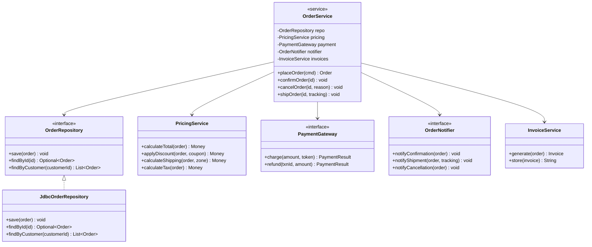

# God Object

> "A God Object is a class that knows too much or does too much."
> — William J. Brown et al., *AntiPatterns* (1998)

A God Object is the most common and most damaging structural anti-pattern in object-oriented software. It is a class that has accumulated so many responsibilities that it has become the gravitational centre of the codebase — everything depends on it, and it depends on everything. Modifying it is risky. Testing it is hard. Understanding it requires understanding the entire system.

The God Object is not born malicious. It grows incrementally. A new requirement appears, someone opens the existing service class and adds a method. Six months and 40 requirements later, you have a 2,000-line class with 60 methods that no single developer fully understands.

> **Interview relevance:** God Objects appear in almost every "improve this design" interview prompt. The ability to diagnose one, explain *why* it is harmful, and propose a coherent refactoring is a core senior-level skill.

---

## Anatomy of a God Object

God Objects exhibit a recognisable cluster of symptoms:

| Symptom | What it looks like |
|---|---|
| **Size** | 500+ lines, 20+ methods, 15+ fields |
| **Name vagueness** | `OrderManager`, `SystemController`, `AppService`, `Helper` |
| **Mixed concerns** | Business logic, persistence, HTTP, formatting, logging all in one class |
| **Many dependencies** | Constructor takes 8+ parameters; imports from every layer |
| **God-level field count** | The class holds references to every service in the application |
| **Constant merge conflicts** | Every feature branch touches the same file |
| **Untestable** | 500-line test setups; tests that mock 10 collaborators |

---

## The Classic God Object: OrderManager

```java
// BAD — a 2,000-line class that owns everything
public class OrderManager {
    // Infrastructure dependencies
    private final DataSource           dataSource;
    private final JavaMailSender       mailSender;
    private final SmsGateway           smsGateway;
    private final RedisTemplate<String, Object> cache;
    private final StripeClient         stripeClient;
    private final SlackClient          slackClient;
    private final S3Client             s3Client;

    // Configuration
    private final double taxRate;
    private final String smtpFrom;
    private final int    maxRetries;

    // Business collaborators
    private final InventoryService     inventoryService;
    private final UserService          userService;
    private final ProductService       productService;
    private final ShippingService      shippingService;

    public OrderManager(/* 14 parameters */) { ... }

    // --- Business logic ---
    public Order createOrder(CreateOrderRequest req) { ... }
    public void confirmOrder(String orderId) { ... }
    public void cancelOrder(String orderId) { ... }
    public void shipOrder(String orderId, String trackingCode) { ... }
    public void returnOrder(String orderId) { ... }

    // --- Pricing logic (should be in PricingService) ---
    public Money calculateTax(Order order) { ... }
    public Money applyDiscount(Order order, String couponCode) { ... }
    public Money calculateShipping(Order order, Address address) { ... }

    // --- Persistence (should be in OrderRepository) ---
    public void saveOrder(Order order) { ... }
    public Order findOrderById(String id) { ... }
    public List<Order> findOrdersByCustomer(String customerId) { ... }
    public void archiveOldOrders(LocalDate cutoff) { ... }

    // --- Notification (should be in NotificationService) ---
    public void sendOrderConfirmationEmail(Order order) { ... }
    public void sendShippingUpdateSms(Order order) { ... }
    public void postToSlack(String message) { ... }

    // --- Invoice generation (should be in InvoiceService) ---
    public byte[] generateInvoicePdf(Order order) { ... }
    public void uploadInvoiceToS3(Order order) { ... }

    // --- Report generation (should be in ReportService) ---
    public List<OrderSummary> generateDailyReport(LocalDate date) { ... }
    public List<OrderSummary> generateMonthlyReport(YearMonth month) { ... }

    // ... and 30 more methods
}
```

This class has at least **six separate reasons to change**:
- Pricing rules change (tax, discounts, shipping)
- Persistence strategy changes (SQL to NoSQL)
- Notification channels change (email provider, SMS gateway)
- Invoice format changes
- Report format changes
- Business lifecycle rules change (confirm, cancel, ship, return)

SRP is violated six times over in a single class.

---

## Why God Objects Form

Understanding the root causes helps prevent recurrence:

| Cause | Mechanism |
|---|---|
| **Naive convenience** | "This service already exists, I'll add my method here" |
| **Temporal coupling** | Code was written together, so it was grouped together |
| **Fear of creating new files** | Perceived overhead of adding a new class or interface |
| **Poorly defined domain boundaries** | No one modelled which class owns what responsibility |
| **Incremental growth** | Every feature adds 10 lines; nobody refactors |
| **Missing abstraction vocabulary** | Without patterns (Repository, Strategy, Service), code has nowhere to go |

---

## Diagnosing the God Object

Before refactoring, map the responsibilities. List every method and label it with a responsibility category:

```
OrderManager methods:
  createOrder()           -> [Order Lifecycle]
  confirmOrder()          -> [Order Lifecycle]
  cancelOrder()           -> [Order Lifecycle]
  shipOrder()             -> [Order Lifecycle]
  calculateTax()          -> [Pricing]
  applyDiscount()         -> [Pricing]
  calculateShipping()     -> [Pricing]
  saveOrder()             -> [Persistence]
  findOrderById()         -> [Persistence]
  findOrdersByCustomer()  -> [Persistence]
  sendConfirmationEmail() -> [Notification]
  sendShippingUpdateSms() -> [Notification]
  generateInvoicePdf()    -> [Invoice]
  uploadInvoiceToS3()     -> [Invoice]
  generateDailyReport()   -> [Reporting]
```

The categories are the future classes. Each category becomes one focused class with one reason to change.

---

## The Refactored Design



```java
// Each class has one reason to change

// Persistence — owned by IT/DBA team
public interface OrderRepository {
    void save(Order order);
    Optional<Order> findById(String orderId);
    List<Order> findByCustomer(String customerId);
}

// Pricing rules — owned by business/finance team
public class PricingService {
    private static final double GST_RATE = 0.18;

    public Money calculateTotal(Order order) {
        Money subtotal = order.lines().stream()
                              .map(OrderLine::lineTotal)
                              .reduce(Money.ZERO, Money::add);
        return applyGst(subtotal);
    }

    public Money applyDiscount(Order order, Coupon coupon) {
        return coupon.apply(calculateTotal(order));
    }

    private Money applyGst(Money amount) {
        return amount.multiply(1.0 + GST_RATE);
    }
}

// Notifications — owned by platform/comms team
public interface OrderNotifier {
    void notifyConfirmation(Order order);
    void notifyShipment(Order order, TrackingCode tracking);
    void notifyCancellation(Order order, String reason);
}

// Invoice generation — owned by finance team
public class InvoiceService {
    private final PdfGenerator    pdfGenerator;
    private final InvoiceStorage  storage;

    public Invoice generate(Order order) {
        byte[] pdf = pdfGenerator.render(order);
        String url = storage.store(order.getId(), pdf);
        return new Invoice(order.getId(), url, LocalDateTime.now());
    }
}

// Orchestrator — thin; delegates all work to collaborators
public class OrderService {
    private final OrderRepository orderRepo;
    private final PricingService  pricing;
    private final PaymentGateway  payment;
    private final OrderNotifier   notifier;
    private final InvoiceService  invoices;

    public OrderService(OrderRepository orderRepo,
                        PricingService pricing,
                        PaymentGateway payment,
                        OrderNotifier notifier,
                        InvoiceService invoices) {
        this.orderRepo = orderRepo;
        this.pricing   = pricing;
        this.payment   = payment;
        this.notifier  = notifier;
        this.invoices  = invoices;
    }

    public Order placeOrder(PlaceOrderCommand cmd) {
        Order order = Order.create(cmd.customerId(), cmd.lines(), cmd.shippingAddress());
        Money total = pricing.calculateTotal(order);

        PaymentResult result = payment.charge(total, cmd.paymentToken());
        if (!result.isSuccess())
            throw new PaymentDeclinedException(result.reason());

        order.confirm();
        orderRepo.save(order);
        invoices.generate(order);
        notifier.notifyConfirmation(order);
        return order;
    }

    public void shipOrder(String orderId, TrackingCode tracking) {
        Order order = orderRepo.findById(orderId)
                               .orElseThrow(() -> new OrderNotFoundException(orderId));
        order.ship(tracking);
        orderRepo.save(order);
        notifier.notifyShipment(order, tracking);
    }

    public void cancelOrder(String orderId, String reason) {
        Order order = orderRepo.findById(orderId)
                               .orElseThrow(() -> new OrderNotFoundException(orderId));
        order.cancel(reason);
        if (order.wasCharged()) {
            payment.refund(order.getTransactionId(), order.getChargedAmount());
        }
        orderRepo.save(order);
        notifier.notifyCancellation(order, reason);
    }
}
```

`OrderService` is now an **orchestrator** — it coordinates work without owning the implementation of any part. Changing the email provider touches only `SmtpOrderNotifier`. Changing tax rules touches only `PricingService`. Zero cross-contamination.

---

## The Refactoring Sequence

Don't rewrite the God Object in one shot. Strangle it incrementally:

1. **Identify responsibility clusters** — categorise every method by the stakeholder who owns it
2. **Extract the lowest-coupling concern first** — notifications are usually the easiest; they have few internal dependencies
3. **Write tests before extracting** — characterisation tests capture the current (possibly wrong) behaviour
4. **Extract one class at a time** — delegate from the God Object initially; cut the link once the new class is stable
5. **Move fields with the methods that use them** — if only the notification methods use `mailSender`, move it to `OrderNotifier`
6. **Remove the God Object last** — once all responsibilities have moved out, the original class is either gone or is just a thin orchestrator

---

## God Object vs Facade

A Facade is sometimes confused with a God Object. They are different:

| | God Object | Facade |
|---|---|---|
| **Contains logic** | Yes — implements behaviour directly | No — delegates entirely |
| **Has many fields** | Yes — owns all data and collaborators | Minimal — just references to subsystem components |
| **Purpose** | Grew accidentally | Designed intentionally as a simplified entry point |
| **Testability** | Hard — too many responsibilities | Fine — the subsystem is tested independently |
| **SRP** | Violated | Preserved (Facade itself has one responsibility: simplify the interface) |

A Facade that starts implementing logic is on the path to becoming a God Object.

---

## Interview Talking Points

**1. How do you identify a God Object in a codebase you've just joined?**
> "I look for three signals: a class with a vague name like `Manager` or `Service` that clocks in at 500+ lines; a constructor that takes 8+ parameters or a class with 10+ fields; and merge conflict history — if one file appears in every PR, it's the gravity well. I then do a quick responsibility audit: I list every method and assign it to a stakeholder category. If I get more than two distinct categories, I have a God Object."

**2. How do you refactor a God Object safely?**
> "I strangle it incrementally, never in one big bang. I start by writing characterisation tests — tests that capture what the class currently does, even if it's wrong — to lock in a safety net. Then I extract the lowest-coupling responsibility first, usually notification or formatting code, because it touches the fewest other things. I delegate from the God Object initially, then cut the link once the extracted class is stable and well-tested. I never try to redesign the whole thing in one sitting — that's how you introduce regressions while trying to clean up."

**3. What's the difference between a God Object and an Orchestrator service?**
> "An orchestrator service like `OrderService` is thin — it coordinates calls to collaborators but contains no business logic itself. The pricing logic is in `PricingService`, the persistence is in `OrderRepository`, the notifications are in `OrderNotifier`. The orchestrator wires them together for a use case. A God Object both orchestrates AND implements — it holds the pricing logic, the persistence logic, and the notification logic all inside itself. The test is: can I test each piece of logic independently, in isolation? If yes, it's an orchestrator. If no, it's a God Object."

---

## Key Takeaways

- A God Object is a class with **multiple reasons to change** — multiple stakeholders whose requirements can force modification
- **Symptoms**: vague name, 500+ lines, 20+ methods, many dependencies, constant merge conflicts, untestable
- God Objects grow **incrementally** — every feature adds 10 lines; refactor continuously, not reactively
- **Diagnose** by categorising methods into responsibility clusters — each cluster becomes a new class
- **Refactor incrementally**: extract one concern at a time, preserve current behaviour with characterisation tests
- The goal: a thin **orchestrator** that delegates everything, surrounded by focused classes each with one reason to change
- The Facade pattern is intentional simplification; the God Object is accidental accumulation — don't confuse them