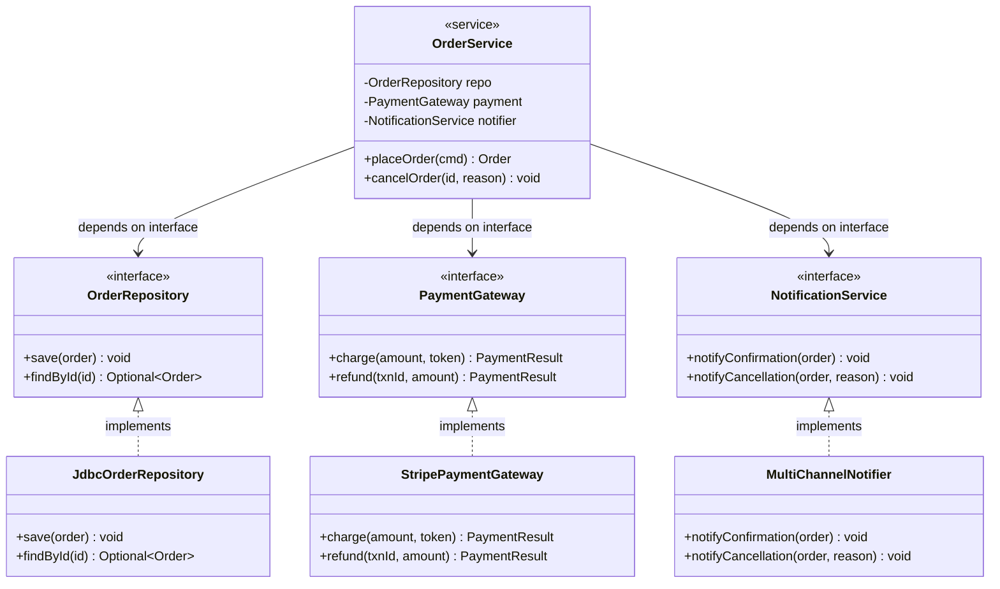

# Tight Coupling

> "The goal of coupling is not to eliminate it — it is to make it intentional, visible, and in the right direction."

Every class depends on something. Coupling is unavoidable. The problem is **unintentional, hidden, or misdirected coupling** — when a class depends on the concrete implementation, internal details, or construction of another class. This kind of coupling means that a change in one class forces a change in many others, making the system brittle and difficult to evolve.

Tight coupling is the mechanism by which many other anti-patterns — God Object, Spaghetti Code, Shotgun Surgery — propagate their damage. It is the structural glue that turns local changes into system-wide breakage.

> **Interview relevance:** Tight coupling is what interviewers probe when they ask "how would you make this testable?" or "how would you swap the database?". DIP, the Repository pattern, and the Strategy pattern are all coupling-management tools.

---

## The Coupling Spectrum

Not all coupling is equal. Understanding the spectrum helps you make deliberate choices:

| Coupling type | Example | Replaceability |
|---|---|---|
| **Content coupling** | Class A directly modifies a field of Class B | Impossible without changing A |
| **Common coupling** | Classes share a mutable global variable | Unpredictable — anyone can change it |
| **Control coupling** | A passes a flag to B to control B's behaviour | B's internals leak into A |
| **Stamp coupling** | A passes a whole object to B when B only needs one field | Unnecessary dependency on object structure |
| **Data coupling** | A passes only the data B actually needs | Fine — minimal necessary coupling |
| **Message coupling** | A calls B only through an interface/message | Best — B can be replaced freely |

The goal is to push coupling toward the bottom of this list.

---

## The Classic Violation: Hardwired Dependencies

The most common form of tight coupling: instantiating concrete classes inside other classes.

```java
// BAD — OrderService is tightly coupled to four concrete implementations
public class OrderService {

    // Coupled to MySQL — changing database requires changing OrderService
    private final MySqlOrderRepository orderRepository = new MySqlOrderRepository(
        "jdbc:mysql://localhost/shop", "root", "pass"
    );

    // Coupled to Stripe — changing payment provider requires changing OrderService
    private final StripePaymentGateway paymentGateway = new StripePaymentGateway(
        "sk_live_hardcoded_key"
    );

    // Coupled to Gmail SMTP — changing email provider requires changing OrderService
    private final GmailNotificationService notifier = new GmailNotificationService(
        "smtp.gmail.com", 587, "orders@shop.com"
    );

    // Coupled to a specific logger — cannot swap to structured logging
    private final FileLogger logger = new FileLogger("/var/log/orders.log");

    public Order placeOrder(PlaceOrderCommand cmd) {
        // business logic
    }
}
```

**The consequences:**
- To test `placeOrder()`, you need a real MySQL database, a real Stripe account, and real SMTP — or the test crashes
- To swap MySQL for PostgreSQL, you open `OrderService` — a class that should know nothing about persistence technology
- To swap Stripe for PayPal, you open `OrderService` — which should know nothing about payment providers
- Every infrastructure decision bleeds into business logic

---

## Coupling Through Construction: The `new` Keyword

Every `new ConcreteClass()` inside a class that's not a factory is a coupling point. Martin calls this the **new is glue** rule.

```java
// Every new is a hardwired dependency
public class ReportService {
    public byte[] generateMonthlyReport(YearMonth month) {
        // Coupled to JDBC — cannot test without a database
        JdbcReportRepository repo = new JdbcReportRepository();

        // Coupled to specific PDF library — cannot swap
        ITextPdfRenderer renderer = new ITextPdfRenderer();

        // Coupled to S3 — cannot test without AWS credentials
        S3ReportStorage storage = new S3ReportStorage("us-east-1", "my-bucket");

        List<ReportRow> rows = repo.fetchForMonth(month);
        byte[] pdf = renderer.render(rows);
        storage.store(month.toString(), pdf);
        return pdf;
    }
}
```

Testing this method requires a test database, a working PDF renderer, and AWS credentials. None of these are what you're testing — you're testing the orchestration logic. The `new` keywords have made that impossible without full infrastructure.

---

## The Fix: Depend on Abstractions, Inject Concretions

Apply DIP: define interfaces in the domain, inject implementations from outside.



```java
// Interfaces defined in the domain — owned by business logic
public interface OrderRepository {
    void save(Order order);
    Optional<Order> findById(String orderId);
}

public interface PaymentGateway {
    PaymentResult charge(Money amount, String paymentToken);
    PaymentResult refund(String transactionId, Money amount);
}

public interface NotificationService {
    void notifyConfirmation(Order order);
    void notifyCancellation(Order order, String reason);
}

// OrderService depends on abstractions ONLY
public class OrderService {
    private final OrderRepository    orderRepo;
    private final PaymentGateway     payment;
    private final NotificationService notifier;

    // Dependencies are DECLARED, not created
    public OrderService(OrderRepository orderRepo,
                        PaymentGateway payment,
                        NotificationService notifier) {
        this.orderRepo = Objects.requireNonNull(orderRepo);
        this.payment   = Objects.requireNonNull(payment);
        this.notifier  = Objects.requireNonNull(notifier);
    }

    public Order placeOrder(PlaceOrderCommand cmd) {
        Order order = buildOrder(cmd);
        PaymentResult result = payment.charge(order.total(), cmd.paymentToken());
        if (!result.isSuccess()) throw new PaymentDeclinedException(result.reason());
        orderRepo.save(order);
        notifier.notifyConfirmation(order);
        return order;
    }

    public void cancelOrder(String orderId, String reason) {
        Order order = orderRepo.findById(orderId)
                               .orElseThrow(() -> new OrderNotFoundException(orderId));
        order.cancel(reason);
        if (order.wasCharged())
            payment.refund(order.transactionId(), order.chargedAmount());
        orderRepo.save(order);
        notifier.notifyCancellation(order, reason);
    }

    private Order buildOrder(PlaceOrderCommand cmd) {
        return Order.create(cmd.customerId(), cmd.lines(), cmd.shippingAddress());
    }
}
```

Now:
- Swapping MySQL for PostgreSQL: replace `JdbcOrderRepository` with `PostgresOrderRepository`. `OrderService` never changes.
- Swapping Stripe for PayPal: replace `StripePaymentGateway` with `PayPalPaymentGateway`. `OrderService` never changes.
- Testing `placeOrder()`: inject `InMemoryOrderRepository`, `FakePaymentGateway`, `CapturingNotificationService`. Three lines of setup.

---

## Coupling Through Law of Demeter Violation

**Law of Demeter (LoD)** / "Don't Talk to Strangers": an object should only call methods on its immediate collaborators — not on objects returned by those collaborators.

```java
// BAD — chain of getters: coupled to the internal structure of three objects
public void processOrder(Order order) {
    String city = order.getShippingAddress().getCity();              // OK — own field
    double taxRate = order.getShippingAddress().getRegion().getTaxRate(); // violates LoD
    String currencyCode = order.getCustomer().getPreferences().getCurrency().getCode(); // deeply coupled
}
```

If `Region` gains a `TaxRegion` wrapper, or `Preferences` changes its currency model, `processOrder` breaks — even though it has nothing to do with those internal structures.

```java
// GOOD — tell the object to compute what you need; don't reach into its internals
public void processOrder(Order order) {
    double taxRate    = order.applicableTaxRate();   // Order knows its address/region
    String currency   = order.preferredCurrency();   // Order knows its customer preferences
}

// Address knows how to compute its tax rate
public class Order {
    public double applicableTaxRate() {
        return shippingAddress.regionTaxRate();
    }
    public String preferredCurrency() {
        return customer.preferredCurrencyCode();
    }
}
```

Each class exposes what its collaborators need — not its internal structure. The coupling stays shallow.

---

## Temporal Coupling: The Silent Villain

Temporal coupling occurs when methods must be called in a specific order, but the API doesn't enforce it.

```java
// BAD — calling methods in wrong order causes NullPointerException or IllegalStateException
public class ReportBuilder {
    private DataSource source;
    private ReportFormat format;
    private List<Filter> filters;

    // Must call these in order: setSource → setFormat → addFilters → build
    // Nothing in the API enforces this
    public void setSource(DataSource source) { this.source = source; }
    public void setFormat(ReportFormat format) { this.format = format; }
    public void addFilter(Filter filter) { filters.add(filter); }

    public Report build() {
        // Crashes if source or format is null
        return new Report(source.load(filters), format);
    }
}

// Client must know the required order — temporal coupling
ReportBuilder builder = new ReportBuilder();
builder.setFormat(ReportFormat.PDF); // OK
// Forgot setSource — NullPointerException at runtime
Report report = builder.build();
```

```java
// GOOD — Builder pattern enforces required parameters at construction time
public class ReportBuilder {
    private final DataSource   source;   // required — set at construction
    private final ReportFormat format;   // required — set at construction
    private final List<Filter> filters = new ArrayList<>();

    // Required dependencies declared upfront — cannot build without them
    public ReportBuilder(DataSource source, ReportFormat format) {
        this.source = Objects.requireNonNull(source, "DataSource is required");
        this.format = Objects.requireNonNull(format, "ReportFormat is required");
    }

    public ReportBuilder addFilter(Filter filter) {
        this.filters.add(filter);
        return this;  // fluent for optional additions
    }

    public Report build() {
        return new Report(source.load(filters), format);
    }
}

// Correct usage is enforced by the compiler
Report report = new ReportBuilder(dataSource, ReportFormat.PDF)
    .addFilter(new DateRangeFilter(from, to))
    .addFilter(new StatusFilter(OrderStatus.CONFIRMED))
    .build();
```

Required dependencies at construction time; optional behaviour through method chaining. The compiler enforces the contract.

---

## Control Coupling: The Flag Anti-Pattern

Passing a boolean flag to control what a method does internally is a form of coupling — the caller knows about the callee's internal branching.

```java
// BAD — caller controls internal behaviour with a flag
public void sendNotification(Order order, boolean urgent) {
    if (urgent) {
        smsSender.send(order.getCustomerPhone(), "URGENT: " + buildMessage(order));
        emailSender.send(order.getCustomerEmail(), "URGENT: " + buildMessage(order));
    } else {
        emailSender.send(order.getCustomerEmail(), buildMessage(order));
    }
}

// Caller must know about the internal branching:
notificationService.sendNotification(order, true);   // what does true mean?
```

```java
// GOOD — separate methods with distinct names and behaviours
public interface OrderNotifier {
    void notifyConfirmation(Order order);
    void notifyUrgentAlert(Order order);
}

public class OrderNotificationService implements OrderNotifier {
    @Override
    public void notifyConfirmation(Order order) {
        emailSender.send(order.customerEmail(), buildConfirmationMessage(order));
    }

    @Override
    public void notifyUrgentAlert(Order order) {
        String message = "URGENT: " + buildAlertMessage(order);
        smsSender.send(order.customerPhone(), message);
        emailSender.send(order.customerEmail(), message);
    }
}

// Crystal clear at the call site
notifier.notifyUrgentAlert(order);
```

---

## Measuring Coupling: Efferent vs Afferent

Two metrics quantify coupling:

| Metric | Definition | Problem when high |
|---|---|---|
| **Efferent coupling (Ce)** | Number of classes this class depends on | Hard to change independently — too many dependencies |
| **Afferent coupling (Ca)** | Number of classes that depend on this class | Hard to change — many callers will break |
| **Instability** | Ce / (Ca + Ce) | 0 = maximally stable; 1 = maximally unstable |

**Design rule**: stable classes (high Ca, low Ce) should be abstract. Unstable classes (high Ce, low Ca) can be concrete. Abstract things should be stable; concrete things should be easy to change.

In practice: put interfaces, abstract classes, and value objects in the stable layer (low Ce). Put service implementations and repository implementations in the unstable layer (high Ce, low Ca). This maps to Clean Architecture's dependency rule.

---

## Common Tight Coupling Patterns

| Anti-pattern | Symptom | Fix |
|---|---|---|
| `new ConcreteClass()` in service | Cannot swap or test | Constructor-inject the interface |
| `static` utility calls | `DateUtils.format()` — cannot mock or extend | Instance method on an injected collaborator |
| Global state | `OrderContext.current()` — any class can mutate it | Pass state as explicit parameters |
| Getter chains `a.getB().getC()` | LoD violation — coupled to internal structure | Ask the object to compute and expose the value |
| Boolean flag parameters | Control coupling — caller knows internals | Split into two named methods |
| Method that needs another called first | Temporal coupling | Required deps in constructor; optional via fluent API |

---

## Interview Talking Points

**1. What is the difference between coupling and dependency?**
> "Every class has dependencies — that's unavoidable. The question is whether the dependency is on an abstraction or a concretion. A dependency on `OrderRepository` (interface) is loose coupling: I can replace the implementation without touching the dependent class. A dependency on `JdbcOrderRepository` (concretion) is tight coupling: if I want to swap to an in-memory repository for testing, I must change the class that uses it. The direction and level of abstraction determine whether coupling is loose or tight."

**2. How does tight coupling affect testability?**
> "Directly. If `OrderService` creates its own `JdbcOrderRepository` with `new`, I cannot test `OrderService` without a real database. The test is now an integration test — slow, stateful, and fragile. When I inject `OrderRepository` (interface) through the constructor, I can inject `InMemoryOrderRepository` in tests. The business logic test runs in milliseconds with zero infrastructure. Testability is the most reliable real-time indicator of coupling quality."

**3. What is the Law of Demeter and why does it matter?**
> "The Law of Demeter says: only talk to your immediate collaborators, not to their collaborators' collaborators. `order.getAddress().getRegion().getTaxRate()` violates it — `OrderService` is now coupled to the internal structure of `Address`, `Region`, and their relationship. If any of those change internally, `OrderService` breaks even though it has nothing to do with regions or addresses. The fix is to move the computation closer to the data: `order.applicableTaxRate()`. Each class exposes a clean interface and hides its structure. This keeps coupling shallow and change-impact local."

---

## Key Takeaways

- Coupling is unavoidable — the goal is to make it **intentional, visible, and toward abstractions**
- The **coupling spectrum**: content > common > control > stamp > data > message — push toward message coupling
- `new ConcreteClass()` inside a service is the most common tight coupling form — always inject through interfaces
- **Law of Demeter**: only talk to immediate collaborators; getter chains are LoD violations
- **Temporal coupling**: required setup that the API doesn't enforce — fix with constructor-required parameters
- **Control coupling**: boolean flag parameters leaking callee internals — fix by splitting into named methods
- Tight coupling is what makes "swap the database" or "change the email provider" touch 10 files instead of 1
- **Efferent coupling** (Ce) measures how many classes you depend on; keep it low for core business classes
- The DIP + constructor injection combination is the standard solution to the most common coupling problems
