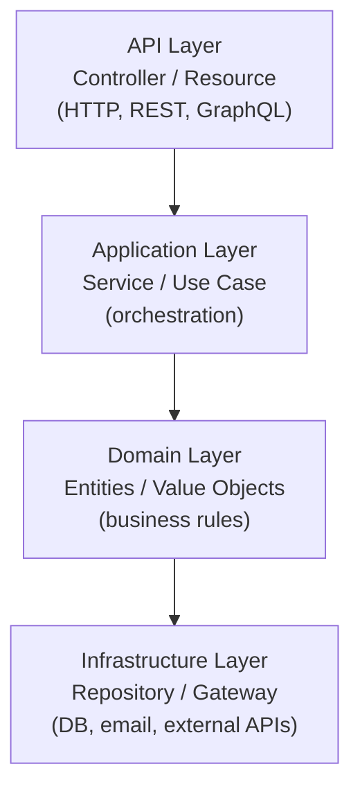

# Code Organization

> "The organization of software is not a cosmetic concern. It is the primary mechanism by which complexity is managed."
> — Robert C. Martin, *Clean Architecture*

How you organise code determines how fast your team moves and how safe changes are. Poorly organised code forces developers to grep through 20 files to understand one feature. Well-organised code makes the codebase navigable — you find what you're looking for in seconds, and a change in one area doesn't ripple unexpectedly into another.

> **Interview relevance:** When designing a system in an LLD interview, how you organise classes into packages and layers tells the interviewer whether you think in terms of domain concerns or technical layers. The difference between a junior and a senior answer is often visible in the package structure.

---

## Two Philosophies: Package by Layer vs Package by Feature

The most consequential organisation decision is whether to group code by **technical layer** or by **domain feature**.

### Package by Layer (the wrong default)

```
com.acme.shop/
  controllers/
    OrderController.java
    ProductController.java
    UserController.java
  services/
    OrderService.java
    ProductService.java
    UserService.java
  repositories/
    OrderRepository.java
    ProductRepository.java
    UserRepository.java
  models/
    Order.java
    Product.java
    User.java
```

Every feature is scattered across four packages. To understand the Order feature, you open four directories. To add an `Order` endpoint, you touch four files in four directories.

**Problems:**
- Feature changes always touch multiple packages — high merge-conflict surface
- Nothing prevents `OrderController` from importing `ProductRepository` directly — invisible coupling
- Package structure reveals nothing about business capabilities

### Package by Feature (the right default)

```
com.acme.shop/
  orders/
    Order.java
    OrderLine.java
    OrderStatus.java
    OrderService.java
    OrderController.java
    OrderRepository.java
    PlaceOrderCommand.java
    OrderResponse.java
  products/
    Product.java
    ProductCategory.java
    ProductService.java
    ProductController.java
    ProductRepository.java
  users/
    User.java
    UserService.java
    UserController.java
    UserRepository.java
  shared/
    Money.java
    Address.java
    PageRequest.java
```

Everything for the Order feature lives in `orders/`. To understand orders, you open one directory. Cross-feature imports are immediately visible and questionable.

**Benefits:**
- Feature changes are localised — one package, one PR
- Package-private visibility becomes meaningful: `OrderLine` can be package-private if only `Order` creates it
- Package structure communicates business capabilities to new team members

---

## Layered Architecture Within a Feature

Within each feature package, organise by architectural concern. The canonical layers for a Spring-style backend:



```
com.acme.shop.orders/
  api/
    OrderController.java       <- HTTP in, Response out
    PlaceOrderRequest.java     <- request DTO
    OrderResponse.java         <- response DTO
    OrderMapper.java           <- domain <-> DTO conversion
  application/
    OrderService.java          <- orchestrates use cases
    PlaceOrderCommand.java     <- input to the use case
  domain/
    Order.java                 <- entity with business rules
    OrderLine.java             <- value object / child entity
    OrderStatus.java           <- enum
    OrderRepository.java       <- interface (owned by domain)
    PaymentGateway.java        <- interface (owned by domain)
  infrastructure/
    JdbcOrderRepository.java   <- implements OrderRepository
    StripePaymentGateway.java  <- implements PaymentGateway
    OrderRowMapper.java        <- DB row to domain object
```

The **dependency rule** is always inward: API depends on Application, Application depends on Domain, Infrastructure depends on Domain. Domain depends on nothing else in the project.

---

## The Dependency Rule in Code

This rule is what makes the structure work. It's enforced through what each layer is allowed to import.

```java
// DOMAIN — imports nothing from the project
// (only java.util, java.math, etc.)
package com.acme.shop.orders.domain;

public class Order {
    private final List<OrderLine> lines = new ArrayList<>();
    private OrderStatus status = OrderStatus.PENDING;

    public void addLine(Product product, Quantity quantity) { ... }
    public void confirm() { ... }
    public Money total() { ... }
}

// Domain owns the interface — infrastructure will implement it
public interface OrderRepository {
    void save(Order order);
    Optional<Order> findById(OrderId id);
}
```

```java
// APPLICATION — imports from domain, never from infrastructure or API
package com.acme.shop.orders.application;

import com.acme.shop.orders.domain.Order;
import com.acme.shop.orders.domain.OrderRepository;
import com.acme.shop.orders.domain.PaymentGateway;

public class OrderService {
    private final OrderRepository  orderRepo;
    private final PaymentGateway   paymentGateway;

    public OrderService(OrderRepository orderRepo, PaymentGateway paymentGateway) {
        this.orderRepo      = orderRepo;
        this.paymentGateway = paymentGateway;
    }

    public Order placeOrder(PlaceOrderCommand cmd) {
        Order order = new Order(OrderId.generate(), cmd.customerId());
        cmd.items().forEach(i -> order.addLine(i.product(), i.quantity()));
        order.confirm();
        orderRepo.save(order);
        return order;
    }
}
```

```java
// INFRASTRUCTURE — imports from domain to implement its interfaces
// NEVER imported by domain or application
package com.acme.shop.orders.infrastructure;

import com.acme.shop.orders.domain.Order;
import com.acme.shop.orders.domain.OrderRepository;

public class JdbcOrderRepository implements OrderRepository {
    private final DataSource dataSource;

    @Override
    public void save(Order order) { /* JDBC insert */ }

    @Override
    public Optional<Order> findById(OrderId id) { /* JDBC select */ return Optional.empty(); }
}
```

```java
// API — imports from application (for the use case), never from infrastructure or domain directly
package com.acme.shop.orders.api;

import com.acme.shop.orders.application.OrderService;
import com.acme.shop.orders.application.PlaceOrderCommand;

@RestController
@RequestMapping("/orders")
public class OrderController {
    private final OrderService orderService;

    public OrderController(OrderService orderService) {
        this.orderService = orderService;
    }

    @PostMapping
    public ResponseEntity<OrderResponse> placeOrder(@RequestBody PlaceOrderRequest req) {
        PlaceOrderCommand cmd = OrderMapper.toCommand(req);
        Order order = orderService.placeOrder(cmd);
        return ResponseEntity.created(URI.create("/orders/" + order.getId()))
                             .body(OrderMapper.toResponse(order));
    }
}
```

---

## Visibility as Architecture

Java's access modifiers are an underused architectural tool. Use them to enforce boundaries.

| Modifier | Use for |
|---|---|
| `public` | API surface that other packages legitimately need |
| `package-private` (no modifier) | Implementation details hidden within a package |
| `private` | Internal to a single class |
| `protected` | Subclass extension points — use sparingly |

```java
// OrderLine is an implementation detail of Order
// External code should not create OrderLines directly
final class OrderLine {         // package-private — only Order (in same package) can use this
    private final ProductId productId;
    private final Quantity  quantity;
    private final Money     unitPrice;

    // package-private constructor — only Order.addLine() calls this
    OrderLine(ProductId productId, Quantity quantity, Money unitPrice) {
        this.productId = productId;
        this.quantity  = quantity;
        this.unitPrice = unitPrice;
    }

    public Money lineTotal() { return unitPrice.multiply(quantity.value()); }
}

// Order is the public face of the orders domain object
public class Order {
    private final List<OrderLine> lines = new ArrayList<>();

    public void addLine(Product product, Quantity quantity) {
        // Only Order creates OrderLines — composition enforced at compile time
        lines.add(new OrderLine(product.id(), quantity, product.price()));
    }
}
```

This is OOP's composition guarantee enforced by the language. You cannot get a stray `OrderLine` from outside the package.

---

## Shared Kernel: The `shared` or `common` Package

Some classes are genuinely cross-cutting:

```
com.acme.shop.shared/
  Money.java            <- value object used everywhere
  Address.java          <- used by orders and users
  PageRequest.java      <- used by all list queries
  PageResult.java       <- used by all list responses
  DomainException.java  <- base exception type
```

**Rules for what belongs in `shared`:**
1. It is truly used by 2+ bounded contexts (feature packages)
2. It has no business logic specific to any one feature
3. It is stable — changes rarely and independently

**Red flags:**
- A `shared` package growing to 50+ classes → it's becoming a dumping ground
- Business logic in `shared` → it belongs in a specific feature
- Feature-specific DTOs in `shared` → move them to the feature package

---

## File Size and Class Length

There is no magic number, but there are useful heuristics:

| Heuristic | Guidance |
|---|---|
| Lines per class | < 200 lines is usually healthy; > 500 is a smell |
| Methods per class | < 10 is common; > 20 suggests multiple responsibilities |
| Parameters per method | > 3 parameters → consider a parameter object |
| Nesting depth | > 3 levels of nesting → extract method or early-return |
| Lines per method | < 20 lines is ideal; > 50 is almost always a smell |

```java
// BAD — deeply nested, hard to reason about
public void processOrder(Order order) {
    if (order != null) {
        if (order.isConfirmed()) {
            for (OrderLine line : order.lines()) {
                if (line.product().isAvailable()) {
                    if (line.quantity().value() > 0) {
                        // ... actual logic buried 5 levels deep
                    }
                }
            }
        }
    }
}

// GOOD — guard clauses and extracted methods flatten the nesting
public void processOrder(Order order) {
    if (order == null || !order.isConfirmed()) return;

    order.lines().stream()
         .filter(this::isProcessable)
         .forEach(this::processLine);
}

private boolean isProcessable(OrderLine line) {
    return line.product().isAvailable() && line.quantity().value() > 0;
}

private void processLine(OrderLine line) {
    // single, clear responsibility
}
```

---

## Organising Tests to Mirror Source

Tests should mirror the source directory structure. A test for `Order` lives next to `Order`:

```
src/
  main/java/com/acme/shop/orders/domain/
    Order.java
    OrderLine.java
    OrderService.java
  test/java/com/acme/shop/orders/domain/
    OrderTest.java
    OrderLineTest.java
    OrderServiceTest.java
```

Test naming conventions:

```java
// Naming: <MethodUnderTest>_<Scenario>_<ExpectedOutcome>
@Test
void addLine_whenProductIsOutOfStock_throwsException() { ... }

@Test
void confirm_whenNoLinesAdded_throwsException() { ... }

@Test
void total_withMultipleLines_returnsSumOfLineTotals() { ... }
```

Each test class has exactly one production class under test. Test helper classes (fixtures, builders, fakes) go in a `testutil` or `fixtures` package:

```
test/java/com/acme/shop/testutil/
  OrderFixtures.java     <- factory methods for test Orders
  FakeOrderRepository.java
  FakePaymentGateway.java
```

---

## Interview Talking Points

**1. How do you organise packages in a new project?**
> "I start with package-by-feature, not package-by-layer. Each domain feature — orders, products, users — gets its own package. Within each feature, I apply Clean Architecture layers: domain entities and interfaces at the center, application services orchestrating use cases, and infrastructure implementing the persistence and external API interfaces. The dependency rule flows inward: infrastructure and API depend on application, application depends on domain. Domain depends on nothing."

**2. How does package structure help enforce architecture?**
> "In two ways. First, `package-private` visibility makes implementation details invisible to other features — `OrderLine` can be package-private, preventing any external class from creating one. Second, if you catch an import of `JdbcOrderRepository` directly inside `OrderService`, the package path makes the violation obvious: infrastructure bleeding into application. Architecturally significant imports cross package boundaries, so the structure makes violations visible."

**3. How do you prevent the `shared` package from becoming a garbage dump?**
> "By applying strict admission criteria. A class belongs in `shared` only if: it is genuinely used by two or more bounded contexts, it has no feature-specific logic, and it is stable. Value objects like `Money` and `Address` qualify. A DTO that only the orders feature uses does not qualify just because someone thinks it might be reused one day. When `shared` starts growing fast, I treat it as a DDD modelling smell — the domain boundaries may need rethinking."

---

## Key Takeaways

- **Package by feature**, not by layer — keeps feature changes localised, makes cross-feature coupling visible
- The **dependency rule** always points inward: API → Application → Domain ← Infrastructure
- The **domain layer owns interfaces** — infrastructure implements them, never the reverse
- Use **package-private** visibility to enforce composition boundaries — prevent external classes from creating internal objects
- **`shared`** is for genuinely cross-cutting, stable value types — not a catch-all dumping ground
- **Test structure mirrors source structure** — one test class per production class, test utilities in `testutil`
- Short methods, guard clauses, and extracted helpers are the micro-level equivalent of package boundaries at the macro level
