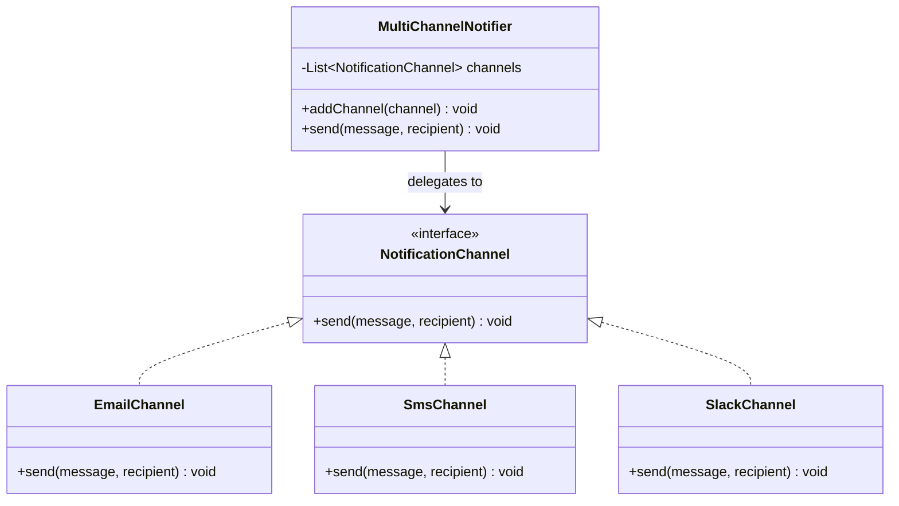

# Composition over Inheritance

> "Favour object composition over class inheritance."
> — Gang of Four, *Design Patterns* (1994)

This is one of the oldest and most consistently cited pieces of advice in object-oriented design. Inheritance is a powerful tool but a brittle one. Composition is more flexible, more testable, and far less likely to surprise you six months later when requirements change.

Understanding *why* composition is preferred — and *when* inheritance is still the right choice — is essential for both production code and LLD interviews.

> **Interview relevance:** If you're designing a notification system, a payment processor, or a report exporter and you reach for inheritance first, an experienced interviewer will probe whether you considered composition. The ability to articulate the tradeoffs — and to show the refactoring — is a strong signal of design maturity.

---

## What's Wrong with Inheritance?

Inheritance is not inherently bad. The problems arise from how it is typically misused.

### Problem 1: Tight Coupling to the Parent

A subclass is intimately coupled to its parent. Every `protected` field, every overridable method, every constructor signature in the parent is part of the implicit contract the subclass depends on.

When the parent changes — even in a seemingly unrelated way — the subclass can silently break. This is the **fragile base class problem**.

```java
// Parent: counts add() calls
public class InstrumentedList<E> extends ArrayList<E> {
    private int addCount = 0;

    @Override
    public boolean add(E e) {
        addCount++;
        return super.add(e);
    }

    @Override
    public boolean addAll(Collection<? extends E> c) {
        addCount += c.size();
        return super.addAll(c);
    }

    public int getAddCount() { return addCount; }
}

InstrumentedList<String> list = new InstrumentedList<>();
list.addAll(List.of("a", "b", "c"));
System.out.println(list.getAddCount()); // Prints 6, not 3!
```

`ArrayList.addAll()` internally calls `add()` for each element. The subclass override of `add()` fires again — incrementing the counter twice per element. The subclass broke because it depended on an implementation detail of the parent that the parent never formally promised to maintain.

### Problem 2: Violating LSP by Design

Inheritance models "is-a" relationships, but **behavioural substitutability** is stricter than taxonomic membership. `Square extends Rectangle` compiles, but the Square is not safely substitutable — it's an LSP violation built in from the start.

### Problem 3: Inflexibility at Runtime

Inheritance selects behaviour at **compile time**. A subclass is permanently bound to its parent's implementation. Composition selects behaviour at **runtime** — you can change the composed object after construction, based on configuration or context.

### Problem 4: Shallow Hierarchies Become Deep Quickly

```
Animal
  └── Pet
        └── FurryPet
              └── DomesticCat
                    └── IndoorDomesticCat
                          └── ...
```

Every new dimension of variation (indoor/outdoor, neutered/not, short/long hair) either multiplies the hierarchy or collapses into god-class parent methods with boolean flags. Both outcomes are maintenance nightmares.

---

## Composition: Behaviour Through Delegation

Instead of inheriting behaviour, **contain a reference to an object that provides the behaviour** and delegate to it.

### Fixing the Instrumented List with Composition

```java
// GOOD — composition wraps the list without inheriting from it
public class InstrumentedList<E> implements List<E> {
    private final List<E> delegate;  // composed, not extended
    private int addCount = 0;

    public InstrumentedList(List<E> delegate) {
        this.delegate = Objects.requireNonNull(delegate);
    }

    @Override
    public boolean add(E e) {
        addCount++;
        return delegate.add(e);
    }

    @Override
    public boolean addAll(Collection<? extends E> c) {
        addCount += c.size();
        return delegate.addAll(c);   // delegate.addAll — does NOT call our overridden add()
    }

    public int getAddCount() { return addCount; }

    // Forward all other List methods to delegate
    @Override public int size()                      { return delegate.size(); }
    @Override public boolean isEmpty()               { return delegate.isEmpty(); }
    @Override public boolean contains(Object o)      { return delegate.contains(o); }
    @Override public Iterator<E> iterator()          { return delegate.iterator(); }
    // ... remaining List methods forwarded
}

InstrumentedList<String> list = new InstrumentedList<>(new ArrayList<>());
list.addAll(List.of("a", "b", "c"));
System.out.println(list.getAddCount()); // Correctly prints 3
```

`InstrumentedList` is no longer affected by how `ArrayList.addAll()` is implemented. It delegates to the real `ArrayList` and measures only what it explicitly intercepts.

---

## Real-World Example: The Notification System

A classic design exercise. Start with the naive inheritance approach, then show why composition wins.

### Attempt 1: Pure Inheritance

```java
public abstract class Notifier {
    public abstract void send(String message, String recipient);
}

public class EmailNotifier extends Notifier {
    @Override public void send(String message, String recipient) {
        System.out.println("Email to " + recipient + ": " + message);
    }
}

// Now the requirements arrive: "we need email + SMS for critical alerts"
// How? Multiple inheritance? Not in Java.
// Add a new subclass for every combination:

public class EmailAndSmsNotifier extends Notifier { ... }    // Email + SMS
public class EmailAndSlackNotifier extends Notifier { ... }  // Email + Slack
public class SmsAndSlackNotifier extends Notifier { ... }    // SMS + Slack
public class AllChannelNotifier extends Notifier { ... }     // Email + SMS + Slack
```

With 3 channels and `2^3 - 1 = 7` combinations, you need 7 classes. With 4 channels: 15 classes. This is the **combinatorial explosion** caused by inheritance when behaviour has multiple orthogonal dimensions.

### Attempt 2: Composition — Decorator Pattern



```java
public interface NotificationChannel {
    void send(String message, String recipient);
}

public class EmailChannel implements NotificationChannel {
    private final EmailClient client;

    public EmailChannel(EmailClient client) { this.client = client; }

    @Override
    public void send(String message, String recipient) {
        client.sendEmail(recipient, message);
    }
}

public class SmsChannel implements NotificationChannel {
    private final SmsGateway gateway;

    public SmsChannel(SmsGateway gateway) { this.gateway = gateway; }

    @Override
    public void send(String message, String recipient) {
        gateway.sendSms(recipient, message);
    }
}

public class SlackChannel implements NotificationChannel {
    private final SlackClient client;
    private final String      channelId;

    public SlackChannel(SlackClient client, String channelId) {
        this.client    = client;
        this.channelId = channelId;
    }

    @Override
    public void send(String message, String recipient) {
        client.post(channelId, recipient + ": " + message);
    }
}

// Composed at runtime — any combination, zero new classes
public class NotificationService {
    private final List<NotificationChannel> channels;

    public NotificationService(List<NotificationChannel> channels) {
        this.channels = List.copyOf(channels);
    }

    public void notifyAll(String message, String recipient) {
        channels.forEach(ch -> ch.send(message, recipient));
    }
}
```

Usage:

```java
// Email only
NotificationService emailOnly = new NotificationService(
    List.of(new EmailChannel(emailClient))
);

// Email + SMS for critical alerts — no new class needed
NotificationService critical = new NotificationService(
    List.of(new EmailChannel(emailClient), new SmsChannel(smsGateway))
);

// All channels — three lines, not a new class
NotificationService allChannels = new NotificationService(
    List.of(new EmailChannel(emailClient),
            new SmsChannel(smsGateway),
            new SlackChannel(slackClient, "#alerts"))
);
```

Adding a fourth channel (push notification, webhook) means one new class. No existing class changes.

---

## The Decorator Pattern: Composition at Its Most Elegant

The **Decorator pattern** uses composition to add behaviour to objects without modifying the original class or creating subclasses. It wraps an object in a series of decorator objects that each add one concern.

```java
// A logging decorator that wraps any PaymentGateway
public class LoggingPaymentGateway implements PaymentGateway {
    private final PaymentGateway delegate;
    private final Logger         log = LoggerFactory.getLogger(getClass());

    public LoggingPaymentGateway(PaymentGateway delegate) {
        this.delegate = delegate;
    }

    @Override
    public PaymentResult charge(Money amount, String token) {
        log.info("Charging {} via {}", amount, delegate.getClass().getSimpleName());
        PaymentResult result = delegate.charge(amount, token);
        log.info("Charge result: {}", result);
        return result;
    }

    @Override
    public PaymentResult refund(String transactionId, Money amount) {
        log.info("Refunding {} for txn {}", amount, transactionId);
        PaymentResult result = delegate.refund(transactionId, amount);
        log.info("Refund result: {}", result);
        return result;
    }
}

// A retry decorator
public class RetryingPaymentGateway implements PaymentGateway {
    private final PaymentGateway delegate;
    private final int            maxAttempts;

    public RetryingPaymentGateway(PaymentGateway delegate, int maxAttempts) {
        this.delegate    = delegate;
        this.maxAttempts = maxAttempts;
    }

    @Override
    public PaymentResult charge(Money amount, String token) {
        for (int attempt = 1; attempt <= maxAttempts; attempt++) {
            PaymentResult result = delegate.charge(amount, token);
            if (result.isSuccess()) return result;
            if (attempt == maxAttempts) return result;
        }
        return PaymentResult.failure("Max retries exceeded");
    }

    @Override
    public PaymentResult refund(String transactionId, Money amount) {
        return delegate.refund(transactionId, amount);
    }
}

// Compose: Stripe, wrapped in retry, wrapped in logging
PaymentGateway gateway =
    new LoggingPaymentGateway(
        new RetryingPaymentGateway(
            new StripePaymentGateway(apiKey),
            3
        )
    );
```

Each concern — logging, retry, the actual Stripe call — is in its own class. Combining them is a wiring decision, not a design decision. New concerns (circuit breaking, metrics, rate limiting) are new decorator classes, not modifications to `StripePaymentGateway`.

---

## When Inheritance IS the Right Choice

Composition is preferred, but inheritance has legitimate uses:

| When inheritance is right | Reason |
|---|---|
| **True is-a relationship with shared implementation** | `SavingsAccount extends Account` when both share significant common behaviour and a stable interface |
| **Template Method pattern** | Superclass defines the algorithm skeleton; subclasses fill in the steps — a deliberate extension point |
| **Framework extension points** | Spring's `AbstractController`, JUnit's `TestCase` — the framework is designed for inheritance |
| **Sealed hierarchies (Java 17+)** | `sealed interface Shape permits Circle, Rectangle` — closed, controlled, modelled exhaustively |

The test: does the subclass honour **all** the parent's contracts (LSP)? If any parent method would need to be thrown or stubbed out in the subclass, inheritance is wrong.

```java
// Appropriate inheritance — template method
public abstract class ReportGenerator {
    // Template method — algorithm skeleton, closed
    public final Report generate(DataSource source) {
        List<Record> data      = loadData(source);
        List<Record> filtered  = filter(data);
        List<Row>    formatted = format(filtered);
        return assemble(formatted);
    }

    protected abstract List<Record> loadData(DataSource source);
    protected abstract List<Row>    format(List<Record> records);

    // Default — override if needed
    protected List<Record> filter(List<Record> records) {
        return records.stream().filter(r -> !r.isEmpty()).collect(toList());
    }

    private Report assemble(List<Row> rows) { return new Report(rows); }
}

// Extension through subclassing — fills in the blanks, doesn't override the skeleton
public class CsvReportGenerator extends ReportGenerator {
    @Override
    protected List<Record> loadData(DataSource source) { /* parse CSV */ return List.of(); }
    @Override
    protected List<Row> format(List<Record> records) { /* format as CSV rows */ return List.of(); }
}
```

---

## Composition vs Inheritance: Decision Guide

```
Is the relationship a true "is-a" (LSP holds)?
        |
       YES                              NO
        |                               |
Does the child use ALL                Use composition.
parent behaviour?
        |
       YES
        |
Is the parent stable
(won't change in ways that break children)?
        |
       YES
        |
Is this a deliberate extension
point (template method, sealed hierarchy)?
        |
       YES
        |
  Inheritance is acceptable.
  Document the contract.
```

When in doubt: start with composition. You can always introduce an abstract base class later if a genuine shared-implementation pattern emerges. Going the other direction — from inheritance to composition — is always harder.

---

## Interview Talking Points

**1. Why is "favour composition over inheritance" such common advice?**
> "Because inheritance couples the subclass to the implementation details of the parent — the fragile base class problem. It's also inflexible: behaviour is selected at compile time, and combinatorial feature combinations require exponential subclasses. Composition lets you combine behaviour at runtime, by wiring the right objects together. Each composed object has one responsibility and can be tested and swapped independently. The Decorator pattern is the clearest example: logging, retry, and circuit breaking all wrap the same interface without any class needing to know about the others."

**2. Can you give an example where you refactored inheritance to composition?**
> "The classic one is notification channels. Inheritance gives you `EmailNotifier`, `SmsNotifier`, then `EmailAndSmsNotifier`, `EmailAndSlackNotifier` — 7 classes for 3 channels. Composition gives you `EmailChannel`, `SmsChannel`, `SlackChannel` each implementing `NotificationChannel`, and a `NotificationService` that holds a `List<NotificationChannel>` and delegates to all of them. Any combination is handled by the wiring — no new class required. Adding a fourth channel is one new class."

**3. When would you choose inheritance over composition?**
> "When the relationship is a true is-a with shared implementation that's unlikely to change, and when LSP holds — the subclass genuinely extends the parent without breaking any of its contracts. The Template Method pattern is the clearest legitimate use: the parent defines an algorithm skeleton with abstract steps; subclasses fill in the steps. I'd also use Java 17 sealed interfaces for exhaustive domain hierarchies — `sealed interface Shape permits Circle, Rectangle, Triangle` — where the set of variants is closed and known upfront."

---

## Key Takeaways

- **Fragile base class**: subclasses depend on parent implementation details that can change silently
- **Combinatorial explosion**: N independent dimensions of variation → `2^N` subclasses; composition handles it with N classes
- Composition selects behaviour at **runtime** through wiring; inheritance selects it at **compile time** permanently
- The **Decorator pattern** is composition's most elegant expression: wrap any interface to add a single cross-cutting concern
- Inheritance is appropriate when: true is-a + LSP holds + stable parent + deliberate extension point (Template Method, sealed class)
- When in doubt: **start with composition** — refactoring from composition to inheritance is rare; from inheritance to composition is common and hard
- Each composed object is independently testable; inherited behaviour requires the full parent hierarchy in test setup
