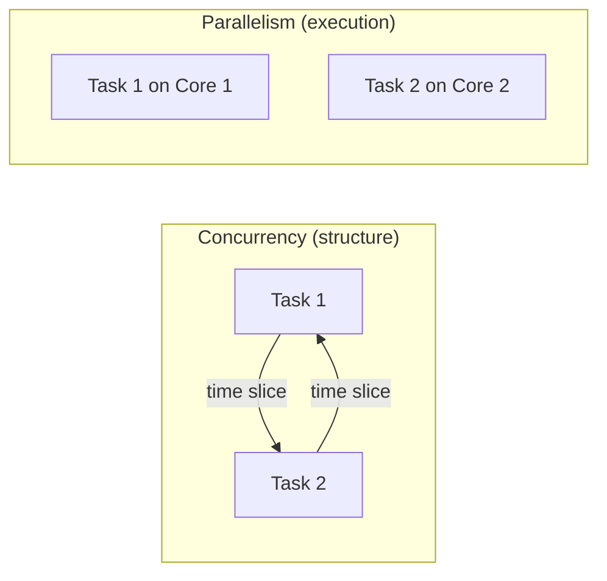
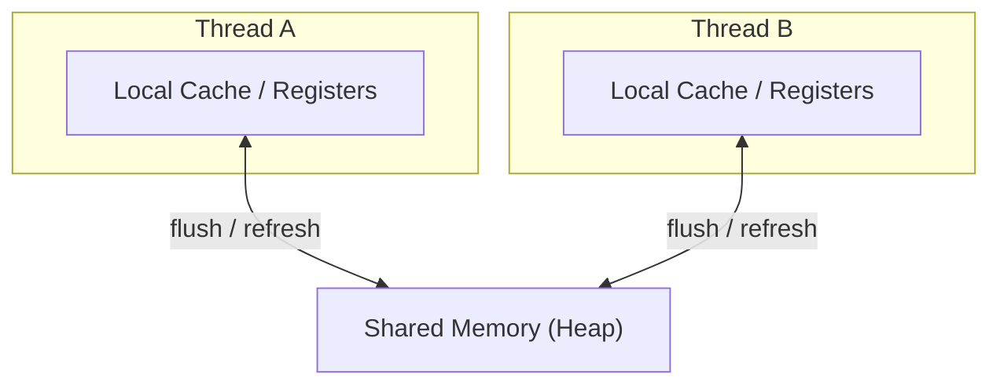
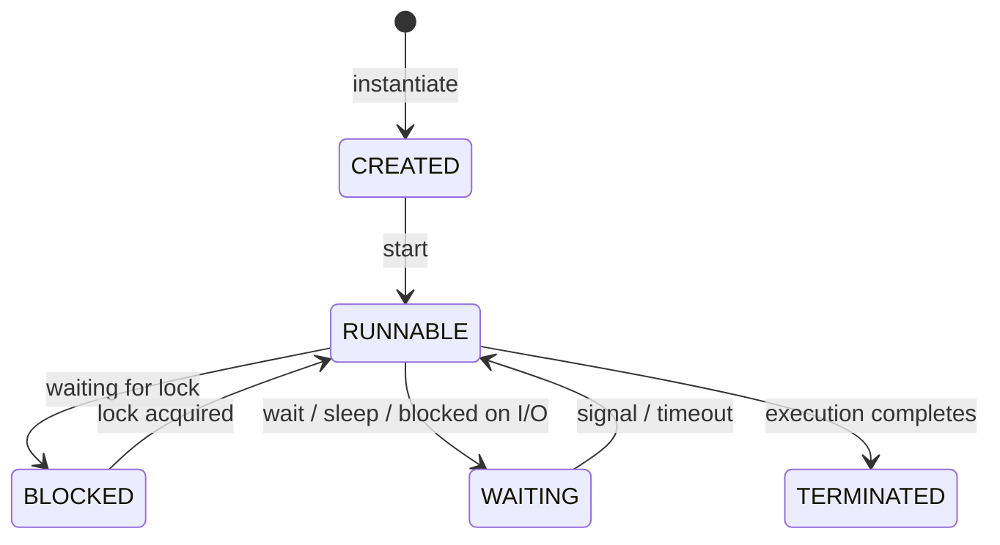

# Concurrency Fundamentals

Imagine a restaurant kitchen. A single chef cooking one dish at a time is sequential execution. Multiple chefs working simultaneously — one on appetisers, another on mains, a third on desserts — is **concurrency**. The shared resources (ovens, counter space, spice rack) create coordination problems. LLD interviews test whether you can design classes that multiple threads of execution use simultaneously without corrupting state.

> **Interview relevance:** "Make this class thread-safe", "Design a thread-safe cache", "What happens if two users book the last seat simultaneously?" — concurrency questions surface in almost every senior-level LLD round.

---

## Why Concurrency Matters in Low-Level Design

Concurrency is not just a systems concern — it directly affects how you **design classes, define interfaces, and manage state**. When you design a `ParkingSlot` class, you need to decide: can two threads call `occupy()` simultaneously? When you design an `OrderQueue`, you need to decide: how do producers and consumers coordinate?

Your design choices at the class level — field mutability, encapsulation, dependency structure — **determine whether concurrency bugs are possible or impossible**.

---

## Processes vs Threads

| Aspect | Process | Thread |
|---|---|---|
| **Memory** | Own address space | Shares heap with other threads in same process |
| **Creation cost** | High (fork + copy-on-write) | Low (just a new stack) |
| **Communication** | IPC (pipes, sockets, shared memory) | Direct access to shared variables |
| **Failure isolation** | Crash doesn't affect other processes | Uncaught exception can crash the entire process |
| **Use case** | Microservices, separate applications | Parallelism within a single application |

In most object-oriented systems, threads are the unit of concurrent execution within a single process. Multiple threads share the same heap memory — which is both the power and the danger.

```java
// In Java, the simplest way to run code concurrently
// Implement Runnable — separates the task from the execution mechanism (SRP!)
class OrderProcessor implements Runnable {
    private final Order order;

    OrderProcessor(Order order) { this.order = order; }

    @Override
    public void run() {
        // This runs on a separate thread
        processPayment(order);
        sendConfirmation(order);
    }
}

// Launch concurrent execution
new Thread(new OrderProcessor(order)).start();
```

---

## Concurrency vs Parallelism

These terms are often confused. They describe different things.



| | Concurrency | Parallelism |
|---|---|---|
| **Definition** | Dealing with multiple things at once (structure) | Doing multiple things at once (execution) |
| **Analogy** | One barista switching between orders | Two baristas each making a drink |
| **Requirement** | Can happen on a single CPU core | Requires multiple cores |
| **LLD concern** | How you structure classes to handle interleaving | How you divide work for throughput |

**Key insight:** You can have concurrency without parallelism (single core, time-sliced). You can't have useful parallelism without concurrency (you need the structure to divide work).

---

## The Shared Mutable State Problem

Concurrency is trivial when threads don't share data. The moment two threads read and write the **same** field, bugs appear. This is the **central problem** of concurrent LLD.

```java
public class Counter {
    private int count = 0;

    public void increment() {
        count++;  // NOT atomic! Read → Modify → Write (3 separate operations)
    }

    public int getCount() {
        return count;
    }
}
```

If two threads call `increment()` simultaneously:

```
Thread A: reads count = 0
Thread B: reads count = 0
Thread A: writes count = 1
Thread B: writes count = 1  ← Lost update! Should be 2.
```

This is a **race condition** — the outcome depends on the unpredictable timing of thread execution.

### The LLD Implication

Every time you design a class with mutable fields, ask: **"Can multiple threads access this instance?"** If yes, you must protect the fields — or redesign to eliminate sharing.

---

## The Three Pillars of Thread Safety

Every concurrency bug in any language traces back to a violation of one of these:

### 1. Atomicity

An operation is **atomic** if it completes entirely or not at all — no thread can observe an intermediate state.

| Operation | Atomic? | Why |
|---|---|---|
| Reading a 32-bit integer | Usually yes | Single CPU instruction |
| `count++` | **No** | Read + Add + Write = 3 operations |
| Assigning a reference | Usually yes | Single pointer write |
| Check-then-act (`if (x == null) x = new X()`) | **No** | Gap between check and act |

### 2. Visibility

When one thread modifies a variable, other threads may **not see the change immediately** due to CPU caching and compiler optimisations.

```java
// Without proper synchronisation:
// Thread A
running = false;  // may only write to CPU cache, not main memory

// Thread B
while (running) { /* may spin forever — sees stale cached value */ }
```

Every language/runtime has mechanisms to force visibility (memory barriers, volatile fields, synchronisation primitives).

### 3. Ordering

Compilers and CPUs **reorder instructions** for performance. Without explicit synchronisation, the order you write code is **not** guaranteed to be the order it executes across threads.

```java
// You write:
x = 1;
ready = true;

// CPU/compiler may execute:
ready = true;   // reordered!
x = 1;          // Thread B sees ready=true but x is still 0
```

**Memory models** (Java Memory Model, C++ memory model, etc.) define rules for when reordering is visible to other threads and how to prevent it.

---

## Memory Model Essentials

Every language/runtime defines a **memory model** — the contract between your code and the hardware about when writes become visible to other threads.



### The Happens-Before Relationship

The core concept across all memory models: if event A **happens-before** event B, then B is guaranteed to see A's writes.

| Rule | What it guarantees |
|---|---|
| **Program order** | Within a single thread, statements execute in order |
| **Lock release → Lock acquire** | Unlock happens-before the next lock on the same monitor |
| **Volatile write → Volatile read** | Write to a volatile field is visible to subsequent reads |
| **Thread start** | Starting a thread makes all prior writes visible to that thread |
| **Thread join** | A completed thread's writes are visible after `join()` returns |

**Practical meaning:** If you synchronise properly (locks, volatile, atomic operations), the memory model guarantees visibility. If you don't, you get undefined behaviour across threads.

---

## Thread Lifecycle (General Model)



The specifics vary by language (Java has TIMED_WAITING, Go has goroutine states, etc.), but the fundamental lifecycle is universal.

---

## When Do You Need Concurrency in LLD?

Not every class needs to be thread-safe. **Most classes don't.** You need it when:

| Scenario | Example |
|---|---|
| Shared resource with concurrent access | Database connection pool, in-memory cache |
| Background processing | Sending notifications while handling requests |
| Producer-consumer workflows | Order queue processed by multiple workers |
| Real-time updates | Live scoreboard, stock ticker |
| Rate limiting | Request throttling with shared counters |

### Design Decision Framework

```
Is this object shared across threads?
├─ No → No synchronisation needed (most classes!)
└─ Yes → Is it read-only after construction?
    ├─ Yes → Make it immutable (safest, fastest, no coordination needed)
    └─ No → Choose synchronisation strategy:
        ├─ Single field updates → atomic variables / volatile
        ├─ Compound operations → locks / monitors
        └─ Complex coordination → concurrent data structures / queues
```

### The LLD Design Principle

> **Design to minimise sharing.** The best concurrency strategy is to not need one. Immutable value objects, thread-confined entities, and message-passing architectures eliminate shared mutable state at the design level — before you ever reach for a lock.

---

## Concurrency and SOLID Principles

| Principle | Concurrency implication |
|---|---|
| **SRP** | A class with one responsibility is easier to make thread-safe (fewer fields, fewer invariants) |
| **OCP** | Strategy/Observer patterns allow extension without modifying synchronised code |
| **DIP** | Injecting thread-safe implementations (e.g., `ConcurrentMap` vs `HashMap`) without changing business logic |
| **ISP** | Smaller interfaces = less shared surface area to protect |

---

## Key Takeaways

1. **Concurrency is a design problem**, not just a coding problem — your class structure determines how hard or easy thread safety is.
2. **Shared mutable state** is the root cause of every concurrency bug, in every language.
3. **Three threats**: atomicity violations, visibility failures, instruction reordering.
4. **Prefer eliminating shared state** (immutability, thread-local, message passing) over managing it (locks, synchronisation).
5. **Most classes don't need to be thread-safe** — only those shared across threads with mutable state.
6. In interviews, **always state your threading assumptions** — "I'm assuming this will be accessed by multiple threads, so I'll design it to be thread-safe."
