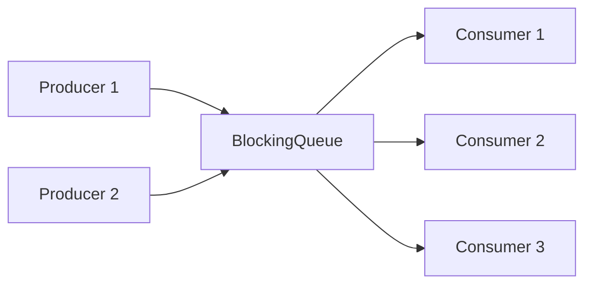
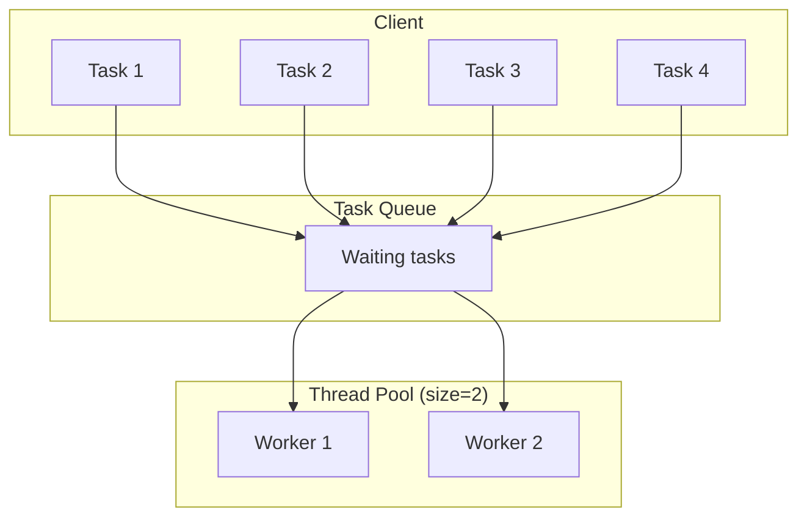

# Concurrent Design Patterns

Design patterns don't just solve structural problems — they also solve **coordination** problems. When multiple threads need to collaborate on work, share resources, or communicate results, these patterns provide proven, reusable solutions.

> **Interview relevance:** "Design a thread pool", "Implement a producer-consumer queue", "Design a rate limiter" — all require concurrent design patterns. Knowing these patterns lets you answer confidently without reinventing solutions.

---

## Producer-Consumer Pattern

The most common concurrent pattern. One or more threads produce work items; one or more threads consume them. A **bounded queue** decouples producers from consumers.



### Implementation with BlockingQueue

```java
public class OrderProcessingSystem {
    private final BlockingQueue<Order> orderQueue;
    private final ExecutorService producers;
    private final ExecutorService consumers;
    private volatile boolean running = true;

    public OrderProcessingSystem(int queueCapacity, int numConsumers) {
        this.orderQueue = new LinkedBlockingQueue<>(queueCapacity);
        this.producers = Executors.newCachedThreadPool();
        this.consumers = Executors.newFixedThreadPool(numConsumers);

        // Start consumer threads
        for (int i = 0; i < numConsumers; i++) {
            consumers.submit(this::consumeOrders);
        }
    }

    // Called by web handlers — producers
    public void submitOrder(Order order) throws InterruptedException {
        orderQueue.put(order);  // blocks if queue is full (backpressure)
    }

    private void consumeOrders() {
        while (running) {
            try {
                Order order = orderQueue.poll(1, TimeUnit.SECONDS);
                if (order != null) {
                    processOrder(order);
                }
            } catch (InterruptedException e) {
                Thread.currentThread().interrupt();
                break;
            }
        }
    }

    public void shutdown() {
        running = false;
        consumers.shutdown();
        producers.shutdown();
    }
}
```

### When to Use

- Decoupling fast producers from slow consumers (web requests → background processing)
- Work distribution across multiple workers
- Smoothing out bursty load (queue absorbs spikes)

---

## Thread Pool Pattern

Creating a new thread per task is expensive. A thread pool maintains a fixed set of worker threads that pick up tasks from a queue.



### Custom Thread Pool Implementation

```java
public class SimpleThreadPool {
    private final BlockingQueue<Runnable> taskQueue;
    private final List<WorkerThread> workers;
    private volatile boolean isShutdown = false;

    public SimpleThreadPool(int poolSize, int queueCapacity) {
        this.taskQueue = new LinkedBlockingQueue<>(queueCapacity);
        this.workers = new ArrayList<>(poolSize);

        for (int i = 0; i < poolSize; i++) {
            WorkerThread worker = new WorkerThread("Pool-Worker-" + i);
            workers.add(worker);
            worker.start();
        }
    }

    public void submit(Runnable task) {
        if (isShutdown) throw new IllegalStateException("Pool is shut down");
        try {
            taskQueue.put(task);
        } catch (InterruptedException e) {
            Thread.currentThread().interrupt();
        }
    }

    public void shutdown() {
        isShutdown = true;
        workers.forEach(Thread::interrupt);
    }

    private class WorkerThread extends Thread {
        WorkerThread(String name) { super(name); }

        @Override
        public void run() {
            while (!isShutdown) {
                try {
                    Runnable task = taskQueue.take();  // blocks until available
                    task.run();
                } catch (InterruptedException e) {
                    break;  // shutdown signal
                } catch (Exception e) {
                    // Log but don't kill the worker
                    System.err.println(getName() + " task failed: " + e.getMessage());
                }
            }
        }
    }
}
```

### Java's Built-in ExecutorService

In production, use `java.util.concurrent.ExecutorService`:

```java
// Fixed pool — predictable resource usage
ExecutorService fixedPool = Executors.newFixedThreadPool(
    Runtime.getRuntime().availableProcessors()
);

// Cached pool — grows as needed, shrinks when idle
ExecutorService cachedPool = Executors.newCachedThreadPool();

// Scheduled pool — for periodic/delayed tasks
ScheduledExecutorService scheduler = Executors.newScheduledThreadPool(2);
scheduler.scheduleAtFixedRate(
    () -> cleanupExpiredSessions(),
    0, 5, TimeUnit.MINUTES
);

// Custom pool — full control
ThreadPoolExecutor custom = new ThreadPoolExecutor(
    4,                              // core pool size
    16,                             // max pool size
    60, TimeUnit.SECONDS,           // idle thread keep-alive
    new LinkedBlockingQueue<>(1000), // work queue
    new ThreadPoolExecutor.CallerRunsPolicy()  // rejection policy
);
```

### Rejection Policies

When the queue is full and all threads are busy:

| Policy | Behaviour |
|---|---|
| `AbortPolicy` | Throws `RejectedExecutionException` |
| `CallerRunsPolicy` | Caller thread runs the task (natural backpressure) |
| `DiscardPolicy` | Silently drops the task |
| `DiscardOldestPolicy` | Drops the oldest queued task, retries |

---

## Read-Write Lock Pattern

Allows multiple concurrent readers but exclusive writer access. Covered in detail in synchronization-mechanisms, but here's the pattern applied to a real design:

```java
public class InMemoryProductCatalog {
    private final Map<String, Product> products = new HashMap<>();
    private final ReadWriteLock lock = new ReentrantReadWriteLock();

    // Many threads read concurrently
    public Optional<Product> findById(String id) {
        lock.readLock().lock();
        try {
            return Optional.ofNullable(products.get(id));
        } finally {
            lock.readLock().unlock();
        }
    }

    public List<Product> search(Predicate<Product> criteria) {
        lock.readLock().lock();
        try {
            return products.values().stream()
                .filter(criteria)
                .collect(Collectors.toList());
        } finally {
            lock.readLock().unlock();
        }
    }

    // Only one thread writes at a time
    public void updateProduct(Product product) {
        lock.writeLock().lock();
        try {
            products.put(product.getId(), product);
        } finally {
            lock.writeLock().unlock();
        }
    }
}
```

---

## Future/Promise Pattern

Submit work asynchronously, get a handle to retrieve the result later.

```java
public class PriceAggregator {
    private final ExecutorService executor = Executors.newFixedThreadPool(4);

    public AggregatedPrice getLowestPrice(String productId) throws Exception {
        // Submit all API calls concurrently
        Future<Double> amazonPrice = executor.submit(
            () -> amazonClient.getPrice(productId));
        Future<Double> ebayPrice = executor.submit(
            () -> ebayClient.getPrice(productId));
        Future<Double> walmartPrice = executor.submit(
            () -> walmartClient.getPrice(productId));

        // Wait for all results (blocks until each completes)
        double lowest = Math.min(
            amazonPrice.get(5, TimeUnit.SECONDS),
            Math.min(
                ebayPrice.get(5, TimeUnit.SECONDS),
                walmartPrice.get(5, TimeUnit.SECONDS)
            )
        );

        return new AggregatedPrice(productId, lowest);
    }
}
```

### CompletableFuture — Non-Blocking Composition

```java
public class OrderFulfillmentService {
    public CompletableFuture<OrderConfirmation> fulfillOrder(Order order) {
        return CompletableFuture
            .supplyAsync(() -> validateInventory(order))
            .thenApplyAsync(validated -> reserveStock(validated))
            .thenApplyAsync(reserved -> processPayment(reserved))
            .thenApplyAsync(paid -> generateConfirmation(paid))
            .exceptionally(ex -> handleFailure(order, ex));
    }
}
```

---

## Singleton with Thread Safety

The Singleton pattern requires special care in concurrent environments.

```java
// Best approach: Enum singleton (thread-safe by JVM guarantee)
public enum ConnectionPoolSingleton {
    INSTANCE;

    private final HikariDataSource dataSource;

    ConnectionPoolSingleton() {
        HikariConfig config = new HikariConfig();
        config.setJdbcUrl("jdbc:postgresql://localhost/mydb");
        config.setMaximumPoolSize(10);
        dataSource = new HikariDataSource(config);
    }

    public Connection getConnection() throws SQLException {
        return dataSource.getConnection();
    }
}

// Alternative: Holder idiom (lazy initialization, thread-safe)
public class ExpensiveSingleton {
    private ExpensiveSingleton() { }

    private static class Holder {
        // Initialized when Holder class is loaded — guaranteed by JVM
        private static final ExpensiveSingleton INSTANCE = new ExpensiveSingleton();
    }

    public static ExpensiveSingleton getInstance() {
        return Holder.INSTANCE;
    }
}
```

---

## Active Object Pattern

Decouples method invocation from method execution. Each object has its own thread and processes messages from a queue.

```java
public class ActiveLogger {
    private final BlockingQueue<String> messageQueue = new LinkedBlockingQueue<>();
    private final Thread workerThread;
    private volatile boolean active = true;

    public ActiveLogger(String logFile) {
        this.workerThread = new Thread(() -> {
            try (PrintWriter writer = new PrintWriter(new FileWriter(logFile, true))) {
                while (active || !messageQueue.isEmpty()) {
                    String message = messageQueue.poll(100, TimeUnit.MILLISECONDS);
                    if (message != null) {
                        writer.println(message);
                        writer.flush();
                    }
                }
            } catch (Exception e) {
                e.printStackTrace();
            }
        }, "ActiveLogger-Worker");
        workerThread.setDaemon(true);
        workerThread.start();
    }

    // Non-blocking — callers never wait for disk I/O
    public void log(String message) {
        messageQueue.offer(Instant.now() + " " + message);
    }

    public void shutdown() {
        active = false;
        try { workerThread.join(5000); } catch (InterruptedException e) { }
    }
}
```

---

## Pattern Selection Guide

| Problem | Pattern | Java Mechanism |
|---|---|---|
| Decouple producers from consumers | Producer-Consumer | `BlockingQueue` |
| Reuse threads for many tasks | Thread Pool | `ExecutorService` |
| Concurrent reads, exclusive writes | Read-Write Lock | `ReentrantReadWriteLock` |
| Async computation with result | Future/Promise | `CompletableFuture` |
| Single shared instance | Singleton | Enum / Holder idiom |
| Non-blocking method calls | Active Object | Queue + worker thread |
| Periodic background tasks | Scheduled Execution | `ScheduledExecutorService` |
| Coordinate N threads at a point | Barrier | `CyclicBarrier` |
| Wait for N events to complete | Latch | `CountDownLatch` |

---

## Key Takeaways

1. **Producer-Consumer** is the workhorse pattern — use it for any asynchronous processing pipeline.
2. **Thread pools** bound resource usage — never create unbounded threads in production.
3. **CompletableFuture** enables non-blocking composition of async operations.
4. **Choose the pattern by the coordination need**, not by what sounds sophisticated.
5. In interviews, **name the pattern, explain why it fits, then implement** — this shows deliberate design, not accidental code.
