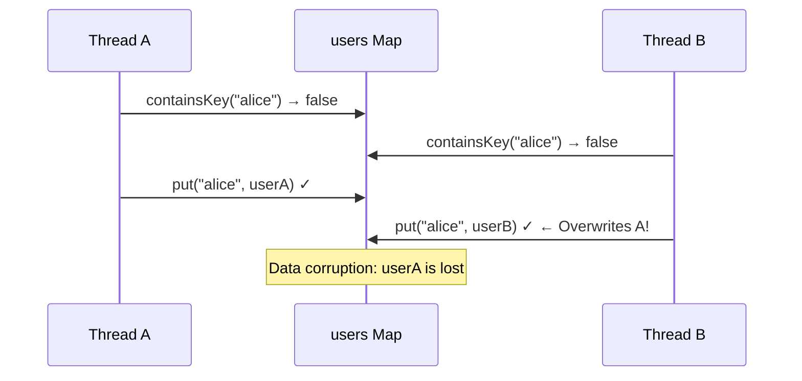
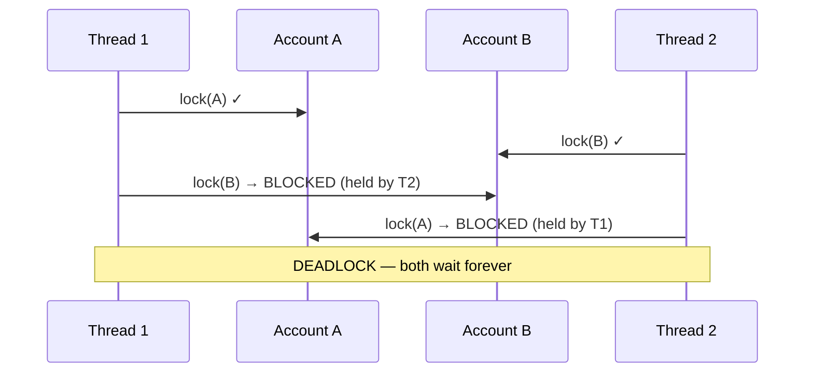

# Deadlocks and Race Conditions

Two friends each pick up one chopstick and wait for the other to put theirs down. Neither eats. Neither gives up. That's a **deadlock**. Meanwhile, two people racing to grab the last concert ticket both see "1 available" and both click "buy" — one gets a duplicate charge. That's a **race condition**.

These are the two most dangerous concurrency bugs. Deadlocks freeze your system; race conditions corrupt your data silently.

> **Interview relevance:** "How do you prevent deadlocks?", "Find the race condition in this code", "Design a transfer method between two accounts that avoids deadlock" — these are standard concurrency interview questions.

---

## Race Conditions

A race condition occurs when the correctness of a program depends on the **relative timing** of thread execution.

### Check-Then-Act Race

The most common pattern: you check a condition, then act on it — but between the check and the act, another thread changes the state.

```java
// BROKEN — classic race condition
public class UserRegistry {
    private final Map<String, User> users = new HashMap<>();

    public void registerUser(String username, User user) {
        if (!users.containsKey(username)) {   // CHECK
            // Thread B can register the same username RIGHT HERE
            users.put(username, user);          // ACT
        }
    }
}
```



**Fix:**

```java
public class UserRegistry {
    private final ConcurrentHashMap<String, User> users = new ConcurrentHashMap<>();

    public boolean registerUser(String username, User user) {
        // putIfAbsent is atomic — check and act in one operation
        return users.putIfAbsent(username, user) == null;
    }
}
```

### Read-Modify-Write Race

```java
// BROKEN — increment is not atomic
public class TicketCounter {
    private int availableTickets = 100;

    public boolean bookTicket() {
        if (availableTickets > 0) {     // READ
            availableTickets--;          // MODIFY + WRITE
            return true;
        }
        return false;
    }
}
```

**Fix with AtomicInteger:**

```java
public class TicketCounter {
    private final AtomicInteger availableTickets = new AtomicInteger(100);

    public boolean bookTicket() {
        // Atomically decrements if > 0
        int current;
        do {
            current = availableTickets.get();
            if (current <= 0) return false;
        } while (!availableTickets.compareAndSet(current, current - 1));
        return true;
    }
}
```

### Compound Action Race

When thread safety requires **multiple operations** to be atomic together:

```java
// BROKEN — even with ConcurrentHashMap, this compound operation isn't atomic
public class Cache {
    private final ConcurrentHashMap<String, ExpensiveObject> cache = new ConcurrentHashMap<>();

    public ExpensiveObject getOrCreate(String key) {
        if (!cache.containsKey(key)) {
            // Two threads may both create expensive objects
            cache.put(key, createExpensiveObject(key));
        }
        return cache.get(key);
    }
}

// FIXED — use computeIfAbsent (atomic for ConcurrentHashMap)
public class Cache {
    private final ConcurrentHashMap<String, ExpensiveObject> cache = new ConcurrentHashMap<>();

    public ExpensiveObject getOrCreate(String key) {
        return cache.computeIfAbsent(key, this::createExpensiveObject);
    }
}
```

---

## Deadlocks

A deadlock occurs when two or more threads are **blocked forever**, each waiting for a resource held by the other.

### The Four Necessary Conditions (Coffman Conditions)

All four must be present for a deadlock to occur:

| Condition | Meaning | Example |
|---|---|---|
| **Mutual Exclusion** | Resource can be held by only one thread | Only one thread can hold a lock |
| **Hold and Wait** | Thread holds one resource while waiting for another | Holds lock A, waits for lock B |
| **No Preemption** | Resource cannot be forcibly taken away | Can't steal a lock from another thread |
| **Circular Wait** | A→B→C→A cycle of waiting | Thread 1 waits for Thread 2, which waits for Thread 1 |

**Break any one condition** and deadlock becomes impossible.

### Classic Deadlock Example: Money Transfer

```java
// DEADLOCK-PRONE — lock ordering depends on call order
public class BankAccount {
    private double balance;
    private final String id;

    public synchronized void transfer(BankAccount target, double amount) {
        // Holds lock on 'this', then tries to acquire lock on 'target'
        synchronized (target) {
            if (this.balance >= amount) {
                this.balance -= amount;
                target.balance += amount;
            }
        }
    }
}
```



### Fix: Consistent Lock Ordering

```java
public class BankAccount {
    private double balance;
    private final String id;

    public void transfer(BankAccount target, double amount) {
        // Always lock the account with the smaller ID first
        BankAccount first = this.id.compareTo(target.id) < 0 ? this : target;
        BankAccount second = this.id.compareTo(target.id) < 0 ? target : this;

        synchronized (first) {
            synchronized (second) {
                if (this.balance >= amount) {
                    this.balance -= amount;
                    target.balance += amount;
                }
            }
        }
    }
}
```

**Why this works:** Every thread acquires locks in the same global order. Circular wait becomes impossible.

### Fix: Try-Lock with Timeout

```java
public class BankAccount {
    private double balance;
    private final ReentrantLock lock = new ReentrantLock();

    public boolean transfer(BankAccount target, double amount) {
        boolean gotMyLock = false;
        boolean gotTargetLock = false;
        try {
            gotMyLock = this.lock.tryLock(1, TimeUnit.SECONDS);
            gotTargetLock = target.lock.tryLock(1, TimeUnit.SECONDS);

            if (gotMyLock && gotTargetLock) {
                if (this.balance >= amount) {
                    this.balance -= amount;
                    target.balance += amount;
                    return true;
                }
            }
            return false;  // couldn't acquire both locks — retry later
        } catch (InterruptedException e) {
            Thread.currentThread().interrupt();
            return false;
        } finally {
            if (gotTargetLock) target.lock.unlock();
            if (gotMyLock) this.lock.unlock();
        }
    }
}
```

---

## Livelock

Threads are not blocked but make **no progress** — like two polite people in a hallway each stepping aside in the same direction.

```java
// Livelock: both threads keep retrying but never succeed
public void politeTransfer(BankAccount target, double amount) {
    while (true) {
        if (this.lock.tryLock()) {
            try {
                if (target.lock.tryLock()) {
                    try {
                        doTransfer(target, amount);
                        return;
                    } finally {
                        target.lock.unlock();
                    }
                }
            } finally {
                this.lock.unlock();
            }
        }
        // Both threads immediately retry → same collision
    }
}
```

**Fix:** Add randomised back-off:

```java
// Add random delay between retries
Thread.sleep(ThreadLocalRandom.current().nextInt(10, 100));
```

---

## Starvation

A thread never gets CPU time or lock access because higher-priority threads continuously preempt it.

**Causes:**
- Unfair locks always grant access to the most recently arrived thread
- Thread priority misuse
- Synchronized blocks held for too long by frequently running threads

**Fix:** Use fair locks (`new ReentrantLock(true)`) — grants access in FIFO order. Trade-off: fair locks have higher overhead.

---

## Deadlock Prevention Strategies

| Strategy | Breaks which condition | Trade-off |
|---|---|---|
| **Lock ordering** | Circular wait | Must define global ordering for all lockable resources |
| **Try-lock with timeout** | Hold and wait | Requires retry logic; may fail under high contention |
| **Single lock** | Hold and wait | Reduces concurrency; coarse-grained |
| **Lock-free algorithms** | Mutual exclusion | Complex to implement; limited applicability |
| **Actor model** | All (no shared state) | Requires architectural change |

---

## Detecting Deadlocks

### In Development

```java
// JVM can detect deadlocks — use jstack or ThreadMXBean
ThreadMXBean threadMXBean = ManagementFactory.getThreadMXBean();
long[] deadlockedThreads = threadMXBean.findDeadlockedThreads();
if (deadlockedThreads != null) {
    ThreadInfo[] infos = threadMXBean.getThreadInfo(deadlockedThreads, true, true);
    for (ThreadInfo info : infos) {
        System.err.println(info);
    }
}
```

### In Production

- Thread dumps (`kill -3 <pid>` or `jstack <pid>`)
- JMX monitoring for deadlocked threads
- Lock timeout alerts — if a lock isn't acquired within N seconds, log and alert

---

## Race Condition Prevention Checklist

| Technique | When to use |
|---|---|
| **Immutability** | When data doesn't need to change after creation |
| **Atomic classes** | Single variable read-modify-write |
| **`synchronized`** | Compound operations on multiple variables |
| **`ConcurrentHashMap` methods** | `computeIfAbsent`, `putIfAbsent`, `merge` |
| **Thread confinement** | Object used by only one thread (e.g., `ThreadLocal`) |
| **Copy-on-write** | Read-heavy, write-rare collections |

---

## Key Takeaways

1. **Race conditions** are silent — your code works 99.9% of the time, fails unpredictably under load.
2. **Deadlocks** are loud — your system freezes and never recovers.
3. **Lock ordering** is the most reliable deadlock prevention — define it once, enforce it everywhere.
4. **Atomic operations** eliminate races for simple cases — `putIfAbsent`, `compareAndSet`, `computeIfAbsent`.
5. In interviews, **always identify the race window** — point to the exact line where another thread can interleave.
