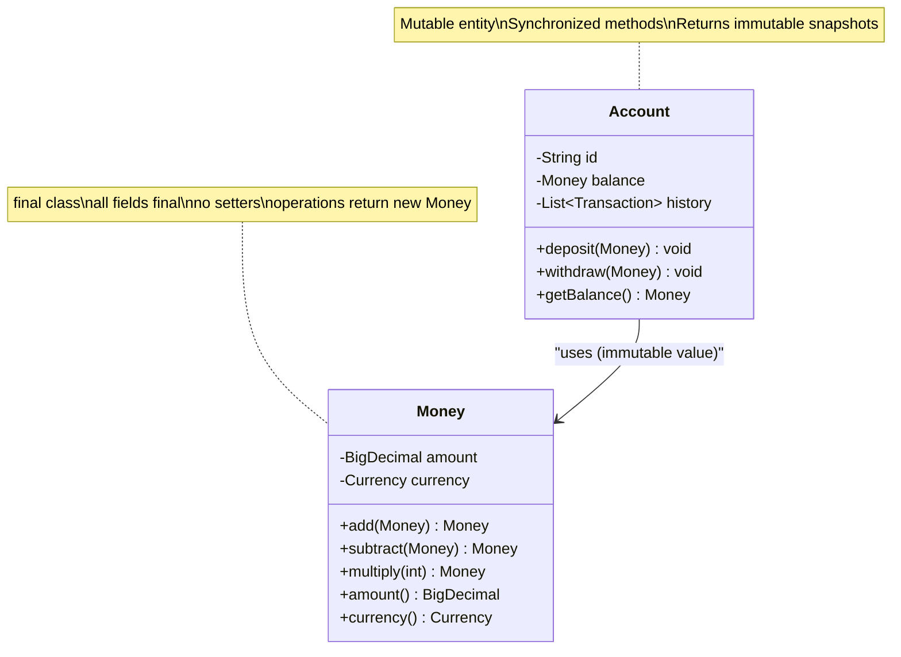

# Immutability and Thread-Safe Design

The simplest way to make code thread-safe is to remove the need for synchronization entirely. An immutable object **cannot be corrupted** by concurrent access because no thread can modify it. It's like giving everyone a photocopy of a document instead of passing around the original — no coordination needed.

> **Interview relevance:** "How would you make this class thread-safe?" — the strongest answer often starts with "I'd make it immutable." Interviewers respect this because it shows you understand that the best synchronization is no synchronization.

---

## What Makes a Class Immutable?

An immutable class satisfies **all** of these:

1. **All fields are `final`** — assigned once, never reassigned
2. **All fields are private** — no external mutation
3. **No setter methods** — no way to change state after construction
4. **The class itself is `final`** — prevents subclasses from adding mutable state
5. **No leaking of mutable internal state** — don't return references to mutable fields

```java
// Fully immutable class
public final class Money {
    private final BigDecimal amount;
    private final Currency currency;

    public Money(BigDecimal amount, Currency currency) {
        this.amount = amount;
        this.currency = currency;
    }

    public Money add(Money other) {
        if (!this.currency.equals(other.currency)) {
            throw new IllegalArgumentException("Currency mismatch");
        }
        // Returns a NEW object — doesn't modify this one
        return new Money(this.amount.add(other.amount), this.currency);
    }

    public BigDecimal amount() { return amount; }       // BigDecimal is immutable
    public Currency currency() { return currency; }     // Currency is immutable

    @Override
    public boolean equals(Object o) {
        if (this == o) return true;
        if (!(o instanceof Money m)) return false;
        return amount.equals(m.amount) && currency.equals(m.currency);
    }

    @Override
    public int hashCode() {
        return Objects.hash(amount, currency);
    }
}
```

### The Mutable Field Trap

```java
// BROKEN immutability — leaks mutable state
public final class Event {
    private final String name;
    private final Date startTime;  // Date is MUTABLE!

    public Event(String name, Date startTime) {
        this.name = name;
        this.startTime = startTime;  // stores the reference directly
    }

    public Date getStartTime() {
        return startTime;  // caller can modify: event.getStartTime().setYear(2099)
    }
}

// FIXED — defensive copies
public final class Event {
    private final String name;
    private final Instant startTime;  // Use Instant (immutable) instead of Date

    public Event(String name, Instant startTime) {
        this.name = name;
        this.startTime = startTime;  // Instant is immutable — safe
    }

    public Instant getStartTime() {
        return startTime;
    }
}
```

### Defensive Copies for Collections

```java
public final class Order {
    private final String orderId;
    private final List<OrderItem> items;

    public Order(String orderId, List<OrderItem> items) {
        this.orderId = orderId;
        // Defensive copy — caller can't modify our list
        this.items = List.copyOf(items);  // Java 10+ unmodifiable copy
    }

    public List<OrderItem> items() {
        return items;  // already unmodifiable — safe to return directly
    }
}
```

---

## Immutable vs Mutable: Design Trade-offs

| Aspect | Immutable | Mutable |
|---|---|---|
| **Thread safety** | Free — no synchronization needed | Requires locks or atomics |
| **Reasoning** | Easy — state never changes after construction | Hard — state depends on call history |
| **Performance** | Object creation overhead | In-place updates |
| **Memory** | More objects (GC pressure) | Fewer objects |
| **Use case** | Value objects, configuration, messages | Stateful services, accumulators |

**When to choose immutable:**
- Value objects (Money, Address, Coordinate)
- DTOs and messages passed between threads
- Configuration objects
- Cache keys and map keys (hashCode must never change)
- Any object shared between threads where you can afford object creation

**When mutable is necessary:**
- Objects with identity and lifecycle (Entity objects like Order, User)
- Performance-critical paths with tight allocation budgets
- Builders (mutable during construction, then frozen)

---

## The Builder Pattern for Immutable Objects

When an immutable class has many fields, constructors become unwieldy. Use a mutable **Builder** that produces an immutable result:

```java
public final class HttpRequest {
    private final String method;
    private final String url;
    private final Map<String, String> headers;
    private final byte[] body;

    private HttpRequest(Builder builder) {
        this.method = builder.method;
        this.url = builder.url;
        this.headers = Map.copyOf(builder.headers);
        this.body = builder.body != null ? builder.body.clone() : null;
    }

    public String method() { return method; }
    public String url() { return url; }
    public Map<String, String> headers() { return headers; }

    public static class Builder {
        private String method = "GET";
        private String url;
        private final Map<String, String> headers = new HashMap<>();
        private byte[] body;

        public Builder url(String url) { this.url = url; return this; }
        public Builder method(String method) { this.method = method; return this; }
        public Builder header(String key, String value) {
            headers.put(key, value); return this;
        }
        public Builder body(byte[] body) { this.body = body; return this; }

        public HttpRequest build() {
            Objects.requireNonNull(url, "URL is required");
            return new HttpRequest(this);
        }
    }
}

// Usage — builder is mutable, result is immutable
HttpRequest request = new HttpRequest.Builder()
    .url("https://api.example.com/users")
    .method("POST")
    .header("Content-Type", "application/json")
    .body(jsonBytes)
    .build();
```

---

## Thread-Safe Design Strategies

When immutability isn't possible, use these strategies in order of preference:

### 1. Thread Confinement

Don't share the object between threads. If only one thread ever accesses it, no synchronization is needed.

```java
// ThreadLocal — each thread gets its own instance
public class DateFormatProvider {
    // SimpleDateFormat is NOT thread-safe, but each thread gets its own
    private static final ThreadLocal<SimpleDateFormat> FORMAT =
        ThreadLocal.withInitial(() -> new SimpleDateFormat("yyyy-MM-dd"));

    public static String format(Date date) {
        return FORMAT.get().format(date);
    }
}
```

### 2. Effectively Immutable + Safe Publication

Object is mutable during construction, then never modified. Published safely to other threads via volatile, final field, or concurrent collection.

```java
public class Configuration {
    // volatile ensures other threads see the fully constructed object
    private volatile Settings currentSettings;

    public void reload() {
        Settings newSettings = loadFromFile();  // mutable during construction
        // After this assignment, newSettings is effectively immutable
        currentSettings = newSettings;  // safe publication via volatile
    }

    public Settings getSettings() {
        return currentSettings;  // safe to read without locks
    }
}
```

### 3. Copy-on-Write

Mutating operations create a new copy. Reads never block.

```java
// CopyOnWriteArrayList — perfect for listener lists (read-heavy, write-rare)
private final CopyOnWriteArrayList<EventListener> listeners = new CopyOnWriteArrayList<>();

public void addEventListener(EventListener listener) {
    listeners.add(listener);  // creates a new internal array (expensive)
}

public void fireEvent(Event event) {
    // No locking needed — iterates over a snapshot
    for (EventListener listener : listeners) {
        listener.onEvent(event);
    }
}
```

### 4. Unmodifiable Wrappers + Volatile Reference

```java
public class FeatureFlags {
    private volatile Map<String, Boolean> flags = Map.of();  // starts empty

    // Called by admin — replaces entire map atomically
    public void updateFlags(Map<String, Boolean> newFlags) {
        this.flags = Map.copyOf(newFlags);  // immutable snapshot
    }

    // Called by every request — no locking needed
    public boolean isEnabled(String flag) {
        return flags.getOrDefault(flag, false);
    }
}
```

---

## The Immutable Object Pattern in LLD Interviews



**Pattern:** Entities are mutable (they have lifecycle). Value objects are immutable (they're interchangeable by value). Pass immutable objects between threads; synchronize access to entities.

---

## Java Records (Java 16+) — Immutable Value Objects

```java
// Records are immutable by default — fields are final, no setters
public record Coordinate(double latitude, double longitude) {
    // Compact constructor for validation
    public Coordinate {
        if (latitude < -90 || latitude > 90)
            throw new IllegalArgumentException("Invalid latitude");
        if (longitude < -180 || longitude > 180)
            throw new IllegalArgumentException("Invalid longitude");
    }

    public double distanceTo(Coordinate other) {
        // Haversine formula
        return calculateHaversine(this, other);
    }
}
```

---

## Key Takeaways

1. **Immutability is the #1 thread-safety strategy** — no locks, no races, no complexity.
2. **Value objects should always be immutable** — `Money`, `Address`, `DateRange`, `Coordinate`.
3. **Defensive copies** prevent accidental mutation via shared references.
4. **Builder pattern** makes immutable objects with many fields ergonomic.
5. **Prefer strategies in order:** immutability → confinement → copy-on-write → synchronization.
6. In interviews, **identify which objects are values (immutable) and which are entities (mutable)** — this shows mature design thinking.
