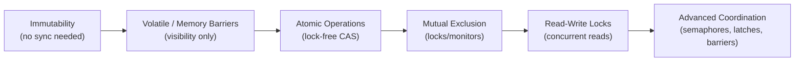
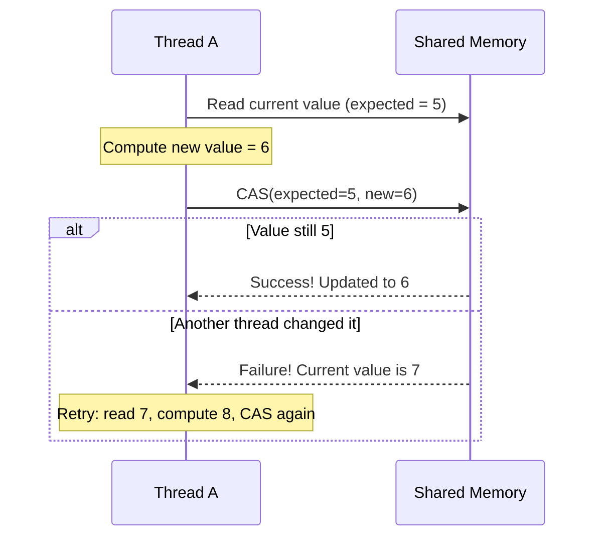
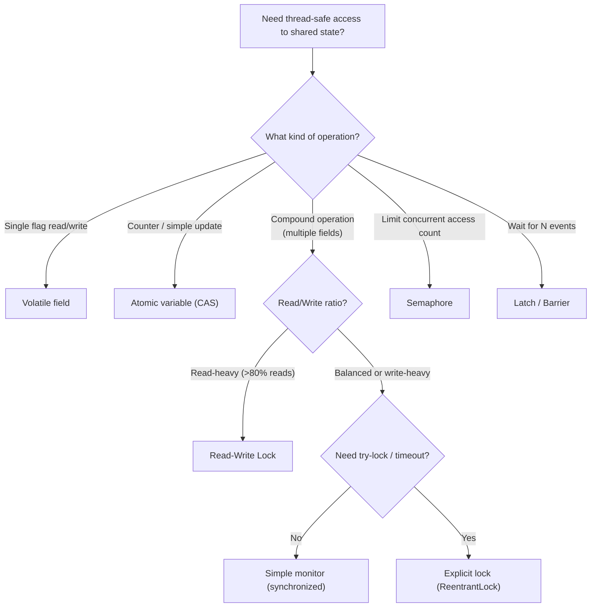

# Synchronization Mechanisms

When two people try to walk through the same narrow doorway simultaneously, they collide. A **lock** is like a sign that says "occupied" — one person enters, the other waits. Synchronization mechanisms are the tools that coordinate thread access to shared resources — and choosing the right one is a core **design decision** in concurrent LLD.

> **Interview relevance:** "How would you make this class thread-safe?", "What's the difference between a mutex and a read-write lock?", "When would you use lock-free programming?" — these questions directly test your understanding of coordination primitives.

---

## The Spectrum of Synchronization

From simplest to most complex:



**Design principle:** Always choose the **simplest** mechanism that solves your problem. Don't use locks when immutability works. Don't use a full mutex when an atomic variable suffices.

---

## Mutual Exclusion (Locks / Monitors)

The most fundamental mechanism: only one thread at a time can execute the protected code.

### Concept: Critical Section

A **critical section** is a block of code that accesses shared mutable state. Only one thread should be in a critical section for a given resource at any time.

```java
public class BankAccount {
    private double balance;

    // Only one thread can execute this method at a time (per instance)
    public synchronized void deposit(double amount) {
        if (amount <= 0) throw new IllegalArgumentException("Amount must be positive");
        balance += amount;
    }

    public synchronized void withdraw(double amount) {
        if (amount > balance) throw new InsufficientFundsException(balance, amount);
        balance -= amount;
    }

    public synchronized double getBalance() {
        return balance;
    }
}
```

**What happens under the hood:**
1. Thread A calls `deposit()` → acquires the lock on `this`
2. Thread B calls `withdraw()` → tries to acquire the same lock → **blocks**
3. Thread A finishes `deposit()` → releases the lock
4. Thread B acquires the lock → proceeds with `withdraw()`

### Fine-Grained Locking

Locking at the object level is simple but coarse. When unrelated operations share the same lock, concurrency suffers. Fine-grained locking protects each independent piece of state with its own lock:

```java
public class Inventory {
    private final Map<String, Integer> stock = new HashMap<>();
    private final Object stockLock = new Object();  // dedicated lock

    private final List<String> auditLog = new ArrayList<>();
    private final Object auditLock = new Object();  // separate lock

    public void addStock(String productId, int quantity) {
        synchronized (stockLock) {
            stock.merge(productId, quantity, Integer::sum);
        }
        // Audit logging doesn't block stock operations
        synchronized (auditLock) {
            auditLog.add("Added " + quantity + " of " + productId);
        }
    }
}
```

**Design trade-off:** More locks = more concurrency but more complexity and more risk of deadlocks. Fewer locks = simpler reasoning but lower throughput.

---

## Volatile Fields / Memory Barriers

A **volatile** field (or equivalent memory barrier) solves the **visibility** problem without mutual exclusion. When one thread writes a volatile field, all other threads immediately see the new value.

```java
public class GracefulShutdown {
    private volatile boolean running = true;  // visible across threads

    public void stop() {
        running = false;  // immediately visible to all threads
    }

    public void run() {
        while (running) {  // always reads fresh value
            doWork();
        }
    }
}
```

### When Volatile Is Sufficient vs Insufficient

| Use case | Volatile works? | Reason |
|---|---|---|
| Boolean flag (stop signal) | Yes | Single writer, readers only check |
| Published reference (write once) | Yes | Publish once, then read-only |
| Counter (`count++`) | **No** | Read-modify-write is not atomic |
| Check-then-act (`if (x == null) x = new...`) | **No** | Compound operation — gap between check and act |

**Rule of thumb:** Volatile works when there's exactly one writer OR the operation is a single read/write (not read-modify-write).

---

## Atomic Operations (Lock-Free / CAS)

Atomic operations provide **atomicity without locks** using hardware-level Compare-And-Swap (CAS) instructions. They're the foundation of lock-free programming.

### How CAS Works (Any Language)



**Key insight:** CAS never blocks. If it fails (another thread modified the value), it **retries**. Under low contention, this is faster than locks because no thread ever waits.

```java
import java.util.concurrent.atomic.AtomicInteger;

public class ThreadSafeCounter {
    private final AtomicInteger count = new AtomicInteger(0);

    public void increment() {
        count.incrementAndGet();  // atomic CAS under the hood
    }

    public int getCount() {
        return count.get();
    }
}
```

### Atomic Operations in LLD Design

| Type | Use case in LLD |
|---|---|
| Atomic counter | Request rate limiter, connection pool size |
| Atomic boolean | One-time initialisation flag, shutdown signal |
| Atomic reference | Lock-free cache entry update, immutable snapshot swap |
| Accumulator (LongAdder) | High-contention metric counters (many threads incrementing) |

### Lock-Free vs Lock-Based: Trade-offs

| Aspect | Lock-free (CAS) | Lock-based |
|---|---|---|
| **Throughput under low contention** | Higher (no lock overhead) | Lower (lock acquire/release) |
| **Throughput under high contention** | Degrades (spinning/retries) | Stable (threads queue) |
| **Complexity** | Higher (ABA problem, retry loops) | Lower (acquire, do work, release) |
| **Starvation risk** | Possible (thread may retry forever) | Preventable with fair locks |
| **Use case** | Simple atomic updates | Compound multi-step operations |

---

## Reentrant Locks — Explicit Lock Control

When you need more control than a basic monitor provides — non-blocking attempts, timeouts, multiple wait conditions — use an explicit lock:

```java
import java.util.concurrent.locks.ReentrantLock;
import java.util.concurrent.locks.Condition;

public class BoundedBuffer<T> {
    private final Object[] items;
    private int count, putIndex, takeIndex;

    private final ReentrantLock lock = new ReentrantLock();
    private final Condition notFull = lock.newCondition();
    private final Condition notEmpty = lock.newCondition();

    public BoundedBuffer(int capacity) {
        items = new Object[capacity];
    }

    public void put(T item) throws InterruptedException {
        lock.lock();
        try {
            while (count == items.length) {
                notFull.await();  // release lock and wait until space available
            }
            items[putIndex] = item;
            putIndex = (putIndex + 1) % items.length;
            count++;
            notEmpty.signal();  // wake one consumer
        } finally {
            lock.unlock();  // ALWAYS in finally — prevents lock leaks
        }
    }

    @SuppressWarnings("unchecked")
    public T take() throws InterruptedException {
        lock.lock();
        try {
            while (count == 0) {
                notEmpty.await();
            }
            T item = (T) items[takeIndex];
            takeIndex = (takeIndex + 1) % items.length;
            count--;
            notFull.signal();
            return item;
        } finally {
            lock.unlock();
        }
    }
}
```

### Basic Monitor vs Explicit Lock: When to Choose

| Feature | Basic monitor (`synchronized`) | Explicit lock (`ReentrantLock`) |
|---|---|---|
| Simplicity | Simple, less error-prone | Must manually lock/unlock |
| Try-lock (non-blocking) | Not supported | `tryLock()` — returns immediately |
| Timeout | Not supported | `tryLock(time, unit)` |
| Interruptible wait | Not supported | `lockInterruptibly()` |
| Multiple conditions | One wait-set per monitor | Multiple `Condition` objects |
| Fairness | No fairness guarantee | Fair mode available |
| Auto-release | Released when block exits | Must call `unlock()` in `finally` |

**Guideline:** Use basic monitors by default. Switch to explicit locks only when you need try-lock, timeout, interruptibility, multiple conditions, or fairness.

---

## Read-Write Locks — Optimising Read-Heavy Workloads

Most shared data structures in LLD are **read frequently, written rarely** (caches, catalogs, configuration). A read-write lock allows **concurrent reads** but **exclusive writes**.

```java
import java.util.concurrent.locks.ReadWriteLock;
import java.util.concurrent.locks.ReentrantReadWriteLock;

public class ThreadSafeCache<K, V> {
    private final Map<K, V> cache = new HashMap<>();
    private final ReadWriteLock rwLock = new ReentrantReadWriteLock();

    public V get(K key) {
        rwLock.readLock().lock();  // multiple readers hold this simultaneously
        try {
            return cache.get(key);
        } finally {
            rwLock.readLock().unlock();
        }
    }

    public void put(K key, V value) {
        rwLock.writeLock().lock();  // exclusive — no readers or writers
        try {
            cache.put(key, value);
        } finally {
            rwLock.writeLock().unlock();
        }
    }
}
```

### When Read-Write Locks Help

| Workload | Best choice | Why |
|---|---|---|
| 90%+ reads | Read-write lock | Readers don't block each other |
| Balanced reads and writes | Simple mutex | RW lock overhead not justified |
| Very short critical sections | Simple mutex | Lock overhead dominates |

---

## Semaphore — Controlling Concurrent Access Count

A **semaphore** limits the number of threads that can access a resource simultaneously. Think of it as a parking lot with N spaces — the N+1th car must wait.

```java
import java.util.concurrent.Semaphore;

public class ConnectionPool {
    private final Semaphore semaphore;
    private final Queue<Connection> pool;

    public ConnectionPool(int maxConnections) {
        this.semaphore = new Semaphore(maxConnections);
        this.pool = new ConcurrentLinkedQueue<>();
        for (int i = 0; i < maxConnections; i++) {
            pool.add(createConnection());
        }
    }

    public Connection acquire() throws InterruptedException {
        semaphore.acquire();  // blocks if all permits taken
        return pool.poll();
    }

    public void release(Connection conn) {
        pool.offer(conn);
        semaphore.release();  // return permit
    }
}
```

### LLD Use Cases for Semaphores

- Database connection pools (limit active connections)
- Rate limiters (N requests per time window)
- Thread pool bounded execution (limit concurrent tasks)

---

## Coordination Primitives

Beyond locks, concurrent systems need **coordination** — "wait until X happens":

| Primitive | Concept | LLD use case |
|---|---|---|
| **CountDownLatch** | Wait for N events to happen | Service startup: wait for all subsystems to initialise |
| **CyclicBarrier** | N threads wait for each other at a rendezvous point | Parallel computation phases |
| **Phaser** | Multi-phase coordination (reusable barrier) | Staged pipeline processing |

```java
// Wait for all microservices to initialise before accepting traffic
public class ServiceInitializer {
    private final CountDownLatch latch;

    public ServiceInitializer(int serviceCount) {
        this.latch = new CountDownLatch(serviceCount);
    }

    public void serviceReady() { latch.countDown(); }

    public void awaitAllReady() throws InterruptedException {
        latch.await();  // blocks until count reaches zero
    }
}
```

---

## Choosing the Right Mechanism — Design Decision Tree



---

## Lock Granularity: A Design Spectrum

| Granularity | Example | Concurrency | Complexity | Deadlock risk |
|---|---|---|---|---|
| **Coarse** (one lock per system) | Global lock | Lowest | Lowest | None |
| **Object-level** (one lock per instance) | `synchronized` method | Medium | Low | Low |
| **Field-level** (one lock per field group) | Separate stockLock, auditLock | High | Medium | Medium |
| **Stripe-level** (N locks for M items) | `ConcurrentHashMap` segments | Highest | Highest | Higher |

**Design guideline:** Start coarse, refine to finer granularity **only when profiling shows contention**.

---

## Common Design Mistakes

1. **Locking on the wrong object:** A new lock object per call (`synchronized(new Object())`) provides zero protection.
2. **Forgetting to release:** Explicit locks without `try/finally` lead to lock leaks on exceptions.
3. **Over-synchronising:** Making every method synchronised when only some share state — kills throughput.
4. **Locking on mutable fields:** If the lock reference changes, threads may hold different locks.
5. **Using volatile for compound operations:** Volatile doesn't make `count++` atomic — it's still read-modify-write.

---

## Key Takeaways

1. **Start with the simplest mechanism** that solves your problem — immutability first, then volatile, then atomics, then locks.
2. **Lock granularity is a design decision** — too coarse reduces concurrency, too fine increases complexity and deadlock risk.
3. **Always release locks in `finally`** blocks when using explicit locks.
4. **Separate unrelated locks** — don't use a single lock for independent state.
5. **Read-heavy workloads** (caches, catalogs) benefit dramatically from read-write locks.
6. In LLD, **state your synchronisation choice and justify it** — "This cache is read-heavy, so I'll use a ReadWriteLock to allow concurrent reads."
