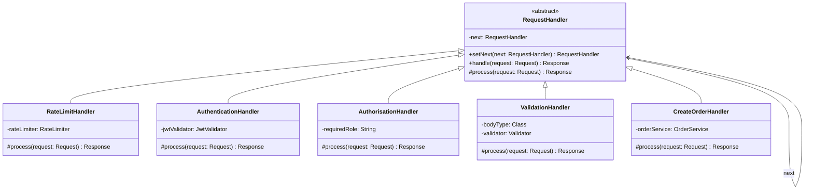
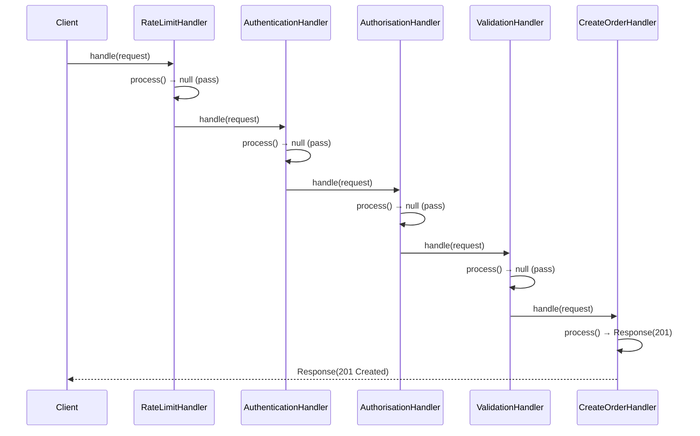
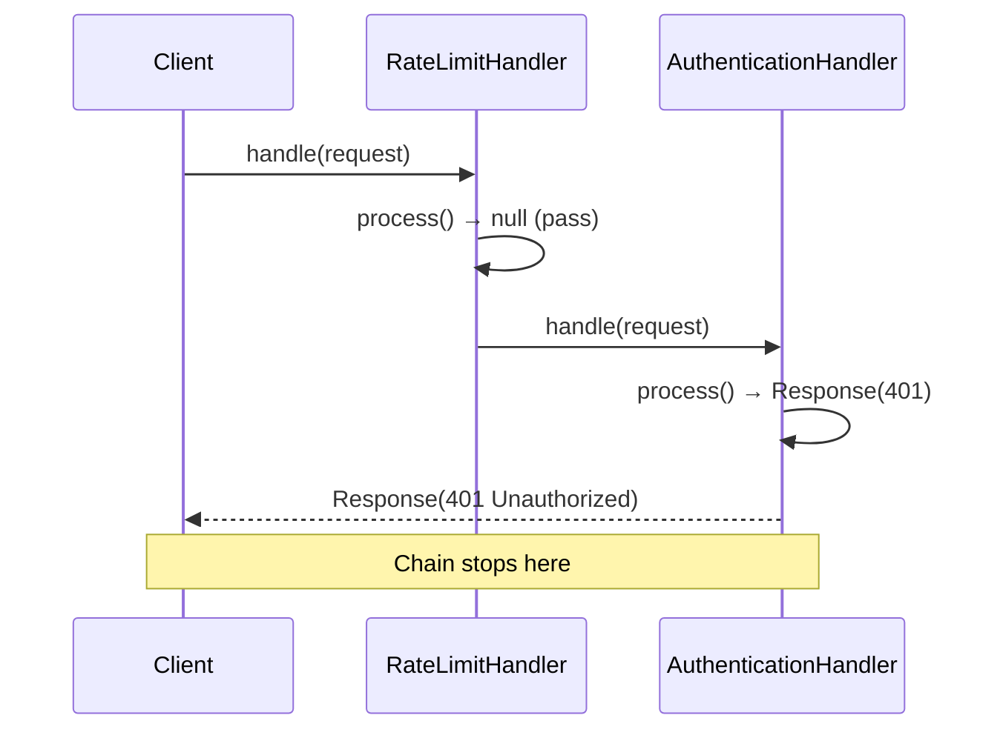

# Chain of Responsibility Pattern

> *"Avoid coupling the sender of a request to its receiver by giving more than one object a chance to handle the request. Chain the receiving objects and pass the request along the chain until an object handles it."*
> — GoF Design Patterns

Chain of Responsibility (CoR) models a pipeline where a request travels through a sequence of handlers. Each handler decides whether to process the request, pass it to the next handler, or stop the chain. This decouples the sender from knowing which handler will ultimately respond.

---

## The Problem it Solves

An HTTP API needs to process incoming requests through a series of concerns: rate limiting, authentication, authorisation, input validation, and finally the business logic. Without a pattern:

```java
public class OrderController {

    public Response createOrder(Request request) {
        // Rate limiting — embedded directly
        if (rateLimiter.isExceeded(request.getClientIp())) {
            return Response.tooManyRequests();
        }

        // Authentication
        String token = request.getHeader("Authorization");
        if (token == null || !jwtValidator.isValid(token)) {
            return Response.unauthorized("Invalid token");
        }

        // Authorisation
        User user = jwtValidator.extractUser(token);
        if (!user.hasRole("ORDER_CREATE")) {
            return Response.forbidden("Insufficient privileges");
        }

        // Input validation
        if (!orderValidator.isValid(request.getBody())) {
            return Response.badRequest("Invalid order data");
        }

        // Actual business logic
        Order order = orderService.createOrder(request.getBody(), user);
        return Response.created(order);
    }
}
```

Problems:
1. Every endpoint repeats the same concern blocks
2. Changing the order of checks, or adding a new one, touches every endpoint
3. The controller is responsible for concerns (rate limiting, auth) that aren't its business

---

## Complete Implementation

### Step 1 — Define the Handler Interface

```java
public abstract class RequestHandler {
    private RequestHandler next;

    // Fluent chain builder
    public RequestHandler setNext(RequestHandler next) {
        this.next = next;
        return next;
    }

    // Process or pass to next
    public final Response handle(Request request) {
        Response response = process(request);
        if (response != null) {
            return response;   // this handler produced a response — chain stops
        }
        if (next != null) {
            return next.handle(request);   // pass to next handler
        }
        return Response.notFound("No handler produced a response");
    }

    // Subclasses implement their specific concern
    // Return null to pass to next handler; return Response to stop the chain
    protected abstract Response process(Request request);
}
```

### Step 2 — Implement Each Handler

```java
public class RateLimitHandler extends RequestHandler {
    private final RateLimiter rateLimiter;

    public RateLimitHandler(RateLimiter rateLimiter) {
        this.rateLimiter = rateLimiter;
    }

    @Override
    protected Response process(Request request) {
        if (rateLimiter.isExceeded(request.getClientIp())) {
            return Response.tooManyRequests("Rate limit exceeded");
        }
        return null;   // not exceeded — pass through
    }
}

public class AuthenticationHandler extends RequestHandler {
    private final JwtValidator jwtValidator;

    public AuthenticationHandler(JwtValidator jwtValidator) {
        this.jwtValidator = jwtValidator;
    }

    @Override
    protected Response process(Request request) {
        String token = request.getHeader("Authorization");
        if (token == null || !token.startsWith("Bearer ")) {
            return Response.unauthorized("Missing or malformed token");
        }
        String jwt = token.substring(7);
        if (!jwtValidator.isValid(jwt)) {
            return Response.unauthorized("Invalid or expired token");
        }
        // Attach user to request context for downstream handlers
        request.setAttribute("user", jwtValidator.extractUser(jwt));
        return null;   // authenticated — continue
    }
}

public class AuthorisationHandler extends RequestHandler {
    private final String requiredRole;

    public AuthorisationHandler(String requiredRole) {
        this.requiredRole = requiredRole;
    }

    @Override
    protected Response process(Request request) {
        User user = (User) request.getAttribute("user");
        if (user == null || !user.hasRole(requiredRole)) {
            return Response.forbidden("Required role: " + requiredRole);
        }
        return null;   // authorised — continue
    }
}

public class ValidationHandler<T> extends RequestHandler {
    private final Class<T>    bodyType;
    private final Validator<T> validator;

    public ValidationHandler(Class<T> bodyType, Validator<T> validator) {
        this.bodyType  = bodyType;
        this.validator = validator;
    }

    @Override
    protected Response process(Request request) {
        T body;
        try {
            body = Json.parse(request.getBody(), bodyType);
        } catch (JsonParseException e) {
            return Response.badRequest("Invalid JSON: " + e.getMessage());
        }
        List<String> errors = validator.validate(body);
        if (!errors.isEmpty()) {
            return Response.badRequest("Validation failed", errors);
        }
        request.setAttribute("parsedBody", body);
        return null;   // valid — continue
    }
}

// Terminal handler — the actual business logic at the end of the chain
public class CreateOrderHandler extends RequestHandler {
    private final OrderService orderService;

    public CreateOrderHandler(OrderService orderService) {
        this.orderService = orderService;
    }

    @Override
    protected Response process(Request request) {
        User             user = (User) request.getAttribute("user");
        CreateOrderRequest body = (CreateOrderRequest) request.getAttribute("parsedBody");
        Order order = orderService.createOrder(body, user);
        return Response.created(order);
    }
}
```

### Step 3 — Assemble and Use the Chain

```java
// Build the chain once at startup
RequestHandler createOrderChain =
    new RateLimitHandler(rateLimiter);

createOrderChain
    .setNext(new AuthenticationHandler(jwtValidator))
    .setNext(new AuthorisationHandler("ORDER_CREATE"))
    .setNext(new ValidationHandler<>(CreateOrderRequest.class, orderValidator))
    .setNext(new CreateOrderHandler(orderService));

// Route-specific chain — different auth requirements
RequestHandler adminChain =
    new RateLimitHandler(adminRateLimiter);

adminChain
    .setNext(new AuthenticationHandler(jwtValidator))
    .setNext(new AuthorisationHandler("ADMIN"))
    .setNext(new AdminHandler(adminService));

// Using the chain
Response response = createOrderChain.handle(request);
```

---

## Class Diagram



---

## Sequence Diagram



A failing case (unauthenticated):



---

## Variant: All Handlers Run (Filter Chain)

Sometimes every handler should run regardless (logging, metrics, request transformation):

```java
public abstract class Filter {
    private Filter next;

    public Filter setNext(Filter next) {
        this.next = next;
        return next;
    }

    public final void doFilter(Request request, Response response) {
        before(request, response);
        if (next != null) {
            next.doFilter(request, response);
        }
        after(request, response);    // runs on the way back up the chain
    }

    protected void before(Request request, Response response) {}
    protected void after(Request request, Response response)  {}
}

public class LoggingFilter extends Filter {
    @Override
    protected void before(Request req, Response res) {
        req.setAttribute("startTime", System.currentTimeMillis());
        log.info(">> {} {}", req.getMethod(), req.getPath());
    }

    @Override
    protected void after(Request req, Response res) {
        long duration = System.currentTimeMillis() - (long) req.getAttribute("startTime");
        log.info("<< {} {}ms", res.getStatus(), duration);
    }
}
```

This is exactly how `javax.servlet.Filter` works — every filter runs; each calls `chain.doFilter()` to pass control forward, then gets control back when the chain returns.

---

## CoR in the Java Ecosystem

| Example | Handler type |
|---|---|
| `javax.servlet.Filter` | All handlers run (filter chain) |
| Spring Security filter chain | Mix: some stop chain (auth failure), some pass through |
| Logback/SLF4J appenders | Log records filtered by level |
| Java exception handler chain (`try/catch`) | First matching `catch` handles the exception |
| Spring `HandlerInterceptor` | Preprocess + postprocess each request |

---

## CoR vs Other Patterns

| | Chain of Responsibility | Decorator | Strategy |
|---|---|---|---|
| **Each handler knows next?** | Yes — forms a chain | Yes — wraps recursively | No — selected by context |
| **Any handler can stop chain?** | Yes | No — always delegates | N/A |
| **Multiple handlers per request?** | May be (filter variant) or one (stop variant) | All run | Exactly one |
| **Use when** | Pipeline with early exits | Adding behaviour around one object | Selecting one algorithm |

---

## When to Use Chain of Responsibility

**Use it when:**
- Multiple handlers may process a request, and the correct handler isn't known upfront
- You want to decouple the request sender from its handler
- The set of handlers should be configurable or extensible without changing existing handlers
- A request must pass through a series of processing steps (pipeline)

**Don't use it when:**
- Exactly one handler always handles the request — just call it directly
- The chain is static and always runs all handlers — consider a list of handlers iterated directly
- Performance is critical — the indirection of the chain adds method call overhead per handler

---

## Key Takeaways

- Chain of Responsibility decouples **who sends** a request from **who handles** it — senders just fire at the chain head
- Two variants: **stop** (first handler that handles it wins) and **filter** (all handlers run, each adding to the pipeline)
- The `setNext()` fluent builder is the idiomatic Java way to assemble chains
- Java Servlet Filters and Spring Security's filter chain are CoR at industrial scale
- Each handler is an independently testable, single-responsibility class — adding a new concern means adding one class, not editing existing ones
