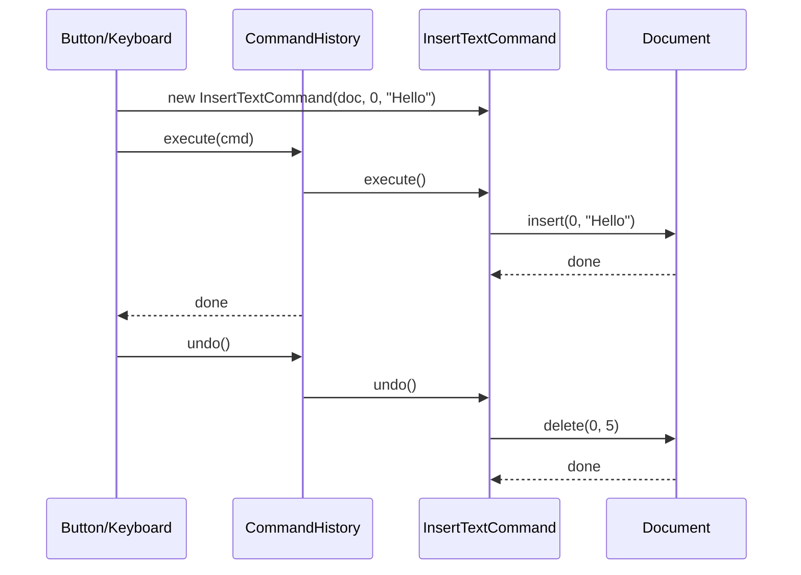

# Command Pattern

> *"Encapsulate a request as an object, thereby letting you parameterise clients with different requests, queue or log requests, and support undoable operations."*
> — GoF Design Patterns

Command elevates a request or action from a plain method call into a **first-class object**. Once a request is an object, it can be stored, queued, logged, composed, executed later, and — crucially — **undone**.

---

## The Problem it Solves

A text editor supports typing, deleting, bold, and undo. The naïve implementation couples the UI directly to the document:

```java
// Button handler — knows about the document's internals
boldButton.addActionListener(e -> {
    TextSelection selection = editor.getSelection();
    editor.applyFormat(selection, "bold");
    undoStack.push(/* what exactly? */);
});
```

Problems:
1. **Undo requires knowing how to reverse** every operation — logic scattered across all handlers
2. **No way to batch or queue** operations for deferred execution
3. **No history** — you can't replay or inspect what happened
4. Keyboard shortcut and toolbar button for "bold" **duplicate the logic**

With Command: every action is an object with an `execute()` method and an `undo()` method. The editor, button, and keyboard shortcut all create the same Command object and hand it to the history manager.

---

## Complete Implementation: Text Editor

```java
// Command interface — the core abstraction
public interface Command {
    void execute();
    void undo();
    String description();
}

// The Receiver — does the actual work
public class Document {
    private final StringBuilder content = new StringBuilder();

    public void insert(int position, String text) {
        content.insert(position, text);
    }

    public void delete(int position, int length) {
        content.delete(position, position + length);
    }

    public void applyStyle(int start, int end, TextStyle style) {
        // Apply bold/italic/underline to range
    }

    public void removeStyle(int start, int end, TextStyle style) {
        // Remove style from range
    }

    public String getContent() { return content.toString(); }
    public int    length()     { return content.length(); }
}

// Concrete commands — each encapsulates one reversible operation
public class InsertTextCommand implements Command {
    private final Document document;
    private final int      position;
    private final String   text;

    public InsertTextCommand(Document document, int position, String text) {
        this.document = document;
        this.position = position;
        this.text     = text;
    }

    @Override
    public void execute() {
        document.insert(position, text);
    }

    @Override
    public void undo() {
        document.delete(position, text.length());
    }

    @Override
    public String description() {
        return "Insert '" + text + "' at " + position;
    }
}

public class DeleteTextCommand implements Command {
    private final Document document;
    private final int      position;
    private final int      length;
    private String         deletedText;  // captured on execute for undo

    public DeleteTextCommand(Document document, int position, int length) {
        this.document = document;
        this.position = position;
        this.length   = length;
    }

    @Override
    public void execute() {
        deletedText = document.getContent().substring(position, position + length);
        document.delete(position, length);
    }

    @Override
    public void undo() {
        if (deletedText == null) throw new IllegalStateException("Command was never executed");
        document.insert(position, deletedText);
    }

    @Override
    public String description() {
        return "Delete " + length + " chars at " + position;
    }
}

public class ApplyStyleCommand implements Command {
    private final Document  document;
    private final int       start;
    private final int       end;
    private final TextStyle style;

    public ApplyStyleCommand(Document document, int start, int end, TextStyle style) {
        this.document = document;
        this.start    = start;
        this.end      = end;
        this.style    = style;
    }

    @Override
    public void execute() { document.applyStyle(start, end, style); }

    @Override
    public void undo()    { document.removeStyle(start, end, style); }

    @Override
    public String description() { return "Apply " + style + " to [" + start + ".." + end + "]"; }
}
```

```java
// Macro Command — composites multiple commands into one undoable unit
public class MacroCommand implements Command {
    private final List<Command> commands;
    private final String        label;

    public MacroCommand(String label, List<Command> commands) {
        this.label    = label;
        this.commands = List.copyOf(commands);
    }

    @Override
    public void execute() {
        commands.forEach(Command::execute);
    }

    @Override
    public void undo() {
        // Undo in reverse order
        List<Command> reversed = new ArrayList<>(commands);
        Collections.reverse(reversed);
        reversed.forEach(Command::undo);
    }

    @Override
    public String description() { return label + " (" + commands.size() + " steps)"; }
}
```

```java
// Invoker — holds the command history, manages undo/redo
public class CommandHistory {
    private final Deque<Command> undoStack = new ArrayDeque<>();
    private final Deque<Command> redoStack = new ArrayDeque<>();
    private static final int     MAX_HISTORY = 100;

    public void execute(Command command) {
        command.execute();
        undoStack.push(command);
        redoStack.clear();   // redo history invalidated after new command
        if (undoStack.size() > MAX_HISTORY) {
            // Remove oldest — we'd need a LinkedList to remove from bottom; for brevity: trim
        }
    }

    public void undo() {
        if (undoStack.isEmpty()) throw new IllegalStateException("Nothing to undo");
        Command command = undoStack.pop();
        command.undo();
        redoStack.push(command);
    }

    public void redo() {
        if (redoStack.isEmpty()) throw new IllegalStateException("Nothing to redo");
        Command command = redoStack.pop();
        command.execute();
        undoStack.push(command);
    }

    public boolean canUndo() { return !undoStack.isEmpty(); }
    public boolean canRedo() { return !redoStack.isEmpty(); }

    public List<String> getHistory() {
        return undoStack.stream()
                        .map(Command::description)
                        .toList();
    }
}
```

### Usage

```java
Document       doc     = new Document();
CommandHistory history = new CommandHistory();

// Execute commands — each one is reversible
history.execute(new InsertTextCommand(doc, 0, "Hello, World!"));
history.execute(new InsertTextCommand(doc, 13, " How are you?"));
history.execute(new ApplyStyleCommand(doc, 0, 5, TextStyle.BOLD));
history.execute(new DeleteTextCommand(doc, 13, 13));

System.out.println(doc.getContent());    // "Hello, World!"

history.undo();   // undoes delete
System.out.println(doc.getContent());    // "Hello, World! How are you?"

history.undo();   // undoes bold
history.redo();   // reapplies bold

System.out.println(history.getHistory());
```

---

## Class Diagram

```mermaid
classDiagram
    class Command {
        <<interface>>
        +execute() void
        +undo() void
        +description() String
    }

    class InsertTextCommand {
        -document: Document
        -position: int
        -text: String
        +execute() void
        +undo() void
    }

    class DeleteTextCommand {
        -document: Document
        -position: int
        -length: int
        -deletedText: String
        +execute() void
        +undo() void
    }

    class MacroCommand {
        -commands: List~Command~
        -label: String
        +execute() void
        +undo() void
    }

    class CommandHistory {
        -undoStack: Deque~Command~
        -redoStack: Deque~Command~
        +execute(command: Command) void
        +undo() void
        +redo() void
        +canUndo() boolean
        +canRedo() boolean
    }

    class Document {
        -content: StringBuilder
        +insert(position: int, text: String) void
        +delete(position: int, length: int) void
        +applyStyle(start, end, style) void
    }

    Command <|.. InsertTextCommand
    Command <|.. DeleteTextCommand
    Command <|.. MacroCommand
    MacroCommand *-- Command
    CommandHistory --> Command : executes/undoes
    InsertTextCommand --> Document : receiver
    DeleteTextCommand --> Document : receiver
```



---

## Sequence Diagram



---

## Real-World Example: Job Queue

Command is the natural model for a work queue where requests must be serialisable, retryable, and traceable:

```java
public interface Job {
    String getJobId();
    void execute();
    JobType getType();
    int getMaxRetries();
}

public class SendEmailJob implements Job {
    private final String jobId   = UUID.randomUUID().toString();
    private final String to;
    private final String subject;
    private final String body;

    public SendEmailJob(String to, String subject, String body) {
        this.to      = to;
        this.subject = subject;
        this.body    = body;
    }

    @Override
    public String  getJobId()      { return jobId; }
    @Override
    public JobType getType()       { return JobType.EMAIL; }
    @Override
    public int     getMaxRetries() { return 3; }

    @Override
    public void execute() {
        emailClient.send(to, subject, body);
    }
}

public class GenerateReportJob implements Job {
    private final String jobId   = UUID.randomUUID().toString();
    private final String reportType;
    private final String userId;

    // ...

    @Override
    public void execute() {
        Report report = reportGenerator.generate(reportType, userId);
        storageService.store(report);
        notificationService.notifyReportReady(userId, report.getDownloadUrl());
    }
}

// The queue
public class JobQueue {
    private final BlockingQueue<Job> queue = new LinkedBlockingQueue<>();

    public void enqueue(Job job) { queue.offer(job); }

    public void processNext() throws InterruptedException {
        Job job = queue.take();
        try {
            job.execute();
        } catch (Exception e) {
            if (job.getMaxRetries() > 0) {
                // Requeue with decremented retry count
            } else {
                deadLetterQueue.add(job);
            }
        }
    }
}
```

---

## Command in the Java Ecosystem

| API | Role |
|---|---|
| `Runnable` | Simplest command — `execute()` only |
| `Callable<T>` | Command with a return value |
| `java.util.function.Consumer<T>` | Parameterised command |
| `Future` / `CompletableFuture` | Deferred command result |
| Spring Batch `Tasklet` | Command in batch job |
| CQRS Command objects | Request objects in command/query separation |
| `javax.transaction.Transaction` | Commit/rollback = execute/undo |

---

## When to Use Command

**Use it when:**
- You need **undo/redo** — Command is the standard solution
- You need to **queue, schedule, or batch** operations
- You need **audit logs** — the command history records exactly what happened
- You need to **parameterise objects with operations** — pass commands as arguments
- You need **transactional behaviour** — execute + rollback (undo)

**Don't use it when:**
- Operations are simple and never need to be undone, queued, or replayed
- The overhead of a command object per action is not justified

---

## Key Takeaways

- Command converts a method call into an object — this enables storage, queuing, logging, and undoing
- The **Receiver** does the actual work; the **Command** knows how to invoke and reverse it; the **Invoker** executes commands and manages history
- **MacroCommand** (Composite of commands) allows complex multi-step operations to be undone as one unit
- **Undo requires capturing enough state** to reverse the operation — commands must snapshot what they need at `execute()` time (e.g., `deletedText`)
- Java's `Runnable`, `Callable`, and all functional interfaces are single-method command interfaces without undo
