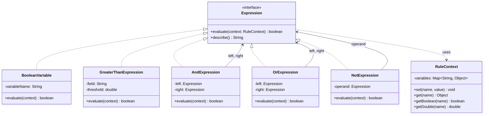

# Interpreter Pattern

> *"Given a language, define a representation for its grammar along with an interpreter that uses the representation to interpret sentences in the language."*
> — GoF Design Patterns

Interpreter converts a recursive grammar into an object tree where each node knows how to evaluate itself. It's the pattern behind rule engines, expression evaluators, DSLs, and query languages. Used appropriately — for small, well-defined grammars — it's elegant. Used on complex grammars, it's a nightmare (that's when you reach for a parser generator instead).

---

## The Problem it Solves

A fraud detection system needs a configurable rule engine. Rules look like:

```
amount > 10000 AND country NOT IN ('US', 'UK') AND (isNewAccount OR hasRecentChargeback)
```

You need to evaluate these rules at runtime without compiling new Java code for each rule variation.

### Without Interpreter — string soup

```java
public class FraudRuleEngine {
    public boolean evaluate(Transaction tx, String rule) {
        // Hand-rolled string parsing — brittle, hard to extend
        if (rule.contains(" AND ")) {
            String[] parts = rule.split(" AND ", 2);
            return evaluate(tx, parts[0]) && evaluate(tx, parts[1]);
        }
        if (rule.startsWith("amount > ")) {
            int threshold = Integer.parseInt(rule.substring(9).trim());
            return tx.getAmount() > threshold;
        }
        // ... more ad-hoc string parsing
        throw new IllegalArgumentException("Unknown rule: " + rule);
    }
}
```

Problems: fragile parsing, no composability, untestable sub-expressions, no type safety.

### With Interpreter — rule tree

```
AndExpression
    +-- ComparisonExpression(amount > 10000)
    +-- OrExpression
            +-- TerminalExpression(isNewAccount)
            +-- TerminalExpression(hasRecentChargeback)
```

Each node is an object. Evaluating the tree means calling `evaluate(context)` on the root.

---

## Grammar and Components

**Terminal expressions** — leaves of the tree. No sub-expressions. Represent literals, variable lookups, or simple comparisons.

**Non-terminal expressions** — interior nodes. Contain one or more sub-expressions. Represent grammar rules (`AND`, `OR`, `NOT`, etc.).

```
Grammar (BNF):
  rule       := rule AND rule
              | rule OR rule
              | NOT rule
              | comparison
              | boolean_variable

  comparison := field > number
              | field < number
              | field = value
```

---

## Complete Implementation: Boolean Rule Engine

```java
// Context — holds the data against which expressions are evaluated
public class RuleContext {
    private final Map<String, Object> variables = new HashMap<>();

    public void set(String name, Object value)    { variables.put(name, value); }
    public Object get(String name)                { return variables.get(name); }

    @SuppressWarnings("unchecked")
    public <T> T get(String name, Class<T> type)  { return type.cast(variables.get(name)); }

    public boolean getBoolean(String name)  { return (Boolean) variables.getOrDefault(name, false); }
    public double  getDouble(String name)   { return ((Number) variables.getOrDefault(name, 0)).doubleValue(); }
}

// Root expression interface
public interface Expression {
    boolean evaluate(RuleContext context);
    String  describe();   // for debugging/logging
}

// Terminal expressions — leaves of the expression tree
public class BooleanVariable implements Expression {
    private final String variableName;

    public BooleanVariable(String variableName) {
        this.variableName = variableName;
    }

    @Override
    public boolean evaluate(RuleContext context) {
        return context.getBoolean(variableName);
    }

    @Override
    public String describe() { return variableName; }
}

public class GreaterThanExpression implements Expression {
    private final String field;
    private final double threshold;

    public GreaterThanExpression(String field, double threshold) {
        this.field     = field;
        this.threshold = threshold;
    }

    @Override
    public boolean evaluate(RuleContext context) {
        return context.getDouble(field) > threshold;
    }

    @Override
    public String describe() { return field + " > " + threshold; }
}

public class LessThanExpression implements Expression {
    private final String field;
    private final double threshold;

    public LessThanExpression(String field, double threshold) {
        this.field     = field;
        this.threshold = threshold;
    }

    @Override
    public boolean evaluate(RuleContext context) {
        return context.getDouble(field) < threshold;
    }

    @Override
    public String describe() { return field + " < " + threshold; }
}

// Non-terminal expressions — composed from sub-expressions
public class AndExpression implements Expression {
    private final Expression left;
    private final Expression right;

    public AndExpression(Expression left, Expression right) {
        this.left  = left;
        this.right = right;
    }

    @Override
    public boolean evaluate(RuleContext context) {
        return left.evaluate(context) && right.evaluate(context);
    }

    @Override
    public String describe() { return "(" + left.describe() + " AND " + right.describe() + ")"; }
}

public class OrExpression implements Expression {
    private final Expression left;
    private final Expression right;

    public OrExpression(Expression left, Expression right) {
        this.left  = left;
        this.right = right;
    }

    @Override
    public boolean evaluate(RuleContext context) {
        return left.evaluate(context) || right.evaluate(context);
    }

    @Override
    public String describe() { return "(" + left.describe() + " OR " + right.describe() + ")"; }
}

public class NotExpression implements Expression {
    private final Expression operand;

    public NotExpression(Expression operand) { this.operand = operand; }

    @Override
    public boolean evaluate(RuleContext context) {
        return !operand.evaluate(context);
    }

    @Override
    public String describe() { return "NOT(" + operand.describe() + ")"; }
}
```

```java
// Build and evaluate the rule tree
Expression fraudRule = new AndExpression(
    new GreaterThanExpression("amount", 10_000),
    new OrExpression(
        new BooleanVariable("isNewAccount"),
        new BooleanVariable("hasRecentChargeback")
    )
);

System.out.println("Rule: " + fraudRule.describe());
// Rule: (amount > 10000.0 AND (isNewAccount OR hasRecentChargeback))

RuleContext tx1 = new RuleContext();
tx1.set("amount",              15_000.0);
tx1.set("isNewAccount",        true);
tx1.set("hasRecentChargeback", false);

RuleContext tx2 = new RuleContext();
tx2.set("amount",              500.0);
tx2.set("isNewAccount",        true);
tx2.set("hasRecentChargeback", false);

System.out.println(fraudRule.evaluate(tx1));   // true  (15k > 10k AND isNewAccount)
System.out.println(fraudRule.evaluate(tx2));   // false (500 is NOT > 10k)
```

---

## Arithmetic Expression Evaluator

```java
public interface ArithmeticExpression {
    double evaluate();
}

public class NumberLiteral implements ArithmeticExpression {
    private final double value;
    public NumberLiteral(double value) { this.value = value; }
    @Override public double evaluate() { return value; }
}

public class Add implements ArithmeticExpression {
    private final ArithmeticExpression left, right;
    public Add(ArithmeticExpression left, ArithmeticExpression right) {
        this.left = left; this.right = right;
    }
    @Override public double evaluate() { return left.evaluate() + right.evaluate(); }
}

public class Multiply implements ArithmeticExpression {
    private final ArithmeticExpression left, right;
    public Multiply(ArithmeticExpression left, ArithmeticExpression right) {
        this.left = left; this.right = right;
    }
    @Override public double evaluate() { return left.evaluate() * right.evaluate(); }
}

public class Divide implements ArithmeticExpression {
    private final ArithmeticExpression left, right;
    public Divide(ArithmeticExpression left, ArithmeticExpression right) {
        this.left = left; this.right = right;
    }
    @Override public double evaluate() {
        double divisor = right.evaluate();
        if (divisor == 0) throw new ArithmeticException("Division by zero");
        return left.evaluate() / divisor;
    }
}

// (3 + 4) * 2 / 7 = 2.0
ArithmeticExpression expr = new Divide(
    new Multiply(
        new Add(new NumberLiteral(3), new NumberLiteral(4)),
        new NumberLiteral(2)
    ),
    new NumberLiteral(7)
);

System.out.println(expr.evaluate());   // 2.0
```

---

## Class Diagram



---

## Building a Fluent Rule Builder

Constructing expression trees with `new` is verbose. A fluent builder reads like the rule language:

```java
public class RuleBuilder {

    public static Expression when(Expression expr) { return expr; }

    public static Expression field(String name) {
        return new BooleanVariable(name);
    }

    public static Expression amount(String field) {
        return new AmountField(field);   // returns a builder for comparison
    }

    public Expression and(Expression other)  { return new AndExpression(this, other); }
    public Expression or(Expression other)   { return new OrExpression(this, other); }
    public Expression not()                  { return new NotExpression(this); }

    // Static factory methods for readability
    public static Expression gt(String field, double value) {
        return new GreaterThanExpression(field, value);
    }

    public static Expression lt(String field, double value) {
        return new LessThanExpression(field, value);
    }
}

// Rule reads almost like English
Expression rule = new AndExpression(
    gt("amount", 10_000),
    new OrExpression(
        field("isNewAccount"),
        field("hasRecentChargeback")
    )
);
```

---

## When NOT to Use Interpreter: Complex Grammars

Interpreter works for simple, well-bounded grammars. For anything complex:

| Threshold | Tool |
|---|---|
| < 10 grammar rules, rarely changing | Interpreter pattern (hand-coded) |
| Complex grammar, occasional changes | [ANTLR](https://www.antlr.org/) or [JavaCC](https://javacc.github.io/javacc/) |
| Embedded scripting | [JEXL](https://commons.apache.org/proper/commons-jexl/), [Groovy](https://groovy-lang.org/), or [GraalVM scripting](https://www.graalvm.org/reference-manual/embed-languages/) |
| SQL-like queries | [JOOQ DSL](https://www.jooq.org/) or [QueryDSL](http://querydsl.com/) |

The failure mode is a grammar with 30+ terminal/non-terminal types where you're hand-coding a recursive descent parser — at that point you're reinventing ANTLR badly.

---

## Interpreter in the Java Ecosystem

| Example | What it interprets |
|---|---|
| `java.util.regex.Pattern` | Regular expression grammar |
| Spring Expression Language (SpEL) | `"#{user.name.toUpperCase()}"` |
| SQL WHERE clause in ORMs | Predicate tree |
| `java.util.Comparator.comparing(...)` chaining | Comparison grammar |
| Logback filter expressions | `<filter class="..">` XML-based expressions |

---

## Interpreter vs Strategy vs Visitor

| | Interpreter | Strategy | Visitor |
|---|---|---|---|
| **Purpose** | Evaluate sentences in a language | Select an algorithm at runtime | Add operations to a stable hierarchy |
| **Structure** | Tree of expression objects | Single algorithm implementation | Visitor walks a separate object tree |
| **Grammar** | Yes — terminal/non-terminal structure | No grammar needed | No grammar needed |
| **Use when** | DSLs, rule engines, expression trees | Interchangeable algorithms | New ops on stable class hierarchy |

---

## When to Use Interpreter

**Use it when:**
- You need a configurable rule engine or expression evaluator
- The grammar is small, stable, and well-defined
- Business users need to express logic in a domain-specific language
- Sentences in the language are best represented as composable object trees

**Don't use it when:**
- The grammar is complex or likely to grow — use a parser generator (ANTLR, JavaCC)
- Performance is critical — each evaluation traverses the entire expression tree
- Simple conditions suffice — `Predicate<T>` composition covers most boolean logic

---

## Key Takeaways

- Interpreter maps a grammar directly to an object hierarchy: **terminal expressions = leaves**, **non-terminal expressions = composite nodes with children**
- The `Context` object carries the runtime data needed for evaluation — expressions are stateless, context provides the state
- A **fluent builder** dramatically improves the ergonomics of constructing expression trees
- The pattern is most valuable for **rule engines, configuration expressions, and small DSLs** where grammar rules rarely change but new rule combinations are created at runtime
- For anything beyond a simple grammar: stop hand-coding and use ANTLR, which generates the parser and the visitor automatically
