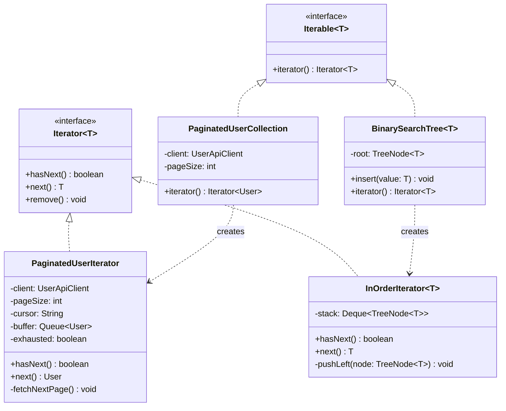

# Iterator Pattern

> *"Provide a way to sequentially access the elements of an aggregate object without exposing its underlying representation."*
> — GoF Design Patterns

Iterator is one of the most fundamental behavioral patterns — and one you've been using daily in Java without necessarily thinking of it as a "design pattern." Its value is in decoupling traversal logic from the collection structure, enabling any kind of collection to be consumed by the same algorithm.

---

## The Problem it Solves

You have multiple data structures holding users: an `ArrayList`, a linked list, a database result set, a binary tree, and an API-paginated source. Code that iterates over users should work the same way regardless of the underlying structure.

Without Iterator, every consumer must know the internal structure:

```java
// Consuming ArrayList
for (int i = 0; i < users.size(); i++) {
    process(users.get(i));
}

// Consuming a custom LinkedList — different API
Node current = linkedList.getHead();
while (current != null) {
    process(current.getValue());
    current = current.getNext();
}

// Consuming a database result set — yet another API
ResultSet rs = stmt.executeQuery("SELECT * FROM users");
while (rs.next()) {
    process(User.from(rs));
}
```

Three structures, three traversal patterns. If the collection type changes, all consumer code must change. The consumer is coupled to the container's internals.

---

## The Pattern Structure

```
Iterator<T>         — interface: hasNext(), next(), optionally remove()
Iterable<T>         — interface: iterator()  (the collection side)
ConcreteIterator    — implements Iterator for a specific data structure
ConcreteCollection  — implements Iterable; creates its ConcreteIterator
```

Once both sides implement these interfaces, the consumer is completely decoupled:

```java
for (User user : anyCollection) {   // works for ArrayList, LinkedList, DB, API...
    process(user);
}
```

---

## Complete Implementation: Paginated API Iterator

The most instructive real-world iterator is one that lazily fetches pages from an external API. This isn't just "iterate over a list" — it manages state (current page, cursor) transparently:

```java
// Iterator interface — Java's standard
// java.util.Iterator<T> provides: hasNext(), next(), remove()

// The paginated API iterator — hides pagination behind a simple hasNext/next interface
public class PaginatedUserIterator implements Iterator<User> {
    private final UserApiClient  client;
    private final int            pageSize;
    private       String         cursor;
    private       boolean        exhausted = false;
    private       Queue<User>    buffer    = new ArrayDeque<>();

    public PaginatedUserIterator(UserApiClient client, int pageSize) {
        this.client   = client;
        this.pageSize = pageSize;
    }

    @Override
    public boolean hasNext() {
        if (!buffer.isEmpty()) return true;
        if (exhausted)         return false;
        fetchNextPage();
        return !buffer.isEmpty();
    }

    @Override
    public User next() {
        if (!hasNext()) throw new NoSuchElementException("No more users");
        return buffer.poll();
    }

    private void fetchNextPage() {
        ApiPage<User> page = client.fetchUsers(cursor, pageSize);
        page.getItems().forEach(buffer::offer);
        cursor = page.getNextCursor();
        if (cursor == null) exhausted = true;
    }
}

// Collection — creates the iterator on demand
public class PaginatedUserCollection implements Iterable<User> {
    private final UserApiClient client;
    private final int           pageSize;

    public PaginatedUserCollection(UserApiClient client, int pageSize) {
        this.client   = client;
        this.pageSize = pageSize;
    }

    @Override
    public Iterator<User> iterator() {
        return new PaginatedUserIterator(client, pageSize);
    }
}
```

```java
// Consumer code — zero knowledge of pagination, cursors, or API structure
PaginatedUserCollection users = new PaginatedUserCollection(apiClient, 100);

for (User user : users) {
    auditService.audit(user);   // pages fetched lazily as needed
}

// Or with streams
StreamSupport.stream(users.spliterator(), false)
    .filter(User::isActive)
    .map(User::getEmail)
    .forEach(emailService::sendNewsletter);
```

---

## Tree Iterator: Depth-First

```java
// Binary tree node
public class TreeNode<T> {
    final T              value;
    final TreeNode<T>    left;
    final TreeNode<T>    right;

    public TreeNode(T value, TreeNode<T> left, TreeNode<T> right) {
        this.value = value;
        this.left  = left;
        this.right = right;
    }
}

// In-order depth-first iterator — traversal logic isolated from tree
public class InOrderIterator<T> implements Iterator<T> {
    private final Deque<TreeNode<T>> stack = new ArrayDeque<>();

    public InOrderIterator(TreeNode<T> root) {
        pushLeft(root);
    }

    @Override
    public boolean hasNext() {
        return !stack.isEmpty();
    }

    @Override
    public T next() {
        if (!hasNext()) throw new NoSuchElementException();
        TreeNode<T> node = stack.pop();
        pushLeft(node.right);
        return node.value;
    }

    private void pushLeft(TreeNode<T> node) {
        while (node != null) {
            stack.push(node);
            node = node.left;
        }
    }
}

// Tree implementing Iterable — consumer uses for-each
public class BinarySearchTree<T extends Comparable<T>> implements Iterable<T> {
    private TreeNode<T> root;

    public void insert(T value) { /* ... */ }

    @Override
    public Iterator<T> iterator() {
        return new InOrderIterator<>(root);
    }
}

// Usage — clean, no traversal logic in the consumer
BinarySearchTree<Integer> bst = new BinarySearchTree<>();
bst.insert(5); bst.insert(3); bst.insert(7); bst.insert(1); bst.insert(4);

for (int value : bst) {
    System.out.print(value + " ");   // 1 3 4 5 7 — in sorted order
}
```

---

## Class Diagram



---

## Java's Built-In Iterator Support

Java has first-class support for Iterator through two interfaces:

```java
// java.util.Iterator<E>
public interface Iterator<E> {
    boolean hasNext();
    E next();
    default void remove() {
        throw new UnsupportedOperationException("remove");
    }
}

// java.lang.Iterable<T> — enables for-each syntax
public interface Iterable<T> {
    Iterator<T> iterator();
}
```

Any class implementing `Iterable<T>` works with:
- **Enhanced for-each** (`for (T item : collection)`)
- **Java Streams** (`StreamSupport.stream(iterable.spliterator(), false)`)
- **`forEach(Consumer)`** default method

### Record-level database cursor iterator

```java
public class DatabaseUserIterator implements Iterator<User>, Closeable {
    private final PreparedStatement stmt;
    private final ResultSet         rs;
    private       User              nextUser;
    private       boolean           closed = false;

    public DatabaseUserIterator(Connection conn, String query) throws SQLException {
        this.stmt = conn.prepareStatement(query);
        this.rs   = stmt.executeQuery();
        advance();
    }

    @Override
    public boolean hasNext() { return nextUser != null; }

    @Override
    public User next() {
        if (nextUser == null) throw new NoSuchElementException();
        User current = nextUser;
        advance();
        return current;
    }

    private void advance() {
        try {
            nextUser = rs.next() ? User.fromResultSet(rs) : null;
        } catch (SQLException e) {
            throw new DataAccessException("Failed to fetch next user", e);
        }
    }

    @Override
    public void close() throws IOException {
        if (!closed) {
            try { rs.close(); stmt.close(); closed = true; }
            catch (SQLException e) { throw new IOException(e); }
        }
    }
}

// Usage with try-with-resources
try (DatabaseUserIterator it = new DatabaseUserIterator(conn, "SELECT * FROM users")) {
    while (it.hasNext()) {
        process(it.next());
    }
}
```

---

## Multiple Traversal Orders

An iterator is a strategy for traversal. The same collection can provide multiple iterators for different traversal orders:

```java
public class MultiOrderTree<T> implements Iterable<T> {
    private TreeNode<T> root;

    // Default: in-order
    @Override
    public Iterator<T> iterator() { return inOrderIterator(); }

    public Iterator<T> inOrderIterator()    { return new InOrderIterator<>(root); }
    public Iterator<T> preOrderIterator()   { return new PreOrderIterator<>(root); }
    public Iterator<T> breadthFirstIterator(){ return new BreadthFirstIterator<>(root); }
}

// Consumer chooses the traversal strategy without knowing the tree's structure
for (T item : tree.breadthFirstIterator()) { ... }
```

---

## When to Use Iterator

**Use it when:**
- You want to provide a standard traversal interface over a custom collection
- The collection has complex internal structure (tree, graph, paginated API) that clients shouldn't deal with
- Multiple traversal orders over the same collection are needed
- You want lazy evaluation — only fetch/compute elements as they're consumed

**Don't use it when:**
- You're iterating over a standard `List` or `Set` — just use for-each directly
- Random access is needed — Iterator is sequential-only; use `get(index)` for indexed access
- The collection is empty or has one element — the overhead isn't justified

---

## Key Takeaways

- Iterator decouples **traversal logic** from **collection structure** — consumers don't need to know what they're iterating over
- Implementing `Iterable<T>` is the correct way to make a custom Java collection support for-each syntax
- **Paginated API iterators** are the most production-relevant application — they hide cursor management behind `hasNext()`/`next()`
- Iterator is inherently stateful: each `Iterator` instance independently tracks position, so multiple iterators over the same collection don't interfere
- Java Streams are built on `Spliterator` (the parallel version of Iterator) — they're the same pattern scaled up for lazy, possibly-parallel traversal
