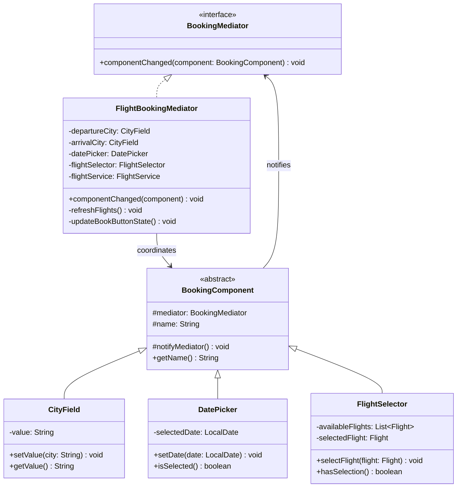
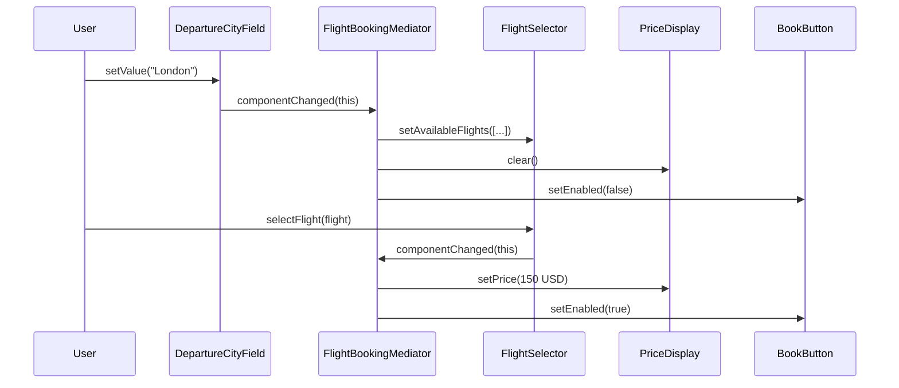

# Mediator Pattern

> *"Define an object that encapsulates how a set of objects interact. Mediator promotes loose coupling by keeping objects from referring to each other explicitly, and it lets you vary their interaction independently."*
> — GoF Design Patterns

Mediator is the pattern of coordinated communication. When a group of objects need to communicate with each other and that communication grows complex, a central Mediator takes over the coordination — each participant talks to the mediator, not directly to each other.

---

## The Problem it Solves

A booking system's UI form has several interacting components: a `DepartureCityField`, an `ArrivalCityField`, a `DatePicker`, a `FlightSelector` (shows available flights), a `SeatSelector` (shows available seats), a `PriceDisplay`, and a `BookButton` (enabled only when all fields are valid).

Each component change affects others: changing departure city refreshes available flights; selecting a flight updates seat options and price; unselecting a date disables the book button.

### Without Mediator — spaghetti communication

```java
public class DepartureCityField {
    private FlightSelector flightSelector;
    private BookButton     bookButton;
    private PriceDisplay   priceDisplay;

    public void onChanged(String city) {
        // Must know about and directly call all dependent components
        flightSelector.refreshFlights(city, arrivalCity, date);
        priceDisplay.clear();
        bookButton.setEnabled(false);
    }
}

public class FlightSelector {
    private SeatSelector seatSelector;
    private PriceDisplay priceDisplay;
    private BookButton   bookButton;

    public void onFlightSelected(Flight flight) {
        seatSelector.refreshSeats(flight);
        priceDisplay.setPrice(flight.getBasePrice());
        bookButton.setEnabled(seatSelector.hasSelection());
    }
}
```

Each component knows about multiple others. The communication graph is N × M connections. Adding a new component means editing many existing ones.

### With Mediator — star topology

Each component knows only the mediator. The mediator knows all components and coordinates their interactions:

```
                 DepartureCityField
                        ↓↑
ArrivalCityField ←→  BookingMediator  ←→  BookButton
                        ↑↓
           DatePicker ←→   FlightSelector ←→ SeatSelector
```

---

## Complete Implementation: Booking Form

```java
// Mediator interface
public interface BookingMediator {
    void componentChanged(BookingComponent component);
}

// Component base — knows only the mediator
public abstract class BookingComponent {
    protected final BookingMediator mediator;
    protected final String          name;

    protected BookingComponent(BookingMediator mediator, String name) {
        this.mediator = mediator;
        this.name     = name;
    }

    protected void notifyMediator() {
        mediator.componentChanged(this);
    }

    public String getName() { return name; }
}

// Concrete components — each only calls notifyMediator()
public class CityField extends BookingComponent {
    private String value = "";

    public CityField(BookingMediator mediator, String name) {
        super(mediator, name);
    }

    public void setValue(String city) {
        this.value = city;
        notifyMediator();
    }

    public String getValue() { return value; }
    public boolean isEmpty() { return value.isBlank(); }
}

public class DatePicker extends BookingComponent {
    private LocalDate selectedDate;

    public DatePicker(BookingMediator mediator) {
        super(mediator, "datePicker");
    }

    public void setDate(LocalDate date) {
        this.selectedDate = date;
        notifyMediator();
    }

    public LocalDate getDate()      { return selectedDate; }
    public boolean   isSelected()   { return selectedDate != null; }
}

public class FlightSelector extends BookingComponent {
    private List<Flight> availableFlights = Collections.emptyList();
    private Flight       selectedFlight;

    public FlightSelector(BookingMediator mediator) {
        super(mediator, "flightSelector");
    }

    public void setAvailableFlights(List<Flight> flights) {
        this.availableFlights = flights;
        this.selectedFlight   = null;
    }

    public void selectFlight(Flight flight) {
        this.selectedFlight = flight;
        notifyMediator();
    }

    public List<Flight> getAvailableFlights() { return availableFlights; }
    public Flight       getSelectedFlight()   { return selectedFlight; }
    public boolean      hasSelection()        { return selectedFlight != null; }
}

public class PriceDisplay extends BookingComponent {
    private Money price;

    public PriceDisplay(BookingMediator mediator) { super(mediator, "priceDisplay"); }

    public void setPrice(Money price) { this.price = price; }
    public void clear()               { this.price = null; }
    public Money getPrice()           { return price; }
}

public class BookButton extends BookingComponent {
    private boolean enabled = false;

    public BookButton(BookingMediator mediator) { super(mediator, "bookButton"); }

    public void setEnabled(boolean enabled) { this.enabled = enabled; }
    public boolean isEnabled()              { return enabled; }

    public void click() {
        if (!enabled) throw new IllegalStateException("Book button is not enabled");
        notifyMediator();
    }
}
```

```java
// The Concrete Mediator — all coordination logic lives here
public class FlightBookingMediator implements BookingMediator {
    private final CityField       departureCity;
    private final CityField       arrivalCity;
    private final DatePicker      datePicker;
    private final FlightSelector  flightSelector;
    private final SeatSelector    seatSelector;
    private final PriceDisplay    priceDisplay;
    private final BookButton      bookButton;
    private final FlightService   flightService;

    public FlightBookingMediator(FlightService flightService) {
        this.flightService  = flightService;
        this.departureCity  = new CityField(this, "departureCity");
        this.arrivalCity    = new CityField(this, "arrivalCity");
        this.datePicker     = new DatePicker(this);
        this.flightSelector = new FlightSelector(this);
        this.seatSelector   = new SeatSelector(this);
        this.priceDisplay   = new PriceDisplay(this);
        this.bookButton     = new BookButton(this);
    }

    @Override
    public void componentChanged(BookingComponent component) {
        switch (component.getName()) {
            case "departureCity", "arrivalCity", "datePicker" -> {
                refreshFlights();
                priceDisplay.clear();
                bookButton.setEnabled(false);
            }
            case "flightSelector" -> {
                if (flightSelector.hasSelection()) {
                    Flight flight = flightSelector.getSelectedFlight();
                    seatSelector.refreshSeats(flight);
                    priceDisplay.setPrice(flight.getBasePrice());
                }
                updateBookButtonState();
            }
            case "seatSelector" -> {
                updatePriceWithSeat();
                updateBookButtonState();
            }
            case "bookButton" -> {
                executeBooking();
            }
        }
    }

    private void refreshFlights() {
        if (!departureCity.isEmpty() && !arrivalCity.isEmpty() && datePicker.isSelected()) {
            List<Flight> flights = flightService.search(
                departureCity.getValue(),
                arrivalCity.getValue(),
                datePicker.getDate()
            );
            flightSelector.setAvailableFlights(flights);
        } else {
            flightSelector.setAvailableFlights(Collections.emptyList());
        }
    }

    private void updateBookButtonState() {
        boolean canBook = !departureCity.isEmpty()
                       && !arrivalCity.isEmpty()
                       && datePicker.isSelected()
                       && flightSelector.hasSelection()
                       && seatSelector.hasSelection();
        bookButton.setEnabled(canBook);
    }

    private void updatePriceWithSeat() {
        if (flightSelector.hasSelection() && seatSelector.hasSelection()) {
            Money total = flightSelector.getSelectedFlight().getBasePrice()
                                        .add(seatSelector.getSelectedSeat().getSurcharge());
            priceDisplay.setPrice(total);
        }
    }

    private void executeBooking() {
        // Assemble booking request from components and confirm
    }
}
```

---

## Class Diagram



---

## Sequence Diagram



---

## Mediator as an Event Bus

A modern production variant of Mediator is an in-process **event bus** — components publish events; the bus routes them to subscribers:

```java
public class EventBusMediator {
    private final Map<Class<?>, List<Consumer<Object>>> handlers = new ConcurrentHashMap<>();

    @SuppressWarnings("unchecked")
    public <T> void on(Class<T> eventType, Consumer<T> handler) {
        handlers.computeIfAbsent(eventType, k -> new CopyOnWriteArrayList<>())
                .add((Consumer<Object>) handler);
    }

    public void emit(Object event) {
        List<Consumer<Object>> h = handlers.get(event.getClass());
        if (h != null) h.forEach(handler -> handler.accept(event));
    }
}

// Components publish events; they don't know who subscribes
EventBusMediator bus = new EventBusMediator();
bus.on(DepartureCityChangedEvent.class, e -> flightSelector.refresh(e.getCity()));
bus.on(FlightSelectedEvent.class,        e -> priceDisplay.setPrice(e.getFlight().getPrice()));
bus.on(FlightSelectedEvent.class,        e -> seatSelector.refresh(e.getFlight()));
```

---

## Mediator vs Observer vs Facade

| | Mediator | Observer | Facade |
|---|---|---|---|
| **Direction** | Peers ↔ Mediator (bidirectional) | Subject → Observers (one-to-many) | Client → Subsystem (one-directional) |
| **Coupling** | Peers don't know each other | Subject doesn't know observers | Client doesn't know subsystem internals |
| **Communication** | Both pull and push | Push only | Caller initiates |
| **Use when** | Complex peer-to-peer interactions | One object changes, many react | Simplify a complex subsystem |

---

## When to Use Mediator

**Use it when:**
- Multiple objects have complex, tangled communication that's hard to follow
- The communication graph is N×M and adding a new peer requires updating many existing ones
- You want to centralise coordination rules in one class

**Don't use it when:**
- Only 2-3 objects communicate — direct references are simpler
- The mediator becomes a "God Object" — a massively complex coordinator that knows everything (this is the primary failure mode)
- Observer suffices — if communication is one-directional (one source, many listeners), Observer is simpler

---

## Key Takeaways

- Mediator replaces a **mesh network** of direct connections with a **star topology** — all communication flows through the central mediator
- The trade-off: decoupled peers, but the mediator can become complex — keep it focused on routing, not business logic
- An **Event Bus** is the modern, loosely-typed variant of Mediator — components publish events rather than calling mediator methods
- Mediator is most valuable in **UI-heavy systems** where many controls interact with each other
- Don't confuse Mediator with Facade: Facade simplifies access to a subsystem for clients; Mediator coordinates communication between equal-standing peers
