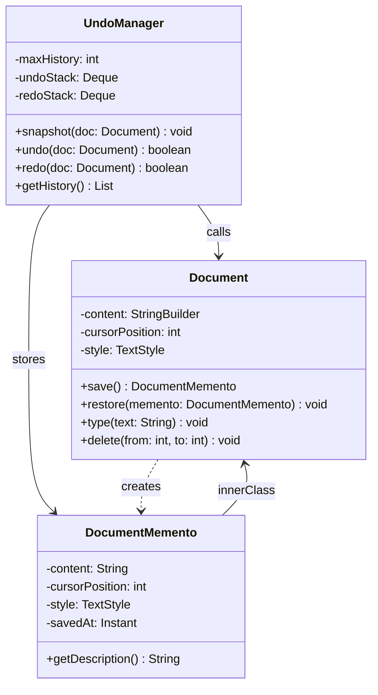

# Memento Pattern

> *"Without violating encapsulation, capture and externalize an object's internal state so that the object can be restored to that state later."*
> — GoF Design Patterns

Memento solves the undo problem elegantly: how do you let an object save and restore its own state without exposing that state to the outside world? The answer is a Memento — an opaque snapshot that only its creator knows how to read.

---

## The Problem it Solves

A text editor supports Ctrl+Z undo. The naive approach exposes the document's internals to whoever manages undo history:

```java
// BAD: The undo manager must know Document internals
public class UndoManager {
    private record DocumentState(String content, int cursorPosition, TextStyle style) {}
    private final Deque<DocumentState> history = new ArrayDeque<>();

    public void snapshot(Document doc) {
        // Must reach into Document's fields — breaks encapsulation
        history.push(new DocumentState(
            doc.getContent(),
            doc.getCursorPosition(),
            doc.getCurrentStyle()
        ));
    }

    public void undo(Document doc) {
        if (!history.isEmpty()) {
            DocumentState state = history.pop();
            // Must know how to reconstruct Document's internal state
            doc.setContent(state.content());
            doc.setCursorPosition(state.cursorPosition());
            doc.setStyle(state.style());
        }
    }
}
```

Problems:
1. `UndoManager` must know all of `Document`'s internal fields
2. If `Document` adds a new field, `UndoManager` must change too
3. `DocumentState` — a copy of Document internals — leaks the implementation

---

## The Three Participants

| Role | Responsibility |
|---|---|
| **Originator** | The object with state to save. Creates Mementos from its current state. Restores its state from a Memento. |
| **Memento** | The snapshot. Stores state from the Originator. Only the Originator can read/write its full state. The Caretaker sees only a "narrow interface." |
| **Caretaker** | Stores and manages Mementos. Never reads or modifies Memento internals — treats them as opaque tokens. |

---

## Complete Implementation: Text Editor

```java
// Originator — the document with state to save
public class Document {

    // -------------------------------------------------------------------------
    // Memento as a private inner class — only Document can read its fields
    // This is the canonical way to preserve encapsulation in Java
    // -------------------------------------------------------------------------
    public static final class DocumentMemento {
        private final String    content;
        private final int       cursorPosition;
        private final TextStyle style;
        private final Instant   savedAt;

        // Private constructor — only Document can create mementos
        private DocumentMemento(String content, int cursorPosition,
                                 TextStyle style) {
            this.content        = content;
            this.cursorPosition = cursorPosition;
            this.style          = style;
            this.savedAt        = Instant.now();
        }

        // Narrow interface for Caretaker: description only, no state access
        public String getDescription() {
            return "Snapshot at " + savedAt
                   + " (" + content.length() + " chars)";
        }
    }

    // Document fields
    private final StringBuilder content        = new StringBuilder();
    private       int           cursorPosition = 0;
    private       TextStyle     style          = TextStyle.DEFAULT;

    // Originator creates its own snapshot
    public DocumentMemento save() {
        return new DocumentMemento(content.toString(), cursorPosition, style);
    }

    // Originator restores from snapshot
    public void restore(DocumentMemento memento) {
        this.content.setLength(0);
        this.content.append(memento.content);       // inner class access to private field
        this.cursorPosition = memento.cursorPosition;
        this.style          = memento.style;
    }

    // Business methods
    public void type(String text) {
        content.insert(cursorPosition, text);
        cursorPosition += text.length();
    }

    public void moveCursor(int position) {
        this.cursorPosition = Math.max(0, Math.min(position, content.length()));
    }

    public void setBold(boolean bold) {
        this.style = style.withBold(bold);
    }

    public void delete(int from, int to) {
        content.delete(from, to);
        cursorPosition = Math.min(cursorPosition, content.length());
    }

    public String getContent()        { return content.toString(); }
    public int    getCursorPosition() { return cursorPosition; }
}
```

```java
// Caretaker — stores snapshots, never reads their internals
public class UndoManager {
    private final int                              maxHistory;
    private final Deque<Document.DocumentMemento>  undoStack = new ArrayDeque<>();
    private final Deque<Document.DocumentMemento>  redoStack = new ArrayDeque<>();

    public UndoManager(int maxHistory) {
        this.maxHistory = maxHistory;
    }

    public void snapshot(Document doc) {
        undoStack.push(doc.save());         // opaque — we just store it
        redoStack.clear();                  // new action invalidates redo history
        if (undoStack.size() > maxHistory) {
            ((ArrayDeque<Document.DocumentMemento>) undoStack).removeLast();
        }
    }

    public boolean undo(Document doc) {
        if (undoStack.isEmpty()) return false;
        redoStack.push(doc.save());         // save current state for redo
        doc.restore(undoStack.pop());       // restore previous state
        return true;
    }

    public boolean redo(Document doc) {
        if (redoStack.isEmpty()) return false;
        undoStack.push(doc.save());
        doc.restore(redoStack.pop());
        return true;
    }

    public int getUndoDepth() { return undoStack.size(); }

    public List<String> getHistory() {
        return undoStack.stream()
                        .map(Document.DocumentMemento::getDescription)   // narrow interface only
                        .toList();
    }
}
```

```java
// Usage
Document    doc    = new Document();
UndoManager undo   = new UndoManager(50);

doc.type("Hello");
undo.snapshot(doc);         // save after "Hello"

doc.type(" World");
undo.snapshot(doc);         // save after "Hello World"

doc.type("!");
// Oops — don't want the "!"

undo.undo(doc);             // back to "Hello World"
System.out.println(doc.getContent());   // Hello World

undo.undo(doc);             // back to "Hello"
System.out.println(doc.getContent());   // Hello

undo.redo(doc);             // forward to "Hello World"
System.out.println(doc.getContent());   // Hello World
```

---

## Class Diagram


 *-- DocumentMemento : nested
---

## Modern Java Approach: Records as Snapshots

With Java 16+ records, you can write more concise Mementos:

```java
public class GameCharacter {

    // Record-based memento — compact and immutable
    public record CharacterSnapshot(
        String name,
        int    health,
        int    mana,
        int    xp,
        Point  position
    ) {
        // Narrow interface — just metadata, not game logic
        public String summary() {
            return name + " @ " + position + " [HP: " + health + "]";
        }
    }

    private String name;
    private int    health;
    private int    mana;
    private int    xp;
    private Point  position;

    // Save state to a save-game file equivalent
    public CharacterSnapshot save() {
        return new CharacterSnapshot(name, health, mana, xp, new Point(position));
    }

    // Load state from a save-game file
    public void restore(CharacterSnapshot snapshot) {
        this.name     = snapshot.name();
        this.health   = snapshot.health();
        this.mana     = snapshot.mana();
        this.xp       = snapshot.xp();
        this.position = new Point(snapshot.position());
    }
}

// Caretaker — game save system
public class SaveGameSystem {
    private final Map<String, GameCharacter.CharacterSnapshot> slots = new LinkedHashMap<>();

    public void save(String slotName, GameCharacter character) {
        slots.put(slotName, character.save());
    }

    public boolean load(String slotName, GameCharacter character) {
        GameCharacter.CharacterSnapshot snapshot = slots.get(slotName);
        if (snapshot == null) return false;
        character.restore(snapshot);
        return true;
    }

    public List<String> getSaveSlots() {
        return slots.entrySet().stream()
                    .map(e -> e.getKey() + ": " + e.getValue().summary())
                    .toList();
    }
}
```

---

## Memento vs Command for Undo

Both patterns implement undo, but with different philosophies:

| | Memento | Command |
|---|---|---|
| **Undo mechanism** | Restore full snapshot of state | Execute inverse operation |
| **Memory cost** | High — stores full object state | Lower — stores only the operation delta |
| **Complexity** | Simple — always works | Higher — every operation needs a precise inverse |
| **Best for** | Complex state with many fields | Operations with clean mathematical inverses |
| **Example** | Text editor (full text snapshot) | Spreadsheet cell (store "old value" and "new value") |

In practice, **incremental snapshots** give you Memento with Command-level memory efficiency: store the diff (what changed), not the full state.

---

## When to Use Memento

**Use it when:**
- You need undo/redo, rollback, or save/restore functionality
- The state you need to save is complex (many fields, nested objects)
- You don't want external code to access or understand the object's internals

**Don't use it when:**
- Object state is simple and already public — just copy the fields
- Operations have clean inverses — Command-based undo is more memory-efficient
- Snapshots are too expensive — consider incremental logging or event sourcing instead

---

## Key Takeaways

- The inner class approach (`private inner class` or `private static nested class`) is the idiomatic Java way to implement Memento because only the Originator can access the Memento's private state
- The Caretaker uses only the **narrow interface** — it stores and returns Mementos but never reads their content
- **Records** are an excellent modern Memento — immutable, concise, and transparent by default; restrict access by keeping the record inside the Originator
- Memento and Command are complementary: Memento stores state, Command stores operations — large editors often use both together (Command for typing, Memento for "save point" checkpoints)
