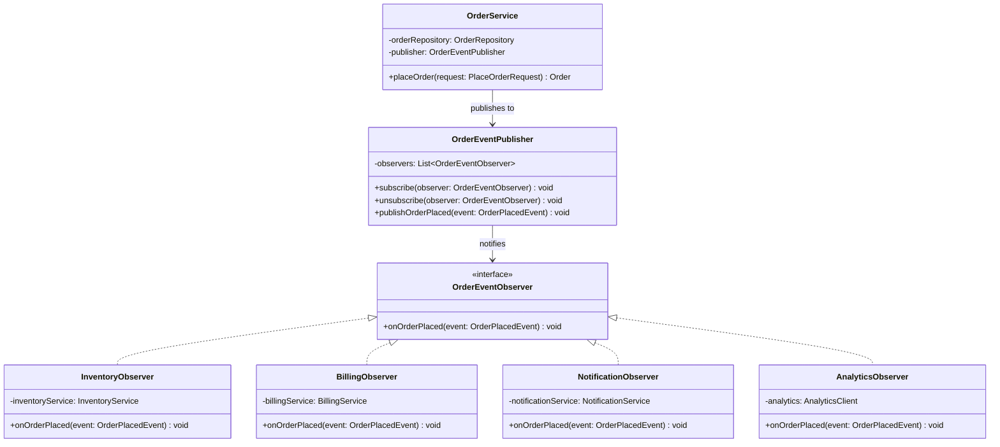
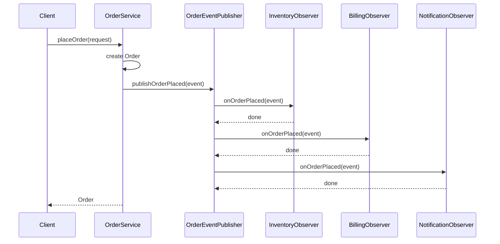

# Observer Pattern

> *"Define a one-to-many dependency between objects so that when one object changes state, all its dependents are notified and updated automatically."*
> — GoF Design Patterns

Observer is the backbone of event-driven architecture. It decouples the object that produces events (the Subject) from the objects that react to them (the Observers). The subject fires events without knowing anything about who's listening.

---

## The Problem it Solves

An `Order` changes state throughout its lifecycle. When an order is placed, three systems need to react: inventory must reserve stock, the billing system must charge the customer, and the notification system must email the customer.

### Naive approach — tight coupling

```java
public class OrderService {
    private final InventoryService    inventory;
    private final BillingService      billing;
    private final NotificationService notifications;

    public void placeOrder(Order order) {
        order.markPending();

        // Now explicitly trigger every downstream system
        inventory.reserve(order);
        billing.charge(order);
        notifications.sendOrderConfirmation(order);
    }
}
```

**Problems:**
1. `OrderService` knows about `InventoryService`, `BillingService`, and `NotificationService` — three dependencies it shouldn't own
2. Adding a new reaction (fraud check, loyalty points, analytics) requires editing `OrderService`
3. Removing a reaction (disable SMS during maintenance) requires editing `OrderService`
4. The class violates SRP: it coordinates a business transaction *and* orchestrates downstream reactions

With Observer: `OrderService` fires an event. Everything else subscribes to it. `OrderService` knows nothing about who listens.

---

## Complete Implementation

```java
// The event — carries all information observers need
public final class OrderPlacedEvent {
    private final Order     order;
    private final Instant   occurredAt;

    public OrderPlacedEvent(Order order) {
        this.order      = Objects.requireNonNull(order);
        this.occurredAt = Instant.now();
    }

    public Order   getOrder()      { return order; }
    public Instant getOccurredAt() { return occurredAt; }
}

// Observer interface — all listeners implement this
public interface OrderEventObserver {
    void onOrderPlaced(OrderPlacedEvent event);
}

// The Subject — fires events, doesn't know about listeners
public class OrderEventPublisher {
    private final List<OrderEventObserver> observers = new CopyOnWriteArrayList<>();

    public void subscribe(OrderEventObserver observer) {
        observers.add(Objects.requireNonNull(observer));
    }

    public void unsubscribe(OrderEventObserver observer) {
        observers.remove(observer);
    }

    public void publishOrderPlaced(OrderPlacedEvent event) {
        observers.forEach(o -> o.onOrderPlaced(event));
    }
}

// Concrete observers
public class InventoryObserver implements OrderEventObserver {
    private final InventoryService inventoryService;

    public InventoryObserver(InventoryService inventoryService) {
        this.inventoryService = inventoryService;
    }

    @Override
    public void onOrderPlaced(OrderPlacedEvent event) {
        inventoryService.reserve(event.getOrder());
    }
}

public class BillingObserver implements OrderEventObserver {
    private final BillingService billingService;

    public BillingObserver(BillingService billingService) {
        this.billingService = billingService;
    }

    @Override
    public void onOrderPlaced(OrderPlacedEvent event) {
        billingService.charge(event.getOrder());
    }
}

public class NotificationObserver implements OrderEventObserver {
    private final NotificationService notificationService;

    public NotificationObserver(NotificationService notificationService) {
        this.notificationService = notificationService;
    }

    @Override
    public void onOrderPlaced(OrderPlacedEvent event) {
        notificationService.sendOrderConfirmation(event.getOrder());
    }
}

// Analytics can be added later — zero changes to OrderService
public class AnalyticsObserver implements OrderEventObserver {
    private final AnalyticsClient analytics;

    public AnalyticsObserver(AnalyticsClient analytics) {
        this.analytics = analytics;
    }

    @Override
    public void onOrderPlaced(OrderPlacedEvent event) {
        analytics.track("order.placed", Map.of(
            "orderId", event.getOrder().getId(),
            "amount",  event.getOrder().getTotal().toString(),
            "ts",      event.getOccurredAt().toString()
        ));
    }
}
```

```java
// OrderService — now clean and focused
public class OrderService {
    private final OrderRepository     orderRepository;
    private final OrderEventPublisher publisher;

    public OrderService(OrderRepository orderRepository, OrderEventPublisher publisher) {
        this.orderRepository = orderRepository;
        this.publisher       = publisher;
    }

    public Order placeOrder(PlaceOrderRequest request) {
        Order order = Order.create(request.getCustomerId(), request.getItems());
        orderRepository.save(order);

        publisher.publishOrderPlaced(new OrderPlacedEvent(order));  // fire and done
        return order;
    }
}
```

```java
// Wired at the composition root
OrderEventPublisher publisher = new OrderEventPublisher();
publisher.subscribe(new InventoryObserver(inventoryService));
publisher.subscribe(new BillingObserver(billingService));
publisher.subscribe(new NotificationObserver(notificationService));
publisher.subscribe(new AnalyticsObserver(analyticsClient));

OrderService orderService = new OrderService(orderRepository, publisher);
```

---

## Class Diagram



---

## Sequence Diagram



---

## Generic Event Bus Pattern

For a more complete system handling multiple event types:

```java
// Generic event bus — supports any event type
public class EventBus {
    private final Map<Class<?>, List<Consumer<Object>>> handlers = new ConcurrentHashMap<>();

    @SuppressWarnings("unchecked")
    public <T> void subscribe(Class<T> eventType, Consumer<T> handler) {
        handlers.computeIfAbsent(eventType, k -> new CopyOnWriteArrayList<>())
                .add((Consumer<Object>) handler);
    }

    public void publish(Object event) {
        List<Consumer<Object>> eventHandlers = handlers.get(event.getClass());
        if (eventHandlers != null) {
            eventHandlers.forEach(h -> h.accept(event));
        }
    }
}

// Usage
EventBus bus = new EventBus();
bus.subscribe(OrderPlacedEvent.class,   event -> inventory.reserve(event.getOrder()));
bus.subscribe(OrderPlacedEvent.class,   event -> billing.charge(event.getOrder()));
bus.subscribe(OrderShippedEvent.class,  event -> notifications.sendShippingUpdate(event.getOrder()));
bus.subscribe(PaymentFailedEvent.class, event -> orderService.cancelOrder(event.getOrderId()));

bus.publish(new OrderPlacedEvent(order));
```

---

## Observer in the Java Ecosystem

| API | Subject | Observer interface |
|---|---|---|
| `java.util.Observable` (deprecated) | `Observable` | `java.util.Observer` |
| Swing | Component classes | `ActionListener`, `MouseListener`, etc. |
| Spring Framework | `ApplicationEventPublisher` | `ApplicationListener<E>` |
| Reactive Streams (RxJava, Project Reactor) | `Observable` / `Flux` | `Observer` / `Subscriber` |
| Java Beans | Any bean | `PropertyChangeListener` |

### Spring Application Events

```java
// Spring event — extend ApplicationEvent or use plain POJO (Spring 4.2+)
public class OrderPlacedEvent {
    private final Order order;
    public OrderPlacedEvent(Order order) { this.order = order; }
    public Order getOrder() { return order; }
}

// Publisher — just inject ApplicationEventPublisher
@Service
public class OrderService {
    private final ApplicationEventPublisher publisher;

    public OrderService(ApplicationEventPublisher publisher) {
        this.publisher = publisher;
    }

    public Order placeOrder(PlaceOrderRequest request) {
        Order order = /* ... */;
        publisher.publishEvent(new OrderPlacedEvent(order));
        return order;
    }
}

// Observer — annotate with @EventListener
@Component
public class InventoryEventHandler {
    @EventListener
    public void onOrderPlaced(OrderPlacedEvent event) {
        inventoryService.reserve(event.getOrder());
    }

    @EventListener
    @Async   // handle in a different thread
    public void sendAnalytics(OrderPlacedEvent event) {
        analytics.track(event.getOrder());
    }
}
```

---

## Error Isolation in Observer Chains

A critical production concern: if one observer throws, should it prevent subsequent observers from running?

```java
// Fault-tolerant publisher — logs failures, continues to remaining observers
public void publishOrderPlaced(OrderPlacedEvent event) {
    for (OrderEventObserver observer : observers) {
        try {
            observer.onOrderPlaced(event);
        } catch (Exception e) {
            log.error("Observer {} failed for event {}: {}",
                observer.getClass().getSimpleName(),
                event.getOrder().getId(),
                e.getMessage(), e);
            // Continue to next observer — don't let one failure cascade
        }
    }
}
```

This is a fundamental design decision: **fail-fast** (one exception aborts all) vs **fault-tolerant** (each observer runs independently). For domain-critical observers (payment), fail-fast is appropriate. For non-critical observers (analytics), fault-tolerant is better.

---

## Observer vs Mediator

| | Observer | Mediator |
|---|---|---|
| **Direction** | One-to-many: subject → observers | Many-to-many: peers communicate through mediator |
| **Coupling** | Subject doesn't know observers | Mediator knows all participants |
| **Use when** | Broadcast notifications | Complex coordination between peer objects |

---

## When to Use Observer

**Use it when:**
- Changes in one object need to trigger reactions in others, and the number of reactors may change
- You want to decouple the source of an event from all its downstream consequences
- The same event needs to notify multiple subsystems simultaneously
- You need to add/remove reactions at runtime without modifying the source

**Don't use it when:**
- The notification order matters — Observer doesn't guarantee order without explicit sorting
- Observers need to return values to the subject — Observer is fire-and-forget
- You need synchronised two-way communication — use a method call or Mediator instead

---

## Key Takeaways

- Observer decouples event *production* from event *consumption* — the subject fires events without knowing who handles them
- `CopyOnWriteArrayList` is the correct backing collection for observers in Java — safe for concurrent subscribe/unsubscribe while iterating
- Production publishers should be **fault-tolerant** — catch observer exceptions so one failure doesn't block others
- Spring's `@EventListener` and Reactive Streams (`Flux`, `Observable`) are Observer at industrial scale
- The pattern is the foundation of event-driven architecture — Observer within a process, message queues across processes
