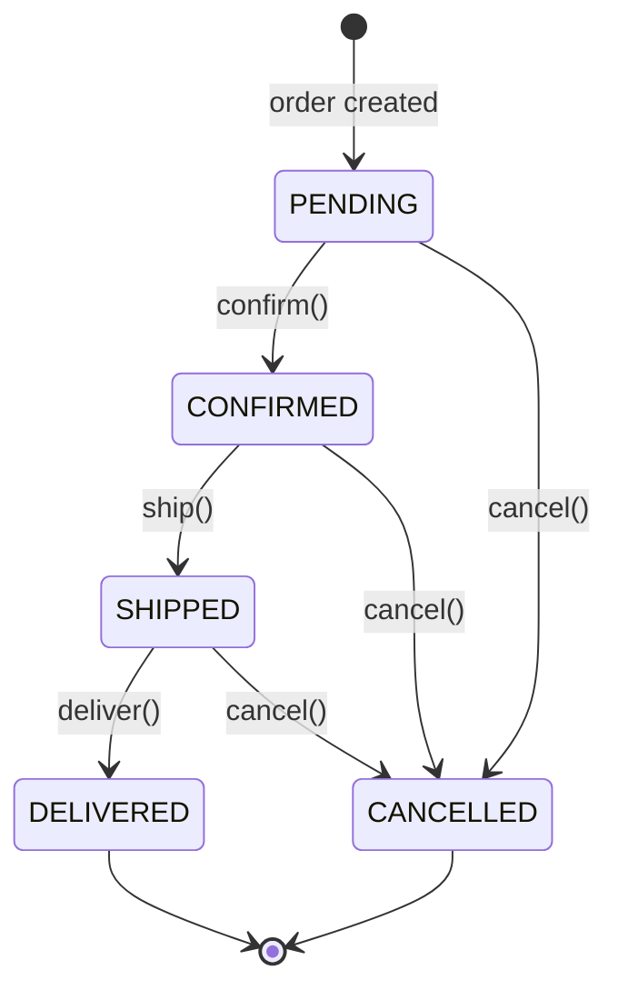
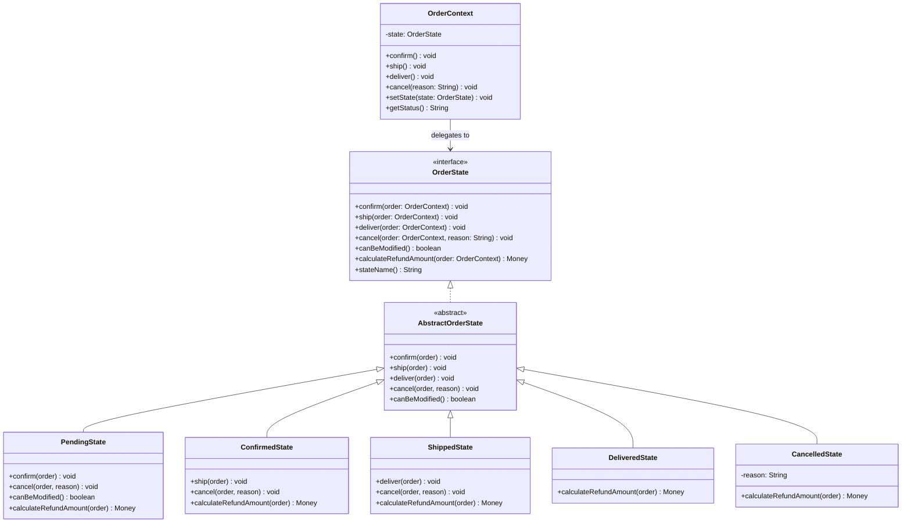

# State Pattern

> *"Allow an object to alter its behaviour when its internal state changes. The object will appear to change its class."*
> — GoF Design Patterns

State is the pattern that eliminates sprawling `if/else` or `switch` chains based on status fields. When an object's behaviour is fundamentally different depending on which "mode" it's in, State moves each mode's behaviour into its own class.

---

## The Problem it Solves

An `Order` has a lifecycle: `PENDING` → `CONFIRMED` → `SHIPPED` → `DELIVERED`, with `CANCELLED` possible from certain states. Each state permits different operations and has different rules.

### Naive approach — status string with conditionals

```java
public class Order {
    private String status = "PENDING";

    public void confirm() {
        if (!status.equals("PENDING")) {
            throw new IllegalStateException("Can only confirm PENDING orders");
        }
        status = "CONFIRMED";
    }

    public void ship() {
        if (!status.equals("CONFIRMED")) {
            throw new IllegalStateException("Can only ship CONFIRMED orders");
        }
        status = "SHIPPED";
    }

    public void deliver() {
        if (!status.equals("SHIPPED")) {
            throw new IllegalStateException("Can only deliver SHIPPED orders");
        }
        status = "DELIVERED";
    }

    public void cancel(String reason) {
        if (status.equals("DELIVERED") || status.equals("CANCELLED")) {
            throw new IllegalStateException("Cannot cancel " + status + " order");
        }
        status = "CANCELLED";
    }

    public boolean canBeModified() {
        return status.equals("PENDING");
    }

    public Money calculateRefundAmount() {
        if (status.equals("PENDING"))   return order.getTotal();
        if (status.equals("CONFIRMED")) return order.getTotal();
        if (status.equals("SHIPPED"))   return order.getTotal().subtract(SHIPPING_FEE);
        if (status.equals("DELIVERED")) return Money.ZERO;
        throw new IllegalStateException("No refund for: " + status);
    }
}
```

Problems:
- Every method has the same guard pattern repeated
- Business logic for each state is **spread across every method** instead of consolidated
- Adding a new state (e.g., `AWAITING_PAYMENT`) requires editing every method
- The `status` field is a string — typos cause silent runtime bugs

---

## Complete State Pattern Implementation

### Step 1 — Define the State Interface

```java
// All valid operations for an Order across all states
public interface OrderState {
    void confirm(OrderContext order);
    void ship(OrderContext order);
    void deliver(OrderContext order);
    void cancel(OrderContext order, String reason);
    boolean canBeModified();
    Money calculateRefundAmount(OrderContext order);
    String stateName();
}
```

### Step 2 — Implement Each State

```java
// Default base — throws for all unsupported transitions
public abstract class AbstractOrderState implements OrderState {
    @Override
    public void confirm(OrderContext order) {
        throw new IllegalStateException("Cannot confirm from " + stateName());
    }

    @Override
    public void ship(OrderContext order) {
        throw new IllegalStateException("Cannot ship from " + stateName());
    }

    @Override
    public void deliver(OrderContext order) {
        throw new IllegalStateException("Cannot deliver from " + stateName());
    }

    @Override
    public void cancel(OrderContext order, String reason) {
        throw new IllegalStateException("Cannot cancel from " + stateName());
    }

    @Override
    public boolean canBeModified() { return false; }
}

public class PendingState extends AbstractOrderState {
    @Override
    public void confirm(OrderContext order) {
        order.setState(new ConfirmedState());
    }

    @Override
    public void cancel(OrderContext order, String reason) {
        order.setState(new CancelledState(reason));
    }

    @Override
    public boolean canBeModified() { return true; }

    @Override
    public Money calculateRefundAmount(OrderContext order) {
        return order.getTotal();   // full refund — not yet charged
    }

    @Override
    public String stateName() { return "PENDING"; }
}

public class ConfirmedState extends AbstractOrderState {
    @Override
    public void ship(OrderContext order) {
        order.setState(new ShippedState());
    }

    @Override
    public void cancel(OrderContext order, String reason) {
        order.setState(new CancelledState(reason));
    }

    @Override
    public Money calculateRefundAmount(OrderContext order) {
        return order.getTotal();   // full refund before shipping
    }

    @Override
    public String stateName() { return "CONFIRMED"; }
}

public class ShippedState extends AbstractOrderState {
    @Override
    public void deliver(OrderContext order) {
        order.setState(new DeliveredState());
    }

    @Override
    public void cancel(OrderContext order, String reason) {
        // Can still cancel if package is in transit — partial refund
        order.setState(new CancelledState(reason));
    }

    @Override
    public Money calculateRefundAmount(OrderContext order) {
        return order.getTotal().subtract(order.getShippingCost());  // minus shipping
    }

    @Override
    public String stateName() { return "SHIPPED"; }
}

public class DeliveredState extends AbstractOrderState {
    @Override
    public Money calculateRefundAmount(OrderContext order) {
        return Money.ZERO;   // past return window — no refund
    }

    @Override
    public String stateName() { return "DELIVERED"; }
}

public class CancelledState extends AbstractOrderState {
    private final String reason;

    public CancelledState(String reason) {
        this.reason = Objects.requireNonNull(reason);
    }

    @Override
    public Money calculateRefundAmount(OrderContext order) {
        return order.getTotal();   // full refund when cancelled
    }

    @Override
    public String stateName() { return "CANCELLED"; }
}
```

### Step 3 — The Context Delegates to Current State

```java
public class OrderContext {
    private final String id;
    private final List<OrderItem> items;
    private final Money total;
    private final Money shippingCost;
    private OrderState state;     // mutable — the current state

    public OrderContext(String id, List<OrderItem> items, Money total, Money shippingCost) {
        this.id           = id;
        this.items        = List.copyOf(items);
        this.total        = total;
        this.shippingCost = shippingCost;
        this.state        = new PendingState();   // always starts here
    }

    // State transitions — delegated to current state
    public void confirm()                     { state.confirm(this); }
    public void ship()                        { state.ship(this); }
    public void deliver()                     { state.deliver(this); }
    public void cancel(String reason)         { state.cancel(this, reason); }

    // Queries — delegated to current state
    public boolean canBeModified()            { return state.canBeModified(); }
    public Money calculateRefundAmount()      { return state.calculateRefundAmount(this); }
    public String getStatus()                 { return state.stateName(); }

    // Called by state objects to transition
    public void setState(OrderState newState) { this.state = newState; }

    // Accessors
    public String getId()          { return id; }
    public Money  getTotal()       { return total; }
    public Money  getShippingCost(){ return shippingCost; }
}
```

### Usage

```java
OrderContext order = new OrderContext("ord_123", items, Money.of(100, "USD"), Money.of(10, "USD"));

System.out.println(order.getStatus());          // PENDING
System.out.println(order.canBeModified());       // true

order.confirm();
System.out.println(order.getStatus());          // CONFIRMED

order.ship();
System.out.println(order.getStatus());          // SHIPPED
System.out.println(order.calculateRefundAmount()); // 90 USD (minus shipping)

order.deliver();
System.out.println(order.getStatus());          // DELIVERED
System.out.println(order.calculateRefundAmount()); // 0 USD

// Invalid transition — throws immediately
order.cancel("changed mind");  // IllegalStateException: Cannot cancel from DELIVERED
```

---

## State Transition Diagram



---

## Class Diagram



---

## Real-World Example: ATM State Machine

```java
public interface ATMState {
    void insertCard(ATMContext atm);
    void enterPin(ATMContext atm, String pin);
    void selectAmount(ATMContext atm, Money amount);
    void ejectCard(ATMContext atm);
}

public class IdleState implements ATMState {
    @Override
    public void insertCard(ATMContext atm) {
        atm.setState(new CardInsertedState());
    }

    @Override public void enterPin(ATMContext atm, String pin) {
        throw new IllegalStateException("Insert card first");
    }
    // ... other invalid transitions
}

public class CardInsertedState implements ATMState {
    private int pinAttempts = 0;
    private static final int MAX_ATTEMPTS = 3;

    @Override
    public void enterPin(ATMContext atm, String pin) {
        if (atm.validatePin(pin)) {
            atm.setState(new AuthenticatedState());
        } else {
            pinAttempts++;
            if (pinAttempts >= MAX_ATTEMPTS) {
                atm.retainCard();
                atm.setState(new IdleState());
                throw new CardRetainedException("Too many incorrect PIN attempts");
            }
        }
    }

    @Override
    public void ejectCard(ATMContext atm) {
        atm.returnCard();
        atm.setState(new IdleState());
    }
}

public class AuthenticatedState implements ATMState {
    @Override
    public void selectAmount(ATMContext atm, Money amount) {
        if (atm.getAccountBalance().isLessThan(amount)) {
            throw new InsufficientFundsException();
        }
        atm.dispenseCash(amount);
        atm.deductFromAccount(amount);
        atm.returnCard();
        atm.setState(new IdleState());
    }
}
```

---

## State vs Strategy

Both use an interface with multiple implementations. The key distinction:

| | State | Strategy |
|---|---|---|
| **States know each other** | Yes — PendingState creates ConfirmedState | No — strategies are independent |
| **Object changes behaviour** | At runtime, as state transitions | At configuration time (or runtime) |
| **Context controls transitions** | State objects do (call `context.setState()`) | Context or client does (inject/swap) |
| **Purpose** | Model lifecycle; enforce valid transitions | Select algorithm variant |

> **Decision test**: does your object have a lifecycle with valid/invalid transitions between modes? → State. Does your object need to select one of several interchangeable algorithms? → Strategy.

---

## When to Use State

**Use it when:**
- An object has 3+ named states and its behaviour differs significantly per state
- State transitions must be validated (only some transitions are legal)
- You find deeply nested `if/else` based on a status field growing in every method
- Adding a new state currently requires editing many existing methods

**Don't use it when:**
- There are only 2 states (a boolean flag is cleaner)
- The state transitions are trivial and don't have per-state behaviour
- The states would all have mostly empty method bodies — the overhead isn't justified

---

## Key Takeaways

- State consolidates all behaviour for each lifecycle phase into one dedicated class — no more sprawling `if/else` across every method
- State objects **call `context.setState()`** to drive transitions — the context is passive; the state controls its own successor
- An **abstract base state** that throws `IllegalStateException` by default is a best practice — you only override what each state actually permits
- The **state transition diagram** is the essential design artifact — draw it before writing any code
- State is the natural pattern for order lifecycle, ATM flows, vending machines, game entity states, and any other object with a non-trivial lifecycle
