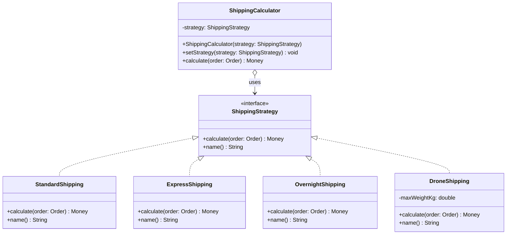
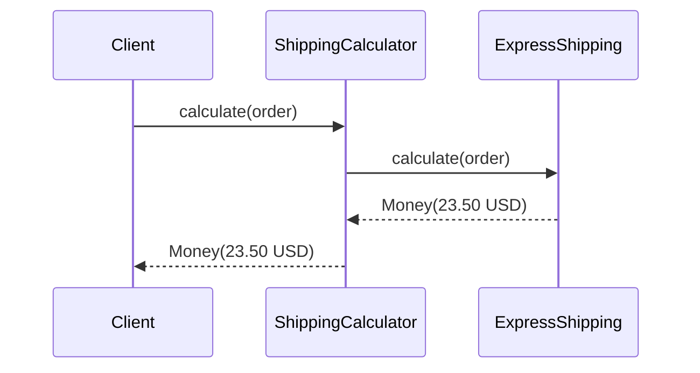

# Strategy Pattern

> *"Define a family of algorithms, encapsulate each one, and make them interchangeable. Strategy lets the algorithm vary independently from clients that use it."*
> — GoF Design Patterns

Strategy is the most interview-relevant behavioral pattern and one of the clearest expressions of the Open-Closed Principle in action. The moment you see an `if/else` or `switch` on a type or mode that controls which algorithm runs, you're looking at a Strategy in disguise.

---

## The Problem it Solves

An order service calculates shipping costs. Initially there are two options:

```java
public class ShippingCalculator {

    public Money calculate(Order order, String shippingType) {
        if (shippingType.equals("standard")) {
            return order.getWeight().multiply(0.05);

        } else if (shippingType.equals("express")) {
            return order.getWeight().multiply(0.15).add(Money.of(5, "USD"));

        } else if (shippingType.equals("overnight")) {
            return Money.of(25, "USD").add(order.getWeight().multiply(0.3));
        }
        throw new IllegalArgumentException("Unknown shipping type: " + shippingType);
    }
}
```

Three months later: "add drone delivery." Six months: "add economy shipping for non-urgent items." A year: "different rules apply for international orders."

Every addition requires editing `ShippingCalculator`. Tests grow unwieldy. The class becomes a kitchen-sink of unrelated formulas. This is an **OCP violation**: the class is not closed for modification.

---

## Evolution: Naive → Strategy

### Step 1 — Extract the Interface

```java
// The Strategy interface — one method signature that all algorithms share
public interface ShippingStrategy {
    Money calculate(Order order);
    String name();
}
```

### Step 2 — Extract Each Algorithm into Its Own Class

```java
public class StandardShipping implements ShippingStrategy {
    @Override
    public Money calculate(Order order) {
        return order.getWeight().multiply(0.05);
    }

    @Override
    public String name() { return "standard"; }
}

public class ExpressShipping implements ShippingStrategy {
    private static final Money HANDLING_FEE = Money.of(5, "USD");

    @Override
    public Money calculate(Order order) {
        return order.getWeight().multiply(0.15).add(HANDLING_FEE);
    }

    @Override
    public String name() { return "express"; }
}

public class OvernightShipping implements ShippingStrategy {
    private static final Money BASE_RATE = Money.of(25, "USD");

    @Override
    public Money calculate(Order order) {
        return BASE_RATE.add(order.getWeight().multiply(0.3));
    }

    @Override
    public String name() { return "overnight"; }
}

// New shipping type added later — zero changes to existing code
public class DroneShipping implements ShippingStrategy {
    private final double maxWeightKg;

    public DroneShipping(double maxWeightKg) {
        this.maxWeightKg = maxWeightKg;
    }

    @Override
    public Money calculate(Order order) {
        if (order.getWeight().toKilograms() > maxWeightKg) {
            throw new OrderTooHeavyForDroneException(order.getId(), maxWeightKg);
        }
        return Money.of(9, "USD");   // flat rate
    }

    @Override
    public String name() { return "drone"; }
}
```

### Step 3 — The Context Holds and Uses the Strategy

```java
public class ShippingCalculator {
    private ShippingStrategy strategy;

    // Inject at construction time (preferred for immutable context)
    public ShippingCalculator(ShippingStrategy strategy) {
        this.strategy = Objects.requireNonNull(strategy);
    }

    // Or allow runtime swapping
    public void setStrategy(ShippingStrategy strategy) {
        this.strategy = Objects.requireNonNull(strategy);
    }

    public Money calculate(Order order) {
        return strategy.calculate(order);   // delegates — no if/else
    }
}
```

### Step 4 — Registry Pattern for Runtime Lookup

Real applications need to resolve a strategy from user input or config:

```java
public class ShippingStrategyRegistry {
    private final Map<String, ShippingStrategy> strategies = new HashMap<>();

    public ShippingStrategyRegistry(List<ShippingStrategy> strategies) {
        strategies.forEach(s -> this.strategies.put(s.name(), s));
    }

    public ShippingStrategy get(String name) {
        ShippingStrategy strategy = strategies.get(name);
        if (strategy == null) throw new IllegalArgumentException("Unknown shipping: " + name);
        return strategy;
    }

    public Set<String> availableStrategies() {
        return Collections.unmodifiableSet(strategies.keySet());
    }
}

// Wired at startup
ShippingStrategyRegistry registry = new ShippingStrategyRegistry(List.of(
    new StandardShipping(),
    new ExpressShipping(),
    new OvernightShipping(),
    new DroneShipping(2.0)
));

// Used per request
ShippingStrategy strategy = registry.get(request.getShippingType());
Money cost = strategy.calculate(order);
```

---

## Class Diagram



---

## Sequence Diagram



---

## Real-World Example: Sorting with Comparator

Java's `Comparator` is the Strategy pattern built into the language:

```java
// Comparator IS a Strategy interface
List<Employee> employees = ...;

// Strategy: sort by salary descending
employees.sort(Comparator.comparingDouble(Employee::getSalary).reversed());

// Strategy: sort by name then department
employees.sort(Comparator.comparing(Employee::getName)
                         .thenComparing(Employee::getDepartment));

// Strategy: custom rule — seniors first, then alphabetical within grade
Comparator<Employee> strategy = Comparator
    .comparingInt(Employee::getGradeLevel).reversed()
    .thenComparing(Employee::getName);

employees.sort(strategy);
```

`Collections.sort()` is the context. `Comparator` is the strategy. The sort algorithm itself never changes; only the comparison rule varies.

---

## Real-World Example: Discount Rules

```java
public interface DiscountStrategy {
    Money apply(Money subtotal, Customer customer);
    boolean isEligible(Customer customer);
}

public class NoDiscount implements DiscountStrategy {
    @Override public Money    apply(Money subtotal, Customer customer) { return subtotal; }
    @Override public boolean  isEligible(Customer customer)            { return true; }
}

public class LoyaltyDiscount implements DiscountStrategy {
    private static final double RATE = 0.10;

    @Override
    public Money apply(Money subtotal, Customer customer) {
        return subtotal.multiply(1.0 - RATE);
    }

    @Override
    public boolean isEligible(Customer customer) {
        return customer.getTotalOrderCount() >= 10;
    }
}

public class FirstOrderDiscount implements DiscountStrategy {
    private static final Money MAX_DISCOUNT = Money.of(20, "USD");

    @Override
    public Money apply(Money subtotal, Customer customer) {
        Money discount = subtotal.multiply(0.15);
        return subtotal.subtract(discount.min(MAX_DISCOUNT));
    }

    @Override
    public boolean isEligible(Customer customer) {
        return customer.getTotalOrderCount() == 0;
    }
}

// Selector picks the best eligible strategy
public class DiscountSelector {
    private final List<DiscountStrategy> strategies;

    public DiscountSelector(List<DiscountStrategy> strategies) {
        this.strategies = strategies;
    }

    public Money applyBestDiscount(Money subtotal, Customer customer) {
        return strategies.stream()
            .filter(s -> s.isEligible(customer))
            .map(s -> s.apply(subtotal, customer))
            .min(Comparator.naturalOrder())   // pick lowest price = highest discount
            .orElse(subtotal);
    }
}
```

---

## Strategy vs Template Method

Both patterns deal with algorithmic variation. The difference is the mechanism:

| | Strategy | Template Method |
|---|---|---|
| **Mechanism** | Object composition — strategy injected | Class inheritance — steps overridden |
| **Change at** | Runtime (swap strategy) | Compile time (choose subclass) |
| **Algorithm** | Entire algorithm varies | Skeleton fixed; steps vary |
| **Relationship** | Context *has-a* strategy | Subclass *is-a* base class |
| **Flexibility** | More flexible — any combination | Less — one subclass per variant |

> **Rule of thumb**: if the varying part is a standalone unit that makes sense independently, use Strategy. If it's one or two steps inside a larger fixed sequence, use Template Method.

---

## Strategy vs Decorator

Strategy replaces an algorithm; Decorator wraps one to add behaviour:

```java
// Strategy — swaps the payment algorithm entirely
PaymentGateway gateway = new StripeGateway();     // or PayPalGateway, or MockGateway

// Decorator — adds logging/retry around a gateway (same algorithm, enhanced)
PaymentGateway gateway = new RetryingGateway(new LoggingGateway(new StripeGateway()));
```

---

## Testing with Strategy

Strategy is the most testable of all patterns — each algorithm is a unit with a single input/output contract:

```java
@Test
void expressShippingAddsHandlingFee() {
    ShippingStrategy express = new ExpressShipping();
    Order order = new OrderBuilder().withWeightKg(2.0).build();

    Money cost = express.calculate(order);

    assertThat(cost).isEqualTo(Money.of(5.30, "USD"));   // 2.0 * 0.15 + 5.00
}

@Test
void droneShippingRejectsHeavyOrders() {
    ShippingStrategy drone = new DroneShipping(1.5);
    Order heavy = new OrderBuilder().withWeightKg(2.0).build();

    assertThrows(OrderTooHeavyForDroneException.class, () -> drone.calculate(heavy));
}
```

---

## When to Use Strategy

**Use it when:**
- An algorithm has multiple variants that may change independently of the client
- You need to switch algorithms at runtime based on configuration or user input
- A class has many conditionals that control which algorithm variant runs
- You want algorithms to be independently testable

**Don't use it when:**
- There is only one algorithm — the interface adds indirection without benefit
- The variations are trivial (just a parameter difference) — a simpler method with a parameter is cleaner
- The algorithms share complex state with the context — that coupling may indicate Strategy is the wrong fit

---

## Key Takeaways

- Strategy is the cleanest expression of OCP: add a new algorithm by writing a new class, never editing existing ones
- The Registry pattern (map of strategies by name) is the standard production-ready form
- Java's `Comparator`, `Runnable`, `Callable`, and functional interfaces (`Function<T, R>`) are all built-in Strategy interfaces
- Each concrete strategy is a focused, independently testable unit — this is the hallmark of a well-applied pattern
- Strategy replaces `if/else` type-selection; it doesn't replace all conditional logic
