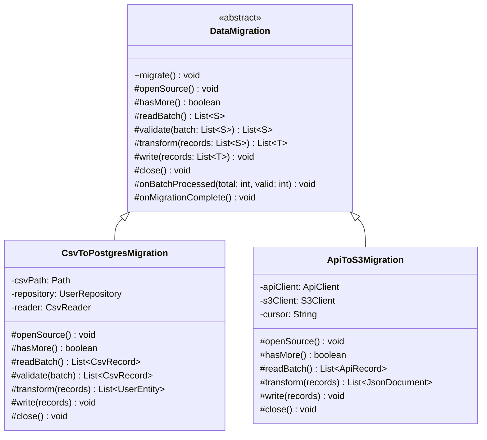

# Template Method Pattern

> *"Define the skeleton of an algorithm in an operation, deferring some steps to subclasses. Template Method lets subclasses redefine certain steps of an algorithm without changing the algorithm's structure."*
> — GoF Design Patterns

Template Method codifies a recurring truth in software: many algorithms share the same high-level structure but differ in the details of specific steps. The pattern captures the shared structure in a base class, leaving the variable steps abstract for subclasses to fill in.

---

## The Problem it Solves

A data migration pipeline processes records from a source: open the source, read records in batches, validate each record, transform it, write to the destination, close everything. The sequence never changes. But the source (CSV file vs database table vs REST API) and destination (another database vs S3 vs another API) vary per use case.

### Naive approach — code duplication

```java
public class CsvToDbMigration {
    public void migrate() {
        CsvReader reader = new CsvReader(filePath);
        reader.open();
        while (reader.hasMore()) {
            List<Record> batch = reader.readBatch(100);
            List<ValidRecord> valid = validate(batch);
            List<TransformedRecord> transformed = transformForDb(valid);
            dbWriter.writeBatch(transformed);
        }
        reader.close();
        dbWriter.close();
    }
}

public class DbToS3Migration {
    public void migrate() {
        // SAME structure — open, read, validate, transform, write, close
        // But different types and different implementations of each step
        JdbcReader reader = new JdbcReader(dataSource);
        reader.open();
        // ... near-identical loop body
    }
}
```

The high-level algorithm is duplicated. If you add retry logic, change batch size logic, or add progress reporting, you have to edit every migration class.

---

## Complete Implementation

### Step 1 — Identify the Fixed Skeleton

The invariant algorithm:
1. Open source
2. While records remain: read batch → validate → transform → write
3. Close resources (even on exception)

### Step 2 — Abstract Class with the Template Method

```java
// Template Method lives here — final, cannot be overridden
public abstract class DataMigration<S, T> {

    // THE template method — the fixed algorithm
    public final void migrate() {
        openSource();
        try {
            while (hasMore()) {
                List<S> batch = readBatch();
                if (batch.isEmpty()) break;

                List<S> valid = validate(batch);
                List<T> transformed = transform(valid);
                write(transformed);

                onBatchProcessed(batch.size(), valid.size());  // hook
            }
        } finally {
            close();  // always close, even on exception
        }
        onMigrationComplete();  // hook
    }

    // Abstract steps — subclasses must implement these
    protected abstract void    openSource();
    protected abstract boolean hasMore();
    protected abstract List<S> readBatch();
    protected abstract List<T> transform(List<S> records);
    protected abstract void    write(List<T> records);
    protected abstract void    close();

    // Default validation — can be overridden for custom rules
    protected List<S> validate(List<S> batch) {
        return batch.stream()
                    .filter(r -> r != null)
                    .toList();
    }

    // Hooks — optional callbacks with empty defaults
    protected void onBatchProcessed(int total, int valid) {
        // Default: do nothing. Subclasses can override for logging/metrics
    }

    protected void onMigrationComplete() {
        // Default: do nothing
    }
}
```

### Step 3 — Concrete Subclasses Fill in the Steps

```java
public class CsvToPostgresMigration extends DataMigration<CsvRecord, UserEntity> {
    private final Path        csvPath;
    private final UserRepository repository;
    private       CsvReader   reader;

    public CsvToPostgresMigration(Path csvPath, UserRepository repository) {
        this.csvPath    = csvPath;
        this.repository = repository;
    }

    @Override
    protected void openSource() {
        reader = new CsvReader(csvPath);
        reader.open();
    }

    @Override
    protected boolean hasMore() { return reader.hasMore(); }

    @Override
    protected List<CsvRecord> readBatch() { return reader.readBatch(500); }

    @Override
    protected List<CsvRecord> validate(List<CsvRecord> batch) {
        return batch.stream()
            .filter(r -> r.getEmail() != null && r.getEmail().contains("@"))
            .filter(r -> r.getName() != null && !r.getName().isBlank())
            .toList();
    }

    @Override
    protected List<UserEntity> transform(List<CsvRecord> records) {
        return records.stream()
            .map(r -> new UserEntity(r.getName(), r.getEmail().toLowerCase()))
            .toList();
    }

    @Override
    protected void write(List<UserEntity> entities) { repository.saveAll(entities); }

    @Override
    protected void close() { reader.close(); }

    @Override
    protected void onBatchProcessed(int total, int valid) {
        System.out.printf("Batch: %d read, %d valid%n", total, valid);
    }
}

public class ApiToS3Migration extends DataMigration<ApiRecord, JsonDocument> {
    private final ApiClient     apiClient;
    private final S3Client      s3Client;
    private final String        bucketName;
    private       String        cursor;
    private       boolean       exhausted = false;

    public ApiToS3Migration(ApiClient apiClient, S3Client s3Client, String bucketName) {
        this.apiClient  = apiClient;
        this.s3Client   = s3Client;
        this.bucketName = bucketName;
    }

    @Override protected void    openSource()     { cursor = null; }
    @Override protected boolean hasMore()        { return !exhausted; }

    @Override
    protected List<ApiRecord> readBatch() {
        ApiPage page = apiClient.fetchPage(cursor, 100);
        cursor = page.getNextCursor();
        if (cursor == null) exhausted = true;
        return page.getRecords();
    }

    @Override
    protected List<JsonDocument> transform(List<ApiRecord> records) {
        return records.stream()
            .map(r -> new JsonDocument(r.getId(), Json.toJson(r)))
            .toList();
    }

    @Override
    protected void write(List<JsonDocument> docs) {
        docs.forEach(d -> s3Client.putObject(bucketName, d.getId() + ".json", d.getContent()));
    }

    @Override protected void close() { /* API has no persistent connection */ }
}
```

### Usage

```java
new CsvToPostgresMigration(Paths.get("users.csv"), userRepository).migrate();
new ApiToS3Migration(apiClient, s3Client, "migrations-bucket").migrate();
```

Both follow exactly the same algorithm. Progress reporting, error handling, and resource cleanup are in one place.

---

## Class Diagram



---

## Hooks vs Abstract Steps

Template Method distinguishes two types of extension points:

| Type | Declaration | Purpose |
|---|---|---|
| **Abstract step** | `protected abstract void step()` | **Must** be implemented by subclass |
| **Hook** | `protected void hook() {}` | **May** be overridden; has a default (usually empty) |

Abstract steps are mandatory parts of the algorithm. Hooks are optional customisation points that do nothing unless the subclass wants to act on them. `onBatchProcessed()` and `onMigrationComplete()` above are hooks.

---

## Real-World Uses of Template Method

| Example | Template Method | Abstract steps |
|---|---|---|
| JUnit `TestCase` | `runTest()` | Each `@Test` method |
| Spring's `JdbcTemplate` | `execute()` | Connection handling done for you |
| `AbstractList` in Java | `iterator()` | `get(int)` and `size()` |
| Servlet lifecycle | `service()` | `doGet()`, `doPost()`, `doPut()` |
| Spring `AbstractBeanFactory` | `getBean()` | `createBean()` |

### AbstractList Example

```java
// AbstractList is a Template Method — you implement get() and size()
public class FibonacciList extends AbstractList<Long> {
    private final int limit;

    public FibonacciList(int limit) { this.limit = limit; }

    @Override
    public Long get(int index) {
        if (index < 0 || index >= limit) throw new IndexOutOfBoundsException(index);
        long a = 0, b = 1;
        for (int i = 0; i < index; i++) {
            long tmp = a + b;
            a = b;
            b = tmp;
        }
        return a;
    }

    @Override
    public int size() { return limit; }
}

// All List operations (contains, indexOf, subList, iterator, stream...) work for free
List<Long> fibs = new FibonacciList(10);
System.out.println(fibs);                    // [0, 1, 1, 2, 3, 5, 8, 13, 21, 34]
System.out.println(fibs.contains(8L));        // true
System.out.println(fibs.subList(3, 7));       // [2, 3, 5, 8]
```

---

## Template Method vs Strategy

| | Template Method | Strategy |
|---|---|---|
| **Mechanism** | Inheritance (abstract method) | Composition (injected object) |
| **Change at** | Compile time | Runtime |
| **Algorithm parts** | Some steps vary | Entire algorithm varies |
| **Coupling** | Subclass coupled to base class | No coupling between strategies |
| **Flexibility** | Less — one class per variant | More — swap at runtime |

> **Pragmatic guide**: If you control both the skeleton and the variants, and compile-time selection is fine, Template Method is simpler (no extra interface). If the algorithm must be swappable at runtime, or the steps are reusable independently, use Strategy.

---

## The Hollywood Principle

Template Method is often called the **Hollywood Principle** pattern: *"Don't call us, we'll call you."*

The base class (Hollywood) drives the algorithm. The subclasses (actors) implement specific steps but never call the skeleton themselves — they wait to be invoked. The control flow is inverted: the framework calls the subclass, not the other way around.

This inversion is the reason the template method is marked `final` — subclasses shouldn't be able to reorder the algorithm's steps.

---

## When to Use Template Method

**Use it when:**
- Multiple classes share the same algorithm structure but differ in specific steps
- You want to enforce the algorithm structure (make it `final`) and prevent subclasses from breaking it
- The common parts of the algorithm represent non-trivial reusable logic (error handling, resource management)

**Don't use it when:**
- The skeleton is trivial — just two lines and a method call
- You need to swap algorithms at runtime — use Strategy
- The inheritance depth is already deep — Template Method adds another layer

---

## Key Takeaways

- Template Method captures the **invariant structure** of an algorithm in a `final` base-class method; subclasses fill in the **variant steps**
- The template method is marked `final` to prevent subclasses from breaking the algorithm's structure — only the abstract steps can be overridden
- **Hooks** (empty protected methods) provide optional customisation points; **abstract methods** provide mandatory ones
- Java's `AbstractList`, `AbstractMap`, `HttpServlet`, and Spring's `JdbcTemplate` are real-world Template Method applications
- The **Hollywood Principle** (don't call us, we'll call you) is the inversion of control that makes Template Method work
