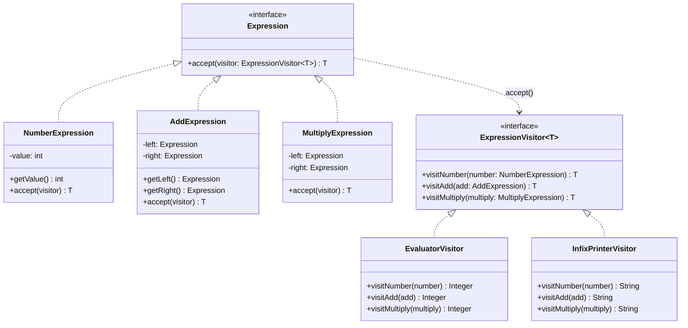

# Visitor Pattern

> *"Represent an operation to be performed on the elements of an object structure. Visitor lets you define a new operation without changing the classes of the elements on which it operates."*
> — GoF Design Patterns

Visitor is the pattern for adding new operations to a stable object hierarchy — without touching the hierarchy's classes. It solves a fundamental tension in OOP: the trade-off between adding new types vs adding new operations.

---

## The Problem it Solves

You have an Abstract Syntax Tree (AST) representing a parsed expression. The AST nodes are stable: `NumberExpression`, `AddExpression`, `MultiplyExpression`. But you need many operations: evaluate it, print it, compile it to bytecode, lint it for style, and estimate its computational cost.

### Without Visitor — the "just add a method" approach

```java
public interface Expression {
    int    evaluate();
    String print();
    String compile();   // adding more operations means editing this interface
    String lint();      // ... and every implementing class
    int    estimateCost();
}

public class AddExpression implements Expression {
    @Override public int    evaluate()    { return left.evaluate() + right.evaluate(); }
    @Override public String print()       { return "(" + left.print() + " + " + right.print() + ")"; }
    @Override public String compile()     { /* bytecode for add */ }
    @Override public String lint()        { /* lint rules for addition */ }
    @Override public int    estimateCost(){ /* ... */ }
}
```

Every time you add a new operation, you modify the `Expression` interface and every class that implements it. With 5 expression types and 10 operations, you have 50 methods scattered across 5 classes. The expression hierarchy is "open for new types" but **closed for new operations**.

### With Visitor — flipped trade-off

Add all the code for **one operation** in one class. Adding a new operation = adding one new class:

```
EvaluatorVisitor.java   — all evaluate logic in one place
PrinterVisitor.java     — all print logic in one place
CompilerVisitor.java    — all compile logic in one place
```

---

## Complete Implementation: Expression Tree

### Step 1 — The Element Hierarchy

```java
// Each element accepts a visitor — this is the "double dispatch" mechanism
public interface Expression {
    <T> T accept(ExpressionVisitor<T> visitor);
}

public class NumberExpression implements Expression {
    private final int value;

    public NumberExpression(int value) { this.value = value; }

    public int getValue() { return value; }

    @Override
    public <T> T accept(ExpressionVisitor<T> visitor) {
        return visitor.visitNumber(this);   // dispatches to the specific visitor method
    }
}

public class AddExpression implements Expression {
    private final Expression left;
    private final Expression right;

    public AddExpression(Expression left, Expression right) {
        this.left  = left;
        this.right = right;
    }

    public Expression getLeft()  { return left; }
    public Expression getRight() { return right; }

    @Override
    public <T> T accept(ExpressionVisitor<T> visitor) {
        return visitor.visitAdd(this);
    }
}

public class MultiplyExpression implements Expression {
    private final Expression left;
    private final Expression right;

    public MultiplyExpression(Expression left, Expression right) {
        this.left  = left;
        this.right = right;
    }

    public Expression getLeft()  { return left; }
    public Expression getRight() { return right; }

    @Override
    public <T> T accept(ExpressionVisitor<T> visitor) {
        return visitor.visitMultiply(this);
    }
}
```

### Step 2 — The Visitor Interface

```java
public interface ExpressionVisitor<T> {
    T visitNumber(NumberExpression number);
    T visitAdd(AddExpression add);
    T visitMultiply(MultiplyExpression multiply);
}
```

### Step 3 — Concrete Visitors (one per operation)

```java
// Operation 1: Evaluate the expression
public class EvaluatorVisitor implements ExpressionVisitor<Integer> {

    @Override
    public Integer visitNumber(NumberExpression number) {
        return number.getValue();
    }

    @Override
    public Integer visitAdd(AddExpression add) {
        return add.getLeft().accept(this) + add.getRight().accept(this);
    }

    @Override
    public Integer visitMultiply(MultiplyExpression multiply) {
        return multiply.getLeft().accept(this) * multiply.getRight().accept(this);
    }
}

// Operation 2: Print as infix expression
public class InfixPrinterVisitor implements ExpressionVisitor<String> {

    @Override
    public String visitNumber(NumberExpression number) {
        return String.valueOf(number.getValue());
    }

    @Override
    public String visitAdd(AddExpression add) {
        return "(" + add.getLeft().accept(this)
             + " + "
             + add.getRight().accept(this) + ")";
    }

    @Override
    public String visitMultiply(MultiplyExpression multiply) {
        return "(" + multiply.getLeft().accept(this)
             + " * "
             + multiply.getRight().accept(this) + ")";
    }
}

// Operation 3: Estimate computational cost (number of operations)
public class CostEstimatorVisitor implements ExpressionVisitor<Integer> {

    @Override
    public Integer visitNumber(NumberExpression number) {
        return 0;   // leaf — no operations
    }

    @Override
    public Integer visitAdd(AddExpression add) {
        return 1 + add.getLeft().accept(this) + add.getRight().accept(this);
    }

    @Override
    public Integer visitMultiply(MultiplyExpression multiply) {
        // Multiply is more expensive than add
        return 3 + multiply.getLeft().accept(this) + multiply.getRight().accept(this);
    }
}
```

```java
// Usage
// Build AST: (2 + 3) * 4
Expression expr = new MultiplyExpression(
    new AddExpression(new NumberExpression(2), new NumberExpression(3)),
    new NumberExpression(4)
);

EvaluatorVisitor   evaluator = new EvaluatorVisitor();
InfixPrinterVisitor printer  = new InfixPrinterVisitor();
CostEstimatorVisitor cost    = new CostEstimatorVisitor();

System.out.println(expr.accept(printer));    // ((2 + 3) * 4)
System.out.println(expr.accept(evaluator));  // 20
System.out.println(expr.accept(cost));       // 4
```

---

## How Double Dispatch Works

Java uses single dispatch: when you call `someObj.method()`, the method selected depends on the runtime type of `someObj` — not the caller's type. That's a problem for Visitor: you want the behaviour to depend on **both** the element type and the visitor type.

Double dispatch solves this with two method calls:

```
1. expr.accept(visitor)
   → dispatches on the runtime type of expr (e.g., AddExpression)
   → calls visitor.visitAdd(this)

2. visitor.visitAdd(this)
   → dispatches on the runtime type of visitor (e.g., EvaluatorVisitor)
   → runs EvaluatorVisitor.visitAdd(...)
```

```
Element type:   AddExpression    ← first dispatch resolves this
Visitor type:   EvaluatorVisitor ← second dispatch resolves this
Method called:  EvaluatorVisitor.visitAdd(AddExpression)
```

Without `accept()`, you'd need `instanceof` chains everywhere:

```java
// Without double dispatch — instanceof cascade
if (expr instanceof NumberExpression n) { return n.getValue(); }
else if (expr instanceof AddExpression a) { ... }
else if (expr instanceof MultiplyExpression m) { ... }
```

---

## Class Diagram



---

## Visitor for Document Export

Another canonical Visitor example — exporting documents in multiple formats:

```java
public interface DocumentElement {
    void accept(DocumentVisitor visitor);
}

public class Paragraph implements DocumentElement {
    private final String text;
    public Paragraph(String text) { this.text = text; }
    public String getText() { return text; }
    @Override public void accept(DocumentVisitor visitor) { visitor.visitParagraph(this); }
}

public class Heading implements DocumentElement {
    private final String text;
    private final int    level;
    public Heading(String text, int level) { this.text = text; this.level = level; }
    public String getText()  { return text; }
    public int    getLevel() { return level; }
    @Override public void accept(DocumentVisitor visitor) { visitor.visitHeading(this); }
}

public class CodeBlock implements DocumentElement {
    private final String code;
    private final String language;
    public CodeBlock(String code, String language) { this.code = code; this.language = language; }
    public String getCode()     { return code; }
    public String getLanguage() { return language; }
    @Override public void accept(DocumentVisitor visitor) { visitor.visitCodeBlock(this); }
}

// Visitor interface
public interface DocumentVisitor {
    void visitParagraph(Paragraph paragraph);
    void visitHeading(Heading heading);
    void visitCodeBlock(CodeBlock codeBlock);
}

// One visitor per export format — no changes to document elements
public class HtmlExportVisitor implements DocumentVisitor {
    private final StringBuilder html = new StringBuilder();

    @Override
    public void visitParagraph(Paragraph p) {
        html.append("<p>").append(escape(p.getText())).append("</p>\n");
    }

    @Override
    public void visitHeading(Heading h) {
        html.append("<h").append(h.getLevel()).append(">")
            .append(escape(h.getText()))
            .append("</h").append(h.getLevel()).append(">\n");
    }

    @Override
    public void visitCodeBlock(CodeBlock c) {
        html.append("<pre><code class=\"language-").append(c.getLanguage()).append("\">")
            .append(escape(c.getCode()))
            .append("</code></pre>\n");
    }

    public String getResult() { return html.toString(); }
    private String escape(String s) { /* HTML entity encoding */ return s; }
}
```

---

## The Extensibility Trade-off

Visitor and Composite/OOP sit at opposite ends of the extensibility axis:

| | Visitor | Direct methods on classes |
|---|---|---|
| **Adding new operation** | Easy — add one new Visitor class | Hard — modify the interface and all implementations |
| **Adding new element type** | Hard — modify Visitor interface and all Visitor classes | Easy — add one new class implementing the interface |
| **Best for** | Stable hierarchy, many operations | Evolving hierarchy, stable operations |

This is the **Expression Problem** — you can't easily do both without a language feature (like Scala's pattern matching type classes or Haskell's type classes).

Choose Visitor when: you're confident the element types won't change often, but you expect many new operations.

---

## When to Use Visitor

**Use it when:**
- You have a stable class hierarchy that needs many different, unrelated operations
- You want to add operations to a class hierarchy without modifying it (Open/Closed for operations)
- Operations involve complex logic that cuts across many types and doesn't belong in those types

**Don't use it when:**
- New element types are added frequently — every new type requires updating all Visitor implementations
- The hierarchy is small (2-3 classes) — Visitor is heavy machinery; simple polymorphism suffices
- Operations are closely related to the element's data — keep them on the class directly

---

## Key Takeaways

- Visitor externalises operations from a class hierarchy — each Visitor class contains all the code for one operation across all element types
- **Double dispatch** is the core mechanism: `element.accept(visitor)` resolves the element type; `visitor.visit(element)` resolves the visitor type
- The pattern inverts the usual extensibility trade-off: easy to add operations, hard to add new element types — the mirror image of normal OOP polymorphism
- In modern Java, **sealed classes + pattern matching** (`switch` with type patterns) can replace Visitor in many cases, providing compiler-checked exhaustiveness without the `accept()` ceremony
- Visitor is most valuable for **compiler-like problems**: ASTs, document trees, object graphs where you want to define many algorithms without touching the tree nodes
