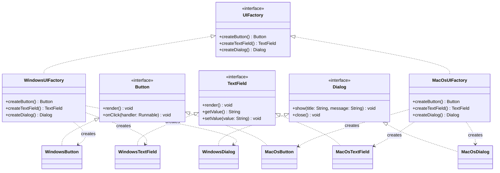
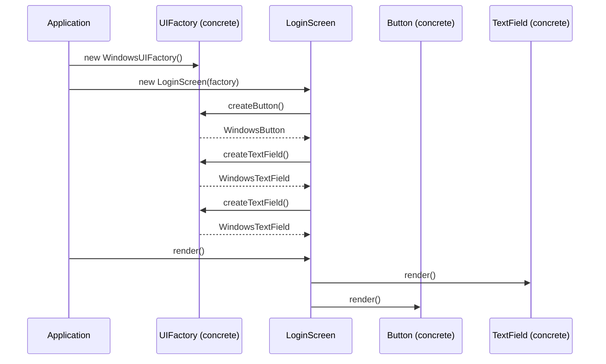

# Abstract Factory Pattern

> *"Provide an interface for creating families of related or dependent objects without specifying their concrete classes."*
> — GoF Design Patterns

While the Factory Method pattern creates one kind of object, Abstract Factory creates **entire families** of related objects. The key constraint it enforces: all objects created by a single factory belong to the same family and are designed to work together.

---

## The Problem it Solves

Imagine building a UI framework that must render correctly on multiple platforms — Windows, macOS, and Web. Each platform needs its own `Button`, `TextField`, and `Dialog`. But they must be **consistent**: a macOS button paired with a Windows dialog would produce a broken UI.

Without Abstract Factory:

```java
// Scattered, inconsistent creation
public class LoginScreen {

    public void render(String platform) {
        Button button;
        TextField textField;
        Dialog dialog;

        if (platform.equals("windows")) {
            button    = new WindowsButton();
            textField = new WindowsTextField();
            dialog    = new WindowsDialog();          // OK so far

        } else if (platform.equals("macos")) {
            button    = new MacOsButton();
            textField = new WindowsTextField();       // BUG: wrong family!
            dialog    = new MacOsDialog();

        } else {
            // ... and another branch for Web
        }
    }
}
```

Two problems:
1. A programmer can accidentally mix families (`MacOsButton` with `WindowsTextField`)
2. Adding "Web" requires editing every screen class

Abstract Factory solves both: the factory guarantees consistency, and adding a new family requires only a new factory class.

---

## Evolution: Naive → Abstract Factory

### Step 1 — Define Product Interfaces

Each product type gets an interface that all families must implement:

```java
// Product family: UI components
public interface Button {
    void render();
    void onClick(Runnable handler);
}

public interface TextField {
    void render();
    String getValue();
    void setValue(String value);
}

public interface Dialog {
    void show(String title, String message);
    void close();
}
```

### Step 2 — Implement Each Product per Family

```java
// Windows family
public class WindowsButton implements Button {
    @Override
    public void render() { System.out.println("[Windows] Button rendered"); }
    @Override
    public void onClick(Runnable handler) { handler.run(); }
}

public class WindowsTextField implements TextField {
    private String value = "";
    @Override
    public void render() { System.out.println("[Windows] TextField rendered"); }
    @Override
    public String getValue() { return value; }
    @Override
    public void setValue(String value) { this.value = value; }
}

public class WindowsDialog implements Dialog {
    @Override
    public void show(String title, String message) {
        System.out.printf("[Windows] Dialog: %s - %s%n", title, message);
    }
    @Override
    public void close() { System.out.println("[Windows] Dialog closed"); }
}

// macOS family — same interfaces, different implementations
public class MacOsButton implements Button {
    @Override
    public void render() { System.out.println("[macOS] Button rendered"); }
    @Override
    public void onClick(Runnable handler) { handler.run(); }
}

public class MacOsTextField implements TextField {
    private String value = "";
    @Override public void render()                { System.out.println("[macOS] TextField rendered"); }
    @Override public String getValue()            { return value; }
    @Override public void setValue(String value)  { this.value = value; }
}

public class MacOsDialog implements Dialog {
    @Override
    public void show(String title, String message) {
        System.out.printf("[macOS] Dialog: %s - %s%n", title, message);
    }
    @Override public void close() { System.out.println("[macOS] Dialog closed"); }
}
```

### Step 3 — Define the Abstract Factory Interface

```java
// The Abstract Factory — one factory method per product type
public interface UIFactory {
    Button    createButton();
    TextField createTextField();
    Dialog    createDialog();
}
```

### Step 4 — Implement Concrete Factories

```java
// Windows factory — creates the entire Windows family
public class WindowsUIFactory implements UIFactory {
    @Override
    public Button    createButton()    { return new WindowsButton(); }
    @Override
    public TextField createTextField() { return new WindowsTextField(); }
    @Override
    public Dialog    createDialog()    { return new WindowsDialog(); }
}

// macOS factory — creates the entire macOS family
public class MacOsUIFactory implements UIFactory {
    @Override
    public Button    createButton()    { return new MacOsButton(); }
    @Override
    public TextField createTextField() { return new MacOsTextField(); }
    @Override
    public Dialog    createDialog()    { return new MacOsDialog(); }
}
```

### Step 5 — Client Code Uses Only Interfaces

```java
public class LoginScreen {
    private final Button    loginButton;
    private final TextField usernameField;
    private final TextField passwordField;

    // Constructor receives a factory — never knows the concrete family
    public LoginScreen(UIFactory factory) {
        this.loginButton    = factory.createButton();
        this.usernameField  = factory.createTextField();
        this.passwordField  = factory.createTextField();
    }

    public void render() {
        usernameField.render();
        passwordField.render();
        loginButton.render();
    }

    public void attemptLogin(AuthService auth) {
        loginButton.onClick(() -> {
            auth.authenticate(usernameField.getValue(), passwordField.getValue());
        });
    }
}
```

### Step 6 — Wire at the Composition Root

```java
public class Application {
    public static void main(String[] args) {
        String platform = System.getProperty("os.name").toLowerCase();

        UIFactory factory = platform.contains("mac")
            ? new MacOsUIFactory()
            : new WindowsUIFactory();

        LoginScreen screen = new LoginScreen(factory);
        screen.render();
    }
}
```

Adding "Web" = add `WebButton`, `WebTextField`, `WebDialog`, `WebUIFactory`. **Zero changes** to `LoginScreen` or `Application`.

---

## Class Diagram



---

## Sequence Diagram



---

## Real-World Production Example: Database DAO Factory

A common production use of Abstract Factory is creating entire layers of data access objects that must use the same underlying database:

```java
// Product interfaces
public interface UserRepository {
    void save(User user);
    Optional<User> findById(String id);
}

public interface OrderRepository {
    void save(Order order);
    List<Order> findByUserId(String userId);
}

public interface TransactionRepository {
    void record(Transaction tx);
    List<Transaction> findByOrderId(String orderId);
}

// The abstract factory
public interface RepositoryFactory {
    UserRepository        createUserRepository();
    OrderRepository       createOrderRepository();
    TransactionRepository createTransactionRepository();
}

// PostgreSQL family
public class PostgresRepositoryFactory implements RepositoryFactory {
    private final DataSource dataSource;

    public PostgresRepositoryFactory(DataSource dataSource) {
        this.dataSource = dataSource;
    }

    @Override
    public UserRepository        createUserRepository()        { return new PostgresUserRepository(dataSource); }
    @Override
    public OrderRepository       createOrderRepository()       { return new PostgresOrderRepository(dataSource); }
    @Override
    public TransactionRepository createTransactionRepository() { return new PostgresTransactionRepository(dataSource); }
}

// In-memory family — for tests (no database required)
public class InMemoryRepositoryFactory implements RepositoryFactory {
    @Override
    public UserRepository        createUserRepository()        { return new InMemoryUserRepository(); }
    @Override
    public OrderRepository       createOrderRepository()       { return new InMemoryOrderRepository(); }
    @Override
    public TransactionRepository createTransactionRepository() { return new InMemoryTransactionRepository(); }
}
```

```java
// Service uses repositories — never knows whether they're Postgres or in-memory
public class OrderService {
    private final UserRepository        users;
    private final OrderRepository       orders;
    private final TransactionRepository transactions;

    public OrderService(RepositoryFactory factory) {
        this.users        = factory.createUserRepository();
        this.orders       = factory.createOrderRepository();
        this.transactions = factory.createTransactionRepository();
    }

    public void placeOrder(String userId, List<OrderItem> items) {
        User  user  = users.findById(userId).orElseThrow(() -> new UserNotFoundException(userId));
        Order order = Order.create(user, items);
        orders.save(order);
        transactions.record(Transaction.forOrder(order));
    }
}

// Production
RepositoryFactory factory = new PostgresRepositoryFactory(dataSource);
OrderService service = new OrderService(factory);

// Test — zero database, zero network
RepositoryFactory testFactory = new InMemoryRepositoryFactory();
OrderService testService = new OrderService(testFactory);
```

---

## The Core Trade-Off: Families vs Products

Abstract Factory's single greatest weakness:

**Adding a new product type requires editing all concrete factories.**

```java
// If you add Tooltip as a new product type...
public interface UIFactory {
    Button    createButton();
    TextField createTextField();
    Dialog    createDialog();
    Tooltip   createTooltip();   // NEW — now every concrete factory must be updated
}
```

| Change type | Effort |
|---|---|
| Add a new **family** (e.g., Web UI) | Write one new factory class + products |
| Add a new **product type** (e.g., Tooltip) | Edit all existing factory interfaces + all concrete factories |

This is the classic OCP tension in Abstract Factory: it's open for new families, closed to new product types. Plan your product interface first, before creating concrete factories.

---

## Abstract Factory vs Factory Method

| Dimension | Factory Method | Abstract Factory |
|---|---|---|
| Creates | One product type | A family of related products |
| Structure | One abstract method per creator | Multiple factory methods per factory |
| Mechanism | Subclassing (override) | Object composition (inject factory) |
| When to use | Product type varies by subclass | Entire family of objects must be consistent |
| Extensibility | New type = new creator subclass | New family = new factory class; new product = edit all factories |

A common relationship: **Abstract Factory often uses Factory Methods internally** — each method in the abstract factory is a Factory Method.

---

## Testing with Abstract Factory

Abstract Factory makes testing exceptionally clean: swap the entire production factory for a test factory and every dependency is replaced at once.

```java
@Test
void shouldPlaceOrderAndRecordTransaction() {
    InMemoryRepositoryFactory factory = new InMemoryRepositoryFactory();
    OrderService service = new OrderService(factory);

    factory.createUserRepository().save(new User("u1", "alice@example.com"));
    service.placeOrder("u1", List.of(new OrderItem("SKU-1", 2)));

    List<Order> orders = factory.createOrderRepository().findByUserId("u1");
    assertThat(orders).hasSize(1);

    List<Transaction> txns = factory.createTransactionRepository().findByOrderId(orders.get(0).getId());
    assertThat(txns).hasSize(1);
}
```

No Spring context, no Docker containers, no setup scripts — just in-memory implementations wired through the factory.

---

## When to Use Abstract Factory

**Use it when:**
- Your system must work with multiple families of related objects (multi-platform UI, multi-database DAOs, multi-environment configurations)
- You need to **enforce consistency** — objects from one family should never be mixed with objects from another
- You want to swap the entire family at the composition root without touching any business logic

**Don't use it when:**
- There is only one family — no benefit over plain construction
- The products in each family have no meaningful interaction — they don't need to be consistent
- The product set is expected to grow frequently — adding new product types is costly

---

## Key Takeaways

- Abstract Factory creates **families of related objects** — consistency between products is its defining value
- Clients depend only on factory and product **interfaces** — no knowledge of concrete families
- New family = one new factory class (OCP-safe); new product type = edit all factories (OCP trade-off)
- In Java applications, Abstract Factory is frequently the **test seam**: swap the production factory for an in-memory factory in tests
- Abstract Factory is often composed of Factory Methods — each `createX()` method is a Factory Method applied to one product type
