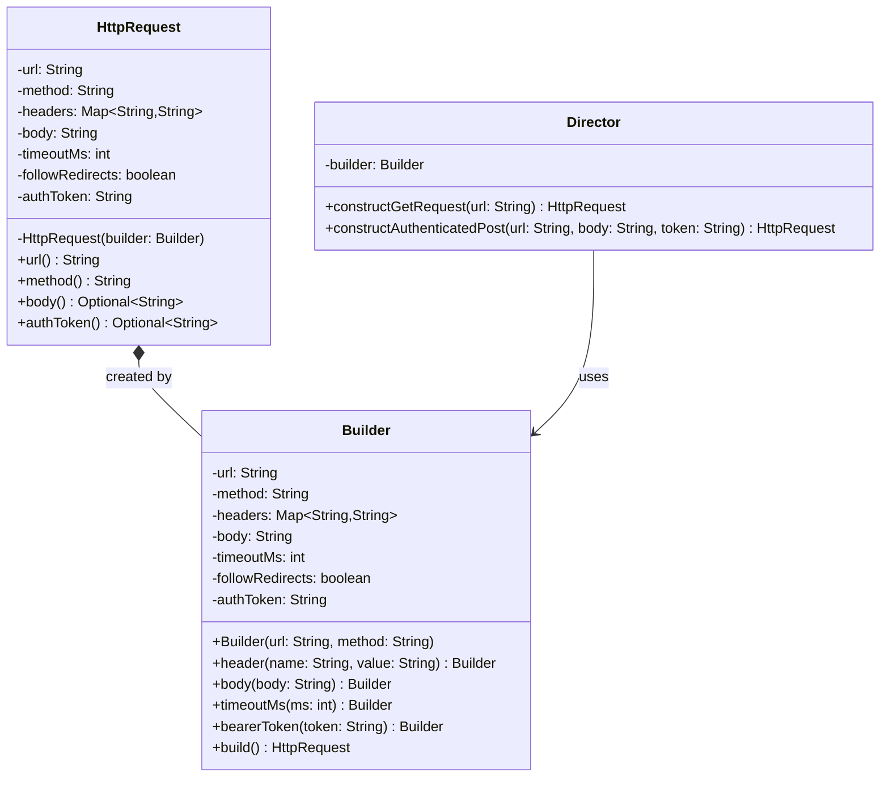
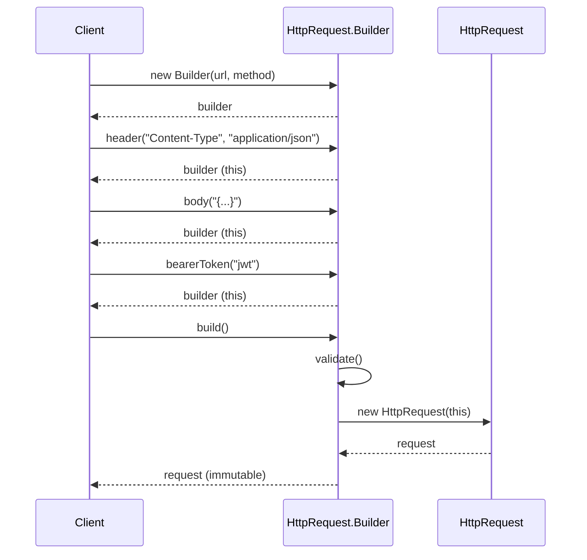

# Builder Pattern

> *"Separate the construction of a complex object from its representation so that the same construction process can create different representations."*
> — GoF Design Patterns

The Builder pattern is the answer to a specific, recurring pain: objects that require many parameters to construct, some optional, some interdependent, some that make the object invalid if combined incorrectly.

It produces **immutable, fully-validated objects** through a readable, step-by-step construction API.

---

## The Problem it Solves

### Problem 1 — Telescoping Constructors

A class with many optional parameters leads to a "telescoping" constructor mess:

```java
public class HttpRequest {
    // 7-parameter constructor — which arg is which?
    public HttpRequest(String url, String method, Map<String, String> headers,
                       String body, int timeoutMs, boolean followRedirects,
                       String authToken) { ... }
}

// At the call site — what do these arguments mean?
HttpRequest request = new HttpRequest(
    "https://api.example.com/orders",
    "POST",
    Map.of("Content-Type", "application/json"),
    "{\"amount\": 100}",
    5000,
    true,
    null       // no auth token? or default? hard to tell
);
```

**Problems:**
- Parameters of the same type (`String url`, `String method`, `String body`) are positional — easy to swap by mistake
- Null-passing is required for optional parameters
- Adding a new optional parameter requires either a new constructor overload or changing existing call sites

### Problem 2 — Setter-Based Construction

The "JavaBean" approach uses a no-arg constructor and setters:

```java
HttpRequest request = new HttpRequest();
request.setUrl("https://api.example.com/orders");
request.setMethod("POST");
request.setBody("{\"amount\": 100}");
// Oops — forgot to call setUrl() — now in an invalid state
send(request);  // URL is null
```

**Problems:**
- The object exists in an **invalid intermediate state** between construction calls
- There is no single point to enforce validation — any setter could leave the object broken
- Objects can never be truly **immutable** — the setters mean any code can mutate state

---

## The Builder Pattern

Builder moves all construction into a **separate builder object** with a fluent API. The final `build()` call is the one moment where validation happens and the immutable result is produced.

### Complete Production Implementation

```java
// The immutable result — no setters, all fields final
public final class HttpRequest {
    private final String              url;
    private final String              method;
    private final Map<String, String> headers;
    private final String              body;
    private final int                 timeoutMs;
    private final boolean             followRedirects;
    private final String              authToken;  // nullable — optional

    // Private constructor — only Builder can call this
    private HttpRequest(Builder builder) {
        this.url             = builder.url;
        this.method          = builder.method;
        this.headers         = Collections.unmodifiableMap(new LinkedHashMap<>(builder.headers));
        this.body            = builder.body;
        this.timeoutMs       = builder.timeoutMs;
        this.followRedirects = builder.followRedirects;
        this.authToken       = builder.authToken;
    }

    // Accessors — no setters
    public String              url()             { return url; }
    public String              method()          { return method; }
    public Map<String, String> headers()         { return headers; }
    public Optional<String>    body()            { return Optional.ofNullable(body); }
    public int                 timeoutMs()       { return timeoutMs; }
    public boolean             followRedirects() { return followRedirects; }
    public Optional<String>    authToken()       { return Optional.ofNullable(authToken); }

    @Override
    public String toString() {
        return "HttpRequest[" + method + " " + url + "]";
    }

    // Static inner Builder class
    public static final class Builder {
        // Required fields — no defaults
        private final String url;
        private final String method;

        // Optional fields — sensible defaults
        private Map<String, String> headers         = new LinkedHashMap<>();
        private String              body            = null;
        private int                 timeoutMs       = 30_000;
        private boolean             followRedirects = true;
        private String              authToken       = null;

        // Constructor takes only required fields
        public Builder(String url, String method) {
            this.url    = Objects.requireNonNull(url,    "url is required");
            this.method = Objects.requireNonNull(method, "method is required");
        }

        // Fluent setters — return this for chaining
        public Builder header(String name, String value) {
            this.headers.put(
                Objects.requireNonNull(name,  "header name is required"),
                Objects.requireNonNull(value, "header value is required")
            );
            return this;
        }

        public Builder headers(Map<String, String> headers) {
            this.headers.putAll(Objects.requireNonNull(headers, "headers map is required"));
            return this;
        }

        public Builder body(String body) {
            this.body = body;
            return this;
        }

        public Builder timeoutMs(int timeoutMs) {
            if (timeoutMs <= 0) throw new IllegalArgumentException("timeout must be positive");
            this.timeoutMs = timeoutMs;
            return this;
        }

        public Builder followRedirects(boolean followRedirects) {
            this.followRedirects = followRedirects;
            return this;
        }

        public Builder bearerToken(String token) {
            this.authToken = Objects.requireNonNull(token, "auth token is required");
            this.headers.put("Authorization", "Bearer " + token);
            return this;
        }

        // Validation + construction
        public HttpRequest build() {
            // Cross-field validation that can't be done in individual setters
            if (hasBody() && isGet()) {
                throw new IllegalStateException("GET requests cannot have a body");
            }
            if (timeoutMs > 120_000) {
                throw new IllegalArgumentException("Timeout exceeds maximum (120s)");
            }
            return new HttpRequest(this);
        }

        private boolean hasBody() { return body != null && !body.isBlank(); }
        private boolean isGet()   { return "GET".equalsIgnoreCase(method); }
    }
}
```

### Usage

```java
// Simple GET — readable, self-documenting
HttpRequest getRequest = new HttpRequest.Builder("https://api.example.com/users/42", "GET")
    .bearerToken("jwt-token-here")
    .timeoutMs(5_000)
    .build();

// Complex POST — clear parameter semantics
HttpRequest postRequest = new HttpRequest.Builder("https://api.example.com/orders", "POST")
    .header("Content-Type", "application/json")
    .header("X-Request-ID", UUID.randomUUID().toString())
    .body("{\"amount\": 100, \"currency\": \"USD\"}")
    .bearerToken("jwt-token-here")
    .timeoutMs(10_000)
    .followRedirects(false)
    .build();
```

---

## Class Diagram



---

## The Director (Optional Refinement)

A **Director** class encapsulates common construction sequences. It's useful when several places in the codebase build the same kind of object with the same configuration:

```java
public class HttpRequestDirector {

    // Reusable construction sequences
    public HttpRequest buildHealthCheck(String baseUrl) {
        return new HttpRequest.Builder(baseUrl + "/health", "GET")
            .timeoutMs(2_000)
            .followRedirects(false)
            .build();
    }

    public HttpRequest buildAuthenticatedPost(String url, String body, String token) {
        return new HttpRequest.Builder(url, "POST")
            .header("Content-Type", "application/json")
            .header("X-Request-ID", UUID.randomUUID().toString())
            .body(body)
            .bearerToken(token)
            .timeoutMs(10_000)
            .build();
    }

    public HttpRequest buildFileUpload(String url, byte[] content, String token) {
        return new HttpRequest.Builder(url, "POST")
            .header("Content-Type", "application/octet-stream")
            .header("Content-Length", String.valueOf(content.length))
            .body(new String(content))
            .bearerToken(token)
            .timeoutMs(60_000)
            .build();
    }
}
```

The Director doesn't add new capability — it just captures recurring construction patterns in one named place.

---

## Test Data Builder: A Pattern within a Pattern

One of the most valuable applications of Builder in production engineering is the **Test Data Builder** — a builder specifically for constructing test fixtures:

```java
// Test Data Builder — only for tests
public class UserBuilder {
    private String id       = UUID.randomUUID().toString();
    private String email    = "user@example.com";
    private String name     = "Test User";
    private boolean active  = true;
    private UserRole role   = UserRole.CUSTOMER;
    private LocalDate memberSince = LocalDate.now().minusYears(1);

    public UserBuilder withId(String id)               { this.id = id; return this; }
    public UserBuilder withEmail(String email)         { this.email = email; return this; }
    public UserBuilder withName(String name)           { this.name = name; return this; }
    public UserBuilder inactive()                      { this.active = false; return this; }
    public UserBuilder asAdmin()                       { this.role = UserRole.ADMIN; return this; }
    public UserBuilder memberSince(LocalDate date)     { this.memberSince = date; return this; }
    public UserBuilder newMember()                     { this.memberSince = LocalDate.now(); return this; }

    public User build() {
        return new User(id, email, name, active, role, memberSince);
    }
}

// Test code is now expressive and noise-free
@Test
void adminShouldAccessRestrictedContent() {
    User admin = new UserBuilder().asAdmin().withEmail("admin@company.com").build();
    assertTrue(accessPolicy.canAccess(admin, Resource.ADMIN_PANEL));
}

@Test
void inactiveUserShouldNotLogin() {
    User inactive = new UserBuilder().inactive().build();
    assertThrows(AccountSuspendedException.class, () -> authService.login(inactive));
}

@Test
void newMemberShouldNotHaveDiscount() {
    User newUser = new UserBuilder().newMember().build();
    assertThat(discountService.getDiscount(newUser)).isEqualTo(Discount.NONE);
}
```

Without the builder, each test would need to call a 6-parameter constructor with irrelevant arguments spelled out explicitly.

---

## Builder in the Java Standard Library

| Builder | Built type |
|---|---|
| `StringBuilder` | `String` |
| `HttpClient.newBuilder()` | `HttpClient` |
| `HttpRequest.newBuilder()` | `HttpRequest` |
| `ProcessBuilder` | `Process` |
| `AlertDialog.Builder` (Android) | `AlertDialog` |
| `UriComponentsBuilder` (Spring) | `UriComponents` |
| `BeanDefinitionBuilder` (Spring) | `BeanDefinition` |

---

## Sequence Diagram: Builder Construction



---

## Key Design Decisions

### When to put fields in the Builder constructor vs fluent methods

- **Constructor**: fields that are **always required** and have no sensible default — URL, HTTP method
- **Fluent method**: fields that are **optional** or have sensible defaults — timeout, headers, body

### Validation placement

| Where to validate | What to validate |
|---|---|
| Builder constructor | Required fields are non-null |
| Each fluent method | The individual field is valid (positive int, non-empty string) |
| `build()` | **Cross-field constraints** (GET cannot have body; timeout cannot exceed limit) |

### Immutability guarantee

- Builder accumulates mutable state during construction
- `build()` copies that state into the immutable result
- The product class has only `final` fields and no setters
- Collections are copied and wrapped in `unmodifiableList`/`unmodifiableMap`

---

## When to Use Builder

**Use it when:**
- The class has 4+ constructor parameters, especially if several are optional
- Invalid intermediate states must be prevented
- You want an immutable result
- Different callers need different subsets of parameters
- You write test data builders for expressive tests

**Don't use it when:**
- The object has 1-3 required fields and no optional ones — a simple constructor is cleaner
- The object is mutable by design — a builder adds overhead for objects that will change
- All fields are always required — just use a constructor with clear parameter names

---

## Tradeoffs

| Benefit | Cost |
|---|---|
| Readable call sites | More classes to maintain (Builder inner class) |
| Immutable results | Longer to write the initial implementation |
| Validation at one point | Builder state can diverge from the product if not carefully maintained |
| Extensible without changing call sites | Adding new required fields breaks the Builder constructor |

---

## Key Takeaways

- Builder produces **immutable, fully-validated objects** through a readable fluent API
- Required fields go in the **builder constructor**; optional fields in fluent methods with defaults
- **Cross-field validation** belongs in `build()` — it's the only place that sees all fields simultaneously
- The **Test Data Builder** is one of the highest-value applications of this pattern — it removes test boilerplate and makes test intent clear
- `build()` should never succeed if the result would be in an invalid state — validation is non-negotiable
- Builder and Singleton often appear together: `AppConfig.getInstance()` frequently returns an object constructed via Builder at startup
