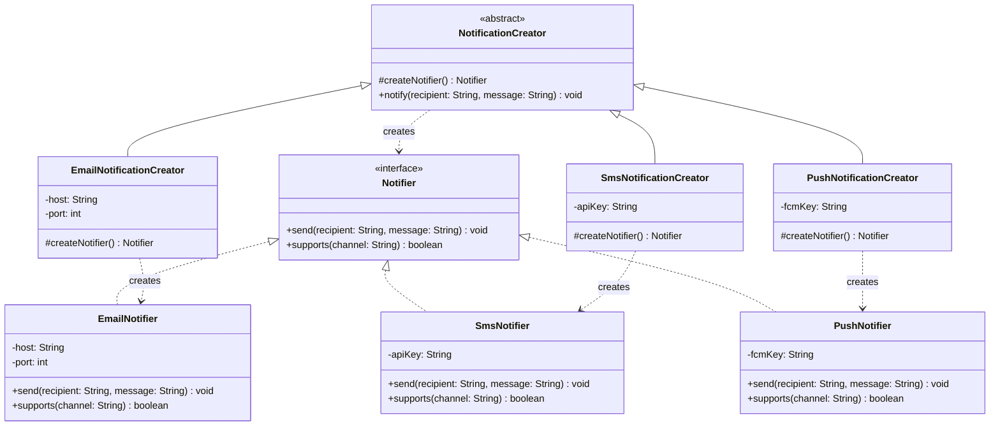
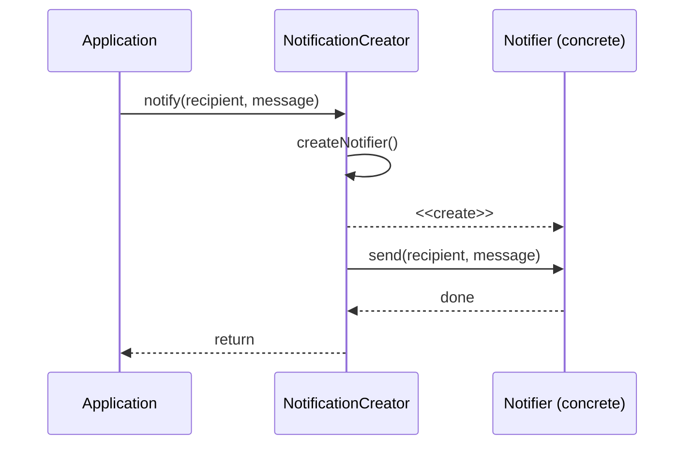

# Factory Method Pattern

> *"Define an interface for creating an object, but let subclasses decide which class to instantiate. Factory Method lets a class defer instantiation to subclasses."*
> — GoF Design Patterns

The Factory Method pattern is the foundational creational pattern. Understand it deeply and you automatically understand Abstract Factory, as well as why direct `new` calls scatter coupling throughout a codebase.

---

## The Problem it Solves

Every time you write `new ConcreteClass()`, you bind the caller to a specific implementation. That one line:

1. Makes the caller responsible for knowing which class to instantiate
2. Embeds a decision that may change over time (payment processor, storage driver, notification channel)
3. Makes the code impossible to test without the concrete dependency present

The problem becomes visible when you trace a real codebase:

```java
// The naive approach — scattered creation logic
public class NotificationService {

    public void notify(User user, String message) {
        String channel = user.getPreferredChannel();

        if (channel.equals("email")) {
            EmailNotifier notifier = new EmailNotifier("smtp.example.com", 587);
            notifier.send(user.getEmail(), message);

        } else if (channel.equals("sms")) {
            SmsNotifier notifier = new SmsNotifier("+1-555", "TWILIO_KEY");
            notifier.send(user.getPhone(), message);

        } else if (channel.equals("push")) {
            PushNotifier notifier = new PushNotifier("FCM_KEY");
            notifier.send(user.getDeviceToken(), message);
        }
        // Add "slack"? Edit this method. And every other place that does the same switch.
    }
}
```

Adding a new channel means editing `NotificationService`. And every other class that builds notifiers. This is an **OCP violation**: a variant requires editing existing code.

---

## Simple Factory (Not GoF — but important)

Before the GoF Factory Method, teams commonly reach for a "Simple Factory" — a static method or a dedicated class that centralises the creation decision:

```java
// Simple Factory — not a GoF pattern, but a stepping stone
public class NotifierFactory {

    public static Notifier create(String channel) {
        return switch (channel) {
            case "email" -> new EmailNotifier("smtp.example.com", 587);
            case "sms"   -> new SmsNotifier("+1-555", "TWILIO_KEY");
            case "push"  -> new PushNotifier("FCM_KEY");
            default      -> throw new IllegalArgumentException("Unknown channel: " + channel);
        };
    }
}
```

**Improvement**: creation is now in one place. All callers use `NotifierFactory.create(channel)`.

**Limitation**: Adding a new channel still requires editing `NotifierFactory`. The OCP violation still exists, just in one place now instead of many. For many projects, this is an acceptable trade-off.

---

## Factory Method: The GoF Pattern

Factory Method introduces a level of indirection: instead of a static helper method, the **creation logic lives in an overridable method** of a creator class (or interface). Subclasses override this method to decide what concrete class to create.

### The participants

```
Creator
  - declares the factory method: Notifier createNotifier()
  - optionally provides a default implementation
  - uses createNotifier() in its template methods

ConcreteCreator (e.g., EmailNotifierCreator)
  - overrides createNotifier() and returns a specific Notifier subclass

Product (Notifier interface)
  - defines the interface all products must implement

ConcreteProduct (EmailNotifier, SmsNotifier, ...)
  - implements the Product interface
```

### Full Implementation

```java
// Product interface — what all notifiers must provide
public interface Notifier {
    void send(String recipient, String message);
    boolean supports(String channel);
}

// Concrete products
public class EmailNotifier implements Notifier {
    private final String host;
    private final int    port;

    public EmailNotifier(String host, int port) {
        this.host = host;
        this.port = port;
    }

    @Override
    public void send(String recipient, String message) {
        // Send email via SMTP
        System.out.printf("[EMAIL] To: %s | %s%n", recipient, message);
    }

    @Override
    public boolean supports(String channel) { return "email".equals(channel); }
}

public class SmsNotifier implements Notifier {
    private final String apiKey;

    public SmsNotifier(String apiKey) { this.apiKey = apiKey; }

    @Override
    public void send(String recipient, String message) {
        System.out.printf("[SMS] To: %s | %s%n", recipient, message);
    }

    @Override
    public boolean supports(String channel) { return "sms".equals(channel); }
}

public class PushNotifier implements Notifier {
    private final String fcmKey;

    public PushNotifier(String fcmKey) { this.fcmKey = fcmKey; }

    @Override
    public void send(String recipient, String message) {
        System.out.printf("[PUSH] To: %s | %s%n", recipient, message);
    }

    @Override
    public boolean supports(String channel) { return "push".equals(channel); }
}
```

```java
// Creator — declares and uses the factory method
public abstract class NotificationCreator {

    // THE factory method — subclasses override this
    protected abstract Notifier createNotifier();

    // Template method: uses the factory method, doesn't know which concrete class
    public final void notify(String recipient, String message) {
        Notifier notifier = createNotifier();   // polymorphic creation
        notifier.send(recipient, message);
    }
}

// Concrete creators
public class EmailNotificationCreator extends NotificationCreator {
    private final String host;
    private final int    port;

    public EmailNotificationCreator(String host, int port) {
        this.host = host;
        this.port = port;
    }

    @Override
    protected Notifier createNotifier() {
        return new EmailNotifier(host, port);
    }
}

public class SmsNotificationCreator extends NotificationCreator {
    private final String apiKey;

    public SmsNotificationCreator(String apiKey) { this.apiKey = apiKey; }

    @Override
    protected Notifier createNotifier() { return new SmsNotifier(apiKey); }
}
```

### Usage

```java
public class Application {
    public static void main(String[] args) {
        // Wire creator based on config
        NotificationCreator creator = new EmailNotificationCreator("smtp.example.com", 587);
        creator.notify("alice@example.com", "Your order has shipped!");

        NotificationCreator smsCreator = new SmsNotificationCreator("TWILIO_KEY");
        smsCreator.notify("+15551234567", "Your order has shipped!");
    }
}
```

---

## Class Diagram



---

## Sequence Diagram: Order Notification Flow



---

## Production Pattern: Interface-Based Factory with Registry

In real applications, hardcoding subclasses for every combination is impractical. A common evolution is a **registry-based factory**: notifiers register themselves, and the factory looks them up by channel.

```java
// Each notifier registers its own capability
public interface NotifierProvider {
    boolean supports(String channel);
    Notifier create();
}

// Registry-based factory — extensible without editing the factory
public class NotifierRegistry {
    private final List<NotifierProvider> providers = new ArrayList<>();

    public void register(NotifierProvider provider) {
        providers.add(provider);
    }

    public Notifier getNotifier(String channel) {
        return providers.stream()
                        .filter(p -> p.supports(channel))
                        .findFirst()
                        .map(NotifierProvider::create)
                        .orElseThrow(() -> new IllegalArgumentException("No notifier for: " + channel));
    }
}

// Registration at app startup (the composition root)
NotifierRegistry registry = new NotifierRegistry();
registry.register(new NotifierProvider() {
    public boolean supports(String c) { return "email".equals(c); }
    public Notifier create()          { return new EmailNotifier("smtp.example.com", 587); }
});
registry.register(new NotifierProvider() {
    public boolean supports(String c) { return "sms".equals(c); }
    public Notifier create()          { return new SmsNotifier("TWILIO_KEY"); }
});

// Adding Slack notifications: NO existing code changes
registry.register(new NotifierProvider() {
    public boolean supports(String c) { return "slack".equals(c); }
    public Notifier create()          { return new SlackNotifier("SLACK_TOKEN"); }
});
```

This is the Factory Method + Open-Closed Principle working together.

---

## Factory Method in the Java Standard Library

| Usage | Factory Method | Returns |
|---|---|---|
| `Calendar.getInstance()` | Creates locale-specific calendar | `Calendar` subclass |
| `LoggerFactory.getLogger(Class)` | SLF4J logger factory | `Logger` implementation |
| `NumberFormat.getInstance(Locale)` | Locale-specific number format | `NumberFormat` |
| `Collections.unmodifiableList()` | Wraps list in decorator | `List` |
| `Optional.of()` / `Optional.empty()` | Named constructors | `Optional<T>` |
| `List.of()` / `Set.of()` | Immutable collection factories | Concrete immutable type |

---

## Factory Method vs Simple Factory vs Abstract Factory

| Aspect | Simple Factory | Factory Method | Abstract Factory |
|---|---|---|---|
| Structure | Static method | Overridable method in Creator | Interface of factory methods |
| Extensibility | Edit the factory | Add new Creator subclass | Add new Factory implementation |
| OCP | Violates | Preserves | Preserves |
| Use when | 2-3 types, rarely changing | Subclass controls product type | Families of related objects |

---

## Testing with Factory Method

The factory method makes testing clean by letting you inject a test creator:

```java
public class TestNotificationCreator extends NotificationCreator {
    private final List<String> sent = new ArrayList<>();

    @Override
    protected Notifier createNotifier() {
        return (recipient, message) -> sent.add(recipient + ": " + message);
    }

    public List<String> getSent() { return sent; }
}

@Test
void shouldSendNotification() {
    TestNotificationCreator creator = new TestNotificationCreator();
    creator.notify("alice@example.com", "Hello");

    assertThat(creator.getSent()).containsExactly("alice@example.com: Hello");
}
```

---

## When to Use Factory Method

**Use it when:**
- The caller should work with a product interface, not a concrete class
- The type of product to create is determined by configuration, user input, or subclass logic
- You want to be able to add new product types without modifying callers

**Don't use it when:**
- There is only one concrete type — a factory adds indirection without benefit
- The type of object to create will never vary — use `new` directly
- The creation logic is trivial — a factory is overkill

---

## Key Takeaways

- Factory Method moves `new ConcreteClass()` into a dedicated method that subclasses or registries can override — satisfying OCP
- The **creator** class never knows which concrete **product** it creates; it only calls `createProduct()` and uses the interface
- In Java, the pattern often appears as either: (1) abstract base class with abstract factory method, or (2) interface-based registry for runtime lookup
- **Simple Factory** (static method) is acceptable for simple scenarios; upgrade to Factory Method when extensibility matters
- Factory Method is the single-type answer; **Abstract Factory** is its multi-type generalisation
