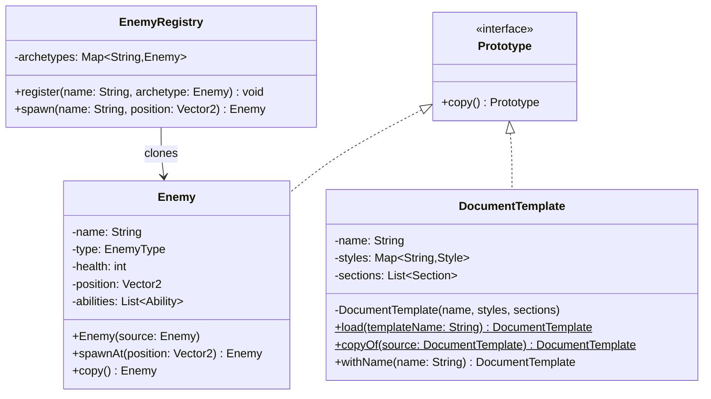

# Prototype Pattern

> *"Specify the kinds of objects to create using a prototypical instance, and create new objects by copying this prototype."*
> — GoF Design Patterns

The Prototype pattern answers a specific question: **when creating a new instance is more expensive or more complex than copying an existing one, why not clone?**

It's less commonly needed than Factory or Builder, but when the scenario fits it produces dramatically cleaner code than the alternatives.

---

## The Problem it Solves

### Scenario 1: Expensive Construction

A `DocumentTemplate` loads fonts, resolves stylesheets, validates structure, and connects to a template registry. Each instantiation takes 300ms. A bulk report generator needs 500 of them:

```java
// Naive approach — 500 × 300ms = 150 seconds just for construction
List<DocumentTemplate> templates = new ArrayList<>();
for (int i = 0; i < 500; i++) {
    templates.add(new DocumentTemplate("INVOICE_TEMPLATE"));  // 300ms each!
}
```

With Prototype: load once, clone 499 times. Cloning is a memory copy operation — microseconds.

### Scenario 2: Complex State That Needs a Starting Point

A game entity (enemy, NPC, building) has 30+ fields configured by a game designer in a level editor. Creating each instance from scratch requires calling 30 setters or a 30-parameter constructor. But the designer has already configured a "prototype" enemy — why not clone that and change only what's different?

```java
// Without Prototype — verbose and error-prone
Enemy orc = new Enemy();
orc.setHealth(200);
orc.setDamage(15);
orc.setArmour(5);
orc.setSpeed(2.5f);
orc.setAggression(Aggression.HOSTILE);
orc.setDropTable(DropTable.ORC_STANDARD);
// ... 25 more fields

// With Prototype — start from a configured archetype
Enemy orc = orcArchetype.clone();
orc.setPosition(new Vector2(100, 200));  // only unique fields
```

---

## Shallow vs Deep Copy

Before writing any `clone()` implementation, the shallow vs deep copy distinction must be understood.

```java
public class Order {
    private String    orderId;
    private User      customer;       // object reference
    private List<OrderItem> items;    // mutable collection
    private Money     totalAmount;    // value object (immutable)
}
```

| Field type | Shallow copy | Deep copy needed? |
|---|---|---|
| `String orderId` | Safe — String is immutable | No |
| `User customer` | Copies the reference — both share the same User | Depends: usually no (share the user entity) |
| `List<OrderItem> items` | Copies the reference — mutating items list affects the original | **Yes** — new list with copied items |
| `Money totalAmount` | Safe — Money is immutable | No |

**Shallow copy**: a new object whose fields point to the same objects as the original.

**Deep copy**: a new object where all mutable reachable objects are recursively cloned.

Most real-world Prototypes need **selective deep copy** — copy the mutable containers and value objects, share the immutable values and entity references.

---

## Java's `Cloneable` — The Problematic Approach

Java provides a `Cloneable` marker interface and `Object.clone()`. In theory, this looks simple:

```java
public class Enemy implements Cloneable {
    private String name;
    private int    health;
    private List<Ability> abilities;

    @Override
    public Enemy clone() {
        try {
            Enemy copy = (Enemy) super.clone();   // shallow copy
            // Must manually deep-copy mutable fields
            copy.abilities = new ArrayList<>(this.abilities);
            return copy;
        } catch (CloneNotSupportedException e) {
            throw new AssertionError("This cannot happen", e);
        }
    }
}
```

**The problems with `Cloneable`:**
1. `Object.clone()` is `protected` — callers outside the class can't use it without this override
2. `CloneNotSupportedException` is a checked exception that can't actually be thrown if you implement `Cloneable` — yet you're forced to handle it
3. `clone()` bypasses the constructor — no validation runs on the copy
4. If a field is added later, the `clone()` method must be updated manually — it's easy to forget
5. Final fields cannot be assigned by `clone()` — immutable objects cannot use this mechanism

Joshua Bloch in *Effective Java*: **"The Cloneable architecture is incompatible with normal use of final fields referring to mutable objects."** And: **"A better approach to object copying is to provide a copy constructor or copy factory."**

---

## The Better Approach: Copy Constructor

```java
public final class Enemy {
    private final String        name;
    private final EnemyType     type;
    private       int           health;       // mutable — current HP
    private final int           maxHealth;
    private       Vector2       position;     // mutable — changes as enemy moves
    private final List<Ability> abilities;    // deep-copied

    // Normal constructor
    public Enemy(String name, EnemyType type, int maxHealth, List<Ability> abilities) {
        this.name       = Objects.requireNonNull(name);
        this.type       = Objects.requireNonNull(type);
        this.maxHealth  = maxHealth;
        this.health     = maxHealth;
        this.position   = Vector2.ZERO;
        this.abilities  = List.copyOf(abilities);    // immutable copy
    }

    // Copy constructor — clear, explicit, validates, works with final fields
    public Enemy(Enemy source) {
        this.name       = source.name;            // String is immutable — share it
        this.type       = source.type;            // Enum — safe to share
        this.maxHealth  = source.maxHealth;
        this.health     = source.health;          // copy current HP
        this.position   = new Vector2(source.position);  // copy mutable value
        this.abilities  = List.copyOf(source.abilities);  // new immutable copy
    }

    // Spawning a new enemy from this archetype
    public Enemy spawnAt(Vector2 spawnPoint) {
        Enemy spawn = new Enemy(this);             // copy constructor
        spawn.position = spawnPoint;               // customise only what differs
        return spawn;
    }

    // Accessors
    public String        name()     { return name; }
    public EnemyType     type()     { return type; }
    public int           health()   { return health; }
    public Vector2       position() { return position; }
    public List<Ability> abilities(){ return abilities; }
}
```

Usage:

```java
// Configure the archetype once
Enemy orcArchetype = new Enemy("Orc Warrior", EnemyType.ORC, 200, List.of(
    new Ability("Slash", 15),
    new Ability("War Cry", 0)
));

// Spawn enemies from the archetype — fast, correct, constructor-validated
Enemy orc1 = orcArchetype.spawnAt(new Vector2(100, 200));
Enemy orc2 = orcArchetype.spawnAt(new Vector2(150, 200));
Enemy orc3 = orcArchetype.spawnAt(new Vector2(200, 200));
```

---

## Copy Factory (Even Cleaner)

A static factory method named `copyOf` or `from` is even cleaner — more descriptive and easier to override in subclasses:

```java
public final class DocumentTemplate {
    private final String              name;
    private final Map<String, Style>  styles;
    private final List<Section>       sections;

    // Private constructor
    private DocumentTemplate(String name, Map<String, Style> styles, List<Section> sections) {
        this.name     = name;
        this.styles   = Map.copyOf(styles);
        this.sections = List.copyOf(sections);
    }

    // Normal factory
    public static DocumentTemplate load(String templateName) {
        // Expensive: load from registry, resolve stylesheets, validate structure
        return new DocumentTemplate(templateName, loadStyles(templateName), loadSections(templateName));
    }

    // Copy factory — cheap: memory copy only
    public static DocumentTemplate copyOf(DocumentTemplate source) {
        return new DocumentTemplate(source.name, source.styles, source.sections);
    }

    public DocumentTemplate withName(String newName) {
        return new DocumentTemplate(newName, this.styles, this.sections);
    }
}

// Usage
DocumentTemplate master = DocumentTemplate.load("INVOICE");         // slow (300ms)
DocumentTemplate copy1  = DocumentTemplate.copyOf(master);          // fast (microseconds)
DocumentTemplate copy2  = DocumentTemplate.copyOf(master).withName("INVOICE_DUPLICATE");
```

---

## Prototype Registry

When managing a catalogue of named prototypes, a **Prototype Registry** provides a lookup mechanism:

```java
public class EnemyRegistry {
    private final Map<String, Enemy> archetypes = new HashMap<>();

    public void register(String name, Enemy archetype) {
        archetypes.put(
            Objects.requireNonNull(name),
            Objects.requireNonNull(archetype)
        );
    }

    public Enemy spawn(String name, Vector2 position) {
        Enemy archetype = archetypes.get(name);
        if (archetype == null) throw new IllegalArgumentException("Unknown enemy: " + name);
        return archetype.spawnAt(position);
    }
}

// At level-load time: register archetypes
EnemyRegistry registry = new EnemyRegistry();
registry.register("orc",    new Enemy("Orc Warrior",    EnemyType.ORC,    200, orcAbilities));
registry.register("goblin", new Enemy("Goblin Scout",   EnemyType.GOBLIN, 80,  goblinAbilities));
registry.register("troll",  new Enemy("Bridge Troll",   EnemyType.TROLL,  500, trollAbilities));

// At runtime: spawn hundreds of enemies cheaply
for (SpawnPoint sp : level.getSpawnPoints()) {
    Enemy enemy = registry.spawn(sp.getEnemyType(), sp.getPosition());
    level.addEnemy(enemy);
}
```

---

## Class Diagram



---

## Prototype vs Copy Constructor vs Serialisation Clone

| Approach | Type-safe? | Handles final fields? | Constructor runs? | Depth control? | Recommended? |
|---|---|---|---|---|---|
| `Object.clone()` | No (unchecked cast) | No | No | Manual | Avoid |
| Copy constructor | Yes | Yes | Yes | Explicit | **Preferred** |
| Copy factory | Yes | Yes | Yes | Explicit | **Preferred** |
| Serialise + deserialise | Yes | Yes | No | Full deep copy | Last resort (slow) |

---

## Real-World Examples

| Domain | Prototype use | What changes per clone |
|---|---|---|
| Game engines | Enemy/NPC archetypes | Position, AI seed, loot seed |
| Report generators | Document templates | Recipient, date, data fields |
| Configuration | Base server config | Port, hostname, environment |
| Test fixtures | "Golden" user/order state | ID, unique fields per test |
| UI frameworks | Cell renderers | Displayed data, position |

---

## When to Use Prototype

**Use it when:**
- Object construction is **expensive** (I/O, database, network) and many similar objects are needed
- Objects have a large number of fields and you need **slightly different variants** of a well-configured base
- The type of object to copy is determined at **runtime**, not compile time
- You need to **snapshot** an object's state for undo/redo or rollback

**Don't use it when:**
- Construction is cheap — just call `new`
- Deep copy semantics are unclear — the shared-vs-copied boundaries are confusing
- The object has complex identity (entity with a database ID) — cloning usually creates a duplicate with the wrong identity
- Objects have circular references — deep copy becomes complex and fragile

---

## Key Takeaways

- Prototype is the right pattern when **cloning is cheaper or simpler than construction from scratch**
- **Avoid `Cloneable`** — Java's `clone()` mechanism is widely considered broken (Effective Java, Item 13)
- **Copy constructors** and **copy factories** are the correct Java idiom — they work with `final` fields, run validation, and are type-safe
- **Shallow vs deep copy** must be a conscious decision for every field — immutable fields share safely, mutable containers need to be copied
- A **Prototype Registry** is the natural companion when managing a catalogue of named archetypes
- Prototype pairs well with **Builder**: use Builder to create the archetype carefully; use Prototype to clone it cheaply many times
