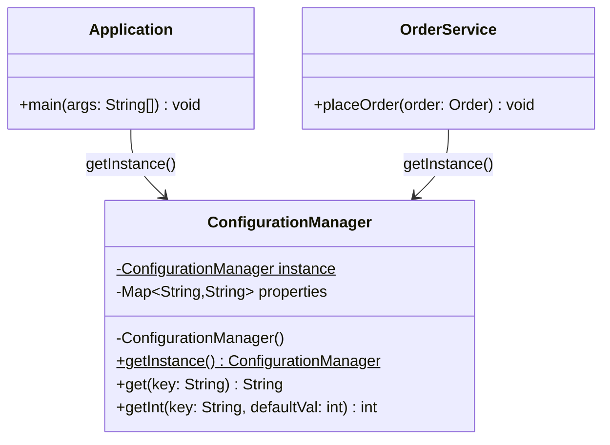

# Singleton Pattern

> *"Ensure a class has only one instance and provide a global access point to it."*
> — GoF Design Patterns

The Singleton is the most talked-about, most implemented, and most misused pattern in software engineering. Understanding it fully — including when **not** to use it — separates a junior programmer from a design-aware engineer.

---

## The Problem it Solves

Some resources must exist exactly once in a running process:

- A **configuration store** loaded from a file at startup — you don't want 20 copies each consuming memory
- A **thread pool** — you want a single pool managing all worker threads
- A **log writer** — file handles are expensive; one writer serialises writes safely
- A **sequence number generator** — distributed uniqueness requires a single source of truth per process

Without Singleton, callers have two choices: pass the shared object everywhere (verbose but correct) or create their own copy (incorrect — divergent state).

Singleton centralises that shared instance. The class itself takes responsibility for ensuring only one copy lives in the JVM.

---

## Evolution: Naive → Production

### Step 1 — The Naive Approach

```java
// The simplest possible implementation
public class ConfigurationManager {
    private static ConfigurationManager instance;
    private final Map<String, String> properties;

    private ConfigurationManager() {
        properties = loadFromFile("application.properties");
    }

    public static ConfigurationManager getInstance() {
        if (instance == null) {                    // PROBLEM: not thread-safe
            instance = new ConfigurationManager();
        }
        return instance;
    }

    public String get(String key) {
        return properties.get(key);
    }
}
```

**What breaks under concurrency:** Thread A checks `instance == null` (true), gets preempted. Thread B also checks `instance == null` (still null), creates an instance, assigns it. Thread A resumes, creates a **second** instance, overwrites Thread B's. Two different instances now exist with diverged state.

---

### Step 2 — Synchronised Method (Correct but Slow)

```java
public class ConfigurationManager {
    private static ConfigurationManager instance;

    private ConfigurationManager() { /* load config */ }

    public static synchronized ConfigurationManager getInstance() {
        if (instance == null) {
            instance = new ConfigurationManager();
        }
        return instance;
    }
}
```

This works, but `synchronized` on the entire method means every call acquires the lock — even the 999,999 calls after the instance is created. The lock is unnecessary for 99.99% of calls.

---

### Step 3 — Double-Checked Locking with `volatile`

```java
public class ConfigurationManager {
    // volatile prevents CPU instruction reordering
    private static volatile ConfigurationManager instance;

    private ConfigurationManager() { /* load config */ }

    public static ConfigurationManager getInstance() {
        if (instance == null) {                          // First check (no lock)
            synchronized (ConfigurationManager.class) {
                if (instance == null) {                  // Second check (inside lock)
                    instance = new ConfigurationManager();
                }
            }
        }
        return instance;
    }
}
```

**Why `volatile` is essential here:** Without it, the CPU can reorder instructions so another thread sees a non-null `instance` reference **before** the constructor has finished writing to all fields. `volatile` guarantees visibility — once a thread writes to `instance`, all subsequent reads by other threads see the fully constructed object.

This is the standard DCL (Double-Checked Locking) approach, safe in Java 5+ (when the Java Memory Model was clarified).

---

### Step 4 — Bill Pugh (Initialization-on-Demand Holder) — Cleanest

```java
public class ConfigurationManager {

    private ConfigurationManager() { /* load config */ }

    // Inner class is not loaded until getInstance() is called
    private static final class InstanceHolder {
        private static final ConfigurationManager INSTANCE = new ConfigurationManager();
    }

    public static ConfigurationManager getInstance() {
        return InstanceHolder.INSTANCE;
    }
}
```

**Why this works:** The JVM guarantees class initialisation is thread-safe. The inner `InstanceHolder` class is not loaded until `getInstance()` is first called, so creation is lazy. No synchronisation overhead on subsequent calls. The JVM's class-loading mechanism ensures exactly one instance is created.

This is the **recommended approach** for most production Java code.

---

### Step 5 — Enum Singleton (Joshua Bloch's Recommendation)

```java
public enum DatabaseConnectionPool {
    INSTANCE;

    private final HikariDataSource dataSource;

    DatabaseConnectionPool() {
        HikariConfig config = new HikariConfig();
        config.setJdbcUrl("jdbc:postgresql://localhost:5432/mydb");
        config.setMaximumPoolSize(10);
        dataSource = new HikariDataSource(config);
    }

    public Connection getConnection() throws SQLException {
        return dataSource.getConnection();
    }

    public void shutdown() {
        dataSource.close();
    }
}

// Usage
Connection conn = DatabaseConnectionPool.INSTANCE.getConnection();
```

**Why enum wins for serialisation and reflection:** Java enums are guaranteed to have exactly one instance per value. They are immune to:
- **Reflection attacks** — `Constructor.newInstance()` throws `IllegalArgumentException` for enums
- **Serialisation attacks** — `readObject()` is not called; the singleton guarantee is preserved across serialise/deserialise

For most Singletons that require serialisation safety (e.g., in distributed caching scenarios), enum is the right choice.

---

## Class Structure



---

## Real-World Production Example: Application Configuration

```java
public final class AppConfig {

    private static volatile AppConfig instance;
    private final Map<String, String> properties;
    private final String environment;

    private AppConfig() {
        this.environment = System.getenv().getOrDefault("APP_ENV", "development");
        this.properties  = loadProperties(environment);
    }

    private Map<String, String> loadProperties(String env) {
        String fileName = "application-" + env + ".properties";
        try (InputStream is = getClass().getClassLoader().getResourceAsStream(fileName)) {
            if (is == null) throw new IllegalStateException("Config not found: " + fileName);
            Properties p = new Properties();
            p.load(is);
            return Map.copyOf((Map) p);
        } catch (IOException e) {
            throw new IllegalStateException("Failed to load configuration", e);
        }
    }

    public static AppConfig getInstance() {
        if (instance == null) {
            synchronized (AppConfig.class) {
                if (instance == null) {
                    instance = new AppConfig();
                }
            }
        }
        return instance;
    }

    public String get(String key) {
        return Optional.ofNullable(properties.get(key))
                       .orElseThrow(() -> new IllegalArgumentException("Unknown config key: " + key));
    }

    public int getInt(String key) {
        return Integer.parseInt(get(key));
    }

    public boolean getBoolean(String key) {
        return Boolean.parseBoolean(get(key));
    }

    public String get(String key, String defaultValue) {
        return properties.getOrDefault(key, defaultValue);
    }
}
```

---

## The Dark Side: Why Singleton is Considered an Anti-Pattern

### Problem 1: Global State Makes Testing Hard

```java
// Production code
public class OrderService {
    public void placeOrder(Order order) {
        String maxItems = AppConfig.getInstance().get("order.max.items");
        // ...
    }
}

// Test — cannot inject a test configuration!
@Test
void shouldRejectOversizedOrder() {
    OrderService service = new OrderService();
    service.placeOrder(bigOrder);  // Uses the REAL config, not a test config
    // How do we simulate "order.max.items=1" without touching the file system?
}
```

### Problem 2: Hidden Dependencies

Classes that call `getInstance()` declare no explicit dependency on the Singleton. The dependency is invisible until you read every line of code. This violates the DIP principle — callers should receive their dependencies, not reach out and grab them.

### Problem 3: Violated Single Responsibility

The class manages both its business logic **and** its own lifecycle (ensuring single instantiation). These are two responsibilities.

---

## The Right Alternative: Dependency Injection

```java
// The class holds its configuration as an injected interface
public class OrderService {
    private final ConfigStore config;

    public OrderService(ConfigStore config) {   // dependency explicit and injectable
        this.config = config;
    }

    public void placeOrder(Order order) {
        int maxItems = Integer.parseInt(config.get("order.max.items"));
        // ...
    }
}

// In tests: inject a simple map-backed implementation
@Test
void shouldRejectOversizedOrder() {
    ConfigStore testConfig = new MapConfigStore(Map.of("order.max.items", "1"));
    OrderService service   = new OrderService(testConfig);
    // full control — no global state involved
}

// At the application root: wire the real singleton ONCE
public class Application {
    public static void main(String[] args) {
        AppConfig config     = AppConfig.getInstance();  // Singleton used here, at the root
        OrderService service = new OrderService(config); // ...then injected downward
    }
}
```

> **The rule**: Use Singleton at the **composition root** to create shared objects. Then **inject** those objects through the graph — don't call `getInstance()` deep inside domain logic.

In Spring: `@Bean` methods with default `@Scope("singleton")` do exactly this — Spring manages a single instance per `ApplicationContext` and injects it wherever needed.

---

## Comparison of All Singleton Implementations

| Approach | Thread-safe? | Lazy? | Serialisation-safe? | Reflection-safe? | Recommended? |
|---|---|---|---|---|---|
| Naive (no sync) | No | Yes | No | No | Never |
| Synchronised method | Yes | Yes | No | No | Small codebases |
| DCL + volatile | Yes | Yes | No | No | General use |
| Bill Pugh (holder) | Yes | Yes | No | No | **Preferred** |
| Enum | Yes | No* | **Yes** | **Yes** | Serialisable contexts |

*Enum instances are created when the enum class is loaded, but class loading is lazy (on first reference).

---

## When to Use Singleton

| Use it | Avoid it |
|---|---|
| Logging infrastructure | Domain services (inject instead) |
| Configuration store (read-only) | Anything with mutable state shared across threads |
| Thread pool / connection pool | Anything you want to unit test in isolation |
| Sequence / ID generators | When two instances would be better (e.g., read vs write DB pool) |

---

## Interview Deep-Dive

**Q: Why is `volatile` needed in DCL?**

Without `volatile`, the JVM can reorder the three steps of object construction: (1) allocate memory, (2) initialise fields, (3) assign reference. A thread can see a non-null reference to an object whose constructor hasn't finished. `volatile` prevents this by establishing a happens-before relationship between the write and any subsequent reads.

**Q: How would you break a DCL Singleton using reflection?**

```java
Constructor<ConfigurationManager> c =
    ConfigurationManager.class.getDeclaredConstructor();
c.setAccessible(true);
ConfigurationManager second = c.newInstance();  // Bypasses the private constructor!
```

Defense: check in the constructor whether an instance already exists and throw if so. Enum Singleton is immune by design.

**Q: In Spring, do you need the Singleton pattern?**

Generally no. Spring beans are Singleton-scoped by default. The framework manages the one instance and injects it via `@Autowired` or constructor injection. Direct Singleton implementation is rarely needed in Spring applications — use `@Bean` or `@Component` instead.

**Q: When would you choose Bill Pugh over Enum Singleton?**

When the Singleton needs constructor parameters or when it must integrate with frameworks that require instantiation through constructors. Enum constructors exist but are awkward to parameterise. For stateless or self-configuring Singletons, Enum is cleaner.

---

## Key Takeaways

- **Bill Pugh** (initialization-on-demand holder) is the best general-purpose Java Singleton — lazy, thread-safe, no overhead
- **Enum Singleton** is the most robust when serialisation and reflection safety matter
- **Never call `getInstance()` inside domain logic** — accept the instance through the constructor and inject it
- Singleton is a **lifecycle management** decision, not a design principle — prefer DI frameworks to manage it for you
- The pattern's main danger is **hidden global state** — make dependencies visible by injecting them
