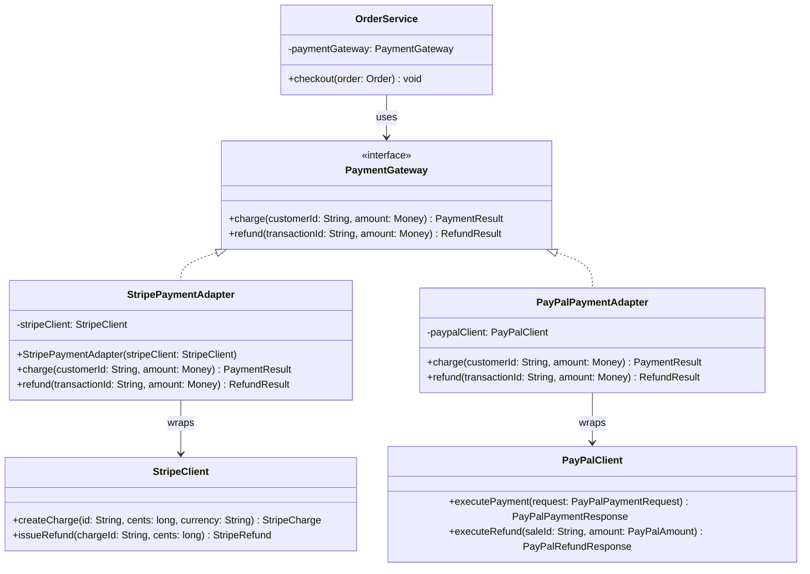
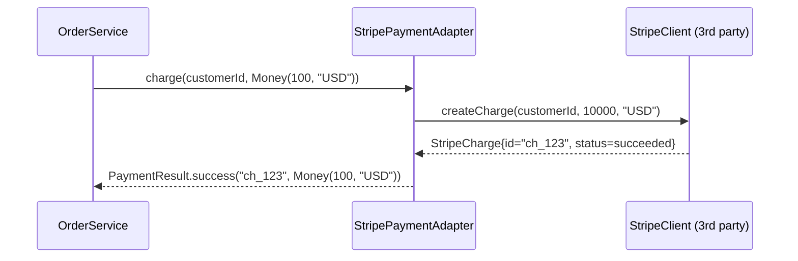

# Adapter Pattern

> *"Convert the interface of a class into another interface clients expect. Adapter lets classes work together that couldn't otherwise because of incompatible interfaces."*
> — GoF Design Patterns

The Adapter is the pattern of integration. In every real system, you eventually need to plug in a library, a legacy service, or a third-party API that speaks a different "language" than your application. The Adapter translates between them without modifying either side.

---

## The Problem it Solves

Your application has been built around a clean `PaymentGateway` interface:

```java
public interface PaymentGateway {
    PaymentResult charge(String customerId, Money amount);
    RefundResult  refund(String transactionId, Money amount);
}
```

All your services, tests, and business logic depend on this interface. Now you need to integrate a third-party payment SDK:

```java
// Third-party SDK — you cannot modify this class
public class StripeClient {
    public StripeCharge createCharge(String stripeCustomerId, long amountCents, String currency) { ... }
    public StripeRefund issueRefund(String chargeId, long refundAmountCents) { ... }
    public StripeCustomer lookupCustomer(String stripeCustomerId) { ... }
}
```

The signatures don't match. `StripeClient` uses `long amountCents` instead of `Money`, `String chargeId` instead of a `transactionId`, and returns `StripeCharge` instead of `PaymentResult`.

You have three bad options and one good one:

| Option | Problem |
|---|---|
| Modify `StripeClient` | You don't own it — it's a third-party library |
| Change `PaymentGateway` to match Stripe | You break all existing code |
| Scatter conversion logic everywhere | Duplicated, untestable, fragile |
| **Write an Adapter** | ✓ One translation class; everything else unchanged |

---

## Object Adapter (Composition — Preferred)

The **Object Adapter** wraps the incompatible class through composition. This is the standard Java approach:

```java
// The Adapter: implements the target interface, wraps the incompatible class
public class StripePaymentAdapter implements PaymentGateway {

    private final StripeClient stripeClient;

    public StripePaymentAdapter(StripeClient stripeClient) {
        this.stripeClient = Objects.requireNonNull(stripeClient);
    }

    @Override
    public PaymentResult charge(String customerId, Money amount) {
        try {
            StripeCharge charge = stripeClient.createCharge(
                customerId,
                amount.amountCents(),    // Money → long
                amount.currency()        // extract currency string
            );

            return charge.isSucceeded()
                ? PaymentResult.success(charge.getId(), amount)
                : PaymentResult.failure(charge.getFailureMessage());

        } catch (StripeApiException e) {
            throw new PaymentProcessingException("Stripe charge failed: " + e.getMessage(), e);
        }
    }

    @Override
    public RefundResult refund(String transactionId, Money amount) {
        try {
            StripeRefund refund = stripeClient.issueRefund(
                transactionId,
                amount.amountCents()
            );

            return refund.isSucceeded()
                ? RefundResult.success(refund.getId())
                : RefundResult.failure(refund.getFailureReason());

        } catch (StripeApiException e) {
            throw new PaymentProcessingException("Stripe refund failed: " + e.getMessage(), e);
        }
    }
}
```

The domain layer never changes. Swapping to PayPal means writing `PayPalPaymentAdapter` — nothing else:

```java
// All of this works unchanged — doesn't know about Stripe
public class OrderService {
    private final PaymentGateway paymentGateway;    // interface only

    public OrderService(PaymentGateway paymentGateway) {
        this.paymentGateway = paymentGateway;
    }

    public void checkout(Order order) {
        PaymentResult result = paymentGateway.charge(order.getCustomerId(), order.getTotal());
        if (!result.isSuccessful()) throw new PaymentDeclinedException(result.getFailureReason());
        order.markPaid(result.getTransactionId());
    }
}

// Wired at the composition root
StripeClient    stripeClient    = new StripeClient(API_KEY);
PaymentGateway  gateway         = new StripePaymentAdapter(stripeClient);
OrderService    orderService    = new OrderService(gateway);
```

---

## Class Diagram



---

## Sequence Diagram



---

## Class Adapter (Inheritance — Rarely Used in Java)

The **Class Adapter** uses multiple inheritance — the adapter extends both the target class and the adaptee. Java doesn't support multiple class inheritance, so this requires the adaptee to be an interface or abstract class:

```java
// Only works if StripeClientBase is an abstract class or interface
public class StripeClassAdapter extends StripeClientBase implements PaymentGateway {

    @Override
    public PaymentResult charge(String customerId, Money amount) {
        StripeCharge charge = this.createCharge(    // calling inherited method
            customerId,
            amount.amountCents(),
            amount.currency()
        );
        return toPaymentResult(charge);
    }
    // ...
}
```

**Why Object Adapter is preferred:**
- Works with any version of the adaptee — even final classes
- The adapter can wrap any subclass of the adaptee
- Doesn't risk inheriting unintended behaviour from the adaptee
- More explicit about the relationship — composition vs inheritance

---

## Real-World Adapters in the Java Ecosystem

| Adapter | Target interface | Adaptee |
|---|---|---|
| `InputStreamReader` | `Reader` | `InputStream` (bytes → chars) |
| `Arrays.asList()` | `List<T>` | `T[]` array |
| `Collections.enumeration()` | `Enumeration<T>` | `Collection<T>` |
| SLF4J bindings | `org.slf4j.Logger` | Log4j, Logback, JUL |
| Spring's `HandlerAdapter` | Spring MVC handler contract | Any `@Controller` method |
| JDBC driver implementations | `java.sql.Driver` | Database-specific protocols |

---

## Legacy System Integration Example

Adapters are the standard approach for wrapping legacy systems behind a modern interface:

```java
// Modern interface your new code expects
public interface CustomerRepository {
    Optional<Customer> findById(String id);
    List<Customer>     findByEmail(String email);
    void               save(Customer customer);
}

// Legacy system — 15-year-old COBOL-backed service with a Java wrapper
public class LegacyCustomerSystem {
    public CustomerRecord getCustomerById(int legacyId) { ... }
    public List<CustomerRecord> searchByEmail(String email) { ... }
    public int insertCustomer(String firstName, String lastName, String email) { ... }
    public boolean updateCustomer(int legacyId, String[] fieldNames, String[] fieldValues) { ... }
}

// Adapter: translates modern interface calls to legacy calls
public class LegacyCustomerRepositoryAdapter implements CustomerRepository {

    private final LegacyCustomerSystem legacySystem;
    private final CustomerIdMapper     idMapper;       // maps new String IDs ↔ legacy int IDs

    public LegacyCustomerRepositoryAdapter(LegacyCustomerSystem legacySystem, CustomerIdMapper idMapper) {
        this.legacySystem = legacySystem;
        this.idMapper     = idMapper;
    }

    @Override
    public Optional<Customer> findById(String id) {
        int legacyId = idMapper.toLegacyId(id);
        CustomerRecord record = legacySystem.getCustomerById(legacyId);
        return Optional.ofNullable(record).map(this::toDomain);
    }

    @Override
    public List<Customer> findByEmail(String email) {
        return legacySystem.searchByEmail(email)
                           .stream()
                           .map(this::toDomain)
                           .toList();
    }

    @Override
    public void save(Customer customer) {
        if (customer.getId() == null) {
            int legacyId = legacySystem.insertCustomer(
                customer.getFirstName(),
                customer.getLastName(),
                customer.getEmail()
            );
            idMapper.register(customer.getId(), legacyId);
        } else {
            int legacyId = idMapper.toLegacyId(customer.getId());
            legacySystem.updateCustomer(legacyId,
                new String[]{"firstName", "lastName", "email"},
                new String[]{customer.getFirstName(), customer.getLastName(), customer.getEmail()}
            );
        }
    }

    private Customer toDomain(CustomerRecord record) {
        String newId = idMapper.toNewId(record.getId());
        return new Customer(newId, record.getFirstName(), record.getLastName(), record.getEmail());
    }
}
```

---

## Adapter vs Other Patterns

| Pattern | Intent | Key difference |
|---|---|---|
| **Adapter** | Make incompatible interfaces compatible | Translates one interface to another |
| **Facade** | Simplify a complex subsystem | Wraps multiple classes; provides simpler view; doesn't need to match an existing interface |
| **Decorator** | Add behaviour to an object | Wraps same interface; augments, not translates |
| **Proxy** | Control access to an object | Same interface; adds lifecycle/access control |
| **Bridge** | Separate abstraction from implementation | Both sides designed together; adapter retrofits incompatible designs |

---

## When to Use Adapter

**Use it when:**
- You need to use an existing class but its interface doesn't match what your code expects
- You're integrating a third-party library with your domain interfaces
- You're wrapping a legacy system behind a modern interface
- You want your domain to depend on **your own interface**, not on external library types

**Don't use it when:**
- Both sides can be changed — redesign the interface instead
- The adaptation is trivial — a direct call with one renamed method doesn't need a pattern
- There are too many semantic differences between the two interfaces — some concepts genuinely can't be adapted cleanly

---

## Key Takeaways

- The Adapter is the most common structural pattern in production Java — you write one every time you wrap a third-party library behind your own interface
- **Object Adapter (composition)** is the correct Java form — it works with final classes and is more flexible
- Adapters protect your domain model from third-party churn: when Stripe changes their API, you update one adapter class, nothing else
- The pattern is the practical expression of the **Dependency Inversion Principle**: depend on your abstraction (`PaymentGateway`), adapt to the concrete external system in one place
- Testing becomes trivial: your domain tests use a `FakePaymentGateway` that directly implements the interface; the adapter is integration-tested separately
