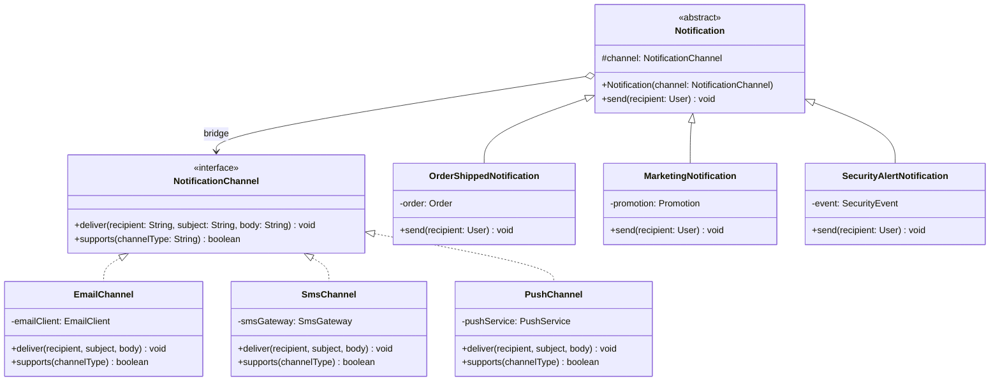
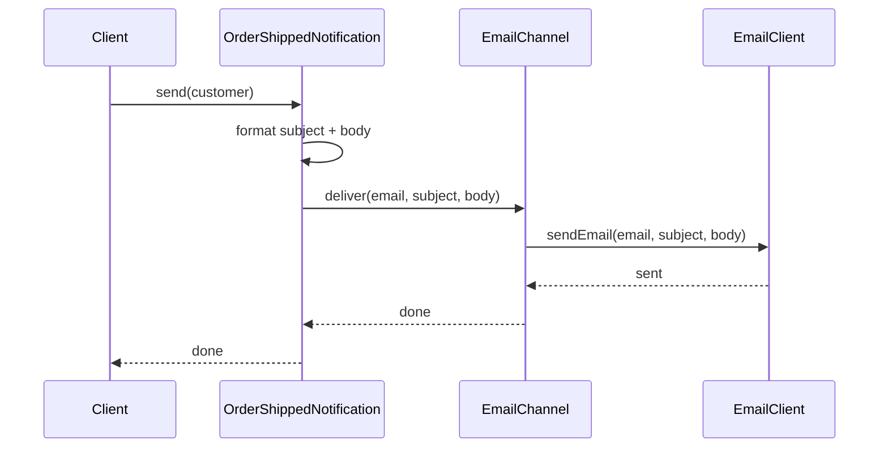

# Bridge Pattern

> *"Decouple an abstraction from its implementation so that the two can vary independently."*
> — GoF Design Patterns

Bridge is the pattern that prevents a **combinatorial explosion of subclasses** when two independent dimensions of variation need to evolve separately. Once you recognise the problem it solves, you see it hiding in systems everywhere.

---

## The Problem it Solves

Suppose you're building a notification system. Currently, you have two notification types (Order and Marketing) and two delivery channels (Email and SMS). The naïve approach uses one subclass per combination:

```
Notification
  ├── OrderEmailNotification
  ├── OrderSmsNotification
  ├── MarketingEmailNotification
  └── MarketingSmsNotification
```

Now add Push notifications: 2 more classes. Add a third notification type: 3 more classes. Add a fourth type and a fourth channel: 4 × 4 = 16 subclasses total.

The formula is **M × N subclasses** where M = notification types and N = delivery channels. This is the combinatorial explosion Bridge prevents.

The root cause: **two independent dimensions of variation are baked into one inheritance hierarchy**. The notification *content* (what to say) is one dimension; the delivery *channel* (how to send) is another. They should be separate.

---

## Evolution: Naive → Bridge

### Step 1 — Identify the Two Dimensions

```
Dimension 1: Abstraction (what the client uses)
  → Notification type: OrderNotification, MarketingNotification, SecurityAlertNotification

Dimension 2: Implementation (the underlying mechanism)
  → Delivery channel: EmailChannel, SmsChannel, PushChannel
```

### Step 2 — Extract the Implementation into an Interface

```java
// Implementation interface — the "right side" of the bridge
public interface NotificationChannel {
    void deliver(String recipient, String subject, String body);
    boolean supports(String channelType);
}
```

### Step 3 — Implement the Right Side Independently

```java
public class EmailChannel implements NotificationChannel {
    private final EmailClient emailClient;

    public EmailChannel(EmailClient emailClient) {
        this.emailClient = emailClient;
    }

    @Override
    public void deliver(String recipient, String subject, String body) {
        emailClient.sendEmail(recipient, subject, body);
    }

    @Override
    public boolean supports(String channelType) { return "email".equals(channelType); }
}

public class SmsChannel implements NotificationChannel {
    private final SmsGateway smsGateway;

    public SmsChannel(SmsGateway smsGateway) {
        this.smsGateway = smsGateway;
    }

    @Override
    public void deliver(String recipient, String subject, String body) {
        // SMS is short — subject + truncated body
        String message = subject + ": " + truncate(body, 140);
        smsGateway.send(recipient, message);
    }

    @Override
    public boolean supports(String channelType) { return "sms".equals(channelType); }

    private String truncate(String text, int maxLen) {
        return text.length() <= maxLen ? text : text.substring(0, maxLen - 3) + "...";
    }
}

public class PushChannel implements NotificationChannel {
    private final PushService pushService;

    public PushChannel(PushService pushService) {
        this.pushService = pushService;
    }

    @Override
    public void deliver(String recipient, String subject, String body) {
        pushService.sendPush(recipient, subject, body);
    }

    @Override
    public boolean supports(String channelType) { return "push".equals(channelType); }
}
```

### Step 4 — Build the Abstraction, Holding a Bridge to the Implementation

```java
// Abstraction — the "left side" of the bridge
public abstract class Notification {
    // The bridge — abstraction holds a reference to the implementation
    protected final NotificationChannel channel;

    protected Notification(NotificationChannel channel) {
        this.channel = Objects.requireNonNull(channel);
    }

    // Each subclass formats content differently; channel delivers it
    public abstract void send(User recipient);
}

// Refined abstractions — each knows what to say, delegates how to send
public class OrderShippedNotification extends Notification {
    private final Order order;

    public OrderShippedNotification(Order order, NotificationChannel channel) {
        super(channel);
        this.order = order;
    }

    @Override
    public void send(User recipient) {
        String subject = "Your order #" + order.getId() + " has shipped!";
        String body    = String.format(
            "Hi %s, your order containing %d items will arrive by %s.",
            recipient.getName(), order.getItemCount(), order.getEstimatedDelivery()
        );
        channel.deliver(recipient.getContactFor(channel), subject, body);
    }
}

public class MarketingNotification extends Notification {
    private final Promotion promotion;

    public MarketingNotification(Promotion promotion, NotificationChannel channel) {
        super(channel);
        this.promotion = promotion;
    }

    @Override
    public void send(User recipient) {
        String subject = promotion.getSubject();
        String body    = promotion.getBodyFor(recipient);
        channel.deliver(recipient.getContactFor(channel), subject, body);
    }
}

public class SecurityAlertNotification extends Notification {
    private final SecurityEvent event;

    public SecurityAlertNotification(SecurityEvent event, NotificationChannel channel) {
        super(channel);
        this.event = event;
    }

    @Override
    public void send(User recipient) {
        String subject = "Security alert: " + event.getType();
        String body    = "Unusual activity was detected on " + event.getTimestamp() +
                         " from " + event.getIpAddress();
        channel.deliver(recipient.getEmail(), subject, body);  // always email for security
    }
}
```

### Step 5 — Combine Freely at the Composition Root

```java
// Any notification × any channel — 3 + 3 = 6 classes instead of 3 × 3 = 9
NotificationChannel email = new EmailChannel(emailClient);
NotificationChannel sms   = new SmsChannel(smsGateway);
NotificationChannel push  = new PushChannel(pushService);

// Order shipped: send via email
new OrderShippedNotification(order, email).send(customer);

// Same notification, different channel — just swap the channel
new OrderShippedNotification(order, push).send(customer);

// Marketing to different channels simultaneously
List<NotificationChannel> channels = List.of(email, sms, push);
for (NotificationChannel channel : channels) {
    new MarketingNotification(promo, channel).send(customer);
}
```

Adding a fourth channel (Slack) = write `SlackChannel` only. Adding a fourth notification type = write that type only. **M + N classes instead of M × N**.

---

## Class Diagram



The `o-->` arrow (the bridge) is the key structural element — the abstraction *holds* the implementation rather than inheriting from it.

---

## Sequence Diagram



---

## The Bridge in the Java Standard Library

| Example | Abstraction | Implementation |
|---|---|---|
| `java.util.logging.Handler` | `Logger` | `Handler` implementations (FileHandler, ConsoleHandler) |
| JDBC | `java.sql.Connection` | MySQL/PostgreSQL driver implementations |
| AWT/Swing | Component hierarchy | Platform peer implementations |

JDBC is the most famous Bridge in Java: your code uses `java.sql.Connection` (abstraction) and the driver jar provides `MysqlConnection`, `PgConnection`, etc. (implementation). Both evolve independently — you can upgrade MySQL without changing your business logic.

---

## Bridge vs Adapter — The Crucial Distinction

| | Bridge | Adapter |
|---|---|---|
| **Purpose** | Designed upfront to allow independent variation | Retrofit to make incompatible interfaces work together |
| **Intent** | Separate abstraction from implementation | Translate one interface to another |
| **Design time** | Both sides designed together | At least one side already exists |
| **Relationship** | Abstraction *uses* implementation | Adapter *wraps* adaptee |
| **When** | Preventing class explosion | Integrating existing incompatible code |

> A useful mental model: **Bridge is planned**, **Adapter is a fix**.

---

## Device and Remote Control — The Classic Example

```java
// Implementation
public interface Device {
    boolean isEnabled();
    void    enable();
    void    disable();
    int     getVolume();
    void    setVolume(int volume);
    int     getChannel();
    void    setChannel(int channel);
}

public class Television implements Device { /* ... */ }
public class Radio       implements Device { /* ... */ }

// Abstraction
public class RemoteControl {
    protected final Device device;

    public RemoteControl(Device device) {
        this.device = device;
    }

    public void togglePower() {
        if (device.isEnabled()) device.disable();
        else                    device.enable();
    }

    public void volumeUp()   { device.setVolume(device.getVolume() + 10); }
    public void volumeDown() { device.setVolume(device.getVolume() - 10); }
}

// Refined abstraction — adds features without touching Device implementations
public class AdvancedRemoteControl extends RemoteControl {

    public AdvancedRemoteControl(Device device) {
        super(device);
    }

    public void mute() {
        device.setVolume(0);
    }

    public void jumpToChannel(int channel) {
        device.setChannel(channel);
    }
}

// Any remote × any device — independent extension
RemoteControl tvRemote    = new RemoteControl(new Television());
RemoteControl radioRemote = new AdvancedRemoteControl(new Radio());
```

---

## When to Use Bridge

**Use it when:**
- You see M × N subclasses forming, where two dimensions of variation are growing independently
- You want to switch implementations at runtime (inject different channel implementations)
- Both abstraction and implementation need to be independently extendable via subclassing
- You share implementations across multiple abstractions (same `EmailChannel` used by many notification types)

**Don't use it when:**
- There is only one implementation — no bridge needed, just use a direct reference
- The two dimensions are actually related, not independent — forced separation creates awkward designs
- The complexity cost (more classes, harder to trace) exceeds the benefit of decoupling

---

## Key Takeaways

- Bridge prevents **M × N class explosion** by separating two independently-varying dimensions into a composition relationship
- The "bridge" is the field in the abstraction that holds a reference to the implementation interface
- Both sides can grow independently: add new notification types without touching channels; add new channels without touching notification types
- Bridge is a **design-time decision** — if you find yourself adding the 4th of a growing 2D matrix of subclasses, that's the signal to refactor to Bridge
- The pattern is deeply related to the **Composition over Inheritance** principle — Bridge replaces a 2D inheritance tree with two 1D hierarchies connected by composition
