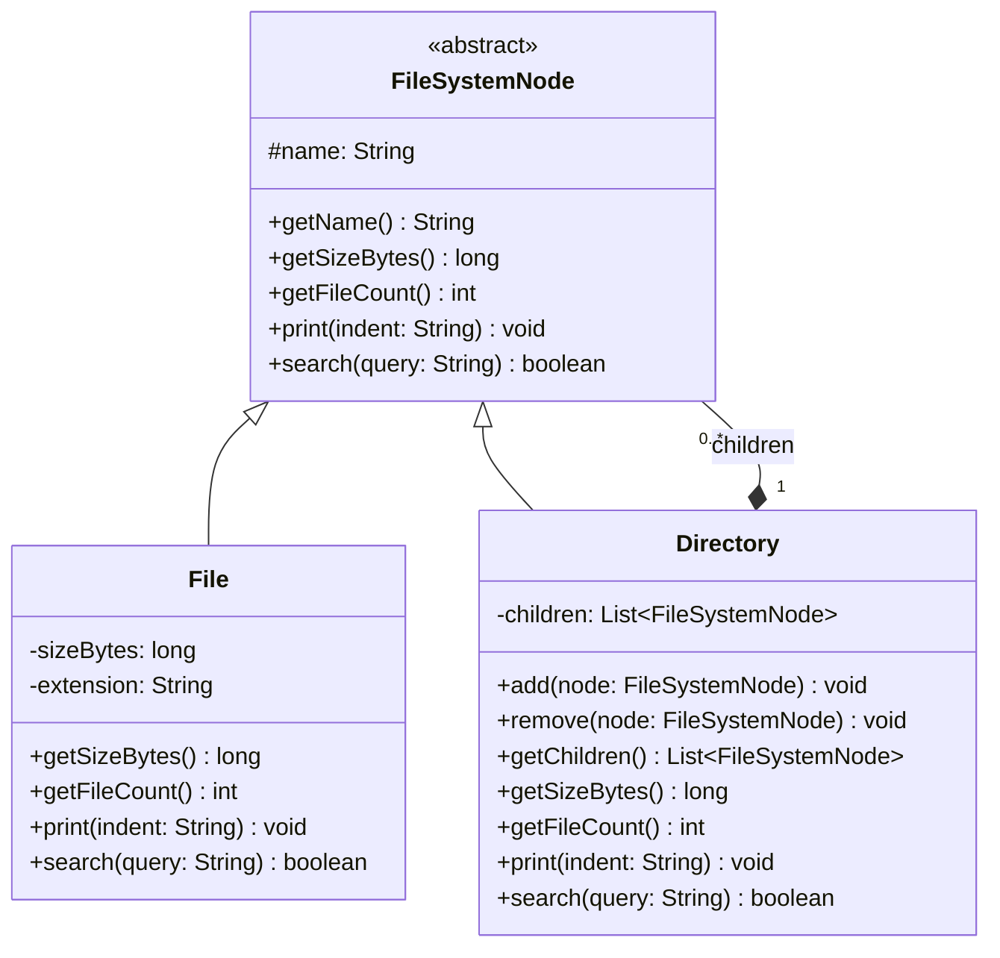

# Composite Pattern

> *"Compose objects into tree structures to represent part-whole hierarchies. Composite lets clients treat individual objects and compositions of objects uniformly."*
> — GoF Design Patterns

Composite solves a single, important problem: **code that works on individual objects should also work on collections of those objects, without the client needing to know which it's dealing with**.

The moment you find yourself writing `if (node instanceof Folder) ... else if (node instanceof File) ...` in every traversal, you've discovered a place where Composite belongs.

---

## The Problem it Solves

A file system has files (leaves) and directories (containers). A directory can contain files and other directories. Calculating total size should work the same way regardless of depth:

```java
// Naive approach — client must handle both types manually
public long calculateSize(FileSystemNode node) {
    if (node instanceof File) {
        return ((File) node).getSizeBytes();

    } else if (node instanceof Directory) {
        long total = 0;
        for (FileSystemNode child : ((Directory) node).getChildren()) {
            total += calculateSize(child);   // recursive check again
        }
        return total;
    }
    throw new IllegalArgumentException("Unknown node type: " + node.getClass());
}
```

Every operation on the tree (size, permissions check, search, render) must repeat this `instanceof` chain. Adding a new node type (e.g., `SymLink`) breaks every one of these methods.

With Composite, the `instanceof` disappears:

```java
// With Composite — same method works for File, Directory, or any tree
long totalSize = rootDirectory.getSizeBytes();   // just call it
```

---

## Structure

The Composite pattern has three participants:

1. **Component** — the common interface (or abstract class) for both leaves and composites
2. **Leaf** — an element with no children; implements the component interface
3. **Composite** — a container element; holds children (components); delegates operations to them

---

## Complete Implementation: File System

```java
// Component — the uniform interface for everything in the tree
public abstract class FileSystemNode {
    protected final String name;

    protected FileSystemNode(String name) {
        this.name = Objects.requireNonNull(name, "name is required");
    }

    public String getName() { return name; }

    public abstract long    getSizeBytes();
    public abstract int     getFileCount();
    public abstract void    print(String indent);
    public abstract boolean search(String query);
}

// Leaf — no children; implements all operations directly
public final class File extends FileSystemNode {
    private final long sizeBytes;
    private final String extension;

    public File(String name, long sizeBytes) {
        super(name);
        if (sizeBytes < 0) throw new IllegalArgumentException("File size cannot be negative");
        this.sizeBytes = sizeBytes;
        this.extension = name.contains(".") ? name.substring(name.lastIndexOf('.') + 1) : "";
    }

    @Override
    public long getSizeBytes() { return sizeBytes; }

    @Override
    public int getFileCount() { return 1; }

    @Override
    public void print(String indent) {
        System.out.printf("%s📄 %s (%,d bytes)%n", indent, name, sizeBytes);
    }

    @Override
    public boolean search(String query) {
        return name.toLowerCase().contains(query.toLowerCase());
    }
}

// Composite — contains children; delegates operations recursively
public final class Directory extends FileSystemNode {
    private final List<FileSystemNode> children = new ArrayList<>();

    public Directory(String name) {
        super(name);
    }

    public void add(FileSystemNode node) {
        children.add(Objects.requireNonNull(node));
    }

    public void remove(FileSystemNode node) {
        children.remove(node);
    }

    public List<FileSystemNode> getChildren() {
        return Collections.unmodifiableList(children);
    }

    @Override
    public long getSizeBytes() {
        // Delegate to children — they handle recursion naturally
        return children.stream()
                       .mapToLong(FileSystemNode::getSizeBytes)
                       .sum();
    }

    @Override
    public int getFileCount() {
        return children.stream()
                       .mapToInt(FileSystemNode::getFileCount)
                       .sum();
    }

    @Override
    public void print(String indent) {
        System.out.printf("%s📁 %s/%n", indent, name);
        children.forEach(child -> child.print(indent + "  "));
    }

    @Override
    public boolean search(String query) {
        return name.toLowerCase().contains(query.toLowerCase()) ||
               children.stream().anyMatch(c -> c.search(query));
    }
}
```

### Usage

```java
// Build the tree
Directory root = new Directory("project");

Directory src = new Directory("src");
Directory main = new Directory("main");
main.add(new File("App.java",     2_048));
main.add(new File("Config.java",  1_024));
src.add(main);

Directory test = new Directory("test");
test.add(new File("AppTest.java", 1_536));
src.add(test);

root.add(src);
root.add(new File("pom.xml",      4_096));
root.add(new File("README.md",    2_560));

// All these operations work the same on File, Directory, or the whole tree
System.out.println("Total size: " + root.getSizeBytes() + " bytes");
System.out.println("File count: " + root.getFileCount());
root.print("");

// Search — client doesn't know or care about the tree structure
List<FileSystemNode> results = findAll(root, "Test");
```

Helper for collecting all matches (the client never checks types):

```java
public static List<FileSystemNode> findAll(FileSystemNode node, String query) {
    List<FileSystemNode> results = new ArrayList<>();
    if (node.search(query)) results.add(node);
    if (node instanceof Directory dir) {
        dir.getChildren().forEach(child -> results.addAll(findAll(child, query)));
    }
    return results;
}
```

---

## Class Diagram



---

## Real-World Example: UI Component Tree

Every UI framework is a Composite. Spring MVC's `WebMvcConfigurer`, Android's `ViewGroup`, Swing's `Container` — all follow this structure:

```java
public abstract class UIComponent {
    protected final String id;
    protected int width;
    protected int height;

    protected UIComponent(String id, int width, int height) {
        this.id     = id;
        this.width  = width;
        this.height = height;
    }

    public abstract void render(RenderContext ctx);
    public abstract int  computedWidth();
    public abstract int  computedHeight();

    public void addChild(UIComponent c)    { throw new UnsupportedOperationException("Leaf has no children"); }
    public void removeChild(UIComponent c) { throw new UnsupportedOperationException("Leaf has no children"); }
}

// Leaf
public class Button extends UIComponent {
    private final String label;

    public Button(String id, String label, int w, int h) {
        super(id, w, h);
        this.label = label;
    }

    @Override public void render(RenderContext ctx) { ctx.drawButton(id, label, width, height); }
    @Override public int computedWidth()  { return width; }
    @Override public int computedHeight() { return height; }
}

// Composite
public class Panel extends UIComponent {
    private final List<UIComponent> children = new ArrayList<>();
    private final Layout layout;

    public Panel(String id, Layout layout) {
        super(id, 0, 0);
        this.layout = layout;
    }

    @Override
    public void addChild(UIComponent c) { children.add(c); }

    @Override
    public void removeChild(UIComponent c) { children.remove(c); }

    @Override
    public void render(RenderContext ctx) {
        layout.apply(children);               // arrange children
        children.forEach(c -> c.render(ctx)); // recurse — uniform call
    }

    @Override
    public int computedWidth()  { return children.stream().mapToInt(UIComponent::computedWidth).max().orElse(0); }
    @Override
    public int computedHeight() { return children.stream().mapToInt(UIComponent::computedHeight).sum(); }
}
```

---

## Real-World Example: Organisation Chart

```java
public abstract class OrgNode {
    protected final String title;
    protected final String name;

    protected OrgNode(String name, String title) {
        this.name  = name;
        this.title = title;
    }

    public abstract double getMonthlySalary();
    public abstract int    getHeadcount();
    public abstract void   printHierarchy(String indent);
}

public class Employee extends OrgNode {
    private final double salary;

    public Employee(String name, String title, double salary) {
        super(name, title);
        this.salary = salary;
    }

    @Override public double getMonthlySalary() { return salary; }
    @Override public int    getHeadcount()      { return 1; }
    @Override public void   printHierarchy(String indent) {
        System.out.printf("%s- %s (%s) $%.0f/mo%n", indent, name, title, salary);
    }
}

public class Department extends OrgNode {
    private final List<OrgNode> members = new ArrayList<>();

    public Department(String name) { super(name, "Department"); }

    public void addMember(OrgNode node) { members.add(node); }

    @Override
    public double getMonthlySalary() {
        return members.stream().mapToDouble(OrgNode::getMonthlySalary).sum();
    }

    @Override
    public int getHeadcount() {
        return members.stream().mapToInt(OrgNode::getHeadcount).sum();
    }

    @Override
    public void printHierarchy(String indent) {
        System.out.printf("%s[%s]%n", indent, name);
        members.forEach(m -> m.printHierarchy(indent + "  "));
    }
}
```

---

## Safe vs Transparent Composite

There's a design tension in how to handle `add()`/`remove()` — the child management methods:

| Approach | How | Benefit | Cost |
|---|---|---|---|
| **Transparent** | Declare `add()`/`remove()` in `Component` | Clients never need to cast | Calling `add()` on a Leaf is a runtime error |
| **Safe** | Only declare `add()`/`remove()` in `Composite` | No runtime errors on Leaf | Client must cast to `Composite` to add children |

> The **transparent** approach is more common in Java because it preserves the "treat uniformly" goal. Defensive guards in the Leaf's `add()` (throw or ignore) document the constraint clearly.

---

## When to Use Composite

**Use it when:**
- You have a **part-whole hierarchy** — elements can contain other elements of the same type
- Client code should treat individual objects and groups of objects **identically**
- Operations on a node should **naturally propagate** through its children (size, render, search, validate, print)

**Classic signals:**
- File system (files + directories)
- UI component trees (widgets + containers)
- Organisation charts (employees + departments)
- Expression trees (literals + operators)
- Bill of materials (parts + assemblies)
- Menu systems (menu items + submenus)

**Don't use it when:**
- The tree structure is artificial — not all elements are genuinely part-whole
- Child management methods on Leaf cause confusion that outweighs the uniformity benefit
- The operations don't compose recursively — forced recursion creates awkward code

---

## Key Takeaways

- Composite eliminates `instanceof`-chains in tree traversal — each node handles its own operation and delegates to children
- The pattern has three roles: **Component** (uniform interface), **Leaf** (terminal node), **Composite** (container that delegates)
- Recursive delegation is the core mechanism: `directory.getSizeBytes()` = sum of `child.getSizeBytes()` for all children
- The transparent vs safe design tension is a real trade-off — choose transparent for cleaner client code, safe for stricter type safety
- Composite appears in virtually every production UI framework, file system API, and tree-structured domain model
