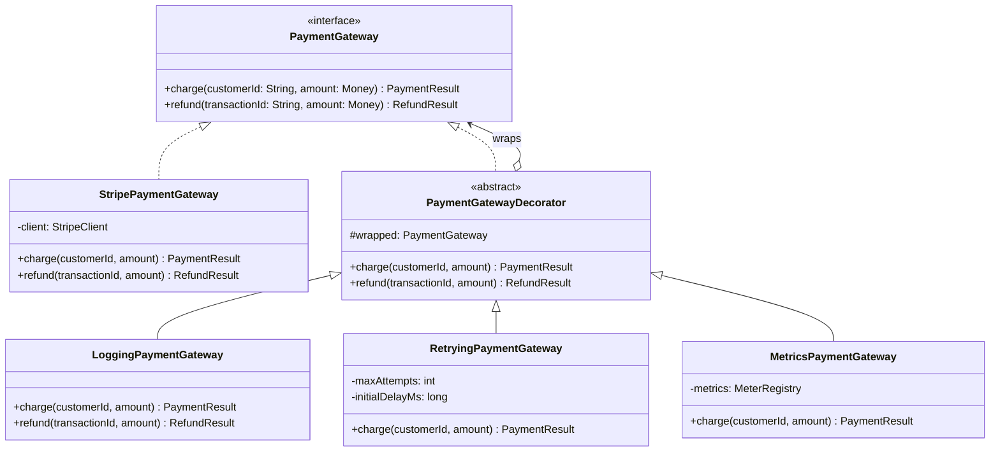
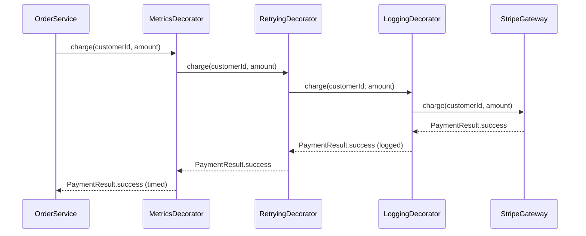

# Decorator Pattern

> *"Attach additional responsibilities to an object dynamically. Decorators provide a flexible alternative to subclassing for extending functionality."*
> — GoF Design Patterns

Decorator is the pattern of wrapping. It solves a specific composition problem: you need to add cross-cutting concerns — logging, retry logic, caching, authentication, rate limiting — to objects **without modifying them and without a combinatorial explosion of subclasses**.

---

## The Problem it Solves

You have a `PaymentGateway` interface with a clean implementation. Now you need:
- Logging on every call
- Retry logic for transient failures
- Metrics recording for each transaction
- Circuit breaking when the gateway is down

The inheritance approach hits a wall immediately:

```
PaymentGateway (interface)
  └── StripePaymentGateway
        ├── LoggingStripeGateway
        ├── RetryingStripeGateway
        ├── MetricsStripeGateway
        ├── LoggingRetryingStripeGateway
        ├── LoggingMetricsStripeGateway
        ├── RetryingMetricsStripeGateway
        └── LoggingRetryingMetricsStripeGateway   ← 7 classes for 3 concerns
```

Every new concern doubles the number of subclasses. Every combination must be anticipated upfront. And this only covers Stripe — you'd need the same tree for PayPal.

With Decorator: 4 classes total, **unlimited combinations at runtime**.

---

## The Core Idea

A Decorator:
1. **Implements the same interface** as the component it wraps
2. **Holds a reference** to a component (which may be another decorator)
3. **Delegates** the actual work to the wrapped component
4. **Adds behaviour** before, after, or around the delegation

This allows unlimited stacking: wrap a gateway in a logging decorator, then wrap that in a retry decorator, and the caller sees only a `PaymentGateway`.

---

## Complete Implementation

```java
// Component interface — the shared contract
public interface PaymentGateway {
    PaymentResult charge(String customerId, Money amount);
    RefundResult  refund(String transactionId, Money amount);
}

// Concrete component — the real implementation
public class StripePaymentGateway implements PaymentGateway {
    private final StripeClient client;

    public StripePaymentGateway(StripeClient client) {
        this.client = client;
    }

    @Override
    public PaymentResult charge(String customerId, Money amount) {
        StripeCharge charge = client.createCharge(customerId, amount.amountCents(), amount.currency());
        return charge.isSucceeded()
            ? PaymentResult.success(charge.getId(), amount)
            : PaymentResult.failure(charge.getFailureMessage());
    }

    @Override
    public RefundResult refund(String transactionId, Money amount) {
        StripeRefund refund = client.issueRefund(transactionId, amount.amountCents());
        return refund.isSucceeded()
            ? RefundResult.success(refund.getId())
            : RefundResult.failure(refund.getFailureReason());
    }
}
```

```java
// Abstract Decorator — holds the wrapped component, delegates by default
public abstract class PaymentGatewayDecorator implements PaymentGateway {
    protected final PaymentGateway wrapped;

    protected PaymentGatewayDecorator(PaymentGateway wrapped) {
        this.wrapped = Objects.requireNonNull(wrapped);
    }

    @Override
    public PaymentResult charge(String customerId, Money amount) {
        return wrapped.charge(customerId, amount);    // default: pure delegation
    }

    @Override
    public RefundResult refund(String transactionId, Money amount) {
        return wrapped.refund(transactionId, amount); // default: pure delegation
    }
}
```

```java
// Logging Decorator — adds structured logging around each call
public class LoggingPaymentGateway extends PaymentGatewayDecorator {
    private static final Logger log = LoggerFactory.getLogger(LoggingPaymentGateway.class);

    public LoggingPaymentGateway(PaymentGateway wrapped) {
        super(wrapped);
    }

    @Override
    public PaymentResult charge(String customerId, Money amount) {
        log.info("Charging customer={} amount={}", customerId, amount);
        long start  = System.currentTimeMillis();
        PaymentResult result = wrapped.charge(customerId, amount);
        long elapsed = System.currentTimeMillis() - start;
        if (result.isSuccessful()) {
            log.info("Charge succeeded txnId={} durationMs={}", result.getTransactionId(), elapsed);
        } else {
            log.warn("Charge failed reason={} durationMs={}", result.getFailureReason(), elapsed);
        }
        return result;
    }

    @Override
    public RefundResult refund(String transactionId, Money amount) {
        log.info("Refunding txnId={} amount={}", transactionId, amount);
        RefundResult result = wrapped.refund(transactionId, amount);
        if (result.isSuccessful()) {
            log.info("Refund succeeded refundId={}", result.getRefundId());
        } else {
            log.warn("Refund failed reason={}", result.getFailureReason());
        }
        return result;
    }
}
```

```java
// Retry Decorator — retries on transient failures with exponential backoff
public class RetryingPaymentGateway extends PaymentGatewayDecorator {
    private static final Logger log = LoggerFactory.getLogger(RetryingPaymentGateway.class);

    private final int    maxAttempts;
    private final long   initialDelayMs;

    public RetryingPaymentGateway(PaymentGateway wrapped, int maxAttempts, long initialDelayMs) {
        super(wrapped);
        this.maxAttempts    = maxAttempts;
        this.initialDelayMs = initialDelayMs;
    }

    @Override
    public PaymentResult charge(String customerId, Money amount) {
        return withRetry(() -> wrapped.charge(customerId, amount));
    }

    private <T> T withRetry(Supplier<T> operation) {
        long delay = initialDelayMs;
        for (int attempt = 1; attempt <= maxAttempts; attempt++) {
            try {
                return operation.get();
            } catch (TransientPaymentException e) {
                if (attempt == maxAttempts) throw e;
                log.warn("Attempt {} failed (transient), retrying in {}ms", attempt, delay);
                sleep(delay);
                delay *= 2;  // exponential backoff
            }
        }
        throw new IllegalStateException("Should not reach here");
    }

    private void sleep(long ms) {
        try { Thread.sleep(ms); }
        catch (InterruptedException e) { Thread.currentThread().interrupt(); }
    }
}
```

```java
// Metrics Decorator — records timing and outcome metrics
public class MetricsPaymentGateway extends PaymentGatewayDecorator {
    private final MeterRegistry metrics;

    public MetricsPaymentGateway(PaymentGateway wrapped, MeterRegistry metrics) {
        super(wrapped);
        this.metrics = metrics;
    }

    @Override
    public PaymentResult charge(String customerId, Money amount) {
        Timer.Sample sample = Timer.start(metrics);
        try {
            PaymentResult result = wrapped.charge(customerId, amount);
            String outcome = result.isSuccessful() ? "success" : "failure";
            sample.stop(metrics.timer("payment.charge", "outcome", outcome));
            metrics.counter("payment.charge.amount", "currency", amount.currency())
                   .increment(amount.amountCents() / 100.0);
            return result;
        } catch (Exception e) {
            sample.stop(metrics.timer("payment.charge", "outcome", "error"));
            metrics.counter("payment.charge.errors").increment();
            throw e;
        }
    }
}
```

### Assembling the Stack

```java
// Build the decorator stack — outermost wraps innermost
PaymentGateway gateway = new MetricsPaymentGateway(
    new RetryingPaymentGateway(
        new LoggingPaymentGateway(
            new StripePaymentGateway(stripeClient),  // the real thing
            3,       // maxAttempts
            100      // initialDelayMs
        ),
        meterRegistry
    )
);

// The caller holds only a PaymentGateway reference — the stack is invisible
orderService = new OrderService(gateway);
```

Execution order for `charge()`:
1. `MetricsPaymentGateway.charge()` — starts timer
2. `RetryingPaymentGateway.charge()` — manages retry loop
3. `LoggingPaymentGateway.charge()` — logs call and result
4. `StripePaymentGateway.charge()` — real work
5. Unwinds: logging → retry → metrics → caller

---

## Class Diagram



---

## Sequence Diagram: Decorator Chain Execution



---

## Java Standard Library Examples

The most famous Decorator chain in Java is `java.io`:

```java
// Reading a gzip-compressed, buffered, binary file — four decorators stacked
InputStream is = new GZIPInputStream(           // decompresses
                     new BufferedInputStream(   // buffers reads for performance
                         new FileInputStream("data.gz")  // reads raw bytes
                     )
                 );

// Writing with encoding + buffering + pretty-printing
PrintWriter pw = new PrintWriter(
                     new BufferedWriter(
                         new OutputStreamWriter(
                             new FileOutputStream("output.txt"),
                             StandardCharsets.UTF_8
                         )
                     )
                 );
```

Each class implements `InputStream` or `Writer` and wraps another. The caller only calls `read()` — the stack handles decompression, buffering, and encoding transparently.

---

## Decorator vs Inheritance

| | Inheritance | Decorator |
|---|---|---|
| When decided | Compile time | Runtime (wired dynamically) |
| Combinations | M × N subclasses | M + N classes, unlimited stacks |
| Requires | Modifying the class hierarchy | Just the interface |
| Concerns | Baked into the class | Separable, reorderable |
| Testing | Test each subclass separately | Test each decorator independently |

---

## Decorator vs Proxy

Both wrap an object with the same interface. The distinction is intent:

| | Decorator | Proxy |
|---|---|---|
| **Intent** | Add behaviour | Control access |
| **Who owns wrapping?** | Client assembles stack | Proxy created by infrastructure |
| **Knowledge** | Client knows it's adding concerns | Client may not know a proxy exists |
| **Examples** | Logging, retry, metrics | Lazy init, security, remote |

---

## Testing Decorators

Because each decorator wraps the interface, each is independently testable with a mock:

```java
@Test
void loggingDecoratorShouldLogSuccessfulCharge() {
    PaymentGateway mockGateway = mock(PaymentGateway.class);
    when(mockGateway.charge(any(), any())).thenReturn(PaymentResult.success("txn123", amount));

    Logger mockLogger = mock(Logger.class);
    LoggingPaymentGateway logging = new LoggingPaymentGateway(mockGateway, mockLogger);

    logging.charge("cust_1", Money.of(100, "USD"));

    verify(mockLogger).info(contains("Charging"), eq("cust_1"), any());
    verify(mockLogger).info(contains("succeeded"), eq("txn123"), any());
}

@Test
void retryDecoratorShouldRetryOnTransientFailure() {
    PaymentGateway mockGateway = mock(PaymentGateway.class);
    when(mockGateway.charge(any(), any()))
        .thenThrow(new TransientPaymentException("timeout"))
        .thenThrow(new TransientPaymentException("timeout"))
        .thenReturn(PaymentResult.success("txn123", amount));

    RetryingPaymentGateway retrying = new RetryingPaymentGateway(mockGateway, 3, 1);
    PaymentResult result = retrying.charge("cust_1", amount);

    assertThat(result.isSuccessful()).isTrue();
    verify(mockGateway, times(3)).charge(any(), any());
}
```

Each decorator is a single-responsibility class with a focused, verifiable contract.

---

## When to Use Decorator

**Use it when:**
- You need to add **cross-cutting concerns** (logging, retry, caching, metrics, auth) without modifying the core class
- The concerns are **composable** — they can be combined in different orders for different use cases
- You want to add behaviour at **runtime**, not compile time
- Subclassing would produce an M × N explosion

**Don't use it when:**
- The wrapper needs to introduce methods that aren't in the interface — Decorator can only work with the interface contract
- The order of decoration matters and callers can't be trusted to assemble the correct stack — prefer a dedicated builder or factory
- There's only one concern to add — just extend the class or add a method

---

## Key Takeaways

- Decorator adds behaviour by **wrapping the same interface** — callers never see the wrapping
- The abstract base decorator that delegates by default is the **structural enabler** — concrete decorators only override what they need
- Stacking decorators is the **runtime composition** answer to the compile-time inheritance explosion
- Java I/O streams are the most famous real-world Decorator system in the JDK
- Each decorator is **independently testable** against a mock or stub — separation of concerns at its best
- The pattern is the practical implementation of the **Open-Closed Principle**: add logging/retry/metrics without modifying the gateway
