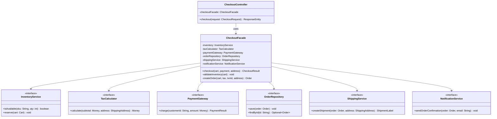
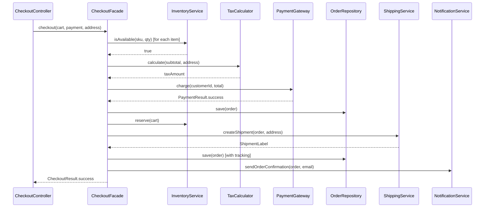

# Facade Pattern

> *"Provide a unified interface to a set of interfaces in a subsystem. Facade defines a higher-level interface that makes the subsystem easier to use."*
> — GoF Design Patterns

The Facade is the pattern of simplicity. It doesn't add new functionality — it **hides complexity behind a clean, purpose-built surface**. When a subsystem has grown to a network of interdependent classes, a Facade gives clients a single door to walk through.

---

## The Problem it Solves

An e-commerce checkout flow involves half a dozen independent subsystems, each with its own API:

```java
// Without a Facade — the client must orchestrate everything
public class CheckoutController {

    public void checkout(Cart cart, PaymentDetails payment, ShippingAddress address) {
        // 1. Validate inventory
        for (CartItem item : cart.getItems()) {
            Inventory inventory = InventoryService.getInstance();
            if (!inventory.checkAvailability(item.getSku(), item.getQuantity())) {
                throw new OutOfStockException(item.getSku());
            }
        }

        // 2. Calculate tax
        TaxCalculator taxCalc = new TaxCalculator(new TaxRuleRepository());
        Money taxAmount = taxCalc.calculate(cart.getSubtotal(), address.getState(), address.getCountry());

        // 3. Process payment
        PaymentGateway gateway = PaymentGatewayFactory.getGateway(payment.getType());
        PaymentResult payResult = gateway.charge(payment.getCustomerId(),
                                                 cart.getSubtotal().add(taxAmount));
        if (!payResult.isSuccessful()) throw new PaymentDeclinedException(payResult.getFailureReason());

        // 4. Create and persist order
        Order order = new Order(cart, taxAmount, payResult.getTransactionId(), address);
        OrderRepository orderRepo = new JdbcOrderRepository(DataSourceHolder.get());
        orderRepo.save(order);

        // 5. Reserve inventory
        for (CartItem item : cart.getItems()) {
            InventoryService.getInstance().reserve(item.getSku(), item.getQuantity());
        }

        // 6. Arrange shipping
        ShippingService shipping = new FedExShippingService(FedExConfig.load());
        ShipmentLabel label = shipping.createShipment(order, address);
        order.setTrackingNumber(label.getTrackingNumber());
        orderRepo.save(order);   // save again with tracking number

        // 7. Notify customer
        NotificationService notif = new EmailNotificationService();
        notif.sendOrderConfirmation(order, payment.getEmailAddress());
    }
}
```

Problems:
- **The controller knows too much** — it's aware of every subsystem API
- **Coupling is maximal** — a change to any subsystem (JDBC → JPA, FedEx → UPS) requires editing this method
- **Testing is impossible** — the controller instantiates concrete classes directly
- **Duplication is inevitable** — another endpoint (mobile API) will repeat this same orchestration

---

## The Facade

A Facade extracts this orchestration into a dedicated class with a clean, single-method surface:

```java
// The Facade — one class, one responsibility: coordinate checkout
public class CheckoutFacade {

    private final InventoryService    inventory;
    private final TaxCalculator       taxCalculator;
    private final PaymentGateway      paymentGateway;
    private final OrderRepository     orderRepository;
    private final ShippingService     shippingService;
    private final NotificationService notificationService;

    // All dependencies injected — each can be swapped independently
    public CheckoutFacade(
            InventoryService    inventory,
            TaxCalculator       taxCalculator,
            PaymentGateway      paymentGateway,
            OrderRepository     orderRepository,
            ShippingService     shippingService,
            NotificationService notificationService) {
        this.inventory           = inventory;
        this.taxCalculator       = taxCalculator;
        this.paymentGateway      = paymentGateway;
        this.orderRepository     = orderRepository;
        this.shippingService     = shippingService;
        this.notificationService = notificationService;
    }

    public CheckoutResult checkout(Cart cart, PaymentDetails payment, ShippingAddress address) {
        validateInventory(cart);

        Money tax   = taxCalculator.calculate(cart.getSubtotal(), address);
        Money total = cart.getSubtotal().add(tax);

        PaymentResult payResult = paymentGateway.charge(payment.getCustomerId(), total);
        if (!payResult.isSuccessful()) {
            return CheckoutResult.paymentDeclined(payResult.getFailureReason());
        }

        Order order = createOrder(cart, tax, payResult.getTransactionId(), address);
        orderRepository.save(order);

        inventory.reserve(cart);

        ShipmentLabel label = shippingService.createShipment(order, address);
        order.setTrackingNumber(label.getTrackingNumber());
        orderRepository.save(order);

        notificationService.sendOrderConfirmation(order, payment.getEmail());

        return CheckoutResult.success(order.getId(), label.getTrackingNumber());
    }

    private void validateInventory(Cart cart) {
        cart.getItems().forEach(item -> {
            if (!inventory.isAvailable(item.getSku(), item.getQuantity())) {
                throw new OutOfStockException(item.getSku());
            }
        });
    }

    private Order createOrder(Cart cart, Money tax, String txnId, ShippingAddress address) {
        return Order.builder()
                    .items(cart.getItems())
                    .subtotal(cart.getSubtotal())
                    .tax(tax)
                    .transactionId(txnId)
                    .shippingAddress(address)
                    .build();
    }
}
```

Now the controller is trivially simple:

```java
// Controller — thin, clean, testable
@RestController
@RequestMapping("/checkout")
public class CheckoutController {

    private final CheckoutFacade checkoutFacade;

    public CheckoutController(CheckoutFacade checkoutFacade) {
        this.checkoutFacade = checkoutFacade;
    }

    @PostMapping
    public ResponseEntity<CheckoutResponse> checkout(@RequestBody CheckoutRequest request) {
        CheckoutResult result = checkoutFacade.checkout(
            request.getCart(),
            request.getPaymentDetails(),
            request.getShippingAddress()
        );
        return result.isSuccessful()
            ? ResponseEntity.ok(new CheckoutResponse(result))
            : ResponseEntity.badRequest().body(new CheckoutResponse(result));
    }
}
```

---

## Class Diagram



---

## Sequence Diagram



---

## Layered Facades in Clean Architecture

In a layered system, facades appear at each boundary to control what crosses:

```java
// Application layer facade — what the REST API and CLI see
public class OrderApplicationService {
    private final PlaceOrderUseCase    placeOrder;
    private final CancelOrderUseCase   cancelOrder;
    private final TrackShipmentUseCase trackShipment;

    public OrderApplicationService(PlaceOrderUseCase placeOrder,
                                   CancelOrderUseCase cancelOrder,
                                   TrackShipmentUseCase trackShipment) {
        this.placeOrder    = placeOrder;
        this.cancelOrder   = cancelOrder;
        this.trackShipment = trackShipment;
    }

    public OrderSummaryDto placeOrder(PlaceOrderCommand cmd) {
        Order order = placeOrder.execute(cmd);
        return OrderSummaryDto.from(order);
    }

    public void cancelOrder(String orderId, String reason) {
        cancelOrder.execute(new CancelOrderCommand(orderId, reason));
    }

    public ShipmentStatusDto trackShipment(String orderId) {
        return ShipmentStatusDto.from(trackShipment.execute(orderId));
    }
}
```

The REST controller, CLI command handler, and message consumer all call this one service — they don't know about use cases, repositories, or domain objects directly.

---

## Facade Does Not Prevent Direct Access

This is a critical design point: **Facade doesn't seal the subsystem**. Advanced clients that need fine-grained control can still access subsystem classes directly. The facade is a convenience layer, not a security boundary. For access control, use the Proxy pattern.

```java
// Simple case: use the facade
checkoutFacade.checkout(cart, payment, address);

// Advanced case: bypass facade, call subsystem directly for special behaviour
taxCalculator.calculateWithOverrides(subtotal, address, exemptions);
```

---

## Facade vs Other Patterns

| Pattern | Intent | Key difference |
|---|---|---|
| **Facade** | Simplified interface to a complex subsystem | One class coordinating many; doesn't restrict direct access |
| **Adapter** | Make incompatible interfaces compatible | Translates one interface to another; works with a single existing class |
| **Mediator** | Objects communicate through a central mediator | Mediator coordinates peer objects; Facade is one-directional (client → subsystem) |
| **Proxy** | Control access to an object | Same interface; controls access; transparent to caller |
| **Decorator** | Add behaviour | Same interface; augments the wrapped object |

The most common confusion is **Facade vs Mediator**. The difference: a Mediator's participants know about the mediator and communicate through it bidirectionally. A Facade's subsystem classes don't know the facade exists.

---

## When to Use Facade

**Use it when:**
- A subsystem has grown complex with many interdependent classes and you want to present a simpler API
- You want to layer a system and restrict what clients of one layer see of the next
- You need to hide the orchestration logic of multi-step workflows from callers
- You're wrapping a legacy subsystem to present a clean modern API while the internals are messy

**Don't use it when:**
- You want to prevent clients from accessing the subsystem directly — use Proxy for that
- The subsystem has only 1-2 classes — a Facade adds indirection with no benefit
- The "facade" starts containing business logic — at that point it's an Application Service or Use Case, which is fine, but call it what it is

---

## Key Takeaways

- Facade is the pattern that lives at **every architectural boundary** — REST controller, application service, integration gateway
- It doesn't restrict access to subsystem internals — it merely provides a **simpler default path**
- The value is in separating **what to do** (client's concern) from **how to coordinate** (facade's responsibility)
- A well-designed Facade has all its **dependencies injected**, making it independently testable
- In Spring applications, `@Service` classes routinely act as Facades — they coordinate repositories, domain objects, and external services, presenting a single method per use case to controllers
