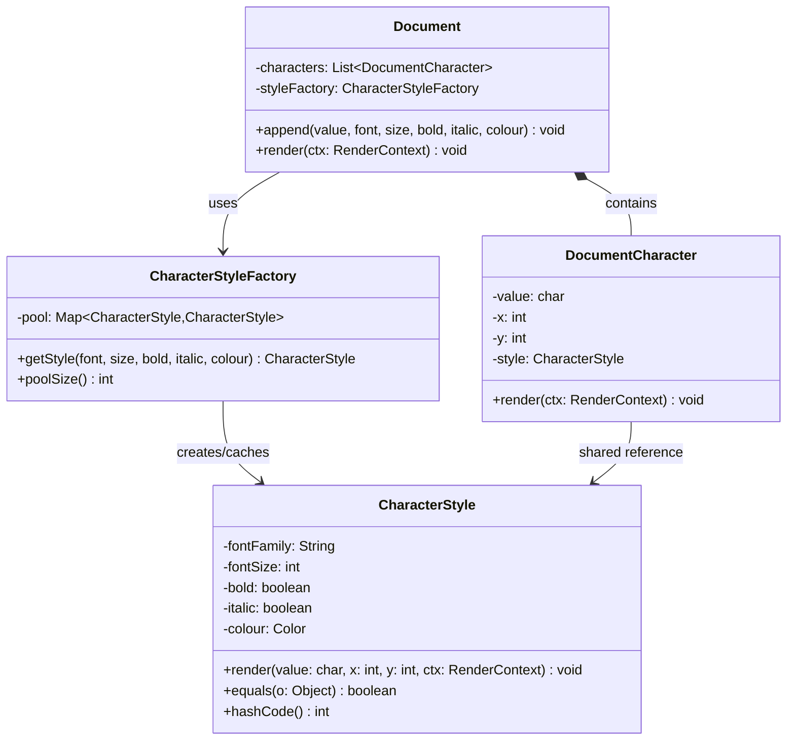

# Flyweight Pattern

> *"Use sharing to support large numbers of fine-grained objects efficiently."*
> — GoF Design Patterns

Flyweight is a memory-optimisation pattern. It applies a specific insight: when many objects share identical portions of their state, that shared state can be stored once and referenced by all of them instead of being copied into each.

---

## The Problem it Solves

Consider a text editor rendering a document with 1 million characters. Each character object stores its display properties:

```java
// Naive — every character stores all its state
public class Character {
    private final char    value;
    private final String  fontFamily;    // "Arial"
    private final int     fontSize;      // 12
    private final boolean bold;          // false
    private final boolean italic;        // false
    private final Color   colour;        // BLACK
    private int           x;             // position
    private int           y;             // position
}
```

Most characters in a typical document share the same font, size, style, and colour. Yet each `Character` object stores its own copy. For 1 million characters with `"Arial"` (6 bytes as a String reference + overhead) and other shared fields, the redundant duplication is significant.

**Flyweight splits state into two categories:**

| State type | Definition | Example |
|---|---|---|
| **Intrinsic** (shared) | Context-independent — same regardless of where the object is used | font family, font size, bold, italic, colour |
| **Extrinsic** (unique) | Context-dependent — unique to each usage | x position, y position, the character value itself |

The intrinsic state is stored in the Flyweight object, shared across many usage points. The extrinsic state is passed in at the time of use.

---

## Complete Implementation: Text Rendering

```java
// Flyweight — stores only intrinsic (shared) state
public final class CharacterStyle {
    private final String  fontFamily;
    private final int     fontSize;
    private final boolean bold;
    private final boolean italic;
    private final Color   colour;

    public CharacterStyle(String fontFamily, int fontSize,
                          boolean bold, boolean italic, Color colour) {
        this.fontFamily = Objects.requireNonNull(fontFamily);
        this.fontSize   = fontSize;
        this.bold       = bold;
        this.italic     = italic;
        this.colour     = Objects.requireNonNull(colour);
    }

    // Used to render one character at a specific position (extrinsic state passed in)
    public void render(char value, int x, int y, RenderContext ctx) {
        ctx.drawCharacter(value, x, y, fontFamily, fontSize, bold, italic, colour);
    }

    @Override
    public boolean equals(Object o) {
        if (this == o) return true;
        if (!(o instanceof CharacterStyle s)) return false;
        return fontSize == s.fontSize && bold == s.bold && italic == s.italic
            && fontFamily.equals(s.fontFamily) && colour.equals(s.colour);
    }

    @Override
    public int hashCode() {
        return Objects.hash(fontFamily, fontSize, bold, italic, colour);
    }

    @Override
    public String toString() {
        return fontFamily + "/" + fontSize + (bold ? "/B" : "") + (italic ? "/I" : "");
    }
}
```

```java
// Flyweight Factory — creates and caches flyweights, ensuring sharing
public class CharacterStyleFactory {
    private final Map<CharacterStyle, CharacterStyle> pool = new HashMap<>();

    public CharacterStyle getStyle(String font, int size, boolean bold,
                                   boolean italic, Color colour) {
        CharacterStyle key = new CharacterStyle(font, size, bold, italic, colour);
        // Return existing instance or add to pool and return
        return pool.computeIfAbsent(key, k -> k);
    }

    public int poolSize() { return pool.size(); }
}
```

```java
// Context — stores extrinsic state + reference to shared flyweight
// This is the "thin" per-character object that the document stores
public class DocumentCharacter {
    private final char           value;   // extrinsic — unique per character
    private final int            x;       // extrinsic — position
    private final int            y;       // extrinsic — position
    private final CharacterStyle style;   // intrinsic — shared flyweight reference

    public DocumentCharacter(char value, int x, int y, CharacterStyle style) {
        this.value = value;
        this.x     = x;
        this.y     = y;
        this.style = Objects.requireNonNull(style);
    }

    public void render(RenderContext ctx) {
        style.render(value, x, y, ctx);   // pass extrinsic state to flyweight
    }
}
```

```java
// Document — uses the factory; character objects stay small
public class Document {
    private final List<DocumentCharacter> characters = new ArrayList<>();
    private final CharacterStyleFactory   styleFactory = new CharacterStyleFactory();

    private int cursorX = 0;
    private int cursorY = 0;

    public void append(char value, String font, int size,
                       boolean bold, boolean italic, Color colour) {
        CharacterStyle style = styleFactory.getStyle(font, size, bold, italic, colour);
        characters.add(new DocumentCharacter(value, cursorX, cursorY, style));
        cursorX += size / 2;  // approximate advance
    }

    public void render(RenderContext ctx) {
        characters.forEach(c -> c.render(ctx));
    }

    public void printStats() {
        System.out.printf("Characters: %,d | Unique styles: %d%n",
            characters.size(), styleFactory.poolSize());
    }
}
```

```java
// Usage
Document doc = new Document();
RenderContext ctx = new RenderContext();

// A million "normal" characters — all share the same CharacterStyle object
for (int i = 0; i < 1_000_000; i++) {
    doc.append('a', "Arial", 12, false, false, Color.BLACK);
}

// A few bold characters — one shared bold style object
for (int i = 0; i < 1_000; i++) {
    doc.append('B', "Arial", 12, true, false, Color.BLACK);
}

doc.printStats();
// Characters: 1,001,000 | Unique styles: 2
// Memory: 2 CharacterStyle objects, not 1,001,000
```

---

## Class Diagram



---

## Real-World Example: Game Particle System

```java
// Flyweight — intrinsic state shared by all particles of same type
public final class ParticleType {
    private final String  name;
    private final Sprite  sprite;       // expensive texture — shared
    private final double  mass;
    private final Color   colour;
    private final int     lifespan;     // ms

    public ParticleType(String name, Sprite sprite, double mass, Color colour, int lifespan) {
        this.name     = name;
        this.sprite   = sprite;
        this.mass     = mass;
        this.colour   = colour;
        this.lifespan = lifespan;
    }

    public void update(double x, double y, double vx, double vy,
                       long age, RenderContext ctx) {
        if (age > lifespan) return;
        double alpha = 1.0 - (double) age / lifespan;
        ctx.drawSprite(sprite, x, y, colour.withAlpha(alpha));
        // Physics update uses mass, extrinsic position/velocity
    }
}

// Context — one per visible particle; stores only extrinsic state
public class Particle {
    private double      x, y;           // extrinsic — position
    private double      vx, vy;         // extrinsic — velocity
    private long        birthTime;      // extrinsic — age tracking
    private final ParticleType type;    // intrinsic — shared flyweight

    public Particle(double x, double y, double vx, double vy, ParticleType type) {
        this.x = x; this.y = y; this.vx = vx; this.vy = vy;
        this.birthTime = System.currentTimeMillis();
        this.type = type;
    }

    public void update(RenderContext ctx) {
        long age = System.currentTimeMillis() - birthTime;
        x += vx; y += vy;                      // simple Euler integration
        type.update(x, y, vx, vy, age, ctx);   // delegate to flyweight
    }
}

// Factory / registry
public class ParticleTypeRegistry {
    private final Map<String, ParticleType> types = new HashMap<>();

    public void register(String name, ParticleType type) { types.put(name, type); }

    public Particle spawn(String typeName, double x, double y, double vx, double vy) {
        ParticleType type = types.get(typeName);
        if (type == null) throw new IllegalArgumentException("Unknown particle type: " + typeName);
        return new Particle(x, y, vx, vy, type);
    }
}

// In a game with 10,000 active "fire" particles:
// - 1 ParticleType (with the expensive Sprite loaded once)
// - 10,000 Particle objects (each only stores x, y, vx, vy, birthTime, and a reference)
```

---

## Memory Comparison

For the particle example above:

| Approach | Sprite size | 10k particles | Total |
|---|---|---|---|
| Without Flyweight | 500KB | 10,000 × 500KB | ~5 GB |
| With Flyweight | 500KB shared | 10,000 × 40 bytes | ~500KB + 400KB |

---

## Java Standard Library Examples

| Example | Flyweight | What's shared |
|---|---|---|
| `Integer.valueOf(int)` | `Integer` objects for -128 to 127 | Cached `Integer` instances |
| `String` interning | Interned `String` objects | Identical string literals |
| `Boolean.TRUE` / `Boolean.FALSE` | Static `Boolean` instances | The two boolean values |
| `Byte.valueOf(byte)` | Cached `Byte` objects | All 256 byte values |
| Font rendering in Java2D | Glyph metrics | Character shape data |

```java
// Integer cache — Java's built-in Flyweight
Integer a = Integer.valueOf(100);
Integer b = Integer.valueOf(100);
System.out.println(a == b);    // true — same instance!

Integer c = Integer.valueOf(200);
Integer d = Integer.valueOf(200);
System.out.println(c == d);    // false — outside cache range; different instances
```

---

## Intrinsic vs Extrinsic — The Design Decision

Correctly classifying state is the hard part of implementing Flyweight:

| Questions to ask | Intrinsic? |
|---|---|
| Is this value the same for every usage of this "type"? | Yes |
| Would two "instances" of the same concept always have this value? | Yes |
| Does this value change based on context (position, time, owner)? | No — it's extrinsic |
| Is sharing this value semantically correct? | Needs careful thought |

A pitfall: putting **mutable** state into the flyweight. Since the flyweight is shared, mutating it from one context would affect all other contexts that share it. **Flyweights must be immutable** or carefully treated as read-only.

---

## When to Use Flyweight

**Use it when:**
- You need a **large number** of objects that share significant portions of their state
- The memory savings are measurable and important (game engines, text renderers, particle systems)
- You can cleanly separate intrinsic from extrinsic state
- The shared state is **immutable**

**Don't use it when:**
- The number of objects is small — the factory complexity isn't worth it
- Objects don't actually share significant state — forced sharing creates artificial coupling
- The extrinsic state extraction makes the API significantly harder to use

---

## Key Takeaways

- Flyweight is a **memory optimisation** — only apply it when profiling reveals a real memory problem
- The core insight: split state into **intrinsic** (shared, immutable) and **extrinsic** (unique, passed per use)
- The **Flyweight Factory** is essential — it ensures that the same intrinsic state always returns the same object instance
- Flyweights **must be immutable** — since they're shared, mutation by one client would corrupt all others
- Java's `Integer.valueOf()` cache, `String.intern()`, and `Boolean.TRUE`/`FALSE` are built-in flyweights in the JDK
